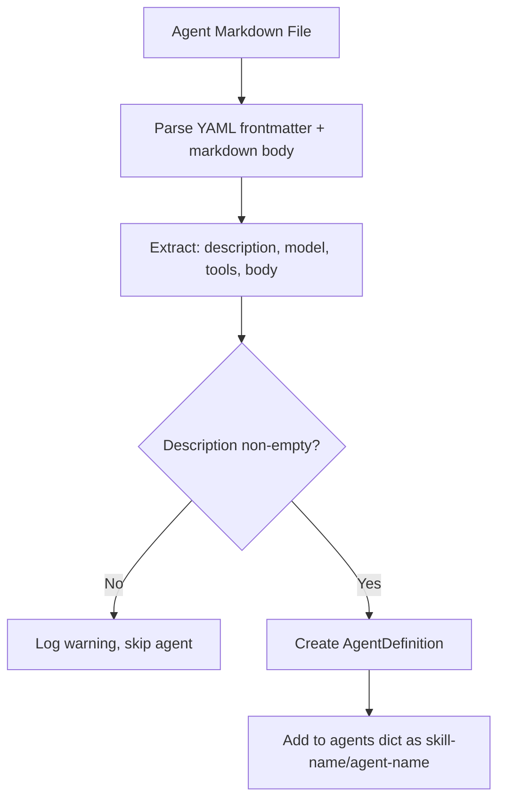

# Design: Skill System and Sub-Agent Delegation

<!-- This design describes the current implementation approach. Updated through delta reconciliation. -->

**Feature Spec**: [../../feature-specs/agent/skills.md](../../feature-specs/agent/skills.md)
**Status**: Current

## Purpose

This document explains the design rationale for the skill system: how skills are structured, discovered, registered, detected per-session, and integrated with the coordinator to enable targeted sub-agent delegation via the SDK.

## Problem Context

The coordinator needs to make specialized sub-agents available to the SDK's orchestrator for delegation. Skills provide a structured, discoverable way to organize and define these agents. Only relevant skills should be loaded per session to avoid wasting context on irrelevant agents.

**Constraints:**
- Skills must be directory-based (not single files) to accommodate future expansion
- Agent definitions must be loadable from markdown files with metadata
- Skills must be discoverable at startup; only relevant skills loaded per-session based on LLM classification
- Invalid or missing skills/agents should not crash the system
- Detection failures must never block messages — same error contract as other pre-processing providers
- Detected agents persist for the session lifetime; cleared on topic shift

**Interactions:**
- Bootstrap process creates the skills directory (via skills hook, see [workspace-bootstrap](workspace-bootstrap.md))
- Skill registry discovers all skills and agents at startup
- Skills context provider classifies relevance per-session via the pre-processing pipeline (see [pre-processing-pipeline](pre-processing-pipeline.md))
- Coordinator extracts detected agents from pipeline results and passes to SDK (see [core-architecture](core-architecture.md))
- SDK's internal orchestrator uses detected agents for delegation decisions

## Design Overview

Five-component architecture: a bootstrap hook creates the directory structure, the skill registry discovers and loads all skills and agents at startup, a skills context provider classifies relevance per-session, the coordinator extracts detected agents from pipeline results, and the system prompt preamble provides static skill awareness independent of per-session detection.

```
┌──────────────────────────────────────────────────────┐
│              Coordinator Layer                        │
│  ┌────────────────────────────────────────────┐       │
│  │  Coordinator                               │       │
│  │  - Extracts detected agents from pipeline  │       │
│  │  - Stores agents per-session               │       │
│  │  - Passes agents to ClaudeAgentOptions     │       │
│  └────┬───────────────────────────────────────┘       │
├───────┼──────────────────────────────────────────────┤
│       │                                               │
│       ▼                                               │
│  ┌────────────────────────────────────────────┐       │
│  │  SkillsContextProvider (PreProcessing)     │       │
│  │  - Classifies relevance via LLM            │       │
│  │  - Injects <skills> XML context block      │       │
│  │  - Returns detected agents on ContextResult│       │
│  │  - Owns its own SkillRegistry              │       │
│  └────┬───────────────────────────────────────┘       │
├───────┼──────────────────────────────────────────────┤
│       │                                               │
│       ▼                                               │
│  ┌────────────────────────────────────────────┐       │
│  │  Skill Registry                            │       │
│  │  - Discovers skills at startup             │       │
│  │  - Loads agents from each skill            │       │
│  │  - Stores skill body + path at init        │       │
│  └────┬───────────────────────────────────────┘       │
├───────┼──────────────────────────────────────────────┤
│       │                                               │
│       ▼                                               │
│  ┌────────────────────────────────────────────┐       │
│  │  Skills Directory Structure                │       │
│  │  workspace/skills/                         │       │
│  │  ├── skill-name/                           │       │
│  │  │   ├── SKILL.md (metadata + body)        │       │
│  │  │   └── agents/                           │       │
│  │  │       ├── agent-1.md                    │       │
│  │  │       └── agent-2.md                    │       │
│  │  └── another-skill/                        │       │
│  │      └── agents/                           │       │
│  └────────────────────────────────────────────┘       │
└──────────────────────────────────────────────────────┘
```

## Components

### Implementation Structure

| Layer/Component | Responsibility | Key Decisions |
|-----------------|----------------|---------------|
| `src/tachikoma/skills/__init__.py` | Re-exports `SkillRegistry`, `Skill`, `skills_hook`, `SkillsContextProvider` | Package module for the skills subsystem |
| `src/tachikoma/skills/registry.py` | `SkillRegistry` class: discovers skills, loads agents, builds agents dict, stores skill body and path; `Skill` dataclass for metadata (name from folder, description, version, body, path) | Uses `python-frontmatter` for parsing; constructs `AgentDefinition` from `claude_agent_sdk.types` directly; name derived from folder, body and path stored at init time |
| `src/tachikoma/skills/context_provider.py` | `SkillsContextProvider(ContextProvider)`: creates its own `SkillRegistry` in `__init__`, classifies relevant skills via standalone `query()` with Opus low effort (DES-007), reads skill body from registry's pre-loaded `Skill.body`, assembles `<skills>` XML block, returns detected agents via `ContextResult.agents` | Self-contained provider (owns registry); no tools for classification agent (pure reasoning); fully consumes query() generator (DES-005); `get_agents_for_skill()` on registry for agent filtering |
| `src/tachikoma/skills/hooks.py` | `skills_hook` bootstrap callback: creates `workspace/skills/` directory | Follows DES-003 pattern (subsystem-owned hook); directory creation only |
| `src/tachikoma/context/loading.py` (`SYSTEM_PREAMBLE`) | Static skills documentation in the system prompt preamble: location, structure, detection, management, and disambiguation from Claude Code's native skills | Part of the `SYSTEM_PREAMBLE` constant; loaded once at startup; independent of per-session detection; follows ADR-008 append pattern |

### Cross-Layer Contracts

**SkillsContextProvider → Pipeline → Coordinator contract:**

The provider classifies relevance, assembles skill content, and returns detected agents on `ContextResult`. The coordinator extracts agents from pipeline results and stores them per-session.

```
SkillsContextProvider(cwd, cli_path)
    │
    ├── creates SkillRegistry internally
    ├── on provide(message):
    │   ├── loads skill names + descriptions from registry.skills
    │   ├── classifies via query() [Opus low effort]
    │   ├── reads skill.body from registry (pre-loaded at init)
    │   ├── filters agents via registry.get_agents_for_skill()
    │   └── returns ContextResult(tag="skills", content=XML, agents=filtered_dict)
    │
    └── Pipeline collects results → Coordinator extracts agents
            │
            ▼
    Coordinator._agents = merged agents from results
            │
            └── ClaudeAgentOptions(agents=self._agents)
```

**Integration Points:**
- SkillRegistry ↔ filesystem: reads `SKILL.md` (with body) and agent markdown files from `workspace/skills/`
- SkillsContextProvider ↔ Pipeline: registers via `pipeline.register(provider)`; `provide(message)` called in parallel with memory provider
- SkillsContextProvider ↔ SkillRegistry: internal — provider creates registry in `__init__`, reads `skills` property and calls `get_agents_for_skill()`
- SkillsContextProvider ↔ SDK: standalone `query()` call for classification (no tools, low effort, DES-007)
- Pipeline ↔ Coordinator: `pipeline.run()` returns `list[ContextResult]`; coordinator reads both `content` (text) and `agents` (structured) from results
- Skills hook ↔ Bootstrap: registered as a standard bootstrap hook (DES-003)
- SYSTEM_PREAMBLE ↔ Agent: the preamble includes a static Skills section so the agent has foundational skill awareness even when no skills are detected for the session; the `<skills>` XML block (injected by provider) is explicitly referenced as conditional

## Modeling

### Agent Definition Transformation



**AgentDefinition fields** (SDK type):
- `description`: From YAML frontmatter (required)
- `prompt`: From markdown body (empty string is valid)
- `model`: From YAML frontmatter (optional; recognized literals mapped through, unrecognized values default to `None` for SDK default)
- `tools`: From YAML frontmatter (optional list of tool names)

### Data Types

```
Skill (dataclass)
├── name: str (derived from folder name)
├── description: str
├── version: str | None
├── body: str (SKILL.md content without YAML frontmatter, loaded at init)
└── path: Path (absolute path to skill directory)

SkillRegistry
├── _agents: dict[str, AgentDefinition]
├── _skills: dict[str, Skill]
├── get_agents() → dict[str, AgentDefinition]
├── get_agents_for_skill(skill_name: str) → dict[str, AgentDefinition]
└── skills (property) → dict[str, Skill]

SkillsContextProvider(ContextProvider)
├── _registry: SkillRegistry     (owned, created in __init__)
├── _cwd: Path                   (workspace directory)
├── _cli_path: str | None        (optional Claude CLI binary path)
└── provide(message: str) → ContextResult | None
```

## Data Flow

### Agent Discovery Process

```
1. SkillRegistry receives workspace_path
2. Resolves workspace_path / "skills"
   ├─ Directory doesn't exist → return empty agents dict (valid state)
   └─ Directory exists → proceed
3. For each subdirectory in skills/:
   a. Check for SKILL.md
      ├─ Not found → log warning, skip directory
      └─ Found → parse YAML frontmatter
   b. Derive name from folder, validate description (required)
      ├─ Invalid → log warning, skip skill
      └─ Valid → store Skill metadata, proceed to agents
   c. Check for agents/ subdirectory
      ├─ Not found → valid skill with no agents, continue
      └─ Found → scan for .md files
   d. For each .md file in agents/:
      ├─ Parse YAML frontmatter + markdown body
      ├─ Validate (description required)
      ├─ Create AgentDefinition with namespace "skill-name/agent-name"
      └─ Add to agents dictionary
4. Return complete agents dictionary
```

### Startup Integration

```
1. Bootstrap runs skills hook → creates workspace/skills/ if missing
2. __main__.py creates SkillsContextProvider(cwd=workspace_path, cli_path=cli_path)
   → Provider creates SkillRegistry internally
   → Registry loads all SKILL.md files (including body and path)
   → Registry discovers and loads all agents/
3. __main__.py registers SkillsContextProvider in pre-processing pipeline
4. Coordinator created without agents parameter
5. Detection happens per-session via pre-processing pipeline:
   → Provider classifies relevance via LLM
   → Coordinator extracts detected agents from pipeline results
   → SDK sees only relevant agents for the session
```

## Key Decisions

### Directory-based Skills over Single Files

**Choice**: Skills are directories (`skills/skill-name/`) containing SKILL.md and agents/ subdirectory, not single files.
**Why**: Directories allow for future expansion (instructions, resources, configurations) without breaking the structure.
**Alternatives Considered**:
- Single files: Simpler but brittle; precludes adding skill-level components later

**Consequences**:
- Pro: Extensible foundation for future skill components
- Pro: Clear organizational hierarchy
- Con: More filesystem operations needed

### YAML Frontmatter for Metadata

**Choice**: Skill and agent metadata is embedded in markdown files using YAML frontmatter, parsed with the `python-frontmatter` library.
**Why**: Markdown is human-readable, and YAML frontmatter is a widely-adopted convention. Metadata stays with the file it describes, making skills self-contained and portable.
**Alternatives Considered**:
- Raw PyYAML (manual frontmatter extraction): Requires manual `---` delimiter parsing
- Separate JSON/YAML files: Decoupled but requires more files per skill

**Consequences**:
- Pro: Self-contained metadata with markdown body
- Pro: Human-friendly format, portable
- Con: Adds `python-frontmatter` dependency

### Model Type Narrowing

**Choice**: Map recognized model strings (`sonnet`, `opus`, `haiku`, `inherit`) to typed literals; default unrecognized values to `None` (SDK applies default model).
**Why**: The SDK's `AgentDefinition.model` field expects `Literal["sonnet", "opus", "haiku", "inherit"] | None`. Python's type system requires narrowing the raw YAML string to a literal. Unrecognized values become `None` rather than causing an error, keeping the registry lenient while satisfying type safety.

**Consequences**:
- Pro: Type-safe AgentDefinition construction
- Pro: No crashes from unexpected model strings
- Con: Silently defaults unrecognized models to SDK default (mitigated by warning logs)

### Skill Metadata Retention

**Choice**: SkillRegistry retains skill metadata (name, description, version) in memory after agent extraction, accessible via a `skills` property.
**Why**: Future features (automatic skill detection and injection) will need skill metadata for matching incoming messages against skills. Retaining metadata avoids rework.

**Consequences**:
- Pro: Forward-compatible without registry restructuring
- Pro: Negligible memory cost
- Con: Slightly more data in memory than strictly needed for current functionality

### Per-Session Agent Detection via Pre-Processing Pipeline

**Choice**: Agents are detected per-session based on message context via the skills context provider in the pre-processing pipeline, rather than loading all agents at startup.
**Why**: Loading all agents at startup wastes context and degrades delegation quality when irrelevant agents compete for attention. Per-session detection ensures only relevant agents are available, improving both precision and context efficiency.
**Alternatives Considered**:
- All agents at startup (previous approach): Simpler but wastes context on irrelevant agents
- Dynamic agent loading mid-session: Complex, SDK doesn't support mid-session agent updates

**Consequences**:
- Pro: Only relevant agents loaded — no context waste
- Pro: Detection is session-scoped — persists across messages within a session
- Pro: Topic shifts trigger re-detection for the new context
- Con: Adds LLM call per new session for classification (mitigated by Opus low effort)

### Provider Owns Its SkillRegistry

**Choice**: `SkillsContextProvider` creates `SkillRegistry` internally in `__init__`, rather than receiving it via constructor injection.
**Why**: The coordinator no longer needs agents from the registry directly — agents flow through the pipeline. The provider is the sole consumer, so it can own it. Follows the same self-contained pattern as `MemoryContextProvider`.
**Alternatives Considered**:
- Registry passed via constructor from `__main__.py`: Adds coupling for no benefit
- Registry from bootstrap extras: No standardized pattern exists

**Consequences**:
- Pro: Self-contained, consistent with `MemoryContextProvider` pattern
- Pro: Simplifies `__main__.py` wiring — provider only needs `cwd` and `cli_path`
- Con: If future consumers need the registry, it would need to be extracted

### Skill Body and Path Stored at Registry Init Time

**Choice**: The `Skill` dataclass stores `body` (SKILL.md content without frontmatter) and `path` (directory path) at registry initialization, rather than reading from the filesystem at detection time.
**Why**: Simpler and avoids duplicate filesystem reads. The registry already reads SKILL.md for metadata — storing the body at the same time is trivial. The provider reads `skill.body` from the registry rather than re-reading from disk.
**Alternatives Considered**:
- Read SKILL.md from filesystem at detection time: Avoids storing bodies in memory but adds filesystem reads during the critical path

**Consequences**:
- Pro: Simpler — body available from the registry without additional filesystem access
- Pro: No I/O during the detection/classification flow
- Con: All skill bodies stored in memory (negligible — skill files are small)

### Graceful Error Handling

**Choice**: Invalid skills/agents are logged as warnings; registry continues loading other skills.
**Why**: A single malformed skill file should not crash the entire system. Partial functionality is better than complete failure.

**Consequences**:
- Pro: System resilience
- Pro: Operator sees what went wrong (diagnostic logging)
- Con: Silent skipping could hide typos (mitigated by explicit warning logs)

## System Behavior

### Invariants

1. **Agent Uniqueness by Namespace**: Each agent has a unique namespace key (skill-name/agent-name). Skill names are folder names (unique by filesystem constraint) and agent names are filename stems (unique within a skill).

2. **Session Stability**: Once agents are detected and loaded for a session, the set of available agents does not change for the session duration. Detection runs on the first message of each new session (including after topic shift transitions).

3. **Graceful Degradation**: Invalid skills or agents do not cause the system to fail. Registry returns whatever agents it successfully loaded.

### Scenario: First launch — no skills exist

**Given**: The `skills/` directory is empty (created by bootstrap hook)
**When**: The registry initializes
**Then**: An empty agents dictionary is returned. The coordinator starts with no sub-agents. System operates normally.
**Rationale**: Empty registry is a valid initial state.

### Scenario: Skill with valid agents

**Given**: A skill directory with valid SKILL.md and agent definitions exists
**When**: The registry initializes
**Then**: All agents are discovered, validated, and added to the agents dictionary with namespace keys.
**Rationale**: Happy path — skills are self-contained and discoverable.

### Scenario: Mixed valid and invalid skills

**Given**: Some skills are valid and some have errors (bad YAML, missing fields)
**When**: The registry initializes
**Then**: Valid skills load normally. Invalid skills are logged as warnings and skipped. The coordinator starts with the agents from valid skills only.
**Rationale**: Graceful degradation — one bad skill shouldn't prevent others from loading.

### Scenario: Skill detection on new session

**Given**: Skills exist in the registry and a user sends a message matching one or more skills
**When**: Pre-processing runs on new session
**Then**: Provider classifies skills, detects matches, reads body from registry, injects `<skills>` XML block, returns agents for matched skills. Coordinator stores agents for the session. SDK sees only relevant agents.
**Rationale**: Core detection path — targeted skill loading reduces context waste.

### Scenario: No relevant skills detected

**Given**: Skills exist but none match the user's message
**When**: Pre-processing runs
**Then**: Classification returns no relevant skills. Provider returns None (no context block, no agents). Message proceeds with memory context only.
**Rationale**: Precision — irrelevant skills are not loaded.

### Scenario: Classification agent fails

**Given**: Provider runs but the forked Opus agent fails (SDK error, timeout)
**When**: Exception is caught
**Then**: Provider logs the error (DES-002), returns None. No agents loaded, no skills context. Other providers (memory) complete normally.
**Rationale**: Detection failures never block the message.

## Notes

- The SDK orchestrator makes delegation decisions opaquely. The application provides agents; the SDK decides how to use them.
- Tool scoping via agent definition's tools field is enforced by the SDK at invocation time.
- The classification prompt design is an implementation detail — it embeds all skill names + descriptions and the user message, asking which skills are relevant.
- The `NO_RELEVANT_SKILLS` sentinel pattern (consistent with `MemoryContextProvider`'s `NO_RELEVANT_MEMORIES`) distinguishes "classified and found nothing" from "agent error."
