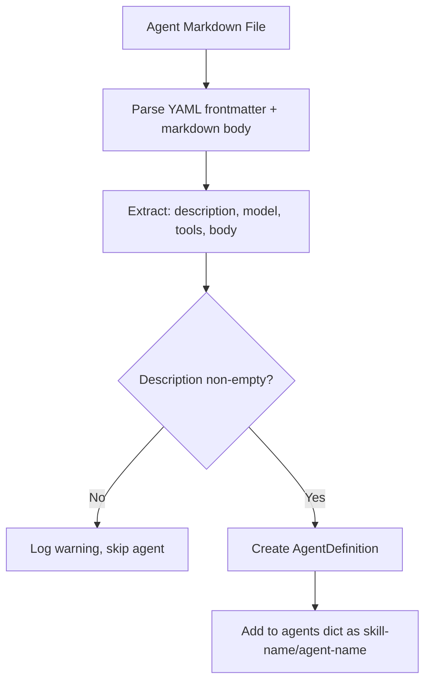

# Design: Skill System and Sub-Agent Delegation

<!-- This design describes the current implementation approach. Updated through delta reconciliation. -->

**Feature Spec**: [../../feature-specs/agent/skills.md](../../feature-specs/agent/skills.md)
**Status**: Current

## Purpose

This document explains the design rationale for the skill system: how skills are structured, discovered, registered, and integrated with the coordinator to enable sub-agent delegation via the SDK.

## Problem Context

The coordinator needs to make specialized sub-agents available to the SDK's orchestrator for delegation. Skills provide a structured, discoverable way to organize and define these agents.

**Constraints:**
- Skills must be directory-based (not single files) to accommodate future expansion
- Agent definitions must be loadable from markdown files with metadata
- Agents must be discoverable and loaded at startup before conversations begin
- Invalid or missing skills/agents should not crash the system
- Agents are passed to the SDK as a dictionary and persist for the session lifetime

**Interactions:**
- Bootstrap process creates the skills directory (via skills hook, see [workspace-bootstrap](workspace-bootstrap.md))
- Skill registry discovers all skills and agents at startup
- Coordinator retrieves agents from registry and passes them to SDK (see [core-architecture](core-architecture.md))
- SDK's internal orchestrator uses agents for delegation decisions

## Design Overview

Three-component architecture: a bootstrap hook creates the directory structure, the skill registry discovers and loads all skills and agents, and the coordinator passes the agents to the SDK.

```
┌──────────────────────────────────────────────────────┐
│              Coordinator Layer                        │
│  ┌────────────────────────────────────────────┐       │
│  │  Coordinator                               │       │
│  │  - Receives agents dict from registry      │       │
│  │  - Passes agents to ClaudeAgentOptions     │       │
│  └────┬───────────────────────────────────────┘       │
├───────┼──────────────────────────────────────────────┤
│       │                                               │
│       ▼                                               │
│  ┌────────────────────────────────────────────┐       │
│  │  Skill Registry                            │       │
│  │  - Discovers skills at startup             │       │
│  │  - Loads agents from each skill            │       │
│  │  - Provides agents dict to coordinator     │       │
│  └────┬───────────────────────────────────────┘       │
├───────┼──────────────────────────────────────────────┤
│       │                                               │
│       ▼                                               │
│  ┌────────────────────────────────────────────┐       │
│  │  Skills Directory Structure                │       │
│  │  workspace/skills/                         │       │
│  │  ├── skill-name/                           │       │
│  │  │   ├── SKILL.md (metadata)               │       │
│  │  │   └── agents/                           │       │
│  │  │       ├── agent-1.md                    │       │
│  │  │       └── agent-2.md                    │       │
│  │  └── another-skill/                        │       │
│  │      └── agents/                           │       │
│  └────────────────────────────────────────────┘       │
└──────────────────────────────────────────────────────┘
```

## Components

### Implementation Structure

| Layer/Component | Responsibility | Key Decisions |
|-----------------|----------------|---------------|
| `src/tachikoma/skills/__init__.py` | Re-exports `SkillRegistry`, `Skill`, `skills_hook` | Package module for the skills subsystem |
| `src/tachikoma/skills/registry.py` | `SkillRegistry` class: discovers skills, loads agents, builds agents dict; `Skill` dataclass for metadata | Uses `python-frontmatter` for parsing; constructs `AgentDefinition` from `claude_agent_sdk.types` directly |
| `src/tachikoma/skills/hooks.py` | `skills_hook` bootstrap callback: creates `workspace/skills/` directory | Follows DES-003 pattern (subsystem-owned hook); directory creation only |

### Cross-Layer Contracts

**SkillRegistry → Coordinator contract:**

The registry provides a dictionary of `AgentDefinition` objects indexed by namespace. The coordinator passes this dictionary directly to `ClaudeAgentOptions.agents`.

```
SkillRegistry(workspace_path)
    │
    ├── discovers skills in workspace/skills/
    ├── loads agents from each skill's agents/ subdirectory
    ├── builds agents dict: {"skill-name/agent-name": AgentDefinition, ...}
    │
    └── get_agents() → dict[str, AgentDefinition]
            │
            ▼
    Coordinator(agents=registry.get_agents())
            │
            └── ClaudeAgentOptions(agents=agents)
```

**Integration Points:**
- SkillRegistry ↔ filesystem: reads `SKILL.md` and agent markdown files from `workspace/skills/`
- SkillRegistry → Coordinator: provides agents dictionary via `get_agents()`
- Skills hook ↔ Bootstrap: registered as a standard bootstrap hook (DES-003)

## Modeling

### Agent Definition Transformation



**AgentDefinition fields** (SDK type):
- `description`: From YAML frontmatter (required)
- `prompt`: From markdown body (empty string is valid)
- `model`: From YAML frontmatter (optional; recognized literals mapped through, unrecognized values default to `None` for SDK default)
- `tools`: From YAML frontmatter (optional list of tool names)

### Data Types

```
Skill (dataclass)
├── name: str (matches folder name)
├── description: str
└── version: str | None

SkillRegistry
├── _agents: dict[str, AgentDefinition]
├── _skills: dict[str, Skill]
├── get_agents() → dict[str, AgentDefinition]
└── skills (property) → dict[str, Skill]
```

## Data Flow

### Agent Discovery Process

```
1. SkillRegistry receives workspace_path
2. Resolves workspace_path / "skills"
   ├─ Directory doesn't exist → return empty agents dict (valid state)
   └─ Directory exists → proceed
3. For each subdirectory in skills/:
   a. Check for SKILL.md
      ├─ Not found → log warning, skip directory
      └─ Found → parse YAML frontmatter
   b. Validate skill metadata (name, description, name == folder name)
      ├─ Invalid → log warning, skip skill
      └─ Valid → store Skill metadata, proceed to agents
   c. Check for agents/ subdirectory
      ├─ Not found → valid skill with no agents, continue
      └─ Found → scan for .md files
   d. For each .md file in agents/:
      ├─ Parse YAML frontmatter + markdown body
      ├─ Validate (description required)
      ├─ Create AgentDefinition with namespace "skill-name/agent-name"
      └─ Add to agents dictionary
4. Return complete agents dictionary
```

### Startup Integration

```
1. Bootstrap runs skills hook → creates workspace/skills/ if missing
2. __main__.py creates SkillRegistry(workspace_path)
   → Scans workspace/skills/
   → Loads all SKILL.md files
   → Discovers and loads all agents/
   → Builds agents dictionary
3. __main__.py passes registry.get_agents() to Coordinator constructor
4. Coordinator passes agents to ClaudeAgentOptions
5. SDK orchestrator can delegate to any loaded agent
```

## Key Decisions

### Directory-based Skills over Single Files

**Choice**: Skills are directories (`skills/skill-name/`) containing SKILL.md and agents/ subdirectory, not single files.
**Why**: Directories allow for future expansion (instructions, resources, configurations) without breaking the structure.
**Alternatives Considered**:
- Single files: Simpler but brittle; precludes adding skill-level components later

**Consequences**:
- Pro: Extensible foundation for future skill components
- Pro: Clear organizational hierarchy
- Con: More filesystem operations needed

### YAML Frontmatter for Metadata

**Choice**: Skill and agent metadata is embedded in markdown files using YAML frontmatter, parsed with the `python-frontmatter` library.
**Why**: Markdown is human-readable, and YAML frontmatter is a widely-adopted convention. Metadata stays with the file it describes, making skills self-contained and portable.
**Alternatives Considered**:
- Raw PyYAML (manual frontmatter extraction): Requires manual `---` delimiter parsing
- Separate JSON/YAML files: Decoupled but requires more files per skill

**Consequences**:
- Pro: Self-contained metadata with markdown body
- Pro: Human-friendly format, portable
- Con: Adds `python-frontmatter` dependency

### Model Type Narrowing

**Choice**: Map recognized model strings (`sonnet`, `opus`, `haiku`, `inherit`) to typed literals; default unrecognized values to `None` (SDK applies default model).
**Why**: The SDK's `AgentDefinition.model` field expects `Literal["sonnet", "opus", "haiku", "inherit"] | None`. Python's type system requires narrowing the raw YAML string to a literal. Unrecognized values become `None` rather than causing an error, keeping the registry lenient while satisfying type safety.

**Consequences**:
- Pro: Type-safe AgentDefinition construction
- Pro: No crashes from unexpected model strings
- Con: Silently defaults unrecognized models to SDK default (mitigated by warning logs)

### Skill Metadata Retention

**Choice**: SkillRegistry retains skill metadata (name, description, version) in memory after agent extraction, accessible via a `skills` property.
**Why**: Future features (automatic skill detection and injection) will need skill metadata for matching incoming messages against skills. Retaining metadata avoids rework.

**Consequences**:
- Pro: Forward-compatible without registry restructuring
- Pro: Negligible memory cost
- Con: Slightly more data in memory than strictly needed for current functionality

### Agents Passed to SDK at Initialization

**Choice**: All agents are discovered at startup and passed to the SDK via `ClaudeAgentOptions.agents`.
**Why**: The SDK's orchestrator requires agents to be known upfront for delegation decisions. Agents must be available for the entire session.
**Alternatives Considered**:
- Dynamic agent loading mid-session: Complex, SDK doesn't support mid-session agent updates

**Consequences**:
- Pro: Single load at startup, simple lifecycle
- Pro: Aligns with SDK's design
- Con: Cannot add agents during conversation

### Graceful Error Handling

**Choice**: Invalid skills/agents are logged as warnings; registry continues loading other skills.
**Why**: A single malformed skill file should not crash the entire system. Partial functionality is better than complete failure.

**Consequences**:
- Pro: System resilience
- Pro: Operator sees what went wrong (diagnostic logging)
- Con: Silent skipping could hide typos (mitigated by explicit warning logs)

## System Behavior

### Invariants

1. **Agent Uniqueness by Namespace**: Each agent has a unique namespace key (skill-name/agent-name). Skill names are folder names (unique by filesystem constraint) and agent names are filename stems (unique within a skill).

2. **Session Stability**: Once agents are passed to the SDK at initialization, the set of available agents does not change for the session duration.

3. **Graceful Degradation**: Invalid skills or agents do not cause the system to fail. Registry returns whatever agents it successfully loaded.

### Scenario: First launch — no skills exist

**Given**: The `skills/` directory is empty (created by bootstrap hook)
**When**: The registry initializes
**Then**: An empty agents dictionary is returned. The coordinator starts with no sub-agents. System operates normally.
**Rationale**: Empty registry is a valid initial state.

### Scenario: Skill with valid agents

**Given**: A skill directory with valid SKILL.md and agent definitions exists
**When**: The registry initializes
**Then**: All agents are discovered, validated, and added to the agents dictionary with namespace keys.
**Rationale**: Happy path — skills are self-contained and discoverable.

### Scenario: Mixed valid and invalid skills

**Given**: Some skills are valid and some have errors (bad YAML, missing fields)
**When**: The registry initializes
**Then**: Valid skills load normally. Invalid skills are logged as warnings and skipped. The coordinator starts with the agents from valid skills only.
**Rationale**: Graceful degradation — one bad skill shouldn't prevent others from loading.

## Notes

- The SDK orchestrator makes delegation decisions opaquely. The application provides agents; the SDK decides how to use them.
- Tool scoping via agent definition's tools field is enforced by the SDK at invocation time.
- This design is infrastructure-focused. Intelligence for automatic skill detection builds on top.
