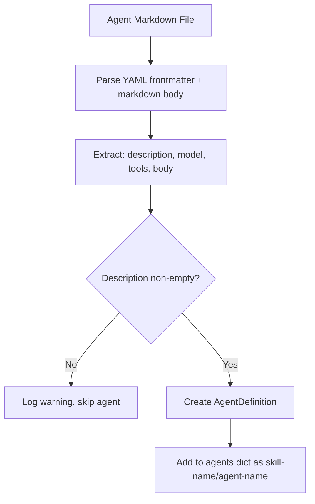

# Design: Skill System and Sub-Agent Delegation

<!-- This design describes the current implementation approach. Updated through delta reconciliation. -->

**Feature Spec**: [../../feature-specs/agent/skills.md](../../feature-specs/agent/skills.md)
**Status**: Current

## Purpose

This document explains the design rationale for the skill system: how skills are structured, discovered, registered, detected per-message, and integrated with the coordinator to enable targeted sub-agent delegation via the SDK.

## Problem Context

The coordinator needs to make specialized sub-agents available to the SDK's orchestrator for delegation. Skills provide a structured, discoverable way to organize and define these agents. Only relevant skills should be loaded per session to avoid wasting context on irrelevant agents.

**Constraints:**
- Skills must be directory-based (not single files) to accommodate future expansion
- Agent definitions must be loadable from markdown files with metadata
- Skills must be discoverable at startup; only relevant skills loaded per-session based on LLM classification
- Skills must be refreshable at runtime when files change on disk, without restart
- Invalid or missing skills/agents should not crash the system
- Detection failures must never block messages — same error contract as other pre-processing providers
- Skills are detected and accumulated per-message within a session — newly detected skills are appended as context entries; the agent set is re-derived on each message from all accumulated entries

**Interactions:**
- Bootstrap process creates the skills directory and shared registry (via skills hook, see [workspace-bootstrap](workspace-bootstrap.md))
- Skill registry discovers all skills and agents at startup, with on-demand refresh when marked dirty
- Filesystem watcher monitors the skills directory and marks the registry dirty when changes occur
- Event bus (ADR-009) carries SkillsChanged events for future consumers (e.g., context invalidation)
- Skills context provider classifies relevance per-message via the per-message pre-processing pipeline (see [pre-processing-pipeline](pre-processing-pipeline.md))
- Coordinator derives agents from context entries and the skill registry, passing them to SDK (see [core-architecture](core-architecture.md))
- SDK's internal orchestrator uses detected agents for delegation decisions

## Design Overview

Eight-component architecture: a bootstrap hook creates the directory structure and shared registry, the skill registry discovers and loads all skills and agents at startup from multiple sources (with runtime refresh support) and exposes a transitive dependency resolver, a filesystem watcher monitors the skills directory for changes and marks the registry dirty, a per-message pre-processing pipeline runs on every message, a skills context provider (receiving the registry via injection, receiving the `MessageEnvelope` from the pipeline; see [DES-013](../../design/DES-013-typed-envelope-with-property-hooks.md)) resolves pinned skills unconditionally and then classifies relevance per-message considering only skills not already in context (refreshing the registry first, then expanding each detected skill through the resolver before emission), the coordinator derives agents from context entries and the skill registry, and the system prompt preamble provides awareness-level skill context independent of per-message detection.

```
┌────────────────────────────────────────────────────────────┐
│              Coordinator Layer                              │
│  ┌──────────────────────────────────────────────────┐      │
│  │  Coordinator                                     │      │
│  │  - Derives agents from entries + registry        │      │
│  │  - Re-derives on each message (accumulates)      │      │
│  │  - Passes agents to ClaudeAgentOptions           │      │
│  └────┬─────────────────────────────────────────────┘      │
├───────┼────────────────────────────────────────────────────┤
│       ▼                                                    │
│  ┌──────────────────────────────────────────────────┐      │
│  │  SkillsContextProvider (PerMessagePreProcessing)  │      │
│  │  - Refreshes registry before classification      │      │
│  │  - Filters to unloaded skills only               │      │
│  │  - Classifies relevance via LLM                  │      │
│  │  - One entry per skill, with metadata            │      │
│  │  - Returns content only (no agents)              │      │
│  │  - Receives SkillRegistry via injection          │      │
│  └────┬─────────────────────────────────────────────┘      │
├───────┼────────────────────────────────────────────────────┤
│       ▼                                                    │
│  ┌──────────────────────┐  ┌───────────────────────────┐   │
│  │ Skill Registry       │  │ Watcher Task              │   │
│  │ (multi-source,       │  │ (asyncio.Task)            │   │
│  │  bootstrap extras)   │  │                           │   │
│  │                      │  │ - awatch(skills/)         │   │
│  │ - Discovers skills   │  │ - Marks registry dirty    │   │
│  │   from all sources   │  │ - Dispatches SkillsChanged│   │
│  │ - Loads agents       │  │ - 5s debounce             │   │
│  │ - Last-wins on       │  │                           │   │
│  │   collision          │  │                           │   │
│  │ - Refreshes on       │  │                           │   │
│  │   dirty flag         │  │                           │   │
│  └────┬─────────────────┘  └───────────────────────────┘   │
├───────┼────────────────────────────────────────────────────┤
│       ▼                                                    │
│  ┌──────────────────────────────────────────────────┐      │
│  │  Skill Sources                                   │      │
│  │  Built-in: src/tachikoma/skills/builtin/         │      │
│  │  ├── skill-authoring-guide/                      │      │
│  │  │   ├── SKILL.md                                │      │
│  │  │   └── references/agents.md                    │      │
│  │  Workspace: workspace/skills/                    │      │
│  │  ├── custom-skill/                               │      │
│  │  │   ├── SKILL.md                                │      │
│  │  │   └── agents/*.md                             │      │
│  │  └── workflow-authoring-guide/                    │      │
│  │      ├── SKILL.md                                │      │
│  │      └── references/step-design.md               │      │
│  │  (skills may also contain workflows/ — see       │      │
│  │   workflow-state-machine design)                  │      │
│  │  Channel: (via get_skill_sources() + add_source) │      │
│  │  ├── src/tachikoma/telegram/skill/               │      │
│  │  │   └── SKILL.md                                │      │
│  └──────────────────────────────────────────────────┘      │
└────────────────────────────────────────────────────────────┘
```

## Components

### Implementation Structure

| Layer/Component | Responsibility | Key Decisions |
|-----------------|----------------|---------------|
| `src/tachikoma/skills/__init__.py` | Re-exports `SkillRegistry`, `Skill`, `SkillsChanged`, `SkillsContextProvider`, `skills_hook`, `watch_skills` | Package module for the skills subsystem |
| `src/tachikoma/skills/registry.py` | `SkillRegistry` class: discovers skills from multiple sources, loads agents, builds agents dict, stores skill body and path; parses the `depends_on` frontmatter list onto the `Skill` dataclass; discovers workflow definitions within skills and exposes via `get_workflow()` and `workflows` property; refreshes all sources on dirty flag via swap-on-success; `add_source(path)` registers and discovers additional sources post-construction (used by channels to contribute skills during startup); exposes `resolve_chain(skill_name)` for transitive dependency resolution (deps-first, anchor-last, cycle-tolerant, unknown-dep-tolerant, memoized); runs a post-discovery `_validate_deps()` pass on every load path to log unknown-dep warnings; `Skill` dataclass for metadata (name from folder, description, version, body, path, `depends_on`) | Uses `python-frontmatter` for parsing; constructs `AgentDefinition` directly; multi-source with last-wins precedence; `mark_dirty()` for external callers, `refresh()` for dirty-check-and-rescan; `add_source()` appends to `_skill_sources` and calls `_discover()` immediately; workflow definitions stored in `_workflows` dict keyed by (skill_name, workflow_name); `depends_on` parsed as `tuple[str, ...]` with warn-and-fall-back on malformed values; `_chain_cache` keyed by skill name, cleared in `refresh()` alongside the fresh-dict swap and at the start of `add_source()` |
| `src/tachikoma/skills/context_provider.py` | `SkillsContextProvider(MessageContextProvider)`: extends standalone MessageContextProvider ABC (not ContextProvider — signatures are incompatible), receives `SkillRegistry` via constructor injection, receives `MessageEnvelope` from the pipeline (reads `message.sdk_input` for the classification prompt, `message.pinned_skills` for unconditional skill resolution — both hooks live on the base; see [DES-013](../../design/DES-013-typed-envelope-with-property-hooks.md)), refreshes registry before classification, resolves pinned skills first (via `registry.resolve_chain()` with first-seen dedup against existing entries), then classifies only unloaded skills via standalone `query()` with Opus low effort (DES-007), expands each classification-detected skill via `registry.resolve_chain()` and merges the chains with first-seen dedup before emission, reads skill body from registry's pre-loaded `Skill.body`, returns one ContextResult per skill in the resolved chain with metadata identifying skill name, agents=None. Also contains `extract_skill_names()`, `derive_agents_from_entries()`, and `render_agents_context()` helpers — the last renders the session's `agents` entry into the classification prompt so classification sees the same operational conventions the main agent reads from AGENTS.md | Receives registry and `AgentDefaults` via constructor injection; no tools for classification agent (pure reasoning); fully consumes query() generator (DES-005); `extract_skill_names()` reads skill names from entry metadata for filtering; `derive_agents_from_entries()` derives agents for the coordinator; pinned skills are resolved before classification and added to the seen-set so they are excluded from the classifier's candidate list; dep expansion happens strictly after classification (does not influence candidate list) and before dedup against `existing_entries`; emitted dep-loaded entries are shape-identical to classification-loaded entries; per-skill `try/except` around `resolve_chain` so one failing chain does not block other detected skills; `render_agents_context()` filters `existing_entries` to owner=="agents" (ID-ordered) and wraps each in `<agents>…</agents>` matching `build_system_prompt`'s format (falls back to a neutral placeholder when no entry is present); `soul`/`user` entries are intentionally excluded — only AGENTS.md content is injected into the classifier |
| `src/tachikoma/skills/hooks.py` | `skills_hook` bootstrap callback: creates `workspace/skills/` directory, resolves built-in skills path, creates `SkillRegistry` with both sources, registers plugin skill paths from `ctx.extras["plugin_skill_paths"]` as namespaced sources, registers plugin event listeners, stores in `ctx.extras["skill_registry"]` | Follows DES-003 pattern; built-in path via `Path(__file__).parent / "builtin"`; graceful fallback if built-in missing; plugin paths registered after default sources via `add_namespaced_source(alias, path)` |
| `src/tachikoma/skills/listeners.py` | `register_plugin_event_listeners(bus, registry, session_registry)`: subscribes to `PluginInstalled` (calls `add_namespaced_source` + dispatches `SkillsChanged`), `PluginRemoving` (marks active session entries deleted), `PluginRemoved` (calls `remove_namespaced_source` + dispatches `SkillsChanged`) | Lives in skills module per event-based decoupling decision; manager has zero skill-registry coupling; registered inside `skills_hook` |
| `src/tachikoma/skills/watcher.py` | `watch_skills()` async function: monitors skills directory, marks registry dirty, dispatches `SkillsChanged` events; top-level exception handler prevents silent task death | Uses `watchfiles.awatch()` with 5s debounce and 2s rust_timeout; relies on watchfiles' default filtering behavior (hidden files, `__pycache__` excluded) |
| `src/tachikoma/skills/events.py` | `SkillsChanged(BaseEvent[None])`: typed event for skill change notification | Follows bubus event pattern (ADR-009); no payload — signals "something changed" |
| `src/tachikoma/context/loading.py` (`SYSTEM_PREAMBLE`) | Awareness-level skills documentation in the system prompt preamble: skills exist in `skills/` directory, auto-detected per session, can create/manage, distinct from Claude Code's native skills and slash commands. Structural details (SKILL.md format, agents/, YAML fields) are covered by the built-in authoring guide skill | Part of the `SYSTEM_PREAMBLE` constant; loaded once at startup; independent of per-message detection; follows ADR-008 append pattern |
| `src/tachikoma/per_message_pre_processing.py` | `MessageContextProvider` ABC (standalone, not extending ContextProvider) + `MessagePreProcessingPipeline` class (parallel execution with error isolation). Providers receive existing context entries enabling filtering of already-loaded data | New file mirroring `message_post_processing.py` pattern; pipeline runs on every message (not session-gated); has internal lock for concurrent invocation safety |

### Cross-Layer Contracts

**Bootstrap → Registry → Provider → Per-Message Pipeline → Coordinator contract:**

The skills hook creates the registry during bootstrap and exposes it via extras. The provider receives the registry via injection, refreshes it, classifies only unloaded skills, assembles one result per skill with metadata, and returns content only (no agents). The coordinator derives agents from all accumulated context entries and the skill registry.

```
skills_hook(ctx)
    │
    ├── workspace_skills_path = workspace_path / "skills"
    ├── Creates workspace_skills_path directory (idempotent)
    ├── Resolves builtin_path = Path(__file__).parent / "builtin"
    │   ├─ Exists → include in sources
    │   └─ Missing → log warning, skip
    ├── Creates SkillRegistry([builtin_path, workspace_skills_path])
    └── ctx.extras["skill_registry"] = registry

__main__.py (after bootstrap.run())
    │
    ├── skill_registry = bootstrap.extras["skill_registry"]
    ├── SkillsContextProvider(agent_defaults, skill_registry)
    └── msg_pre_pipeline.register(SkillsContextProvider)

SkillsContextProvider.provide(message: MessageEnvelope, existing_entries=entries)
    │
    ├── Calls registry.refresh() (dirty check → re-scan all sources if needed)
    ├── Resolves pinned skills from message.pinned_skills (unconditional, via resolve_chain, deduped)
    ├── Extracts loaded skill names from entries metadata
    ├── Filters registry to unloaded skills only (pinned skills excluded from candidates)
    ├── If no unloaded skills → return None (skip, no LLM call)
    ├── Renders the `agents` entry from existing_entries via render_agents_context()
    │   (soul/user intentionally ignored — out of scope for classification)
    ├── Classifies via query() [Opus low effort, DES-007] using message.sdk_input
    ├── For each detected skill (per-skill try/except for error isolation):
    │   └── chain = registry.resolve_chain(name)  # deps-first, anchor-last
    │   └── merge into ordered list with first-seen dedup (seed seen-set with loaded_names)
    ├── For each skill in the resolved ordered chain:
    │   └── ContextResult(tag="skills", content=XML, metadata={"skill_name": name})
    └── Returns list[ContextResult] (agents=None on all)
        │
        └── Per-message pipeline collects results
                │
                ▼
        Coordinator saves new entries, derives agents from all entries + registry
                │
                └── ClaudeAgentOptions(agents=derived_agents)
```

**Watcher → Registry → EventBus contract:**

The watcher monitors the skills directory and signals the registry and event bus when changes are detected.

```
watch_skills(skills_path, registry, bus)
    │
    └── on file changes (debounced 5s):
        ├── registry.mark_dirty() → sets _dirty = True
        └── await bus.dispatch(SkillsChanged()) → notifies subscribers
```

**Integration Points:**
- skills_hook ↔ Bootstrap: registered as standard hook (DES-003); creates `SkillRegistry`, writes `"skill_registry"` to extras
- __main__.py ↔ extras: reads `"skill_registry"` after bootstrap; passes to provider constructor
- SkillsContextProvider ↔ SkillRegistry: injected dependency; provider reads `skills` property and calls `get_agents_for_skill()`
- Channel → SkillRegistry: `channel.get_skill_sources()` returns paths; `__main__.py` calls `registry.add_source(path)` for each — startup-time, one-directional integration
- SkillRegistry ↔ filesystem: scans each source path (built-in + workspace + channel-provided) for skill directories; reads `SKILL.md` and agent markdown files
- SkillsContextProvider ↔ Per-Message Pipeline: registers via `msg_pre_pipeline.register(provider)`; `provide(message: MessageEnvelope, existing_entries=entries)` called on every message
- SkillsContextProvider ↔ SkillRegistry: shared — registry received via constructor from bootstrap extras; `refresh()` called before `skills` property access
- SkillsContextProvider ↔ SDK: standalone `query()` call for classification (no tools, low effort, DES-007); `model=agent_defaults.searcher_model` (default `"opus"`) because selecting relevant skills requires understanding user intent over a large candidate set — more "smart retrieval" than clear-rule classification (see DES-004)
- Per-Message Pipeline ↔ Coordinator: `pipeline.run(msg: MessageEnvelope, existing_entries=entries)` returns `list[ContextResult]`; coordinator passes the envelope directly; saves new entries and derives agents from all entries + registry. The coordinator gates the call on `envelope.runs_pre_processing`, skipping the pipeline (and therefore the classifier) entirely for envelopes that opt out (e.g., a `ButtonTapMessage`)
- Watcher ↔ Registry: `mark_dirty()` — write-only, no return value
- Watcher ↔ EventBus: `await bus.dispatch(SkillsChanged())` — awaited dispatch, no return value used
- `__main__.py` ↔ Watcher: task creation/cancellation via `asyncio.create_task` / `task.cancel()`
- Skills hook ↔ Bootstrap: registered as a standard bootstrap hook (DES-003); creates registry with multi-source and stores in `ctx.extras`
- SYSTEM_PREAMBLE ↔ Agent: the preamble includes an awareness-level Skills section (skills exist, auto-detected, can create/manage); structural details covered by built-in authoring guide skill

## Modeling

### Agent Definition Transformation


```mermaid
flowchart TD
    File["Agent Markdown File"] --> Parse["Parse YAML frontmatter + markdown body"]
    Parse --> Extract["Extract: description, model, tools, body"]
    Extract --> Validate{"Description non-empty?"}
    Validate -->|No| Skip["Log warning, skip agent"]
    Validate -->|Yes| Create["Create AgentDefinition"]
    Create --> Dict["Add to agents dict as skill-name/agent-name"]
```

**AgentDefinition fields** (SDK type):
- `description`: From YAML frontmatter (required)
- `prompt`: From markdown body (empty string is valid)
- `model`: From YAML frontmatter (optional; recognized literals mapped through, unrecognized values default to `None` for SDK default)
- `tools`: From YAML frontmatter (optional list of tool names)

### Data Types

```
Skill (dataclass, frozen)
├── name: str (derived from folder name)
├── description: str
├── version: str | None
├── body: str (SKILL.md content without YAML frontmatter, loaded at init)
├── path: Path (absolute path to skill directory)
├── depends_on: tuple[str, ...] (declared direct dependencies by skill name; default ())
├── namespace: str | None = None (plugin alias or None for default namespace)
└── qualified_name: str (property: f"{namespace}:{name}" when namespaced, bare name otherwise)

SkillRegistry
├── __init__(skill_sources: list[Path])  # scans each source; last-wins on name collision; runs _validate_deps at end
├── _agents: dict[str, AgentDefinition]
├── _skills: dict[str, Skill]
├── _workflows: dict[tuple[str, str], WorkflowDefinition]  (keyed by skill_name, workflow_name)
├── _chain_cache: dict[str, list[Skill]]  (memoized transitive chains, keyed by anchor skill name; cleared on refresh/add_source)
├── _dirty: bool                         (set by watcher, cleared by refresh)
├── _skill_sources: list[Path]           (stored for reuse during refresh; default-namespace only)
├── _namespaced_source_paths: dict[str, list[Path]]  (plugin alias → paths added under that alias; used for remove and refresh)
├── add_source(path: Path) → None       (clears _chain_cache, appends to _skill_sources, discovers immediately, runs _validate_deps; used by channels)
├── add_namespaced_source(alias: str, path: Path) → None  (registers plugin skill path under alias namespace; per-skill try/except; clears _chain_cache; runs _validate_deps)
├── remove_namespaced_source(alias: str) → None  (drops all skills/agents/workflows for alias; clears _namespaced_source_paths[alias]; clears _chain_cache)
├── mark_dirty() → None                 (external API for watcher)
├── refresh() → None                    (check dirty, re-discover all sources if needed; clears _chain_cache alongside fresh-dict swap; runs _validate_deps on success)
├── resolve_chain(skill_name: str) → list[Skill]  (DFS post-order, visited-set, memoized; raises KeyError if skill_name not registered)
├── _validate_deps() → None             (private; walks _skills once, logs one warning per dependent skill whose depends_on contains unknown names)
├── get_agents() → dict[str, AgentDefinition]
├── get_agents_for_skill(skill_name: str) → dict[str, AgentDefinition]
├── get_workflow(skill_name: str, workflow_name: str) → WorkflowDefinition | None
├── skills (property) → dict[str, Skill]
└── workflows (property) → dict[tuple[str, str], WorkflowDefinition]

SkillsContextProvider(MessageContextProvider)   [standalone ABC, not extending ContextProvider]
├── _agent_defaults: AgentDefaults
├── _registry: SkillRegistry     (injected via constructor from bootstrap extras)
└── provide(message: MessageEnvelope, *, existing_entries) → list[ContextResult] | None
    ├── Resolve pinned skills from message.pinned_skills (unconditional, deps-first)
    ├── Add pinned skills to seen-set for classifier exclusion
    ├── Extract loaded skill names from entries metadata
    ├── Filter registry to unloaded skills only
    ├── Skip if no unloaded skills → return None
    ├── Classify via query() (DES-007) using message.sdk_input
    └── Return one ContextResult per skill, each with metadata={"skill_name": name}, agents=None

extract_skill_names(entries) → set[str]
└── Reads metadata["skill_name"] from entries where owner="skills"

derive_agents_from_entries(entries, registry) → dict[str, AgentDefinition]
└── Extracts skill names from entries, looks up agents from registry per skill

SkillsChanged(BaseEvent[None])
└── (no fields — signals "skills changed on disk")
```

## Data Flow

### Agent Discovery Process

```
1. SkillRegistry receives skill_sources: list[Path]
2. For each source path in skill_sources:
   ├─ Directory doesn't exist → skip source (debug log, valid state)
   └─ Directory exists → scan for skill subdirectories
3. For each subdirectory in source:
   a. Check for SKILL.md
      ├─ Not found → log warning, skip directory
      └─ Found → parse YAML frontmatter
   b. Derive name from folder, validate description (required)
      ├─ Invalid → log warning, skip skill
      ├─ Name collision with earlier source → remove earlier skill's agents, replace
      └─ Valid → store Skill metadata, proceed to agents
   c. Check for agents/ subdirectory
      ├─ Not found → valid skill with no agents, continue
      └─ Found → scan for .md files
   d. For each .md file in agents/:
      ├─ Parse YAML frontmatter + markdown body
      ├─ Validate (description required)
      ├─ Create AgentDefinition with namespace "skill-name/agent-name"
      └─ Add to agents dictionary
4. Return complete skills and agents dictionaries
```

### Startup Integration

```
1. Bootstrap runs skills hook:
   a. Creates workspace/skills/ directory (idempotent)
   b. Resolves built-in path (Path(__file__).parent / "builtin")
      ├─ Exists → include in sources
      └─ Missing → log warning, omit
   c. Creates SkillRegistry([builtin_path, workspace_skills_path])
      → Registry scans built-in first, then workspace (last-wins precedence)
      → Loads all SKILL.md files (including body and path) and agents/
   d. Stores registry in ctx.extras["skill_registry"]
2. __main__.py retrieves skill_registry from bootstrap.extras["skill_registry"]
3. __main__.py creates SkillsContextProvider(agent_defaults, skill_registry)
   → Provider receives registry (does not create its own)
4. __main__.py registers SkillsContextProvider in per-message pre-processing pipeline (not session-gated)
5. __main__.py creates channel, then registers channel-provided skill sources:
   for path in channel.get_skill_sources():
       skill_registry.add_source(path)
   → Skills from channel sources discovered immediately (e.g., Telegram's send_file skill)
   → Channel sources included in subsequent refresh() scans (last-wins precedence)
6. __main__.py creates watcher task:
   asyncio.create_task(watch_skills(skills_path, skill_registry, bus), name="skills_watcher")
7. __main__.py passes skill_registry and msg_pre_pipeline to Coordinator constructor
8. Detection happens per-message via per-message pipeline:
   → Provider calls registry.refresh() first (dirty check → re-scan all sources)
   → Provider extracts loaded skill names from existing entries metadata
   → Provider filters to unloaded skills only, classifies relevance via LLM
   → New entries saved with metadata, agents derived from all entries + registry
   → SDK sees accumulated agents from all detected skills
```

### Skill Change Detection and Refresh

```
1. File change occurs in workspace/skills/
   (create dir, write SKILL.md, add agent .md, modify, delete)

2. watchfiles.awatch() accumulates changes during debounce window (5s)
   └── Burst of changes coalesced into single yield

3. Watcher loop receives change set
   ├── registry.mark_dirty()          → sets _dirty = True
   └── bus.dispatch(SkillsChanged())  → notifies subscribers

4. Next per-message evaluation, coordinator calls per-message pipeline
   └── SkillsContextProvider.provide(message, existing_entries=entries)
       ├── registry.refresh()
       │   ├── _dirty is True → proceed
       │   ├── Save references: old_agents, old_skills
       │   ├── Clear dicts, run _discover(skills_path)
       │   ├── Success → reset _dirty = False
       │   └── Exception → restore old_agents, old_skills, log error
       └── Continue with classification using refreshed registry
```

## Key Decisions

### Directory-based Skills over Single Files

**Choice**: Skills are directories (`skills/skill-name/`) containing SKILL.md and agents/ subdirectory, not single files.
**Why**: Directories allow for future expansion (instructions, resources, configurations) without breaking the structure.
**Alternatives Considered**:
- Single files: Simpler but brittle; precludes adding skill-level components later

**Consequences**:
- Pro: Extensible foundation for future skill components
- Pro: Clear organizational hierarchy
- Con: More filesystem operations needed

### YAML Frontmatter for Metadata

**Choice**: Skill and agent metadata is embedded in markdown files using YAML frontmatter, parsed with the `python-frontmatter` library.
**Why**: Markdown is human-readable, and YAML frontmatter is a widely-adopted convention. Metadata stays with the file it describes, making skills self-contained and portable.
**Alternatives Considered**:
- Raw PyYAML (manual frontmatter extraction): Requires manual `---` delimiter parsing
- Separate JSON/YAML files: Decoupled but requires more files per skill

**Consequences**:
- Pro: Self-contained metadata with markdown body
- Pro: Human-friendly format, portable
- Con: Adds `python-frontmatter` dependency

### Model Type Narrowing

**Choice**: Map recognized model strings (`sonnet`, `opus`, `haiku`, `inherit`) to typed literals; default unrecognized values to `None` (SDK applies default model).
**Why**: The SDK's `AgentDefinition.model` field expects `Literal["sonnet", "opus", "haiku", "inherit"] | None`. Python's type system requires narrowing the raw YAML string to a literal. Unrecognized values become `None` rather than causing an error, keeping the registry lenient while satisfying type safety.

**Consequences**:
- Pro: Type-safe AgentDefinition construction
- Pro: No crashes from unexpected model strings
- Con: Silently defaults unrecognized models to SDK default (mitigated by warning logs)

### Skill Metadata Retention

**Choice**: SkillRegistry retains skill metadata (name, description, version) in memory after agent extraction, accessible via a `skills` property.
**Why**: Future features (automatic skill detection and injection) will need skill metadata for matching incoming messages against skills. Retaining metadata avoids rework.

**Consequences**:
- Pro: Forward-compatible without registry restructuring
- Pro: Negligible memory cost
- Con: Slightly more data in memory than strictly needed for current functionality

### Per-Message Agent Detection via Per-Message Pipeline

**Choice**: Agents are detected per-message based on message context via the skills context provider in the per-message pre-processing pipeline. Skills accumulate within a session — only unloaded skills are classified on each message.
**Why**: Per-session detection locks skills to the first message, missing newly relevant skills as the conversation topic evolves. Per-message detection with accumulation ensures skills are detected as they become relevant, while filtering already-loaded skills prevents redundant LLM calls.
**Alternatives Considered**:
- All agents at startup: Wastes context on irrelevant agents
- Per-session detection (previous approach): Simpler but misses skills that become relevant mid-session
- Per-message detection replacing all skills: Would lose previously relevant skills

**Consequences**:
- Pro: Skills detected as they become relevant during conversation
- Pro: Only unloaded skills classified — no redundant LLM calls
- Pro: Topic shifts trigger fresh classification (session boundary clears entries)
- Con: LLM call on every message until all skills are loaded (mitigated by skip when all loaded)

### Registry Created by Bootstrap Hook with Provider Injection

**Choice**: The skills bootstrap hook creates the `SkillRegistry` with multi-source support and exposes it via `ctx.extras["skill_registry"]`, shared between the provider and the filesystem watcher. The provider receives it via constructor injection.
**Why**: The hook needs to resolve multiple source paths (built-in + workspace) — an infrastructure concern that belongs in bootstrap. The provider is a consumer that shouldn't know about source paths. The registry is consumed by two components (provider and watcher), matching the established extras pattern used by database, session_registry, and task_repository.
**Alternatives Considered**:
- Provider creates registry internally: Would require the provider to know about built-in paths, mixing infrastructure and consumption concerns; doesn't support watcher access without coupling
- Module-level helper in registry.py: Keeps resolution near the registry but doesn't match the project's bootstrap extras pattern

**Consequences**:
- Pro: Consistent with existing bootstrap → extras → consumer pattern
- Pro: Provider becomes simpler — just uses the registry
- Pro: Registry is available to other consumers (watcher for hot-reload)
- Con: skills_hook gains more responsibility (directory creation + registry creation)

### Filesystem Watching with watchfiles

**Choice**: Use `watchfiles` (by the pydantic team) for filesystem monitoring, with `awatch()` as an async generator.
**Why**: Rust-backed for performance, built-in async support (`awatch()`), native debounce parameter (satisfies burst coalescing without custom logic), actively maintained. Used by `uvicorn` for auto-reload.
**Alternatives Considered**:
- `watchdog`: Pure Python, requires manual async bridge and custom debounce
- `inotify` / `asyncinotify`: Linux-only, no cross-platform support
- Built-in `pathlib` polling: No OS-level events, wasteful

**Consequences**:
- Pro: Native debounce eliminates custom coalescing logic
- Pro: `awatch()` integrates naturally with asyncio task pattern
- Con: Adds a new dependency (`watchfiles`)
- Con: Cancellation latency bounded by `rust_timeout` (mitigated: 2s)

### Dirty Flag with Swap-on-Success Refresh

**Choice**: Boolean dirty flag set by watcher, checked by provider. Refresh uses swap-on-success: save old references, re-discover all sources into fresh dicts, restore on failure.
**Why**: Minimizes coupling — watcher only sets a flag, provider controls when to re-scan. Swap-on-success ensures valid state even if `_discover()` fails.

**Consequences**:
- Pro: Simple, safe, no locking needed (single-threaded asyncio)
- Pro: Failed refresh preserves previous valid state
- Con: Brief window where dirty flag is set but not yet processed (next `provide()` picks it up)

### Skill Body and Path Stored at Registry Init Time

**Choice**: The `Skill` dataclass stores `body` (SKILL.md content without frontmatter) and `path` (directory path) at registry initialization, rather than reading from the filesystem at detection time.
**Why**: Simpler and avoids duplicate filesystem reads. The registry already reads SKILL.md for metadata — storing the body at the same time is trivial. The provider reads `skill.body` from the registry rather than re-reading from disk.
**Alternatives Considered**:
- Read SKILL.md from filesystem at detection time: Avoids storing bodies in memory but adds filesystem reads during the critical path

**Consequences**:
- Pro: Simpler — body available from the registry without additional filesystem access
- Pro: No I/O during the detection/classification flow
- Con: All skill bodies stored in memory (negligible — skill files are small)

### Graceful Error Handling

**Choice**: Invalid skills/agents are logged as warnings; registry continues loading other skills.
**Why**: A single malformed skill file should not crash the entire system. Partial functionality is better than complete failure.

**Consequences**:
- Pro: System resilience
- Pro: Operator sees what went wrong (diagnostic logging)
- Con: Silent skipping could hide typos (mitigated by explicit warning logs)

### Per-Message Pipeline over Direct Coordinator Call

**Choice**: Create `MessagePreProcessingPipeline` mirroring the existing `MessagePostProcessingPipeline`, rather than having the coordinator call the skills provider directly.
**Why**: The project already has a paired pipeline pattern — `MessagePostProcessingPipeline` runs per-message post-response. Creating the pre-response counterpart keeps the architecture symmetric. It also makes future per-message providers (such as memory re-evaluation) a simple registration away rather than requiring coordinator changes.

**Consequences**:
- Pro: Architectural consistency with `MessagePostProcessingPipeline`
- Pro: Future per-message providers become registrations, not coordinator changes
- Pro: Pipeline handles parallel execution and error isolation automatically
- Con: New file + new ABC (minimal overhead)

### SkillsContextProvider Returns Content Only (No Agents)

**Choice**: `SkillsContextProvider.provide()` returns `ContextResult` with content populated but agents=None. The coordinator derives agents from entries + registry independently.
**Why**: Since entries are the source of truth, the agents field on ContextResult would be redundant — the coordinator already re-derives agents from all entries after saving new ones. Having the provider also populate agents creates a dual source of truth that could diverge.

**Consequences**:
- Pro: Single source of truth for agents (entries + registry)
- Pro: Provider becomes simpler — only responsible for skill content
- Con: ContextResult.agents field unused for skills (acceptable — field is optional)

### One Entry per Skill with Metadata

**Choice**: Each detected skill is persisted as a separate context entry with metadata={`skill_name`: name}, rather than combining all detected skills into a single entry per classification run.
**Why**: One entry per skill makes individual skill tracking clean — each entry has its own metadata, making it trivial to identify which skills are loaded. It also produces cleaner system prompt assembly and makes future features like skill-specific invalidation straightforward.

**Consequences**:
- Pro: Clean metadata per skill (one name per entry)
- Pro: Easier skill-specific queries and future invalidation
- Pro: System prompt has natural separation per skill
- Con: More entries per session (negligible — typically <10 skills)

### Entries as Single Source of Truth

**Choice**: Derive both loaded skill names and agents from context entries. Remove `self._agents` as independent coordinator state.
**Why**: Context entries are already the source of truth — they persist across messages, survive session resume, and are already loaded for system prompt assembly. Maintaining separate state creates a synchronization risk.

**Consequences**:
- Pro: Zero new coordinator state fields
- Pro: Naturally consistent — entries and agents always agree
- Pro: Session resume works automatically (entries are persisted)
- Con: Agent derivation requires registry access on every message (negligible — dict lookup)

### Registry Lookup Failure for Deleted Skills

**Choice**: When deriving agents, skill names in entries that don't exist in the registry (skill was deleted from filesystem) are silently skipped with a debug log.
**Why**: Skills can be deleted at runtime via the filesystem watcher. The entry persists (historical context), but the registry no longer has the skill. Including the deleted skill's agents would fail anyway, and logging at debug level avoids noisy warnings for a benign condition.

**Consequences**:
- Pro: Handles runtime skill deletion gracefully
- Pro: Entry content still includes the skill description (readable by the agent as context)
- Con: Agent loses access to deleted skill's agents (correct behavior)

### Standalone MessageContextProvider ABC

**Choice**: `MessageContextProvider` is a standalone ABC rather than extending the existing `ContextProvider`. The signatures are incompatible — `ContextProvider.provide()` returns `ContextResult | None` while `MessageContextProvider.provide()` returns `list[ContextResult] | None` and accepts `existing_entries`.
**Why**: Extending ContextProvider with an incompatible return type would violate the Liskov Substitution Principle. Making MessageContextProvider standalone keeps both contracts clear — providers are registered in one pipeline type or the other, not both.

**Consequences**:
- Pro: No inheritance mismatch or LSP violation
- Pro: Each ABC has a clear, focused contract
- Con: Two separate ABCs for context providers (acceptable — they serve different pipeline types)

### SkillRegistry.add_source() for Post-Construction Sources

**Choice**: Add an `add_source(path)` method to `SkillRegistry` that appends to `_skill_sources` and immediately discovers skills from the new path.
**Why**: The skill registry is created during bootstrap before the channel exists. Channels need to contribute skill sources after bootstrap. Rather than restructuring the bootstrap order, adding a method to accept additional sources post-construction is minimal and follows the existing multi-source pattern.
**Alternatives Considered**: Restructure bootstrap to include channel (over-engineering), pass channel skill paths to bootstrap hook via extras (couples bootstrap to channel selection logic)

**Consequences**:
- Pro: Clean extension point — any subsystem can add sources post-construction
- Pro: Maintains last-wins precedence — channel skills added last, can override built-in/workspace
- Note: Channel sources are not watched by the filesystem watcher (acceptable — they're package resources, not user-editable)

### Declarable Skill Dependencies

**Choice**: Skills declare direct dependencies via a `depends_on: tuple[str, ...]` field on the frozen `Skill` dataclass, parsed from SKILL.md frontmatter. The registry exposes `resolve_chain(skill_name) → list[Skill]` implemented as a post-order DFS with a visited-set, memoized in `_chain_cache` and invalidated on every mutation path (`refresh()`, `add_source()`). A post-discovery `_validate_deps()` pass runs at the end of every load path and logs one warning per dependent skill whose `depends_on` contains unknown names. The resolver returns the unfiltered transitive chain; the provider handles dedup against `existing_entries` and across sibling chains.
**Why**: Skills routinely assume foundations that live in *other* skills (the built-in `workflow-authoring-guide` being the canonical example). Without a declarative link, loading the foundation depends on the classifier happening to also detect it — fragile and phrasing-sensitive. Post-order DFS with a visited-set gives deps-first ordering and handles cycles, diamonds, and self-references uniformly; unfiltered chains let the resolver be reusable across future non-provider callers (task attachment, workflow step binding) while keeping cache keys simple (just the skill name); post-discovery validation is the only point where `_skills` is authoritative for distinguishing "unknown" from "will be registered by a later source."
**Alternatives Considered**:
- **Iterative DFS with explicit stack**: same result, more code. Python's default recursion limit is comfortably above realistic dep depths (usually 1–3).
- **Kahn's algorithm (BFS topological sort)**: requires a DAG; would need to explicitly reject cycles instead of tolerating them (R4 says tolerate).
- **`functools.lru_cache` on `resolve_chain`**: tempting but wrong — instance-scoped quirks; a plain dict is clearer and explicitly invalidatable.
- **Resolver filters against `existing_entries`**: cache key would need to include the entry set, breaking memoization across messages; also couples resolver to the provider's concerns.
- **In-line warnings during `_load_skill`**: produces false positives when a later source registers the "missing" skill; would need a retraction dance.
- **`list[str]` default via `field(default_factory=list)`**: violates the frozen-dataclass value-object expectation and breaks potential hashability.
- **Case-insensitive dep matching**: would forgive typos but create asymmetry with folder-name identity used elsewhere in the registry.

**Consequences**:
- Pro: Declarative, textbook resolution in O(V+E) per uncached call; cycle handling is a consequence of the existing visited-set, not a special case.
- Pro: Memoized chains shared across messages until refresh — repeated resolutions are O(1).
- Pro: Resolver API is reusable for non-provider callers (future task attachment / workflow step binding).
- Pro: Shape-identical emission at the provider boundary — downstream agent derivation cannot tell dep-loaded from classification-loaded entries.
- Pro: Authoring-time warnings surface typos and deleted-skill references at startup without blocking the load.
- Con: Recursion depth bounded by Python's default limit (acceptable — realistic chains are shallow).
- Con: Every load path must remember to call `_validate_deps` (mitigated: only three load paths).
- Con: On `refresh()` failure the cache is left empty rather than restored alongside the fresh-dict swap (accepted — empty cache is consistent with any `_skills` state; cold-recompute is the only cost).

### Skills Provider Moves Entirely to Per-Message Pipeline

**Choice**: `SkillsContextProvider` is removed from the session-gated `PreProcessingPipeline` and registered only in the `MessagePreProcessingPipeline`.
**Why**: Running skills in both pipelines would cause double classification on the first message (session-gated + per-message both running). Moving it entirely avoids this. On the first message, the per-message pipeline runs with empty entries, producing the same result as the previous session-gated behavior.

**Consequences**:
- Pro: No double classification on first message
- Pro: Skills evaluation always goes through the same code path (unified process)
- Con: Session-gated pipeline no longer includes skills (memory and projects only)

## System Behavior

### Invariants

1. **Agent Uniqueness by Namespace**: Each agent has a unique namespace key (skill-name/agent-name). Skill names are folder names (unique by filesystem constraint) and agent names are filename stems (unique within a skill).

2. **Session Stability**: Skills accumulate per-message within a session — newly detected skills are appended as context entries. The agent set is re-derived on each message from all accumulated entries. Existing entries are never modified or removed. Detection runs on every message, classifying only unloaded skills.

3. **Graceful Degradation**: Invalid skills or agents do not cause the system to fail. Registry returns whatever agents it successfully loaded.

### Scenario: First launch — no skills exist

**Given**: The `skills/` directory is empty (created by bootstrap hook)
**When**: The registry initializes
**Then**: An empty agents dictionary is returned. The coordinator starts with no sub-agents. System operates normally.
**Rationale**: Empty registry is a valid initial state.

### Scenario: Skill with valid agents

**Given**: A skill directory with valid SKILL.md and agent definitions exists
**When**: The registry initializes
**Then**: All agents are discovered, validated, and added to the agents dictionary with namespace keys.
**Rationale**: Happy path — skills are self-contained and discoverable.

### Scenario: Mixed valid and invalid skills

**Given**: Some skills are valid and some have errors (bad YAML, missing fields)
**When**: The registry initializes
**Then**: Valid skills load normally. Invalid skills are logged as warnings and skipped. The coordinator starts with the agents from valid skills only.
**Rationale**: Graceful degradation — one bad skill shouldn't prevent others from loading.

### Scenario: Skill detection on new session (first message)

**Given**: Skills exist in the registry and a user sends a message matching one or more skills
**When**: Per-message pipeline runs with empty entries (first message of session)
**Then**: Provider classifies full registry, detects matches, reads body from registry, returns one ContextResult per skill with metadata. Entries saved. Agents derived from entries + registry.
**Rationale**: Core detection path — same unified process as subsequent messages, just with empty existing entries.

### Scenario: Subsequent message — new skill relevant

**Given**: An active session with skills A and B in context entries
**When**: A message relevant to skill C arrives
**Then**: Provider extracts {A, B} from entries, classifies against registry minus {A, B}, detects C. New entry for C appended. Agents re-derived to include C's agents alongside A and B.
**Rationale**: Incremental classification — only unloaded skills considered.

### Scenario: All skills loaded — skip evaluation

**Given**: An active session where all registry skills are already in context entries
**When**: A new message arrives
**Then**: Provider finds no unloaded skills and returns None immediately (no LLM call). No new entries saved. Existing agents unchanged.
**Rationale**: Skip when no unloaded skills remain — zero latency overhead.

### Scenario: No relevant skills detected

**Given**: Skills exist but none match the user's message
**When**: Pre-processing runs
**Then**: Classification returns no relevant skills. Provider returns None (no context block, no agents). Message proceeds with memory context only.
**Rationale**: Precision — irrelevant skills are not loaded.

### Scenario: Classification agent fails

**Given**: Provider runs but the classification agent fails (SDK error, timeout)
**When**: Exception is caught
**Then**: Provider logs the error (DES-002), returns None. No agents loaded, no skills context. Other providers (memory) complete normally.
**Rationale**: Detection failures never block the message.

### Scenario: Skill change detected at runtime

**Given**: A skill is added, modified, or deleted while the application is running
**When**: The filesystem watcher detects the change (after 5s debounce), marks the registry dirty, and dispatches a SkillsChanged event
**Then**: The next per-message evaluation's `provide()` call triggers a registry refresh, discovering the updated skills. The current session's accumulated entries remain, but newly discovered skills become available for classification on the next message.
**Rationale**: Runtime refresh enables skill authoring without restart while allowing new skills to be detected mid-session through the per-message evaluation.

### Scenario: Detected skill has a transitive dependency chain

**Given**: Skill A depends on B; B depends on C; none are loaded in the session.
**When**: The classifier detects A and the provider calls `registry.resolve_chain("A")`.
**Then**: The resolver returns `[C, B, A]`. The provider emits three `ContextResult`s in that order, each shape-identical to a classification-loaded entry.
**Rationale**: Deps-first ordering ensures foundations appear before their dependents in the assembled prompt.

### Scenario: Diamond dependency

**Given**: Skill A depends on B and C; both B and C depend on D.
**When**: The classifier detects A.
**Then**: The resolver returns a chain containing `D, B, C, A` (D appears exactly once, before both B and C; A is last). The visited-set dedup prevents D from being emitted twice.
**Rationale**: Shared foundations are injected once per message regardless of how many paths reach them.

### Scenario: Cycle or self-reference

**Given**: Skill A depends on B and B depends on A (or A declares `depends_on: [a]`).
**When**: The resolver is called.
**Then**: Traversal enters each node at most once via the visited-set, terminates cleanly, and returns each skill exactly once. No warning is emitted at resolution time.
**Rationale**: Cycles are tolerated (R4); the visited-set serves double duty (cycle break + dedup).

### Scenario: Unknown dependency at load and resolution time

**Given**: Skill A declares `depends_on: [missing-x, real-b]`; `missing-x` is not registered.
**When**: The registry finishes loading (or is refreshed).
**Then**: `_validate_deps` logs a single warning for A naming `missing-x`; A still loads. On a later `resolve_chain("A")` call, `missing-x` is silently skipped and the chain is `[real-b, A]` (plus `real-b`'s own deps).
**Rationale**: Authoring-time warning is the authoritative signal; silent skip at resolution avoids log spam on every message.

### Scenario: Chain partially loaded in the session

**Given**: The session's context entries already contain skill B. Classifier detects A (depends on B).
**When**: The provider expands `resolve_chain("A")` → `[B, A]` and dedups against `existing_entries`.
**Then**: Only A is emitted (B is skipped via `skill_name` metadata match).
**Rationale**: Dedup against the session's existing entries prevents re-injecting foundations that are already in prompt.

### Scenario: Cache invalidation after refresh

**Given**: The registry has cached the chain for A. A SKILL.md file changes on disk; the watcher marks the registry dirty.
**When**: The provider's next `provide()` call invokes `refresh()`.
**Then**: `refresh()` clears `_chain_cache` alongside the fresh-dict swap. The next `resolve_chain("A")` call traverses from scratch against the refreshed `_skills`.
**Rationale**: Stale cache entries after schema changes would return obsolete chains (R10).

### Scenario: Resolver exception for one skill

**Given**: `resolve_chain` raises unexpectedly for skill X (e.g., pathological recursion depth).
**When**: The provider is mid-expansion over `detected_names = [X, Y, Z]`.
**Then**: The per-skill try/except logs X's exception and continues; Y and Z are still expanded and emitted.
**Rationale**: Error isolation (R14 / R32) — one bad chain does not block the message.

### Scenario: Watcher encounters an error

**Given**: The watcher is running and encounters an OS-level error (e.g., inotify watch limit exhaustion)
**When**: The exception is caught by the watcher's top-level handler
**Then**: The error is logged and the watcher task terminates. The registry retains its last known state. Skills continue to work but won't hot-reload until restart.
**Rationale**: The watcher is a best-effort enhancement — failure should not crash the application.

## Notes

- The SDK orchestrator makes delegation decisions opaquely. The application provides agents; the SDK decides how to use them.
- Tool scoping via agent definition's tools field is enforced by the SDK at invocation time.
- The classification prompt design is an implementation detail — it embeds all skill names + descriptions, the user message, the session's `agents` entry (from AGENTS.md), and conversation context (session summary + last exchange) so the classifier sees the same operational conventions and conversation state that inform the main agent's judgment, asking which skills are relevant. Only the `agents` entry is injected (not `soul`/`user`): AGENTS.md carries the rules and workflow preferences that shape relevance decisions, while SOUL.md (tone) and USER.md (identity) are low-signal for the classifier. Conversation context uses `render_conversation_context()` (shared across all per-message providers) to conditionally render a "## Conversation Context" section — omitted entirely on the first message (no summary), and with an optional "Last assistant response" subsection when the last exchange is available. The injection goes into the user prompt rather than `options.system_prompt` to keep the change local to the classification query and match how `{skills}` / `{message}` are already threaded.
- The `NO_RELEVANT_SKILLS` sentinel pattern distinguishes "classified and found nothing" from "agent error."
- `watchfiles` is a project dependency (added to `pyproject.toml`), maintained by the pydantic team (Samuel Colvin) and used by `uvicorn` for auto-reload.
- Workflow definitions are discovered alongside skills during registry loading. The `workflows/` directory is optional — skills without workflows incur no overhead. See [workflow state machine design](../workflows/workflow-state-machine.md) for the full workflow subsystem.
- `MessageContextProvider` is a standalone ABC (not extending `ContextProvider`) because the return types are incompatible — `ContextResult | None` vs `list[ContextResult] | None`. See Key Decisions for rationale.
- `extract_skill_names()` and `derive_agents_from_entries()` live in `skills/context_provider.py` for cohesion with the skills module that owns the skill-related logic, rather than in the per-message pipeline module.
- Future memory re-evaluation can reuse the per-message pipeline by registering a provider — no coordinator changes needed.
- `SkillRegistry.resolve_chain` has a second caller: the workflow MCP tool invokes it when activating a step that declares `required_skills`, injecting the resolved chains into the tool response. `SkillRegistry._validate_deps` also walks `self._workflows` and warns about unknown step-declared skill names alongside skill-level `depends_on` warnings. See [workflow state machine design](../workflows/workflow-state-machine.md) — "Step-declared required skills injected via tool response".
