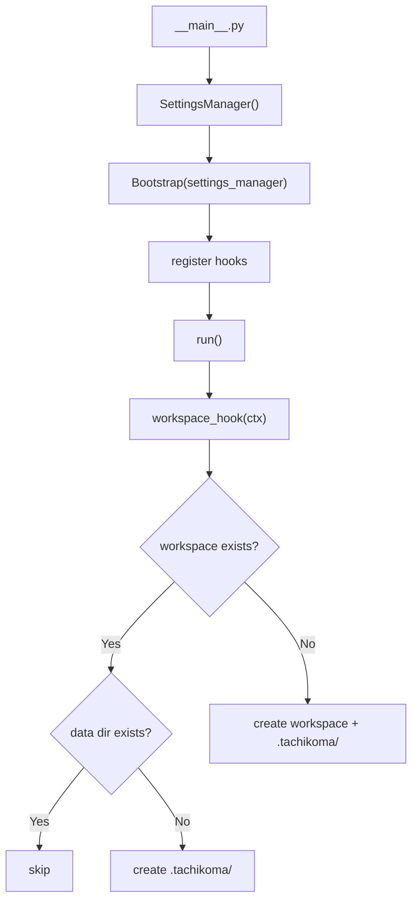

# Design: Workspace Bootstrap

<!-- This design describes the current implementation approach. Updated through delta reconciliation. -->

**Feature Spec**: [../../feature-specs/agent/workspace-bootstrap.md](../../feature-specs/agent/workspace-bootstrap.md)
**Status**: Current

## Purpose

This document explains the design rationale for the workspace bootstrap: the registry pattern, hook system, context passing, and workspace directory creation.

## Problem Context

The agent needs a formal initialization sequence that runs on every launch. As more modules need first-run setup (git init, core context files, skills directory), ad-hoc initialization in `__main__.py` doesn't scale — each module would add its own setup logic, creating ordering issues and making startup fragile.

**Constraints:**
- Must be idempotent — safe to run on every launch, including after partial failures
- Must fail fast with clear error naming the failing hook
- No external dependencies — pure Python patterns are sufficient

## Design Overview

A `Bootstrap` registry class owns a `BootstrapContext` and an ordered list of named hooks. Callers register hooks via `register(name, hook)` and trigger execution via `await run()`. Each hook is a plain async callable (`Callable[[BootstrapContext], Awaitable[None]]`) that receives the context and self-determines whether it needs to act. Hooks access settings via `ctx.settings_manager`. Hooks can pass objects back to the caller via `ctx.extras`, a mutable dictionary on the frozen context.

The workspace root directory and `.tachikoma/` data folder are created by a standard hook (not special-cased), making the bootstrap mechanism completely generic.



## Components

### Implementation Structure

| Layer/Component | Responsibility | Key Decisions |
|-----------------|----------------|---------------|
| `src/tachikoma/bootstrap.py` | BootstrapContext, BootstrapHook type, Bootstrap class, BootstrapError | Mechanism only; each subsystem owns its hooks internally (see DES-003) |
| `src/tachikoma/workspace.py` | `workspace_hook` — creates workspace root and `.tachikoma/` data folder | Subsystem-owned hook; pattern established by workspace module |

### Cross-Layer Contracts

Hooks receive a `BootstrapContext` with access to the SettingsManager (for reading and writing config), a prompt callable (for user input), and an extras dictionary (for passing objects back to the caller).

```
Bootstrap(settings_manager, prompt=input)
    │
    ▼
BootstrapContext
├── settings_manager: SettingsManager (read + write access)
├── prompt: Callable[[str], str] (for user input)
└── extras: dict[str, Any] (mutable bag for hook-to-caller communication)
    │
    │ passed to each hook
    ▼
workspace_hook(ctx) ──creates──▶ dirs
                    ──may call──▶ ctx.settings_manager.update/save

Bootstrap.extras (property) ──delegates to──▶ BootstrapContext.extras
    │
    │ callers read hook outputs after run()
    ▼
__main__.py reads bootstrap.extras["key"]
```

**Integration Points:**
- Bootstrap ↔ hooks: hooks receive BootstrapContext, raise exceptions on failure
- Bootstrap ↔ `__main__.py`: `run()` raises BootstrapError on hook failure; `bootstrap.extras` exposes hook outputs
- BootstrapContext ↔ SettingsManager: hooks read/write settings via `ctx.settings_manager`

## Modeling

```
Bootstrap
├── has one BootstrapContext (created at construction)
└── has ordered list of (name: str, hook: BootstrapHook) tuples

BootstrapContext (frozen dataclass)
├── settings_manager: SettingsManager (mutable — can update/save settings)
├── prompt: Callable[[str], str] (for user input)
└── extras: dict[str, Any] = {} (mutable bag; frozen prevents swapping the dict, contents are mutable)

BootstrapHook = Callable[[BootstrapContext], Awaitable[None]]

BootstrapError
└── names the failing hook in its message, chains original exception via __cause__
```

The `BootstrapContext` is frozen (fields can't be reassigned), but `settings_manager` is a mutable object — hooks can call `.update()` and `.save()` on it.

## Data Flow

### Bootstrap execution (every launch)

```
1. __main__.py creates Bootstrap(settings_manager, prompt=input)
2. Registers hooks: bootstrap.register("workspace", workspace_hook), bootstrap.register("logging", logging_hook), bootstrap.register("git", git_hook), bootstrap.register("projects", projects_hook), ...
3. Calls await bootstrap.run()
4. For each (name, hook) in registration order:
   a. await hook(context)
   b. Hook self-determines if action needed
   c. Hook may call ctx.settings_manager.update() + .save()
   d. Hook may store objects on ctx.extras for the caller to retrieve
   e. If hook raises → wrap in BootstrapError naming hook, propagate
5. Bootstrap completes — __main__.py reads final settings
6. __main__.py retrieves hook outputs from bootstrap.extras
```

### Workspace hook logic

```
1. Read workspace path from ctx.settings_manager.settings.workspace.path
2. Check if workspace path exists and is a directory
   ├─ exists and is dir → continue (still need to check data_path)
   ├─ exists but is file → raise with clear error
   └─ doesn't exist → create with parents
3. Check if .tachikoma/ data folder exists
   ├─ exists → skip
   └─ doesn't exist → create
4. If mkdir fails (PermissionError) → raise with clear error
```

## Key Decisions

### Bootstrap as a registry class (not a plain function)

**Choice**: `Bootstrap` class with `register()`/`run()` methods
**Why**: A registry pattern where the class owns the context internally and hooks are registered by name. This keeps context construction encapsulated and provides a natural place for hook naming.
**Alternatives Considered**:
- Plain function taking a list of hooks: Simpler, but context must be built externally
- Decorator-based auto-discovery: Over-engineered for a small, explicit hook set

**Consequences**:
- Pro: Clean API — construct, register, run
- Pro: Hook names stored naturally alongside hooks
- Con: Slightly more ceremony than a plain function

### Plain async callable for hooks (not Protocol)

**Choice**: `BootstrapHook = Callable[[BootstrapContext], Awaitable[None]]` type alias
**Why**: Any async function with the right signature works. Async hooks can natively `await` operations like database access and network calls without `asyncio.run()` workarounds inside sync hooks.
**Alternatives Considered**:
- Protocol with name property: Adds ceremony; registry already stores names
- Sync hooks with `asyncio.run()` workarounds: Conflicts with the outer event loop

**Consequences**:
- Pro: Zero boilerplate — plain async functions work
- Pro: Easy to test
- Pro: Hooks can natively await async operations (DB access, network calls)

### Prompt callback for user input

**Choice**: Hooks receive a `prompt` callable via BootstrapContext instead of calling `input()` directly
**Why**: Testable without monkeypatching builtins.

**Consequences**:
- Pro: Fully testable — inject a lambda or mock
- Pro: Explicit dependency

### Workspace hook in its own module

**Choice**: Define `workspace_hook` in `workspace.py`, following DES-003 (subsystem-owned bootstrap hooks)
**Why**: Each subsystem owns its hook in its own module. The workspace hook creates directories other hooks depend on, but that dependency is managed through registration order in `__main__.py`, not module co-location.

**Consequences**:
- Pro: Consistent with DES-003 pattern — all hooks follow the same placement convention
- Pro: Bootstrap module stays focused on the mechanism (`Bootstrap` class, `BootstrapContext`)
- Pro: Discoverable — looking at `workspace.py`, you immediately find `workspace_hook`

## System Behavior

### Scenario: First launch — no workspace exists

**Given**: No directory at the configured workspace path
**When**: Bootstrap runs the workspace hook
**Then**: The workspace directory and `.tachikoma/` data folder are created.
**Rationale**: The workspace hook runs first by registration order.

### Scenario: Subsequent launch — workspace already exists

**Given**: Workspace directory and `.tachikoma/` already exist
**When**: Bootstrap runs the workspace hook
**Then**: The hook detects existing directories and returns immediately with no side effects.
**Rationale**: Each hook self-determines whether it needs to act, making the full sequence safe to run every time.

### Scenario: Hook failure

**Given**: A registered hook raises an exception
**When**: Bootstrap's `run()` is executing
**Then**: The exception is caught and re-raised as BootstrapError naming the failing hook. Startup aborts immediately.
**Rationale**: Fail-fast prevents cascading errors. The hook name tells the user what went wrong.

### Scenario: Workspace path is a file

**Given**: The configured workspace path resolves to an existing regular file
**When**: The workspace hook runs
**Then**: The hook raises an error indicating the path is not a directory.
**Rationale**: Clear error messaging instead of confusing OS errors.

## Notes

- Hook registration order in `__main__.py`: workspace → logging → git → projects → skills → context → memory → sessions → telegram. Logging runs before git so that loguru's file handler is configured before any hooks emit log messages. Projects runs after git because it needs the git repository initialized. Skills runs before context so that the skills directory is created before context initialization. Telegram runs last so all other subsystems are initialized before channel-specific validation.
- The hook registration order in `__main__.py` serves as the explicit documentation of initialization sequence — no magic discovery
