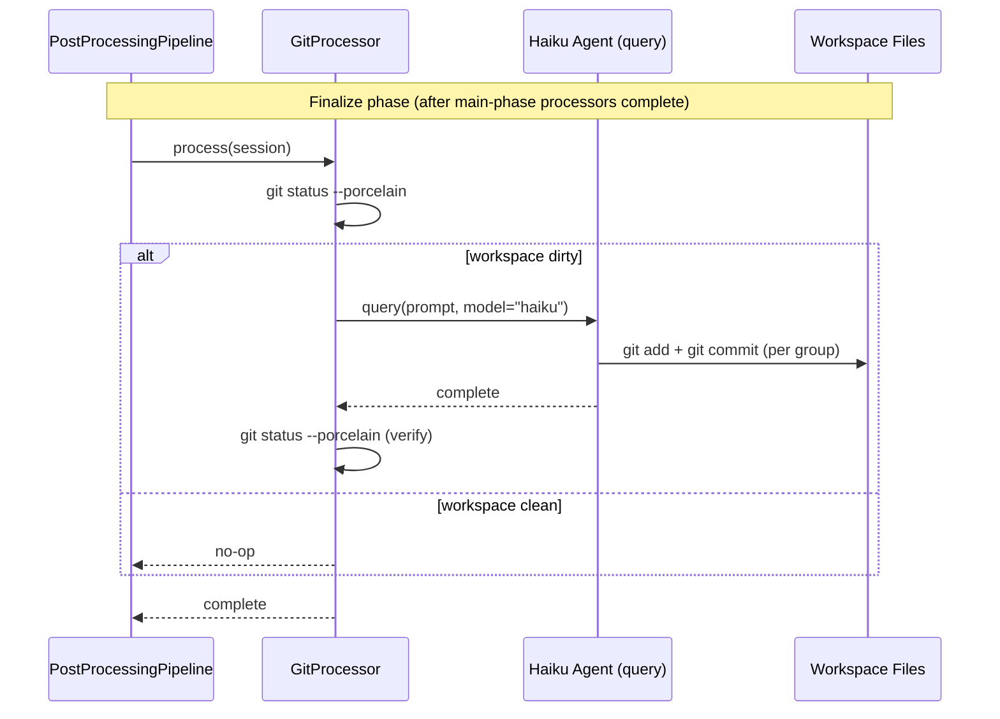

# Design: Workspace Version Tracking

<!-- This design describes the current implementation approach. Updated through delta reconciliation. -->

**Feature Spec**: [../../feature-specs/agent/workspace-version-tracking.md](../../feature-specs/agent/workspace-version-tracking.md)
**Status**: Current

## Purpose

This document explains the design rationale for workspace version tracking: how the git module initializes repos, spawns commit agents, and integrates with the post-processing pipeline.

## Problem Context

Workspace changes (memories, context files, configuration) happen as side effects of post-processing — forked LLM agents autonomously read/write files during memory extraction. Without version tracking, there's no history, no diff, and no rollback capability.

**Constraints:**
- Must run after all other post-processors complete (memory extraction writes files the git processor needs to see)
- Must not depend on gitpython — the agent uses bash git commands directly
- Must work on a fresh workspace with no prior git history
- No global git config dependency — committer identity configured per-repo

**Interactions:**
- Post-processing pipeline: git processor registers in the `finalize` phase (see [pipeline design](post-processing-pipeline.md))
- Workspace bootstrap: git hook registers after workspace hook (see [workspace-bootstrap design](workspace-bootstrap.md))
- Memory extraction processors: their file writes are what the git processor commits

## Design Overview

Two independent components:

1. A **git bootstrap hook** that initializes the workspace as a git repo on first run (idempotent)
2. A **git post-processor** that spawns a lightweight Haiku agent to inspect, group, and commit workspace changes after each session

The post-processor runs in the pipeline's **finalize phase**, ensuring all memory extraction is complete before commits happen.

## Components

### Implementation Structure

| Layer/Component | Responsibility | Key Decisions |
|-----------------|----------------|---------------|
| `src/tachikoma/git/__init__.py` | Re-exports: `git_hook`, `GitProcessor` | Clean public API for the git package |
| `src/tachikoma/git/hooks.py` | `git_hook`: initializes workspace as git repo | Subsystem-owned hook pattern (DES-003); uses `asyncio.create_subprocess_exec` |
| `src/tachikoma/git/processor.py` | `GitProcessor(PostProcessor)` + `GIT_COMMIT_PROMPT` + `query_and_consume` helper | Prompt co-located with processor; fresh `query()` (not fork); helper local to module |

### Cross-Layer Contracts



**Integration Points:**
- GitProcessor ↔ subprocess: `asyncio.create_subprocess_exec("git", "status", "--porcelain")` for dirty check and post-agent verification
- GitProcessor ↔ SDK: `query(prompt=GIT_COMMIT_PROMPT, options=ClaudeAgentOptions(model="haiku", cwd=..., permission_mode="bypassPermissions"))` — fresh stateless call, not a session fork
- Bootstrap ↔ git hook: `git_hook` runs after workspace hook, uses `asyncio.create_subprocess_exec` for `git init`, `git config`, `git commit`

**Error contract:**
- Git hook failures propagate as `BootstrapError` (fail-fast, per DES-003)
- GitProcessor failures caught by pipeline's `asyncio.gather(return_exceptions=True)` (error isolation)
- Partial commits are valid — if the agent commits 1 of 3 groups then fails, those commits persist

### Shared Logic

- **`query_and_consume` function** (`git/processor.py`): standalone helper for fresh `query()` calls (no session fork). Local to the git module since no other processor currently needs this pattern.

## Modeling

The domain model is minimal — no persistent entities or state. The git processor is stateless; all state lives in the workspace filesystem and git history.

```
GitProcessor(PostProcessor)
├── _cwd: Path
└── process(session) → None

git_hook(ctx: BootstrapContext) → None

query_and_consume(prompt, cwd) → None
```

## Data Flow

### Bootstrap: git repo initialization

```
1. __main__.py registers git_hook after workspace hook
2. bootstrap.run() executes hooks in registration order
3. git_hook(ctx) runs:
   a. Read workspace_path from ctx.settings_manager.settings
   b. Check if workspace_path / ".git" exists
      ├─ exists → return immediately (idempotent)
      └─ doesn't exist → continue
   c. Run: git init
   d. Run: git config user.name "Tachikoma"
   e. Run: git config user.email "tachikoma@local"
   f. Run: git commit --allow-empty -m "Initial commit"
   g. If any subprocess returns non-zero → raise with stderr output
```

### Git post-processor: commit flow

```
1. GitProcessor.process(session) called during finalize phase
2. Run: git status --porcelain (from workspace cwd)
   ├─ empty output → log debug, return (no-op)
   └─ non-empty → continue
3. Spawn: query(prompt=GIT_COMMIT_PROMPT, options=ClaudeAgentOptions(
       model="haiku", cwd=self._cwd, permission_mode="bypassPermissions"))
4. Consume all messages from the async iterator
5. Run: git status --porcelain (verification)
   ├─ empty → log debug "all changes committed"
   └─ non-empty → log warning "uncommitted changes remain after git processor"
```

## Key Decisions

### Fresh query() instead of fork_and_consume

**Choice**: The git processor uses a fresh `query()` call, not `fork_and_consume` with session forking.
**Why**: The git agent doesn't need conversation history — it only needs to inspect the workspace filesystem and run git commands. A fresh call is simpler, cheaper (no forked context), and avoids coupling to the user's session.

**Consequences**:
- Pro: Cheaper per-run (no conversation context in prompt)
- Pro: Simpler — no session dependency
- Con: Can't reference conversation content in commit messages (acceptable)

### query_and_consume local to git module

**Choice**: Place the `query_and_consume` helper in `git/processor.py`, not in `post_processing.py`.
**Why**: Only one consumer (GitProcessor). If another processor needs fresh queries later, the helper can be promoted.

**Consequences**:
- Pro: Keeps `post_processing.py` focused on shared pipeline mechanism
- Pro: Git module is self-contained

### Python-side dirty check before spawning agent

**Choice**: Run `git status --porcelain` via subprocess before deciding whether to spawn the agent.
**Why**: Checking `git status` is near-instant and avoids agent cost for clean workspaces. Most sessions produce changes, but trivial sessions shouldn't incur LLM cost.

**Consequences**:
- Pro: Zero cost for clean workspaces
- Con: Duplicates the dirty check (Python checks, agent also sees status) — acceptable

### Model "haiku" with no resource limits

**Choice**: Use `model="haiku"` with no `max_turns` or `max_budget_usd`.
**Why**: Cheapest available model for a mechanical task. The task is naturally bounded (finite workspace changes).

**Consequences**:
- Pro: Simplest configuration, no risk of stopping mid-commit
- Con: Theoretically unbounded cost in pathological cases (mitigated by Haiku's low cost)

### Git package with separate hook and processor modules

**Choice**: `src/tachikoma/git/` package with `hooks.py` and `processor.py`.
**Why**: Separates bootstrap concerns from runtime concerns. Follows the `memory/` package pattern.

**Consequences**:
- Pro: Clear separation, consistent with existing patterns
- Con: More files for a small feature (acceptable)

## System Behavior

### Scenario: Session ends with workspace changes

**Given**: Memory extraction processors wrote files to `memories/episodic/`, `memories/facts/`
**When**: The finalize phase runs the git post-processor
**Then**: `git status --porcelain` detects changes. Haiku agent groups by subdirectory and creates separate commits.

### Scenario: Session ends with no changes

**Given**: Memory extraction found nothing to extract
**When**: The finalize phase runs the git post-processor
**Then**: `git status --porcelain` returns empty. Processor returns without spawning an agent.

### Scenario: Agent commits some groups but fails mid-way

**Given**: Agent commits episodic changes but crashes before committing facts
**When**: The git processor resumes after agent failure
**Then**: Episodic commits persist. Warning logged. Facts changes picked up on next run.

### Scenario: First launch — no git repo

**Given**: Workspace exists but has no `.git` directory
**When**: Bootstrap runs the git hook
**Then**: Repo initialized, identity configured, initial empty commit created. No `.gitignore`.

### Scenario: Subsequent launch — git repo exists

**Given**: Workspace has `.git`
**When**: Bootstrap runs the git hook
**Then**: Hook returns immediately (idempotent).

## Notes

- The git processor establishes a second post-processor pattern: fork-based (memory) vs. fresh-query (git). Future processors can follow either pattern.
- Agent guardrails (safe git commands only) are enforced via prompt instructions, consistent with memory processors' file scope constraints.
- No `.gitignore` is created — all workspace content is tracked by default. Users can add their own if desired.
