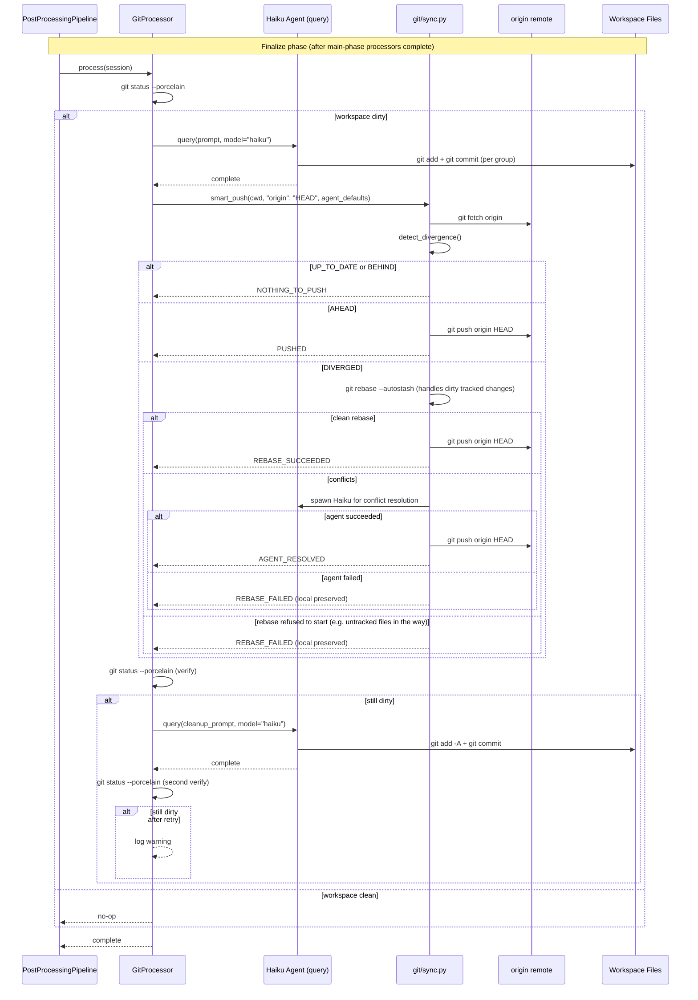

# Design: Workspace Version Tracking

<!-- This design describes the current implementation approach. Updated through delta reconciliation. -->

**Feature Spec**: [../../feature-specs/agent/workspace-version-tracking.md](../../feature-specs/agent/workspace-version-tracking.md)
**Status**: Current

## Purpose

This document explains the design rationale for workspace version tracking: how the git module initializes repos, spawns commit agents, syncs with remotes, and integrates with the post-processing pipeline.

## Problem Context

Workspace changes (memories, context files, configuration) happen as side effects of post-processing — forked LLM agents autonomously read/write files during memory extraction. Without version tracking, there's no history, no diff, and no rollback capability.

**Constraints:**
- Must run after all other post-processors complete (memory extraction writes files the git processor needs to see)
- Must not depend on gitpython — the agent uses bash git commands directly
- Must work on a fresh workspace with no prior git history
- No global git config dependency — committer identity configured per-repo

**Interactions:**
- Post-processing pipeline: git processor registers in the `finalize` phase (see [pipeline design](post-processing-pipeline.md))
- Workspace bootstrap: git hook registers after workspace hook (see [workspace-bootstrap design](workspace-bootstrap.md))
- Memory extraction processors: their file writes are what the git processor commits
- Projects processor ([project-management design](project-management.md)): runs in `pre_finalize` phase, commits and pushes submodule changes before GitProcessor. The resulting submodule reference changes appear in `git status` and are committed by GitProcessor alongside other workspace changes — no code change to GitProcessor is needed

## Design Overview

Three independent components, plus a system prompt section:

1. A **system prompt preamble** "Git Management" section (`context/loading.py`) that instructs the assistant about the automatic commit system, the destructive-git deny rules, the safe bash git surface, and the available `push`/`sync` MCP tools
2. A **git bootstrap hook** that initializes the workspace as a git repo on first run (idempotent), creates `.gitignore` for the DB binary, then syncs with the origin remote
3. A **git post-processor** that spawns a lightweight Haiku agent to inspect, group, and commit workspace changes after each session, then pushes to the `origin` remote with divergence detection and conflict resolution
4. **MCP tools** (`push`, `sync`) that expose the sync module's `smart_push`/`smart_pull` to the main coordinator and task executor agents, targeting the workspace or registered project submodules
5. A **destructive-git deny hook** (`make_bash_deny_hook` + `DESTRUCTIVE_GIT_DENY_PATTERNS`) installed on every non-git-processor agent surface, blocking `git push`, `git reset`, `git checkout .`, `git restore .`, `git clean`, and mutating `git remote` subcommands

The post-processor runs in the pipeline's **finalize phase**, ensuring all memory extraction is complete before commits happen.

## Components

### Implementation Structure

| Layer/Component | Responsibility | Key Decisions |
|-----------------|----------------|---------------|
| `src/tachikoma/git/__init__.py` | Re-exports: `git_hook`, `GitProcessor`, sync utilities | Clean public API for the git package |
| `src/tachikoma/git/hooks.py` | `git_hook`: initializes workspace as git repo + syncs with origin | Subsystem-owned hook pattern (DES-003); creates `.gitignore` with DB binary and active log exclusions on fresh init; ensures missing gitignore entries on every startup (idempotent, no commit); delegates sync to `smart_pull` |
| `src/tachikoma/database.py` | `database_hook`: initializes shared database | Creates and migrates the SQLite database; runs schema migrations on startup |
| `src/tachikoma/git/processor.py` | `GitProcessor(PostProcessor)` + `GIT_COMMIT_PROMPT` + `query_and_consume` helper | Prompt co-located with processor; uses `$WORKSPACE` placeholders for directory paths (DES-008), replaced at call site before passing to `query_and_consume`; fresh `query()` (not fork); delegates push to `smart_push` from sync module |
| `src/tachikoma/git/sync.py` | Shared sync utilities: `detect_divergence()`, `smart_push()`, `smart_pull()`, conflict resolution | Two-tier rebase (naive then agent); filesystem-based success detection; result enums |
| `src/tachikoma/git/tools.py` | MCP tool server factory (DES-006): `push` and `sync` tools + `DESTRUCTIVE_GIT_DENY_PATTERNS` | Extracted handlers for testability; targets workspace or project submodules via `type`/`target` args; deny patterns co-located with tools |

### Cross-Layer Contracts


```mermaid
sequenceDiagram
    participant Pipeline as PostProcessingPipeline
    participant Git as GitProcessor
    participant Agent as Haiku Agent (query)
    participant Sync as git/sync.py
    participant Remote as origin remote
    participant FS as Workspace Files

    Note over Pipeline,FS: Finalize phase (after main-phase processors complete)
    Pipeline->>Git: process(session)
    Git->>Git: git status --porcelain
    alt workspace dirty
        Git->>Agent: query(prompt, model="haiku")
        Agent->>FS: git add + git commit (per group)
        Agent-->>Git: complete
        Git->>Sync: smart_push(cwd, "origin", "HEAD", agent_defaults)
        Sync->>Remote: git fetch origin
        Sync->>Sync: detect_divergence()
        alt UP_TO_DATE or BEHIND
            Sync-->>Git: NOTHING_TO_PUSH
        else AHEAD
            Sync->>Remote: git push origin HEAD
            Sync-->>Git: PUSHED
        else DIVERGED
            Sync->>Sync: git rebase --autostash (handles dirty tracked changes)
            alt clean rebase
                Sync->>Remote: git push origin HEAD
                Sync-->>Git: REBASE_SUCCEEDED
            else conflicts
                Sync->>Agent: spawn Haiku for conflict resolution
                alt agent succeeded
                    Sync->>Remote: git push origin HEAD
                    Sync-->>Git: AGENT_RESOLVED
                else agent failed
                    Sync-->>Git: REBASE_FAILED (local preserved)
                end
            else rebase refused to start (e.g. untracked files in the way)
                Sync-->>Git: REBASE_FAILED (local preserved)
            end
        end
        Git->>Git: git status --porcelain (verify)
        alt still dirty
            Git->>Agent: query(cleanup_prompt, model="haiku")
            Agent->>FS: git add -A + git commit
            Agent-->>Git: complete
            Git->>Git: git status --porcelain (second verify)
            alt still dirty after retry
                Git-->>Git: log warning
            end
        end
    else workspace clean
        Git-->>Pipeline: no-op
    end
    Git-->>Pipeline: complete
```

**Integration Points:**
- GitProcessor ↔ subprocess: `asyncio.create_subprocess_exec("git", "status", "--porcelain")` for dirty check and post-agent verification
- GitProcessor ↔ sync module: `smart_push(cwd, "origin", "HEAD", agent_defaults)` replaces bare git push with divergence detection and agent-driven conflict resolution
- GitProcessor ↔ SDK: `query(prompt=GIT_COMMIT_PROMPT, options=ClaudeAgentOptions(model=agent_defaults.processor_model, cwd=..., permission_mode="bypassPermissions"))` — fresh stateless call, not a session fork; runs on the processor tier (default `"haiku"`, see DES-004)
- Bootstrap ↔ git hook: `git_hook` runs after workspace hook, uses sync module helpers for init and `_sync_workspace` for startup sync

**Error contract:**
- Git hook failures propagate as `BootstrapError` (fail-fast, per DES-003)
- GitProcessor failures caught by pipeline's `asyncio.gather(return_exceptions=True)` (error isolation)
- Partial commits are valid — if the agent commits 1 of 3 groups then fails, those commits persist
- Push failures return result enums (REBASE_FAILED, PUSH_FAILED) — logged as warnings, commits intact, retried on next sync

### Shared Logic

- **`query_and_consume` function** (`git/processor.py`): standalone helper for fresh `query()` calls (no session fork). Used by both GitProcessor and ProjectsProcessor for spawning commit agents.
- **`git/sync.py`**: Shared sync utilities (smart_push, smart_pull, detect_divergence) used by git hooks, git processor, projects hooks, projects processor, and the push/sync MCP tools. Centralizes the fetch-detect-rebase-resolve-push sequence.
- **`git/tools.py`**: MCP tools (`push`, `sync`) wrapping `smart_push`/`smart_pull` for agent-tier access. Also exports `DESTRUCTIVE_GIT_DENY_PATTERNS` used by `make_bash_deny_hook` to block destructive git on non-git-processor agent surfaces. Follows DES-006 (factory + extracted handlers + Pydantic arg models).

## Modeling

The domain model is minimal — no persistent entities or state. The git processor is stateless; all state lives in the workspace filesystem and git history.

```
GitProcessor(PostProcessor)
├── _agent_defaults: AgentDefaults
├── _cwd: Path
└── process(session) → None

git_hook(ctx: BootstrapContext) → None

git/hooks.py (gitignore management)
├── _GITIGNORE_ENTRIES: list[str]
├── _create_gitignore(workspace_path) → None
├── _ensure_gitignore_entries(workspace_path) → None
└── _append_missing_entries(existing) → str

query_and_consume(prompt, agent_defaults) → None

git/sync.py (stateless functions)
├── detect_divergence(cwd, remote, branch) → DivergenceStatus
├── smart_push(cwd, remote, branch, agent_defaults) → PushResult
├── smart_pull(cwd, remote, branch, agent_defaults) → SyncResult
├── _try_naive_rebase(cwd, remote_branch) → bool   # uses --autostash
├── _agent_rebase(cwd, remote_branch, agent_defaults) → bool
├── _abort_stale_rebase(cwd) → bool
└── _has_uncommitted_changes(cwd) → bool

git/tools.py
├── create_git_tools_server(workspace_path, agent_defaults) → McpSdkServerConfig
├── handle_push(type_, target, workspace_path, agent_defaults) → dict
├── handle_sync(type_, target, workspace_path, agent_defaults) → dict
├── resolve_target(type_, target, workspace_path) → Path | None
├── _AUTO_COMMIT_PROMPT: str
├── _auto_commit_if_dirty(resolved, agent_defaults) → bool
└── DESTRUCTIVE_GIT_DENY_PATTERNS: list[re.Pattern]
```

## Data Flow

### Bootstrap: git repo initialization and workspace sync

```
1. __main__.py registers git_hook after workspace hook
2. bootstrap.run() executes hooks in registration order
3. git_hook(ctx) runs:
   a. Read workspace_path from ctx.settings_manager.settings
   b. Check if workspace_path / ".git" exists
      ├─ exists → skip init
      └─ doesn't exist → continue
   c. Run: git init
   d. Run: git config user.name "Tachikoma"
   e. Run: git config user.email "tachikoma@local"
   f. Run: git commit --allow-empty -m "Initial commit"
   g. Create .gitignore with .tachikoma/*.db and .tachikoma/logs/tachikoma.log (append to existing)
   h. Run: git add .gitignore && git commit -m "Add gitignore for workspace exclusions"
   i. If any subprocess returns non-zero → raise with stderr output
4. Ensure gitignore entries (runs on every startup, idempotent):
   a. _ensure_gitignore_entries(workspace_path)
   b. Appends any missing entries to .gitignore without committing
5. Sync workspace with remote:
   a. Check if origin remote exists: run_git("remote", "get-url", "origin")
      ├─ no origin → debug log, skip sync
      └─ origin exists → smart_pull(workspace_path, "origin", "HEAD", agent_defaults)
         ├─ DIRTY_SKIPPED → warning log
         ├─ UP_TO_DATE → debug log
         ├─ FAST_FORWARDED/REBASE_SUCCEEDED/AGENT_RESOLVED → info log
         └─ SYNC_FAILED → warning log
   b. All errors caught → warning log, startup continues (non-blocking)
```

### Git post-processor: commit and push flow

```
1. GitProcessor.process(session) called during finalize phase
2. Run: git status --porcelain (from workspace cwd)
   ├─ empty output → log debug, return (no-op)
   └─ non-empty → continue
3. Spawn: query_and_consume(GIT_COMMIT_PROMPT, agent_defaults)
4. Consume all messages from the async iterator
5. result = smart_push(cwd, "origin", "HEAD", agent_defaults)
   ├─ PUSHED/REBASE_SUCCEEDED/AGENT_RESOLVED → log info
   ├─ NOTHING_TO_PUSH → log debug
   └─ PUSH_FAILED/REBASE_FAILED → log warning, continue (commits intact)
6. Run: git status --porcelain (verification)
   ├─ empty → log debug "all changes committed"
   └─ non-empty → retry once with cleanup prompt
       a. Spawn: query_and_consume(_COMMIT_RETRY_PROMPT, agent_defaults)
       b. Run: git status --porcelain (second verification)
          ├─ empty → log debug "cleanup succeeded"
          └─ non-empty → log warning "uncommitted changes remain after retry"
```

## Key Decisions

### Fresh query() instead of fork_and_consume

**Choice**: The git processor uses a fresh `query()` call, not `fork_and_consume` with session forking.
**Why**: The git agent doesn't need conversation history — it only needs to inspect the workspace filesystem and run git commands. A fresh call is simpler, cheaper (no forked context), and avoids coupling to the user's session.

**Consequences**:
- Pro: Cheaper per-run (no conversation context in prompt)
- Pro: Simpler — no session dependency
- Con: Can't reference conversation content in commit messages (acceptable)

### query_and_consume local to git module

**Choice**: Place the `query_and_consume` helper in `git/processor.py`, not in `post_processing.py`.
**Why**: Only one consumer (GitProcessor). If another processor needs fresh queries later, the helper can be promoted.

**Consequences**:
- Pro: Keeps `post_processing.py` focused on shared pipeline mechanism
- Pro: Git module is self-contained

### Python-side dirty check before spawning agent

**Choice**: Run `git status --porcelain` via subprocess before deciding whether to spawn the agent.
**Why**: Checking `git status` is near-instant and avoids agent cost for clean workspaces. Most sessions produce changes, but trivial sessions shouldn't incur LLM cost.

**Consequences**:
- Pro: Zero cost for clean workspaces
- Con: Duplicates the dirty check (Python checks, agent also sees status) — acceptable

### Processor-tier model with no resource limits

**Choice**: Use `model=agent_defaults.processor_model` (default `"haiku"`) with no `max_turns` or `max_budget_usd`. Applies to both the commit agent in `GitProcessor` and the conflict-resolution agent in `git/sync.py:_agent_rebase`.
**Why**: Both tasks are mechanical post-processing, and the processor tier defaults to the cheapest model available (see DES-004). Tasks are naturally bounded (finite workspace changes / finite conflict markers).

**Consequences**:
- Pro: Simplest configuration, no risk of stopping mid-commit
- Pro: Configurable via `processor_model` setting without code change
- Con: Theoretically unbounded cost in pathological cases (mitigated by the default model's low cost)

### Push is Python-side, not agent-side

**Choice**: The commit agent prompt continues to prohibit `git push`. The processor handles pushing after the agent completes via `smart_push`, which includes divergence detection and agent-driven conflict resolution. Push failure handling remains Python-side.
**Why**: Keeps the agent focused on the mechanical commit task. Push divergence resolution is a separate concern handled by the shared sync module. Matches the `ProjectsProcessor` pattern where push is done by the processor, not the commit agent.

**Consequences**:
- Pro: Agent prompt stays simple and focused on commit grouping
- Pro: Push failure handling is in Python (structured logging, exception handling) rather than relying on agent behavior
- Con: None significant

### Single retry with cleanup prompt for missed files

**Choice**: After the commit agent completes and changes are pushed, verify the working tree is clean. If not, retry once with a focused cleanup prompt (`_COMMIT_RETRY_PROMPT`) that instructs the agent to stage and commit all remaining files. If changes still remain after the retry, log a warning — no further retries.
**Why**: The commit agent uses selective `git add <files>` per group and may occasionally miss files (e.g., new untracked files not caught by the grouping heuristic). The main prompt already includes verification instructions, but a single retry with a blunt "commit everything remaining" prompt catches the tail case without adding significant latency or cost.

**Consequences**:
- Pro: Catches files missed by selective grouping without changing the agent's core commit strategy
- Pro: Bounded — at most one retry, keeping total agent cost predictable
- Con: Extra agent call in the failure path (rare, uses cheap Haiku model)

**Choice**: `src/tachikoma/git/` package with `hooks.py` and `processor.py`.
**Why**: Separates bootstrap concerns from runtime concerns. Follows the `memory/` package pattern.

**Consequences**:
- Pro: Clear separation, consistent with existing patterns
- Con: More files for a small feature (acceptable)

### MCP tools for agent-tier push/sync

**Choice**: Expose `push` and `sync` MCP tools via a factory in `git/tools.py`, following DES-006. Both tools accept `type: "workspace" | "project"` and `target: str | None` to target the workspace root or a named project submodule. Target resolution uses a filesystem check (`.git` marker exists). The `push` tool auto-commits uncommitted changes before proceeding with `smart_push` — it detects dirty state, spawns a fast agent (processor-tier model) with a commit prompt to create cohesive commits, then calls `smart_push`. The `sync` tool does not auto-commit (it delegates to `smart_pull` which skips dirty repos).
**Why**: The main coordinator and task executor agents need a structured way to push and sync without hand-assembling fetch/rebase/push from bash. The existing `smart_push`/`smart_pull` already encapsulate divergence handling and conflict resolution. Wrapping them in MCP tools gives agents a safe, well-defined surface. Auto-commit in `push` makes mid-session pushes work as expected — without it, the tool returns `NOTHING_TO_PUSH` when changes are uncommitted, which is confusing.

**Consequences**:
- Pro: Agents can push/sync on demand (mid-session) rather than waiting for session-end auto-push
- Pro: Same divergence/conflict handling as the auto-commit path
- Pro: Mid-session pushes work even with uncommitted changes (auto-commit via fast agent)
- Pro: Clear error when targeting unknown/missing projects
- Con: One more MCP server to register and thread through
- Con: Auto-commit adds latency for mid-session pushes when the working tree is dirty (agent spawn cost)

### Auto-commit via fast agent in push tool

**Choice**: The `push` tool's `handle_push` handler checks for uncommitted changes before calling `smart_push`. When dirty, it spawns a processor-tier agent (Haiku) via `query_and_consume` with the same `GIT_TOOLS`/`GIT_ALLOW`/`GIT_BASH_HOOK` setup used by `GitProcessor` and `ProjectsProcessor`. The agent receives a generic commit prompt that groups changes into cohesive commits with descriptive messages. A scoped `AgentDefaults` with `cwd=resolved_target` ensures the agent operates on the correct repository (workspace or project submodule), following the `ProjectsProcessor._commit_and_push` pattern.
**Why**: A bare `git add -A && git commit` would produce a single monolithic commit with a generic message. The agent-based approach produces grouped commits with descriptive messages, matching the quality of session-end commits at minimal cost (Haiku model on a mechanical task). Auto-commit belongs in `handle_push`, not `smart_push`, because `smart_push` is shared with `GitProcessor` which already handles committing via its own agent.

**Consequences**:
- Pro: Mid-session pushes produce the same commit quality as session-end commits
- Pro: No changes to `smart_push` or `handle_sync` — existing behavior preserved
- Pro: Scoped defaults handle both workspace and project targets correctly
- Con: Minimal latency added when working tree is dirty (Haiku agent spawn)

### Destructive-git deny hook for non-git-processor surfaces

**Choice**: Install a `PreToolUse` deny hook (via `make_bash_deny_hook` in `post_processing.py`) on every agent surface that runs in `bypassPermissions` mode *except* the git-dedicated processors. The hook denies `git push` (any form), `git reset`, `git checkout .`, `git restore .`, `git clean`, and mutating `git remote` subcommands. Read-only git and `git clone` are unaffected. The deny patterns live alongside the MCP tools in `git/tools.py` as `DESTRUCTIVE_GIT_DENY_PATTERNS`.
**Why**: The main coordinator and task executor agents run in `bypassPermissions` with no git guardrails — a confused agent could wipe local changes, force-push, or repoint a remote. The git processors (GitProcessor, ProjectsProcessor commit agents, rebase resolver) already use allow-list gate hooks (`GIT_BASH_HOOK`) that only permit the commands they need. The deny hook is the inverse: it blocks destructive patterns while allowing everything else.

**Consequences**:
- Pro: Irrecoverable git operations are blocked on all non-git-processor surfaces
- Pro: Git processors keep full git access — no behavioral change
- Pro: `make_bash_deny_hook` is generic and reusable for future deny patterns
- Con: `git push` is fully denied rather than just `--force` — acceptable since the MCP `push` tool handles push with divergence detection

## System Behavior

### Scenario: Session ends with workspace changes and origin configured

**Given**: Memory extraction processors wrote files to `memories/episodic/`, `memories/facts/`; origin remote is configured
**When**: The finalize phase runs the git post-processor
**Then**: `git status --porcelain` detects changes. Haiku agent groups by subdirectory and creates separate commits. `smart_push` fetches, detects divergence, and pushes. Info log emitted.

### Scenario: Push with divergence — clean rebase

**Given**: Origin remote has new commits in non-overlapping files
**When**: `smart_push` detects divergence
**Then**: Naive rebase succeeds cleanly. Push proceeds. Info log with REBASE_SUCCEEDED.

### Scenario: Push with divergence — agent resolves conflicts

**Given**: Origin remote has new commits in overlapping files
**When**: `smart_push` detects divergence and naive rebase fails
**Then**: Haiku agent spawned for conflict resolution. Agent resolves conflicts, rebase completes, push succeeds. Info log with AGENT_RESOLVED.

### Scenario: Push with divergence — agent fails

**Given**: Origin remote has conflicts the agent cannot resolve
**When**: `smart_push` detects divergence and both naive and agent rebase fail
**Then**: REBASE_FAILED logged as warning. Local commits preserved. Will be retried on next sync.

### Scenario: Push with divergence — dirty tracked files, autostash handles it

**Given**: Origin remote has diverged and the working tree has uncommitted changes to tracked files (e.g., active log file)
**When**: `smart_push` runs `git rebase --autostash`
**Then**: Git stashes dirty changes, rebases, restores the stash, and pushes. Result is REBASE_SUCCEEDED.

### Scenario: Push with divergence — rebase refuses to start

**Given**: Origin remote has diverged and an untracked file in the workspace would be overwritten by the rebase (so even autostash can't make the rebase start)
**When**: `_try_naive_rebase` returns False without leaving rebase state behind
**Then**: REBASE_FAILED logged as warning. Local commits preserved. Operator must clear the offending untracked file.

### Scenario: Session ends with workspace changes, no origin remote

**Given**: Memory extraction processors wrote files; no origin remote configured
**When**: The finalize phase runs the git post-processor
**Then**: Changes are committed by agent. Processor detects no origin remote, logs at debug level, skips push.

### Scenario: Session ends with no changes

**Given**: Memory extraction found nothing to extract
**When**: The finalize phase runs the git post-processor
**Then**: `git status --porcelain` returns empty. Processor returns without spawning an agent or checking for remote.

### Scenario: Push fails after successful rebase

**Given**: Agent successfully resolved conflicts and completed rebase
**When**: Processor attempts `git push` after rebase
**Then**: Push fails (e.g., concurrent push). PUSH_FAILED logged as warning. Commits rebased and intact. Next sync will detect ahead state and retry.

### Scenario: Agent commits some groups but fails mid-way

**Given**: Agent commits episodic changes but crashes before committing facts
**When**: The git processor resumes after agent failure
**Then**: Episodic commits persist. Warning logged. Facts changes picked up on next run.

### Scenario: First launch — no git repo

**Given**: Workspace exists but has no `.git` directory
**When**: Bootstrap runs the git hook
**Then**: Repo initialized, identity configured, initial empty commit created, `.gitignore` with `.tachikoma/*.db` and `.tachikoma/logs/tachikoma.log` committed.

### Scenario: Subsequent launch — git repo exists

**Given**: Workspace has `.git`
**When**: Bootstrap runs the git hook
**Then**: Init skipped (idempotent). Workspace synced with origin remote via `smart_pull`.

## Notes

- The git processor establishes a second post-processor pattern: fork-based (memory) vs. fresh-query (git). Future processors can follow either pattern.
- Agent guardrails are enforced in two layers: (1) prompt instructions describe the allowed commands (git + a curated set of read-only inspection and navigation utilities), and (2) a `PreToolUse` hook built from `make_bash_gate_hook()` (`GIT_BASH_HOOK`) programmatically gates every `Bash` tool call to the allowed prefix list (`git`, `ls`, `find`, `file`, `echo`, `date`, `cat`, `head`, `tail`, `wc`, `stat`, `cd`, `pwd`). The hook compiles these into a single regex that matches exact command names or command names followed by a space and arguments — preventing partial matches (e.g., `cd` matches `cd /path` but not `cdeject`). Compound commands (joined by `&&`, `||`, `|`, or `;`) are split before validation; each sub-command must pass independently, or the entire command is denied. See [DES-004](../../design/DES-004-prompt-driven-forked-processor.md) for the hook's design.
- `.gitignore` is created on fresh init with `.tachikoma/*.db` and `.tachikoma/logs/tachikoma.log` exclusions. On every startup, `_ensure_gitignore_entries` appends any missing entries without committing. Rotated log files (`.tachikoma/logs/tachikoma.<timestamp>.log`) remain tracked.
- Known consolidation opportunities: `_run_git`/`_run_git_capture` duplicated between `git/sync.py` and `projects/git.py`; `_check_git_status` in processor.py vs `_has_uncommitted_changes` in sync.py are functionally identical; `AgentDefaults` construction from settings duplicated in both hooks (only 2 call sites).
- The `push` MCP tool's `scrub_paths` argument is declared as `str | None` on `PushArgs`, so its JSON Schema advertises `string | null`. The agent passes a JSON-encoded array of paths (e.g. `'["audio/large-file.ogg"]'`); the `push` tool wrapper parses it via the module-level `_decode_scrub_paths` helper before delegating to `handle_scrub`. This works around the SDK MCP transport's client-side rejection of array-typed arguments — see [DES-006](../../design/DES-006-sdk-mcp-tool-server-factory.md) for the reusable pattern.
