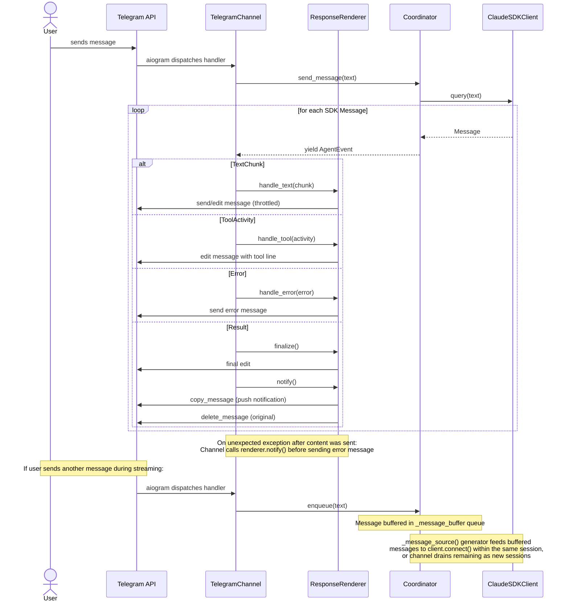

# Design: Telegram Channel

<!-- This design describes the current implementation approach. Updated through delta reconciliation. -->

**Feature Spec**: [../feature-specs/channels/telegram.md](../../feature-specs/channels/telegram.md)
**Status**: Current

## Purpose

This document explains the design rationale for the Telegram channel: the bot lifecycle, response rendering, message buffering mechanism, and configuration approach.

## Problem Context

Tachikoma needs a production-facing communication channel beyond the development REPL. Telegram is the target: a single authorized user sends text messages to a bot, the coordinator processes them, and responses stream back as formatted Telegram messages with progressive editing.

**Constraints:**
- Must integrate with the existing async coordinator (`send_message()` → `AsyncIterator[AgentEvent]`)
- Telegram's Bot API has rate limits (~30 msg/sec global, ~5 edits/min per message) and a 4096-character message size limit
- Telegram's MarkdownV2 format has strict escaping rules that break with partial markdown during streaming
- The CLI entry point must support channel selection while integrating with SettingsManager and bootstrap sequence
- Messages arriving while the agent is responding should be buffered and processed in order

**Interactions:**
- Coordinator layer (core-architecture): `send_message()` for normal turns, `enqueue()` for message buffering
- Configuration system (config-system): `[telegram]` section in Settings model
- Bootstrap system (config-system): `telegram_hook` validates Telegram config, prompts for missing values
- SettingsManager (config-system): CLI flag overrides applied as runtime-only settings

## Design Overview

The Telegram channel follows the same pattern as the REPL: a `TelegramChannel` class that calls `coordinator.send_message()` and consumes `AgentEvent`s, but renders them as Telegram messages instead of terminal output. The channel uses **aiogram 3.x** for bot communication and **telegramify-markdown** for formatting.

```
┌──────────────────────────────────────────────────────────────┐
│                      Entry Point                              │
│  ┌────────────────────────────────────────────────────────┐   │
│  │  cyclopts App (--channel flag)                         │   │
│  │  → SettingsManager (TOML + CLI overrides)              │   │
│  │  → Bootstrap (hooks incl. telegram validation)         │   │
│  │  → Channel dispatch (Repl or TelegramChannel)          │   │
│  └────────────────────────────────────────────────────────┘   │
├──────────────────────────────────────────────────────────────┤
│                     Channel Layer                              │
│  ┌─────────────┐  ┌───────────────────────────────────────┐   │
│  │    Repl      │  │  TelegramChannel                     │   │
│  │  (existing)  │  │  ┌─────────────────────────────────┐ │   │
│  │              │  │  │ aiogram Bot + Dispatcher + Router│ │   │
│  │              │  │  └─────────────────────────────────┘ │   │
│  │              │  │  ┌─────────────────────────────────┐ │   │
│  │              │  │  │ ResponseRenderer                │ │   │
│  │              │  │  │ (progressive edits, tool lines, │ │   │
│  │              │  │  │  message splitting, formatting) │ │   │
│  │              │  │  └─────────────────────────────────┘ │   │
│  └──────┬──────┘  └──────────────┬────────────────────────┘   │
│         │                        │                             │
│         ▼                        ▼                             │
├──────────────────────────────────────────────────────────────┤
│                   Coordinator Layer                             │
│  ┌────────────────────────────────────────────────────────┐   │
│  │  Coordinator                                           │   │
│  │  send_message() → AsyncIterator[AgentEvent]             │   │
│  │  enqueue(text) → None  (message buffering)             │   │
│  └────────────────────────────────────────────────────────┘   │
└──────────────────────────────────────────────────────────────┘
```

The key components:
- **`TelegramChannel`**: owns the aiogram lifecycle, handles message events, renders responses
- **`ResponseRenderer`**: manages progressive message editing, tool lines, splitting, and formatting
- **`Coordinator.enqueue()`**: buffers a user message into `_message_buffer` for processing by the message source generator
- **Cyclopts CLI**: parses `--channel` flag and applies overrides to SettingsManager
- **Telegram bootstrap hook**: validates config when Telegram channel is selected (follows DES-003)

## Components

### Implementation Structure

| Layer/Component | Responsibility | Key Decisions |
|-----------------|----------------|---------------|
| `src/tachikoma/__main__.py` | Cyclopts `App` entry point: parses `--channel`, creates `SettingsManager`, applies CLI overrides, runs bootstrap, dispatches to channel | Replaces bare `asyncio.run(main())` with cyclopts; integrates with SettingsManager + Bootstrap |
| `src/tachikoma/telegram.py` | `TelegramChannel` class + `ResponseRenderer` class + `telegram_hook` function. Subscribes to `SessionTaskReady` and `TaskNotification` events via `bus.on()` at construction. Shared `_process_through_coordinator()` method handles both user messages and session task delivery. `_handle_notification()` sends notifications directly as Telegram messages with severity emoji prefix | High cohesion between channel control flow and response rendering; event bus subscriptions at construction |
| `src/tachikoma/coordinator.py` | Existing + `enqueue()` method, `_message_buffer` queue, `has_pending_messages` property, and `_message_source()` async generator passed to `client.connect()` | Message buffer replaces steer/pending-steers pattern |
| `src/tachikoma/config.py` | `TelegramSettings` model added to `Settings` | Extends existing config; optional section (`None` when not configured) |
| `src/tachikoma/display.py` | `TOOL_DISPLAY` map for live tool status formatting; `TOOL_SUMMARY` map and `summarize_tool_activity()` for post-hoc tool activity summaries | Shared between REPL and Telegram channels |

### Event Rendering

| Event Type | Rendering |
|------------|-----------|
| `TextChunk` | Accumulated in buffer, formatted via telegramify-markdown, sent as progressive message edits |
| `ToolActivity` | Inline status line appended to current message (e.g., "_Reading src/main.py..._"); replaced by next tool; activities collected for summary generation at tool→text transitions |
| `Result` | Final edit with complete formatted text; copy+delete for push notification (if enabled); renderer reset for next turn |
| `Status` | Transient italic message sent via `handle_status()` method; replaced when the first TextChunk or ToolActivity arrives |
| `Error` | Separate error message sent to chat; conversation continues if recoverable |

**Tool display format:** Uses shared `TOOL_DISPLAY` map from `display.py` for live status lines. Known tools show contextual details; unknown tools show the tool name. At tool→text transitions, `summarize_tool_activity()` generates a post-hoc summary from the collected activities using `TOOL_SUMMARY` (e.g., "Read 3 files and searched for 'config'").

### Cross-Layer Contracts



**Integration Points:**
- Channel ↔ Coordinator: `send_message()` (async iterator), `enqueue()` (sync buffer write), `has_pending_messages` (drain check)
- Channel ↔ aiogram: `Router` handler receives `Message`, `Bot` sends/edits messages
- Renderer ↔ telegramify-markdown: converts accumulated markdown to `(text, entities)` tuples on each edit cycle
- `__main__.py` ↔ SettingsManager: CLI overrides applied via `update_root()` + `reload()` (runtime-only)
- `telegram_hook` ↔ Bootstrap: follows DES-003 pattern (defined in telegram module, registered in __main__.py, self-skips when channel != "telegram")
- Channel ↔ Event bus: subscribes to `SessionTaskReady` (session task delivery) and `TaskNotification` (direct notification display) via `bus.on()` at construction (see ADR-009)

## Modeling

### Config model additions

```
Settings (root, frozen)
├── workspace: WorkspaceSettings
├── agent: AgentSettings
├── logging: LoggingSettings
├── tasks: TaskSettings
├── channel: Literal["repl", "telegram"] = "repl"  (new, top-level)
└── telegram: TelegramSettings | None = None  (new, optional)
    ├── bot_token: str
    ├── authorized_chat_id: int
    └── push_notifications: bool = True
```

`channel` is a top-level setting defaulting to `"repl"`. The CLI `--channel` flag overrides it via `SettingsManager.update_root()` at runtime (no file persistence).

`TelegramSettings` is `None` by default. When the `[telegram]` section exists in TOML, Pydantic validates both fields as required (no defaults — both must be provided).

### ResponseRenderer state

```
ResponseRenderer
├── _bot: Bot
├── _chat_id: int
├── _push_notifications: bool = False    (set from TelegramSettings at construction; False default for test safety)
├── _current_message_id: int | None      (Telegram message being edited)
├── _buffer: str                          (accumulated markdown text)
├── _tool_line: str | None                (current tool status line)
├── _tool_activities: list[ToolActivity]  (collected activities for summary; cleared at each tool-to-text transition and on finalize)
├── _last_edit_time: float                (monotonic timestamp of last edit)
└── _message_count: int                   (tracks messages sent in current response)
```

The renderer exposes a `reset()` method that clears all state for a new response. The channel calls `reset()` after each `Result` event, so buffered messages start with a fresh renderer.

### Coordinator additions

```
Coordinator (existing)
├── _client: ClaudeSDKClient
├── _message_buffer: asyncio.Queue[str]   (unbounded FIFO queue)
├── has_pending_messages: bool             (property: True when buffer is non-empty)
├── send_message() → AsyncIterator        (reads from buffer; no text parameter)
├── enqueue(text) → None                  (sync, zero preconditions, puts message in buffer)
└── _message_source(initial, buffer)      (long-lived async generator passed to client.connect())
```

## Data Flow

### Normal message flow (Telegram)

```
1. User sends text in Telegram
2. aiogram Router receives update, chat ID filter passes
3. Handler validates: text message, non-empty
4. ChatActionSender starts typing indicator
5. Handler calls coordinator.send_message(text)
6. For each AgentEvent:
   a. TextChunk → if tool activities pending, generate and insert summary marker; append to buffer, schedule throttled edit
   b. ToolActivity → collect in _tool_activities, set tool line, schedule throttled edit
   c. Error → send error message to chat
   d. Result → finalize (final edit), notify (copy+delete for push notification), reset renderer
7. Typing indicator stops when ChatActionSender context exits
```

When `push_notifications` is enabled, all `send_message` calls during streaming pass `disable_notification=True`. After `finalize()`, `notify()` copies the last message (triggering push) and deletes the original. If copy fails, the original is preserved. For split responses, only the last message is copy+deleted.

### Throttled edit cycle

```
1. Event arrives (TextChunk or ToolActivity)
2. Update buffer/tool_line state
3. Check: has 2 seconds elapsed since last edit?
   ├─ No → skip edit (buffer continues accumulating)
   └─ Yes → format and edit
4. Format: telegramify-markdown converts buffer + tool_line → (text, entities)
5. Check: formatted text approaching 3800 chars (safety margin)?
   ├─ No → edit current message with (text, entities)
   └─ Yes → find last paragraph boundary, send current message up to boundary,
            start new message with remainder
6. Update _last_edit_time
7. On Result event: always send final edit regardless of throttle
```

### Message splitting

```
1. Buffer accumulates text chunks; tool line (if any) is included in character count
2. Before each edit, check if formatted output (buffer + tool line) > ~3800 chars
3. If over limit:
   a. Find last paragraph boundary (\n\n) before the limit in the text buffer
   b. Split: send everything up to boundary as final edit of current message
   c. Start new message with remainder + current tool line (if active)
   d. Reset _current_message_id to new message
4. If no paragraph boundary found, split at last newline
5. If no newline found, hard-split at MAX_MESSAGE_SIZE (3800)
```

The 3800-char safety margin (7% buffer) accounts for entity overhead and encoding variations.

### Message buffer flow

```
1. Channel calls coordinator.enqueue("A"), then triggers processing if idle
2. send_message() reads from _message_buffer, passes initial message + buffer to _message_source()
3. _message_source(initial, buffer) is a long-lived async generator passed to client.connect()
4. Generator yields "A" first, then awaits further messages from the buffer
5. Events for A stream back, channel renders them
6. User sends msg B while A is streaming
7. aiogram dispatches new handler → channel calls coordinator.enqueue("B")
8. _message_source() generator picks up B from the buffer and yields it to the SDK session
9. Events for B stream back through the same session
   Channel renders them as a new response message (renderer was reset)
10. Session completes when no more buffered messages remain
11. Channel has an outer drain loop: if has_pending_messages is True after session ends,
    remaining buffered messages are processed as new full-pipeline sessions
12. on_complete callback is called after the buffer is empty
```

The `Result` event serves as a turn boundary signal. The channel finalizes the current response and resets the renderer, so each buffered message gets its own Telegram response message(s).

### Startup flow (with bootstrap integration)

```
1. cyclopts App parses CLI args (--channel flag)
2. Create SettingsManager(config_path)
3. Apply CLI overrides at runtime (no save):
   └─ --channel value → update_root("channel", value) + reload()
4. Create Bootstrap(settings_manager)
5. Register hooks:
   a. bootstrap.register("workspace", workspace_hook)
   b. bootstrap.register("logging", logging_hook)
   c. bootstrap.register("git", git_hook)
   d. bootstrap.register("skills", skills_hook)
   e. bootstrap.register("context", context_hook)
   f. bootstrap.register("memory", memory_hook)
   g. bootstrap.register("sessions", session_recovery_hook)
   h. bootstrap.register("telegram", telegram_hook)  (follows DES-003)
6. bootstrap.run()
   └─ telegram_hook:
      a. Check settings.channel == "telegram", skip otherwise
      b. Check settings.telegram is not None → if None, prompt for values
      c. Persist via ctx.settings_manager.update()/save()
      d. Validate token via await bot.get_me()
7. Read final settings from settings_manager.settings
8. Create Coordinator(...)
9. Dispatch based on settings.channel:
   ├─ "repl" → Repl(coordinator, history_path=...)
   └─ "telegram" → TelegramChannel(coordinator, settings.telegram)
10. Channel runs (repl.run() or telegram.run())
```

## Key Decisions

### aiogram 3.x over python-telegram-bot

**Choice**: Use aiogram 3.x as the Telegram bot library
**Why**: aiogram is async-native from the ground up — `dp.start_polling(bot)` is an awaitable coroutine that runs inside `asyncio.run()`, fitting perfectly with the existing async entry point. python-telegram-bot's `run_polling()` is blocking and manages its own event loop.
**Sources**: aiogram 3.x docs, python-telegram-bot v22 docs, community comparisons
**Alternatives Considered**: python-telegram-bot v22, pyTelegramBotAPI (telebot)

**Consequences**:
- Pro: Native async integration with existing coordinator
- Pro: Router-level filtering, built-in ChatActionSender, clean middleware system
- Con: Smaller community — fewer examples available
- Con: Rate limit handling for edits needs manual implementation

### telegramify-markdown with entities output

**Choice**: Use telegramify-markdown in `(text, entities)` tuple mode, sending with `parse_mode=None` + `entities` parameter
**Why**: Telegram's MarkdownV2 requires strict escaping and breaks with partial markdown during streaming. The entities-based approach sidesteps all parsing issues — `convert(markdown)` returns plain text + a list of `MessageEntity` objects. Safe for streaming: partial markdown produces valid plain text + whatever entities could be parsed.
**Sources**: telegramify-markdown docs, Telegram Bot API docs on MessageEntity
**Alternatives Considered**: md2tgmd, mark2tg, custom converter, plain text during streaming

**Consequences**:
- Pro: No MarkdownV2 escaping issues during streaming
- Pro: Handles LLM output patterns (code blocks, nested formatting)
- Pro: Built-in `split_entities()` for message splitting with proper entity clipping
- Pro: Safe for progressive edits — re-parsing the growing buffer produces correct entities

### Time-based edit throttle (2 seconds)

**Choice**: Edit the Telegram message at most once every 2 seconds during streaming
**Why**: Telegram does not publish exact rate limits. Empirical community testing reports varying per-message edit limits. A 2-second interval is conservative enough to stay safe while being responsive.
**Sources**: Telegram Bot API FAQ, community empirical testing

**Consequences**:
- Pro: Simple to implement — one timer check
- Pro: Conservative interval avoids rate limit issues
- Note: If 2s proves too aggressive, the interval is a single constant to adjust

### Message buffer via Coordinator.enqueue()

**Choice**: Replace `steer()` + `_pending_steers` with an `asyncio.Queue`-based message buffer. `enqueue(text)` is sync and zero-precondition. `_message_source(initial, buffer)` is a long-lived async generator passed to `client.connect()` (SDK-managed concurrent task). The channel calls `enqueue()`, then triggers processing if idle. An outer drain loop processes remaining buffered messages as new full-pipeline sessions.
**Why**: The queue-based approach decouples message arrival from processing, eliminates the counter-based coordination, and integrates cleanly with the SDK's `client.connect()` message source contract. `send_message()` no longer takes a text parameter — it reads from the buffer.
**Sources**: Claude Agent SDK Python source, asyncio.Queue documentation

**Consequences**:
- Pro: Seamless UX — user can send messages anytime, no "please wait" state
- Pro: Simpler coordinator state — unbounded FIFO queue replaces counter + direct query calls
- Pro: Conversation context preserved — buffered messages are full turns in the same or subsequent sessions
- Pro: `enqueue()` is sync with zero preconditions — safe to call from any context

### Cyclopts with SettingsManager integration

**Choice**: Use cyclopts for CLI parsing, applying flag values as runtime-only overrides to SettingsManager (no persist)
**Why**: CLI flags and TOML config are the same parameters. A `channel` field on Settings (defaulting to `"repl"`) lets users configure their default channel in TOML; the `--channel` CLI flag overrides it via `update_root()` + `reload()` without `.save()`.
**Sources**: cyclopts docs, DLT-023 design (SettingsManager API)

**Consequences**:
- Pro: Single source of truth for all config values
- Pro: Users can set a default channel in TOML and still override per-launch
- Pro: cyclopts auto-generates `--help` output from type annotations

### Optional TelegramSettings (None when unconfigured)

**Choice**: Model `telegram` as `TelegramSettings | None = None` on Settings, where `TelegramSettings` fields are all required (no defaults)
**Why**: Unlike workspace and agent settings which have sensible defaults, Telegram settings (bot token, chat ID) are secrets with no meaningful defaults. The section itself is optional (None = not configured), but when present, all fields must be provided.

**Consequences**:
- Pro: Clear distinction — `None` means "not configured", present means "fully configured"
- Pro: Pydantic validates all fields when the section exists
- Con: Requires the bootstrap hook to check and prompt when the section is missing

### MAX_MESSAGE_SIZE = 3800 (safety margin)

**Choice**: Use 3800 characters as the practical limit instead of Telegram's 4096
**Why**: The 7% safety margin accounts for entity serialization overhead and UTF-16 code unit variations. Splitting earlier prevents edge cases where formatted output exceeds the limit.

**Consequences**:
- Pro: Fewer edge cases at the boundary
- Pro: Room for entity metadata overhead
- Con: Slightly more messages for very long responses

## System Behavior

### Scenario: Token validation success

**Given**: A valid bot token in config
**When**: The application starts with `--channel telegram`
**Then**: The `telegram_hook` calls `await bot.get_me()`, validation passes, and the bot begins polling.

### Scenario: Token validation failure

**Given**: An invalid bot token in config
**When**: The application starts with `--channel telegram`
**Then**: The `telegram_hook` catches the API error and exits with a clear error message before entering the main loop.

### Scenario: Buffering mid-stream

**Given**: The bot is streaming a response to message A
**When**: The user sends message B
**Then**: The channel calls `coordinator.enqueue("B")`. The message source generator picks up B from the buffer and yields it to the SDK session. B's response streams back through the same session or is processed as a new session after A completes. The channel renders B's response as a new message in the chat.

### Scenario: Message splitting at paragraph boundary

**Given**: The agent is streaming a long response
**When**: The accumulated text approaches 3800 characters
**Then**: The renderer finds the last paragraph boundary (`\n\n`) before the limit, sends the current message as final (up to the boundary), and starts a new message with the remainder.

### Scenario: Rate limit on edit with retry

**Given**: The renderer edits a message
**When**: Telegram returns HTTP 429 (TelegramRetryAfter)
**Then**: The error handler catches the exception, waits `retry_after` seconds, and the next edit cycle proceeds normally. The edit that triggered the limit is skipped (not retried).

### Scenario: Graceful shutdown with partial response

**Given**: SIGTERM or SIGINT is received
**When**: The bot is streaming a response
**Then**: aiogram's internal signal handler sets the stop event, ending the polling loop. The `@dp.shutdown()` hook fires and sends a final edit with the partial response. The process exits cleanly.

### Scenario: Graceful shutdown via q keypress

**Given**: The bot is running in Telegram mode in a TTY
**When**: The user presses `q` in the terminal
**Then**: The stdin reader detects the keypress, calls `stop_polling()` (same as SIGINT handler), and the bot exits cleanly. Terminal settings are restored via `tcsetattr()` with `TCSADRAIN` to let pending output flush.

### Scenario: Unauthorized user

**Given**: The bot is running
**When**: A message arrives from a chat ID that doesn't match the configured `authorized_chat_id`
**Then**: aiogram's router-level filter (`F.chat.id == authorized_chat_id`) silently drops the message. No handler is invoked, no response is sent.

### Scenario: Network error during edit

**Given**: The renderer attempts to edit a message
**When**: The network is unreachable
**Then**: The edit silently fails (caught exception). The renderer continues accumulating text and attempts the next edit on the next throttle cycle. No crash.

### Scenario: Recoverable coordinator error

**Given**: The coordinator yields an `Error` event with `recoverable=True`
**When**: The renderer receives it
**Then**: An error message is sent to the user in the chat. The conversation remains usable.

### Scenario: Push notification after streamed response

**Given**: Push notifications enabled (default), agent streams a text response
**When**: The Result event arrives
**Then**: `finalize()` sends the final edit, `notify()` copies the message via `copy_message` (triggering push notification) and deletes the original via `delete_message`. All messages during streaming were sent silently. If copy fails, the original is preserved (no push, logged at warning). If delete fails, duplicate is acceptable (logged at warning).

### Scenario: Push notification for split response

**Given**: Push notifications enabled, response splits across multiple messages
**When**: The Result event arrives
**Then**: Only the last message (`_current_message_id`) is copy+deleted. Earlier split messages remain in place. The user receives one push notification.

### Scenario: Unexpected exception after partial content

**Given**: Push notifications enabled, text was partially streamed (silently)
**When**: An unexpected exception occurs during processing
**Then**: `notify()` is called on the renderer to trigger push notification for the partial text. The exception error message is sent silently (since push was already triggered). The user receives the push notification and sees the error message.

## Notes

- aiogram 3.x docs: https://docs.aiogram.dev/en/dev/
- telegramify-markdown: https://github.com/sudoskys/telegramify-markdown — key APIs: `convert()` for `(text, entities)`, `split_entities()` for chunking
- cyclopts: https://cyclopts.readthedocs.io/en/stable/
- The `ResponseRenderer` in `telegram.py` follows the same pattern as `Renderer` in `repl.py` — both consume `AgentEvent`s and render them to their respective outputs
- `telegram_hook` follows DES-003 (subsystem bootstrap hooks): defined in the telegram module, registered in __main__.py, self-skips when `settings.channel != "telegram"`
- `_message_buffer` is an `asyncio.Queue` — safe under asyncio's cooperative concurrency and supports sync `put_nowait()` via `enqueue()`
- `display.py` provides `TOOL_DISPLAY` (live status lines) and `TOOL_SUMMARY`/`summarize_tool_activity()` (post-hoc summaries) shared across REPL and Telegram channels
- Polling backoff uses aiogram's `BackoffConfig` dataclass: `BackoffConfig(min_delay=1, max_delay=60, factor=2, jitter=0.1)` — not a plain dict
- The `ResponseRenderer` exposes a `handle_status()` method for rendering `Status` events as transient italic messages in Telegram. The status message is replaced when the first content event arrives.
- The `q` keypress shutdown uses `tty.setcbreak()` + `loop.add_reader()` to monitor stdin character-by-character without blocking. Guarded by `sys.stdin.isatty()` to skip in non-TTY environments. EOF on stdin removes the reader to prevent busy-loop spin.
