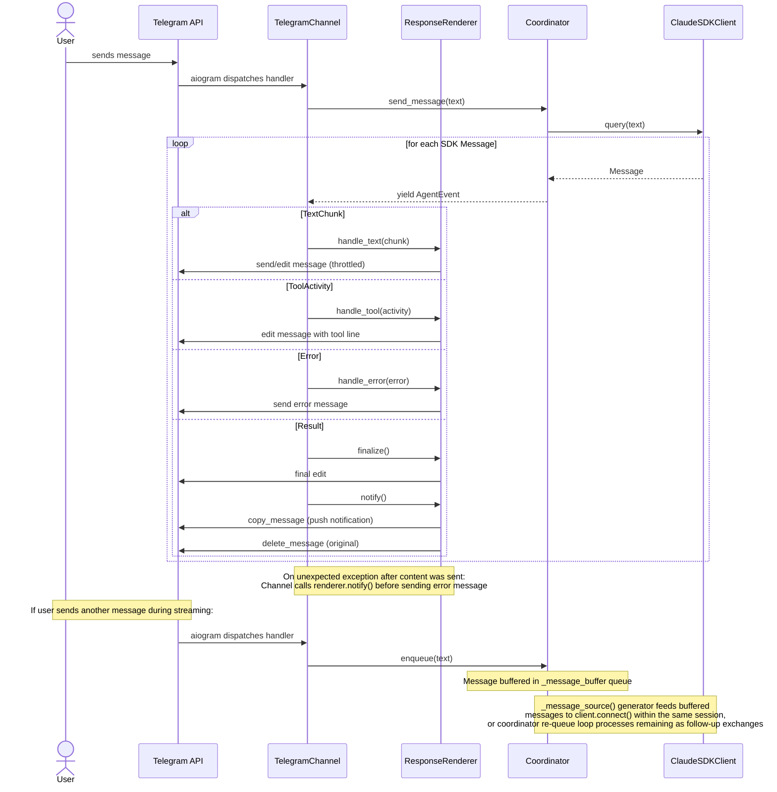
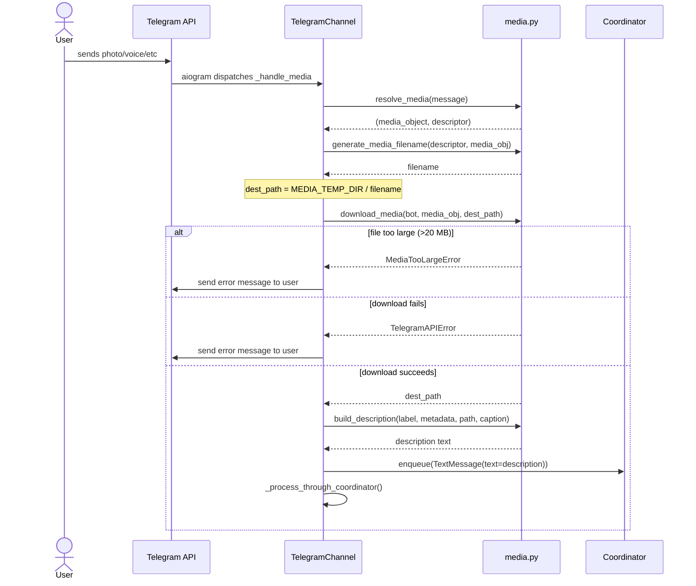
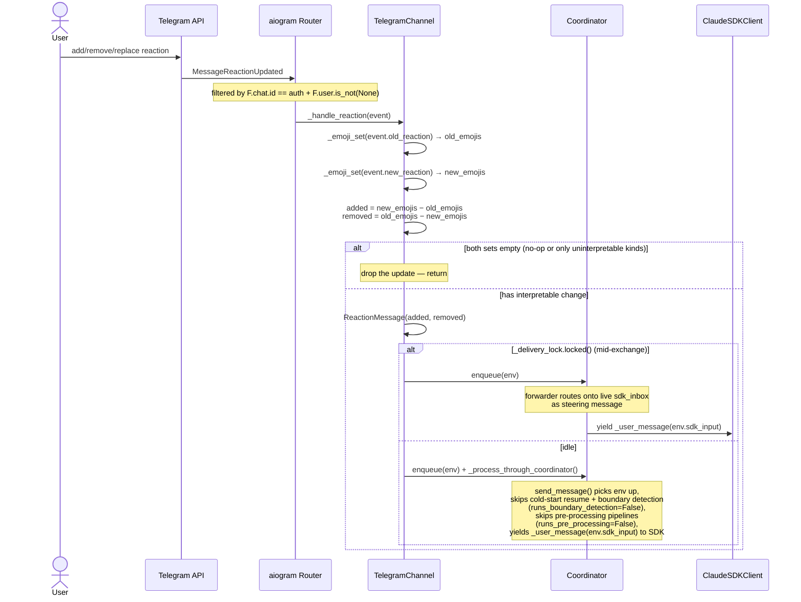

# Design: Telegram Channel

<!-- This design describes the current implementation approach. Updated through delta reconciliation. -->

**Feature Spec**: [../feature-specs/channels/telegram.md](../../feature-specs/channels/telegram.md)
**Status**: Current

## Purpose

This document explains the design rationale for the Telegram channel: the bot lifecycle, response rendering, message buffering mechanism, and configuration approach.

## Problem Context

Tachikoma needs a production-facing communication channel beyond the development REPL. Telegram is the target: a single authorized user sends text messages to a bot, the coordinator processes them, and responses stream back as formatted Telegram messages with progressive editing.

**Constraints:**
- Must integrate with the existing async coordinator (`send_message()` → `AsyncIterator[AgentEvent]`)
- Telegram's Bot API has rate limits (~30 msg/sec global, ~5 edits/min per message) and a 4096-character message size limit
- Telegram's MarkdownV2 format has strict escaping rules that break with partial markdown during streaming
- The CLI entry point must support channel selection while integrating with SettingsManager and bootstrap sequence
- Messages arriving while the agent is responding should be buffered and processed in order

**Interactions:**
- Coordinator layer (core-architecture): `send_message()` for normal turns, `enqueue()` for message buffering
- Configuration system (config-system): `[telegram]` section in Settings model
- Bootstrap system (config-system): `telegram_hook` validates Telegram config, prompts for missing values
- SettingsManager (config-system): CLI flag overrides applied as runtime-only settings

## Design Overview

The Telegram channel follows the same pattern as the REPL: a `TelegramChannel` class that calls `coordinator.send_message()` and consumes `AgentEvent`s, but renders them as Telegram messages instead of terminal output. The channel uses **aiogram 3.x** for bot communication and **telegramify-markdown** for formatting.

```
┌──────────────────────────────────────────────────────────────┐
│                      Entry Point                              │
│  ┌────────────────────────────────────────────────────────┐   │
│  │  cyclopts App: run subcommand (--channel flag)          │   │
│  │  → SettingsManager (TOML + CLI overrides)              │   │
│  │  → Bootstrap (hooks incl. telegram validation)         │   │
│  │  → Channel dispatch (Repl or TelegramChannel)          │   │
│  └────────────────────────────────────────────────────────┘   │
├──────────────────────────────────────────────────────────────┤
│                     Channel Layer                              │
│  ┌─────────────┐  ┌───────────────────────────────────────┐   │
│  │    Repl      │  │  TelegramChannel                     │   │
│  │  (existing)  │  │  ┌─────────────────────────────────┐ │   │
│  │              │  │  │ aiogram Bot + Dispatcher + Router│ │   │
│  │              │  │  │ _handle_message (F.text)         │ │   │
│  │              │  │  │ _handle_media (F.photo|F.voice..)│ │   │
│  │              │  │  └────────────────┬────────────────┘ │   │
│  │              │  │                   │ delegates to      │   │
│  │              │  │  ┌────────────────▼────────────────┐ │   │
│  │              │  │  │ media.py                        │ │   │
│  │              │  │  │ resolve/download/describe media  │ │   │
│  │              │  │  └─────────────────────────────────┘ │   │
│  │              │  │  ┌─────────────────────────────────┐ │   │
│  │              │  │  │ ResponseRenderer                │ │   │
│  │              │  │  │ (progressive edits, tool lines, │ │   │
│  │              │  │  │  message splitting, formatting) │ │   │
│  │              │  │  └─────────────────────────────────┘ │   │
│  │              │  │  ┌─────────────────────────────────┐ │   │
│  │              │  │  │ pinning.py                      │ │   │
│  │              │  │  │ MCP tools: pin/unpin messages   │ │   │
│  │              │  │  └─────────────────────────────────┘ │   │
│  └──────┬──────┘  └──────────────┬────────────────────────┘   │
│         │                        │                             │
│         ▼                        ▼                             │
├──────────────────────────────────────────────────────────────┤
│                   Coordinator Layer                             │
│  ┌────────────────────────────────────────────────────────┐   │
│  │  Coordinator                                           │   │
│  │  send_message() → AsyncIterator[AgentEvent]             │   │
│  │  enqueue(text) → None  (message buffering)             │   │
│  └────────────────────────────────────────────────────────┘   │
└──────────────────────────────────────────────────────────────┘
```

The key components:
- **`TelegramChannel`**: owns the aiogram lifecycle, handles message events, renders responses
- **`ResponseRenderer`**: manages progressive message editing, tool lines, splitting, and formatting
- **`Coordinator.enqueue()`**: buffers a user message into `_message_buffer` for processing by the message source generator
- **Cyclopts CLI**: parses `--channel` flag and applies overrides to SettingsManager
- **Telegram bootstrap hook**: validates config when Telegram channel is selected (follows DES-003)

## Components

### Implementation Structure

| Layer/Component | Responsibility | Key Decisions |
|-----------------|----------------|---------------|
| `src/tachikoma/__main__.py` | Cyclopts `App` entry point: `run()` subcommand with `--channel` flag (also the default for bare invocation); creates `SettingsManager`, applies CLI overrides, runs bootstrap, dispatches to channel. Registers `media_hook` in bootstrap sequence (after `tasks`, before `telegram`) | Replaces bare `asyncio.run(main())` with cyclopts; `cli()` wrapper as `[project.scripts]` entry point; integrates with SettingsManager + Bootstrap |
| `src/tachikoma/telegram/__init__.py` | `TelegramChannel` class + `ResponseRenderer` class + `telegram_hook` function. Subscribes to `BufferedDelivery` events via `bus.on()` in `run()` (deferred until the coordinator is set). Shared `_process_through_coordinator()` method handles both user messages and buffered deliveries. `_handle_buffered_delivery()` spawns a detached `asyncio.Task` for the delivery work and returns immediately so the EventBus is freed (see DES-009). The `_deliver()` task acquires the delivery lock, wraps `event.prompt` in a `TextMessage` envelope, routes it through the coordinator, fires per-item `on_delivered` callbacks, and calls `resolve_shutdown()` in a `finally` block for shutdown digests. `_handle_media` catch-all handler delegates to `media.py` functions for descriptor resolution, download, and description building. Channel-specific formatter maps (`TELEGRAM_TOOL_DISPLAY`, `TELEGRAM_TOOL_SUMMARY`) with `code_wrap()` utility for inline code wrapping of dynamic tool arguments (file paths, patterns, commands — but not Bash descriptions, which are plain text). `_send_shutdown_status()` manages a dedicated shutdown progress message (send on first call, edit on subsequent) using the same pattern as `ResponseRenderer.handle_status()`. In `run()`, sets `coordinator.shutdown_status_callback` to `_send_shutdown_status` so the coordinator emits bookend messages ("Shutting down..." / "Shutdown complete") and the pipeline emits per-processor status during shutdown post-processing. `_detect_command()` inspects `bot_command` entities for `/new` and `/queue` command detection; `_handle_message()` routes commands to deferred queue (when busy) or immediate processing (when idle); `_drain_deferred_queue()` processes deferred messages sequentially after each delivery cycle. Registers commands via `bot.set_my_commands()` in `run()`. **Inline button taps**: registers an aiogram `@router.callback_query(F.data.startswith("btn"))` handler `_handle_callback_query` alongside the existing message and media handlers. The handler runs `answer()` first (so the spinner always clears), checks `callback.from_user.id` against the configured authorized user, schedules `_remove_keyboard()` as a detached task on `_delivery_tasks` when `single_use=True`, unpacks the callback data via `_unpack()` from `buttons.py`, constructs a `ButtonTapMessage(value=…)` envelope, and routes via the same `_delivery_lock.locked()` busy/idle branching as `_handle_message`/`_handle_media`. `_remove_keyboard()` calls `bot.edit_message_reply_markup(reply_markup=None)` and swallows `TelegramBadRequest("message is not modified")` as a no-op (consistent with `_flush`/`_send_chunks`). **Inbound reactions**: when `settings.inbound_reactions` is True, registers an aiogram `@router.message_reaction(F.chat.id == authorized_chat_id, F.user.is_not(None))` handler `_handle_reaction` alongside the existing observers. The handler extracts emoji strings from the old and new reaction lists via the module-level `_emoji_set(reactions: Sequence[ReactionType]) -> frozenset[str]` helper (drops `ReactionTypeCustomEmoji` and `ReactionTypePaid`), computes the set diff, drops the update when both `added` and `removed` are empty (no-op or only uninterpretable kinds), constructs a `ReactionMessage(added, removed)` envelope, and routes via the same `_delivery_lock.locked()` busy/idle branching as the other handlers — reactions never use `enqueue_deferred()`. `TelegramChannel.run()` passes `allowed_updates=self._dispatcher.resolve_used_update_types()` to `start_polling`, so registered handlers (including the reaction handler) drive the polling subscription with no hardcoded update-type list. All producer sites in this module construct envelopes at the coordinator boundary (text/media/command/buffered-delivery paths construct `TextMessage`; the callback handler constructs `ButtonTapMessage`; the reaction handler constructs `ReactionMessage`). **Channel message recording**: incoming messages set `external_id=str(message.message_id)` on the `TextMessage` envelope; after `_process_through_coordinator()` completes, the channel records the incoming external ID via `registry.record_channel_message()`. Outgoing message IDs are captured from `ResponseRenderer.get_finalized_message_ids()` after finalization and recorded asynchronously (each split message ID as its own row). **Reaction session routing**: the reaction handler extracts `event.message_id`, calls `registry.find_session_by_external_id("telegram", str(event.message_id))` — if the result maps to a different session than the current active session, sets `target_session_id` on the envelope and defers via `enqueue_deferred()`; otherwise routes normally. Reactions with session switches are deferred to ensure the switch happens between turns, not mid-response (per DES-009). | High cohesion between channel control flow and response rendering; only `BufferedDelivery` is observed — session tasks and notifications are enqueued into the priority buffer by their producers (see [delivery/priority-buffer](../delivery/priority-buffer.md)); shutdown progress follows existing status callback pattern from pre-processing; command detection uses Telegram-native entities (not string matching); tap acknowledgement runs before the auth check (otherwise unauthorized users would stare at a stuck spinner); keyboard removal is detached so a slow/failing edit cannot delay envelope routing; reaction-type filtering happens in-handler (not via aiogram `F.new_reaction[0].type` filters) because aiogram's index filter fails on mixed-kind updates and the no-op drop requires post-filter set comparison; `allowed_updates=resolve_used_update_types()` couples polling to the registered handler set in one direction so registration is the single source of truth |
| `src/tachikoma/media.py` | Media descriptor table (`MEDIA_DESCRIPTORS`), `resolve_media()`, `download_media()`, `build_description()`, `generate_media_filename()`, `MediaTooLargeError`, `media_hook` bootstrap function. Constants: `MEDIA_TEMP_DIR`, `TELEGRAM_MAX_FILE_SIZE`, `MEDIA_CLEANUP_DAYS` | High cohesion between all media-related logic; bootstrap hook follows DES-003; descriptor table driven by ordered sequence for priority resolution |
| `src/tachikoma/coordinator.py` | Existing + `enqueue()` method, `_message_buffer` queue, `has_pending_messages` property, `_message_source()` async generator passed to `client.connect()`, `shutdown_status_callback` attribute set by channels before polling starts to receive progress updates during shutdown post-processing. Deferred queue: `_deferred_queue`, `enqueue_deferred()`, `has_deferred`, `promote_next_deferred()` for messages that should wait until the current turn completes. `force_new` routing in `send_message()` skips boundary detection and triggers fresh session transition. `_route_to_target_session()` handles `target_session_id` routing — closes current session (via existing `_close_and_fire_postprocessing()`), reopens target, falls back to fresh session on reopen failure | Message buffer replaces steer/pending-steers pattern; shutdown callback follows same StatusCallback pattern as pre-processing; deferred queue is coordinator-level (generic infrastructure) while drain loop is channel-level (delivery timing); `_route_to_target_session` reuses existing session close logic |
| `src/tachikoma/config.py` | `TelegramSettings` model added to `Settings` | Extends existing config; optional section (`None` when not configured) |
| `src/tachikoma/display.py` | `TOOL_DISPLAY` map for live tool status formatting (present-progressive, Bash prefers description over command); `TOOL_SUMMARY` map and `summarize_tool_activity()` for post-hoc tool activity summaries (present-progressive matching active style, chronological ordering so the summary reads naturally top-to-bottom; when the display limit is exceeded, oldest entries are dropped preserving the most recent context); `summarize_tool_activity()` accepts optional `summary_map` parameter for channel-specific formatters; `format_tool_name()` for formatting MCP tool names into human-readable labels in fallback paths | Shared base formatters used directly by REPL; Telegram uses channel-specific formatter maps via `summary_map` parameter |
| `src/tachikoma/telegram/pinning.py` | Pin/unpin MCP tool handlers + factory. Follows DES-006: `handle_pin_message()` and `handle_unpin_message()` extracted handlers, `UnpinMessageArgs` Pydantic model, `create_pinning_server()` factory. Pins use `disable_notification=False` so the pin action delivers the push notification. Factory returns `(McpSdkServerConfig, is_pinned_checker)` — the checker tests message IDs against a closure-captured `pinned_ids` set, enabling `notify()` to skip copy+delete for pinned messages. | Separate module from tools.py (unrelated concerns); getter captured as `Callable[[], int \| None]` to decouple from ResponseRenderer |
| `src/tachikoma/telegram/buttons.py` | `present_buttons` MCP tool handler + factory. Follows DES-006: `handle_present_buttons()` extracted handler, `PresentButtonsArgs` Pydantic model with `prompt: str`, `buttons: str` (JSON-encoded list-of-lists per DES-006 array-arg pattern), `single_use: bool = True`; module-level `_decode_buttons()` parses and validates the JSON string, `_pack(value, single_use)` and `_unpack(data)` own the `callback_data` wire format (`"btn1:<value>"` single-use, `"btnN:<value>"` multi-use). `create_buttons_server(bot, chat_id)` factory returns the `McpSdkServerConfig`. Handler builds raw `InlineKeyboardMarkup(inline_keyboard=[[InlineKeyboardButton(text=label, callback_data=_pack(value, single_use)) …]])`, calls `bot.send_message(chat_id, prompt, reply_markup=markup)`, returns the sent message ID on success or `{is_error: True, …}` on validation/API failure. Per-button `value` is capped at 58 UTF-8 bytes (Telegram's 64-byte `callback_data` limit minus the 5-byte prefix). | Separate module — buttons are an unrelated concern, same pattern as `pinning.py`; `_pack`/`_unpack` are imported by the channel's callback handler (single source of truth for the wire format); single-use bit encoded into `callback_data` itself so semantics survive across process restarts (no per-message DB state); raw `InlineKeyboardMarkup` over `InlineKeyboardBuilder` because the agent already chose the row layout |

### Event Rendering

| Event Type | Rendering |
|------------|-----------|
| `TextChunk` | Accumulated in buffer, formatted via telegramify-markdown, sent as progressive message edits |
| `ToolActivity` | Italicized inline status line appended to current message with wrench icon (e.g., "*🔧 Reading \`src/main.py\`*"), separated from surrounding text by blank lines; replaced by next tool; activities collected for summary generation at tool→text transitions |
| `Result` | Final edit with complete formatted text; copy+delete for push notification (if enabled); renderer reset for next turn |
| `Status` | Transient italic message sent via `handle_status()` method; replaced when the first TextChunk or ToolActivity arrives; consecutive Status events edit the existing message in place |
| `Error` | Separate error message sent to chat; conversation continues if recoverable |

**Tool display format:** Uses Telegram-specific `TELEGRAM_TOOL_DISPLAY` map for live status lines — present-progressive format with wrench icon in markdown italics (e.g., "*🔧 Reading \`src/main.py\`*"), separated from surrounding text by blank lines. Included tools (Read, Grep, Glob, Edit, Write) wrap dynamic arguments (file paths, patterns, commands) in inline code via `code_wrap()` to prevent markdown-sensitive characters from being misinterpreted; Bash wraps commands in inline code but renders descriptions as plain text (descriptions are natural language, not code); excluded tools (Agent, ToolSearch) and unknown/MCP tools produce plain text. Unknown tools fall back to tool name with ellipsis — MCP tool names (starting with `mcp__`) are formatted into human-readable labels via `format_tool_name()` (e.g., `mcp__projects__list_projects` becomes "List Projects"). At tool→text transitions, `summarize_tool_activity()` generates a post-hoc summary using `TELEGRAM_TOOL_SUMMARY` — present-progressive format with code-wrapped arguments for included tools and plain text for Bash descriptions (e.g., "*🔧 Reading 3 files and install project dependencies*"), with blank lines before and after to visually separate tool activity from response text.

### Cross-Layer Contracts


```mermaid
sequenceDiagram
    actor User
    participant TG as Telegram API
    participant Channel as TelegramChannel
    participant Renderer as ResponseRenderer
    participant Coord as Coordinator
    participant SDK as ClaudeSDKClient

    User->>TG: sends message
    TG->>Channel: aiogram dispatches handler
    Channel->>Coord: send_message(text)
    Coord->>SDK: query(text)

    loop for each SDK Message
        SDK-->>Coord: Message
        Coord-->>Channel: yield AgentEvent

        alt TextChunk
            Channel->>Renderer: handle_text(chunk)
            Renderer->>TG: send/edit message (throttled)
        else ToolActivity
            Channel->>Renderer: handle_tool(activity)
            Renderer->>TG: edit message with tool line
        else Error
            Channel->>Renderer: handle_error(error)
            Renderer->>TG: send error message
        else Result
            Channel->>Renderer: finalize()
            Renderer->>TG: final edit
            Channel->>Renderer: notify()
            Renderer->>TG: copy_message (push notification)
            Renderer->>TG: delete_message (original)
        end
    end

    Note over Channel,Renderer: On unexpected exception after content was sent:<br/>Channel calls renderer.notify() before sending error message

    Note over User,TG: If user sends another message during streaming:
    TG->>Channel: aiogram dispatches handler
    Channel->>Coord: enqueue(text)
    Note over Coord: Message buffered in _message_buffer queue
    Note over Coord,SDK: _message_source() generator feeds buffered<br/>messages to client.connect() within the same session,<br/>or coordinator re-queue loop processes remaining as follow-up exchanges
```

#### Media message flow


```mermaid
sequenceDiagram
    actor User
    participant TG as Telegram API
    participant Channel as TelegramChannel
    participant Media as media.py
    participant Coord as Coordinator

    User->>TG: sends photo/voice/etc
    TG->>Channel: aiogram dispatches _handle_media
    Channel->>Media: resolve_media(message)
    Media-->>Channel: (media_object, descriptor)

    Channel->>Media: generate_media_filename(descriptor, media_obj)
    Media-->>Channel: filename
    Note over Channel: dest_path = MEDIA_TEMP_DIR / filename

    Channel->>Media: download_media(bot, media_obj, dest_path)
    alt file too large (>20 MB)
        Media-->>Channel: MediaTooLargeError
        Channel->>TG: send error message to user
    else download fails
        Media-->>Channel: TelegramAPIError
        Channel->>TG: send error message to user
    else download succeeds
        Media-->>Channel: dest_path
        Channel->>Media: build_description(label, metadata, path, caption)
        Media-->>Channel: description text
        Channel->>Coord: enqueue(TextMessage(text=description))
        Channel->>Channel: _process_through_coordinator()
    end
```

#### Inline button tap flow

```mermaid
sequenceDiagram
    actor User
    participant TG as Telegram API
    participant Router as aiogram Router
    participant Chan as TelegramChannel
    participant Coord as Coordinator
    participant SDK as ClaudeSDKClient

    User->>TG: tap button
    TG->>Router: CallbackQuery
    Router->>Chan: _handle_callback_query(cb)
    Chan->>TG: callback_query.answer()
    Note over Chan: broad-except on answer() — never blocks routing

    alt cb.from_user.id != authorized_chat_id
        Note over Chan: drop — no keyboard removal, no envelope
    else authorized
        Chan-)+TG: detached Task: edit_message_reply_markup(None) if single-use
        Note over Chan: log + swallow errors; "message is not modified" → no-op

        Chan->>Chan: ButtonTapMessage(value=_unpack(cb.data))

        alt _delivery_lock.locked() (mid-exchange)
            Chan->>Coord: enqueue(tap)
            Note over Coord: forwarder routes onto live sdk_inbox<br/>as steering message
            Coord->>SDK: yield _user_message(tap.sdk_input)
        else idle
            Chan->>Coord: enqueue(tap) + _process_through_coordinator()
            Note over Coord: send_message() picks tap up,<br/>skips pre-processing (runs_pre_processing=False),<br/>runs boundary detection on sdk_input,<br/>yields _user_message(tap.sdk_input) to SDK
        end
    end
```

#### Inbound reaction flow


```mermaid
sequenceDiagram
    actor User
    participant TG as Telegram API
    participant Router as aiogram Router
    participant Chan as TelegramChannel
    participant Coord as Coordinator
    participant SDK as ClaudeSDKClient

    User->>TG: add/remove/replace reaction
    TG->>Router: MessageReactionUpdated
    Note over Router: filtered by F.chat.id == auth + F.user.is_not(None)
    Router->>Chan: _handle_reaction(event)

    Chan->>Chan: _emoji_set(event.old_reaction) → old_emojis
    Chan->>Chan: _emoji_set(event.new_reaction) → new_emojis
    Chan->>Chan: added = new_emojis − old_emojis<br/>removed = old_emojis − new_emojis

    alt both sets empty (no-op or only uninterpretable kinds)
        Note over Chan: drop the update — return
    else has interpretable change
        Chan->>Chan: ReactionMessage(added, removed)

        alt _delivery_lock.locked() (mid-exchange)
            Chan->>Coord: enqueue(env)
            Note over Coord: forwarder routes onto live sdk_inbox<br/>as steering message
            Coord->>SDK: yield _user_message(env.sdk_input)
        else idle
            Chan->>Coord: enqueue(env) + _process_through_coordinator()
            Note over Coord: send_message() picks env up,<br/>skips cold-start resume + boundary detection<br/>(runs_boundary_detection=False),<br/>skips pre-processing pipelines<br/>(runs_pre_processing=False),<br/>yields _user_message(env.sdk_input) to SDK
        end
    end
```

**Integration Points:**
- Channel ↔ Coordinator: `send_message()` (async iterator yielding continuous stream from all re-queue iterations), `enqueue()` (sync buffer write), `enqueue_deferred()` (sync deferred queue write), `has_deferred` + `promote_next_deferred()` (drain control)
- Channel ↔ aiogram: `Router` handler receives `Message`, `Bot` sends/edits messages
- Channel ↔ `media.py`: function calls — `resolve_media()` for descriptor lookup, `download_media()` for file download, `build_description()` for text composition, `generate_media_filename()` for unique file naming
- Renderer ↔ telegramify-markdown: converts accumulated markdown to `(text, entities)` tuples on each edit cycle
- `__main__.py` ↔ SettingsManager: CLI overrides applied via `update_root()` + `reload()` (runtime-only)
- `telegram_hook` ↔ Bootstrap: follows DES-003 pattern (defined in telegram module, registered in __main__.py, self-skips when channel != "telegram")
- `media_hook` ↔ Bootstrap: follows DES-003 pattern (defined in media module, registered in __main__.py)
- Channel ↔ Event bus: subscribes to `BufferedDelivery` (unified buffered-item delivery) via `bus.on()` in `run()` (see ADR-009 and [delivery/priority-buffer](../delivery/priority-buffer.md))
- Channel ↔ pinning.py: `create_pinning_server()` factory called in `get_mcp_servers()` — captures `Bot`, chat ID, and a locally-defined `get_msg_id()` function that safely resolves `_active_renderer.get_last_message_id()` (returns `None` when no renderer is active). Returns a tuple of `(McpSdkServerConfig, is_pinned_checker)` where the checker tests message IDs against a closure-captured `pinned_ids` set. The channel stores the checker and passes it to each new `ResponseRenderer` so `notify()` can skip copy+delete for pinned messages.
- Channel ↔ buttons.py: `create_buttons_server(bot, chat_id)` factory called in `get_mcp_servers()` — produces the `telegram-buttons` server (third entry alongside `send-file` and `telegram-pinning`). The channel also imports `_unpack` from `buttons.py` for use in `_handle_callback_query`, making `buttons.py` the single source of truth for the `callback_data` wire format on both the producing and consuming sides.
- Channel ↔ aiogram callback router: new `@router.callback_query(F.data.startswith("btn"))` handler registered alongside the message and media handlers. Authorization happens in-handler (post-`answer()`) rather than at the router level, so unauthorized taps still clear their originator's spinner before being dropped.
- Channel ↔ aiogram reaction observer: when `settings.inbound_reactions` is True, an `@router.message_reaction(F.chat.id == authorized_chat_id, F.user.is_not(None))` handler is registered alongside the other observers. Chat-level authorization is applied at the observer (router-wide `router.message.filter(...)` does not propagate to the `message_reaction` observer in aiogram); the `F.user.is_not(None)` clause excludes anonymous-channel reactions before they reach the handler.
- Channel ↔ `Dispatcher.start_polling`: `allowed_updates=self._dispatcher.resolve_used_update_types()` is passed so aiogram derives the polling subscription set from the registered handlers. Adding or omitting handlers (e.g., via the `inbound_reactions` flag) automatically adjusts the set — no hardcoded `["message", "callback_query", "message_reaction", ...]` literal to maintain.

## Modeling

### Config model additions

```
Settings (root, frozen)
├── workspace: WorkspaceSettings
├── agent: AgentSettings
├── logging: LoggingSettings
├── tasks: TaskSettings
├── channel: Literal["repl", "telegram"] = "repl"  (new, top-level)
└── telegram: TelegramSettings | None = None  (new, optional)
    ├── bot_token: str
    ├── authorized_chat_id: int
    ├── push_notifications: bool = True
    ├── inbound_reactions: bool = True
    │   — gates registration of the message_reaction handler;
    │     when False, aiogram's resolve_used_update_types()
    │     omits message_reaction from polling
    └── send_file: SendFileSettings = SendFileSettings()
        └── extra_roots: list[Path] = []
            — entries are Path objects
            — `~` is expanded at load (before-validator)
            — must be absolute after expansion (after-validator)
            — need NOT exist at load time
```

`channel` is a top-level setting defaulting to `"repl"`. The CLI `--channel` flag overrides it via `SettingsManager.update_root()` at runtime (no file persistence).

`TelegramSettings` is `None` by default. When the `[telegram]` section exists in TOML, Pydantic validates `bot_token` and `authorized_chat_id` as required (no defaults). The nested `[telegram.send_file]` sub-section is optional — when absent, `SendFileSettings` defaults to an empty `extra_roots` list. The nested sub-section leaves room for future `send_file` knobs (e.g. size limits, MIME filters) without reshuffling `TelegramSettings`.

### ResponseRenderer state

```
ResponseRenderer
├── _bot: Bot
├── _chat_id: int
├── _push_notifications: bool = False    (set from TelegramSettings at construction; False default for test safety)
├── _current_message_id: int | None      (Telegram message being edited; after split, points to last chunk)
├── _buffer: str                          (accumulated markdown text)
├── _tool_line: str | None                (current tool status line)
├── _tool_activities: list[ToolActivity]  (collected activities for summary; cleared at each tool-to-text transition and on finalize)
├── _last_edit_time: float                (monotonic timestamp of last edit)
├── _split_message_ids: list[int]         (tracked message IDs from split; reused on re-split, excess deleted)
├── _message_count: int                   (tracks messages sent in current response)
├── _is_pinned: Callable[[int], bool] | None  (checker from pinning module; None when not wired)
└── + get_last_message_id() -> int | None (returns _current_message_id; None if no message sent or after reset)
```

The renderer exposes a `reset()` method that clears all state for a new response. The channel calls `reset()` after each `Result` event, so buffered messages start with a fresh renderer.

### Coordinator additions

```
Coordinator (existing)
├── _client: ClaudeSDKClient
├── _message_buffer: asyncio.Queue[MessageEnvelope]   (unbounded FIFO queue; envelopes per DES-013)
├── _deferred_queue: asyncio.Queue[MessageEnvelope]   (unbounded FIFO queue for deferred envelopes)
├── has_pending_messages: bool             (property: True when buffer is non-empty)
├── has_deferred: bool                     (property: True when deferred queue is non-empty)
├── send_message() → AsyncIterator        (re-queue loop: processes buffer until empty; no text parameter)
├── enqueue(msg) → None                   (sync, zero preconditions, puts message in buffer)
├── enqueue_deferred(msg) → None          (sync, puts message in deferred queue)
├── promote_next_deferred() → None        (moves one item from deferred queue to message buffer)
└── _message_source(initial, buffer)      (long-lived async generator passed to client.connect())
```

## Data Flow

### Normal message flow (Telegram)

```
1. User sends text in Telegram
2. aiogram Router receives update, chat ID filter passes
3. Handler validates: text message, non-empty
4. ChatActionSender starts typing indicator
5. Handler calls coordinator.send_message(text)
6. For each AgentEvent:
   a. TextChunk → if tool activities pending, generate and insert summary marker; append to buffer, schedule throttled edit
   b. ToolActivity → collect in _tool_activities, set tool line, schedule throttled edit
   c. Error → send error message to chat
   d. Result → finalize (final edit), notify (copy+delete for push notification), reset renderer
7. Typing indicator stops when ChatActionSender context exits
```

When `push_notifications` is enabled, all `send_message` calls during streaming pass `disable_notification=True`. After `finalize()`, `notify()` copies the last message (triggering push) and deletes the original. If copy fails, the original is preserved. For split responses, only the last message is copy+deleted.

### Throttled edit cycle

```
1. Event arrives (TextChunk or ToolActivity)
2. Update buffer/tool_line state
3. Check: has 2 seconds elapsed since last edit?
   ├─ No → skip edit (buffer continues accumulating)
   └─ Yes → format and edit
4. Format: telegramify-markdown converts buffer + tool_line → (text, entities)
5. Check: formatted text approaching 3800 chars (safety margin)?
   ├─ No → edit current message with (text, entities)
   └─ Yes → find last paragraph boundary, send current message up to boundary,
            start new message with remainder
6. Update _last_edit_time
7. On Result event: always send final edit regardless of throttle
```

### Message splitting

```
1. Buffer accumulates text chunks; tool line (if any) is included
2. On each flush, convert(display_text) produces (text, entities)
3. Measure converted text with utf16_len(text) against TELEGRAM_MAX_UTF16 (4096)
4. If over limit:
   a. split_entities(text, entities, 4096) produces list of (text, entities) chunks
   b. _send_chunks() processes each chunk:
      - If tracked split message exists at this index → edit in-place (no duplicate)
      - If first split ever with current streaming message → edit streaming message
      - Otherwise → send new message
   c. All message IDs are tracked in _split_message_ids
   d. Excess tracked messages (from a previous split with more chunks) are deleted
5. If under limit:
   a. If _split_message_ids is non-empty (shrink-to-unsplit):
      - Edit first tracked message with full content
      - Delete remaining tracked messages
      - Fall through to normal edit path
   b. Otherwise: send/edit as a single message
```

Splitting operates on the post-conversion text+entities via `telegramify_markdown.split_entities()`, which respects UTF-16 code unit length (Telegram's actual constraint), clips entities at split boundaries, and prefers newline-based split points. Split messages are tracked via `_split_message_ids` to prevent duplicates when `_send_chunks()` is called multiple times per response (during streaming and finalization).

### Message buffer flow

```
1. Channel calls coordinator.enqueue("A"), then triggers processing if idle
2. Channel calls send_message() — single async for iteration
3. send_message() enters re-queue loop: dequeue A, run full pipeline, create SDK client
4. _message_source yields "A" first, then awaits further messages from the buffer
5. Events for A stream back, channel renders them
6. User sends msg B while A is streaming
7. aiogram dispatches new handler → channel calls coordinator.enqueue("B")
8. _message_source() generator picks up B from the buffer and yields it to the SDK session
9. Events for B stream back through the same session
   Channel renders them as a new response message (renderer was reset)
10. Exchange completes → forwarder cancelled, client disconnected, _drain_back() recovers leftovers
11. Re-queue loop check: _message_buffer non-empty? → dequeue next, start new exchange in same session
12. Buffer empty → generator returns
13. on_complete callback is called after send_message() returns
14. Deferred queue drain: while coordinator.has_deferred(), promote + _process_through_coordinator()
```

The `Result` event serves as a turn boundary signal. The channel finalizes the current response and resets the renderer, so each buffered message gets its own Telegram response message(s). The coordinator's re-queue loop handles leftover messages internally — the channel sees one continuous event stream from `send_message()`.

### Startup flow (with bootstrap integration)

```
1. Entry point invoked (console script via [project.scripts] or python -m), cyclopts dispatches to run() subcommand (with --channel flag) or default_command() (bare invocation, delegates to run())
2. Create SettingsManager(config_path)
3. Apply CLI overrides at runtime (no save):
   └─ --channel value → update_root("channel", value) + reload()
4. Create Bootstrap(settings_manager)
5. Register hooks:
   a. bootstrap.register("workspace", workspace_hook)
   b. bootstrap.register("logging", logging_hook)
   c. bootstrap.register("git", git_hook)
   d. bootstrap.register("skills", skills_hook)
   e. bootstrap.register("context", context_hook)
   f. bootstrap.register("memory", memory_hook)
   g. bootstrap.register("sessions", session_recovery_hook)
   h. bootstrap.register("telegram", telegram_hook)  (follows DES-003)
6. bootstrap.run()
   └─ telegram_hook:
      a. Check settings.channel == "telegram", skip otherwise
      b. Check settings.telegram is not None → if None, prompt for values
      c. Persist via ctx.settings_manager.update()/save()
      d. Validate token via await bot.get_me()
7. Read final settings from settings_manager.settings
8. Create Coordinator(...)
9. Dispatch based on settings.channel:
   ├─ "repl" → Repl(coordinator, history_path=...)
   └─ "telegram" → TelegramChannel(coordinator, settings.telegram)
10. Channel runs (repl.run() or telegram.run())
```

## Key Decisions

### aiogram 3.x over python-telegram-bot

**Choice**: Use aiogram 3.x as the Telegram bot library
**Why**: aiogram is async-native from the ground up — `dp.start_polling(bot)` is an awaitable coroutine that runs inside `asyncio.run()`, fitting perfectly with the existing async entry point. python-telegram-bot's `run_polling()` is blocking and manages its own event loop.
**Sources**: aiogram 3.x docs, python-telegram-bot v22 docs, community comparisons
**Alternatives Considered**: python-telegram-bot v22, pyTelegramBotAPI (telebot)

**Consequences**:
- Pro: Native async integration with existing coordinator
- Pro: Router-level filtering, built-in ChatActionSender, clean middleware system
- Con: Smaller community — fewer examples available
- Con: Rate limit handling for edits needs manual implementation

### telegramify-markdown with entities output

**Choice**: Use telegramify-markdown in `(text, entities)` tuple mode, sending with `parse_mode=None` + `entities` parameter
**Why**: Telegram's MarkdownV2 requires strict escaping and breaks with partial markdown during streaming. The entities-based approach sidesteps all parsing issues — `convert(markdown)` returns plain text + a list of `MessageEntity` objects. Safe for streaming: partial markdown produces valid plain text + whatever entities could be parsed.
**Sources**: telegramify-markdown docs, Telegram Bot API docs on MessageEntity
**Alternatives Considered**: md2tgmd, mark2tg, custom converter, plain text during streaming

**Consequences**:
- Pro: No MarkdownV2 escaping issues during streaming
- Pro: Handles LLM output patterns (code blocks, nested formatting)
- Pro: Built-in `split_entities()` for message splitting with proper entity clipping
- Pro: Safe for progressive edits — re-parsing the growing buffer produces correct entities

### Time-based edit throttle (2 seconds)

**Choice**: Edit the Telegram message at most once every 2 seconds during streaming
**Why**: Telegram does not publish exact rate limits. Empirical community testing reports varying per-message edit limits. A 2-second interval is conservative enough to stay safe while being responsive.
**Sources**: Telegram Bot API FAQ, community empirical testing

**Consequences**:
- Pro: Simple to implement — one timer check
- Pro: Conservative interval avoids rate limit issues
- Note: If 2s proves too aggressive, the interval is a single constant to adjust

### Message buffer via Coordinator.enqueue()

**Choice**: Replace `steer()` + `_pending_steers` with an `asyncio.Queue`-based message buffer. `enqueue(text)` is sync and zero-precondition. `_message_source(initial, buffer)` is a long-lived async generator passed to `client.connect()` (SDK-managed concurrent task). The channel calls `enqueue()`, then triggers processing if idle. A re-queue loop inside `send_message()` processes remaining buffered messages as follow-up exchanges within the same generator call.
**Why**: The queue-based approach decouples message arrival from processing, eliminates the counter-based coordination, and integrates cleanly with the SDK's `client.connect()` message source contract. `send_message()` no longer takes a text parameter — it reads from the buffer.
**Sources**: Claude Agent SDK Python source, asyncio.Queue documentation

**Consequences**:
- Pro: Seamless UX — user can send messages anytime, no "please wait" state
- Pro: Simpler coordinator state — unbounded FIFO queue replaces counter + direct query calls
- Pro: Conversation context preserved — buffered messages are full turns in the same or subsequent sessions
- Pro: `enqueue()` is sync with zero preconditions — safe to call from any context

### Cyclopts with SettingsManager integration

**Choice**: Use cyclopts for CLI parsing, applying flag values as runtime-only overrides to SettingsManager (no persist)
**Why**: CLI flags and TOML config are the same parameters. A `channel` field on Settings (defaulting to `"repl"`) lets users configure their default channel in TOML; the `--channel` CLI flag (on the `run` subcommand) overrides it via `update_root()` + `reload()` without `.save()`. Bare `tachikoma` invocation delegates to `run()` via `@app.default default_command()`.
**Sources**: cyclopts docs, SettingsManager API in `src/tachikoma/config.py`

**Consequences**:
- Pro: Single source of truth for all config values
- Pro: Users can set a default channel in TOML and still override per-launch
- Pro: cyclopts auto-generates `--help` output from type annotations

### Optional TelegramSettings (None when unconfigured)

**Choice**: Model `telegram` as `TelegramSettings | None = None` on Settings, where `TelegramSettings` fields are all required (no defaults)
**Why**: Unlike workspace and agent settings which have sensible defaults, Telegram settings (bot token, chat ID) are secrets with no meaningful defaults. The section itself is optional (None = not configured), but when present, all fields must be provided.

**Consequences**:
- Pro: Clear distinction — `None` means "not configured", present means "fully configured"
- Pro: Pydantic validates all fields when the section exists
- Con: Requires the bootstrap hook to check and prompt when the section is missing

### Post-conversion splitting via split_entities

**Choice**: Always convert markdown first, then split using `telegramify_markdown.split_entities()` against Telegram's 4096 UTF-16 code unit hard limit
**Why**: The previous approach (pre-conversion split at 3800 raw chars) couldn't account for text expansion during conversion — `convert()` pads table cells with spaces for alignment, causing ~1.5x expansion that exceeded 4096 after splitting. Splitting post-conversion against the actual UTF-16 limit eliminates this mismatch.

**Consequences**:
- Pro: Correct splitting regardless of how `convert()` transforms the text
- Pro: Uses UTF-16 code units (Telegram's real constraint) via `utf16_len()`
- Pro: Simpler code — one split mechanism instead of two (pre-conversion + fallback)
- Con: Always calls `convert()` even on long text (lightweight, not a bottleneck)

### Channel protocol for capability declaration

**Choice**: `TelegramChannel` implements the `Channel` protocol (`@runtime_checkable Protocol` with explicit subclassing for defaults). Overrides `get_mcp_servers()` to provide the `send_file` and `telegram-pinning` tool servers and `get_skill_sources()` to provide the skill directory. Receives coordinator in `run()`, not at construction.
**Why**: Channels are the natural owner of channel-specific capabilities. The protocol makes this explicit and extensible — any future channel can provide tools and skills through the same interface. Creating the channel before the coordinator enables capability extraction during startup without circular dependencies.
**Alternatives Considered**: Ad-hoc factory functions per channel, separate ChannelCapabilities object, ABC

**Consequences**:
- Pro: Generic, extensible — REPL or future channels can provide tools/skills the same way
- Pro: Clean lifecycle — channel is created, queried, then started
- Pro: No new abstraction — capabilities live on the channel object
- Con: Constructor signature change (coordinator moves to `run()`)

### Skill-based context injection for send_file instructions

**Choice**: Ship `send_file` usage instructions as a built-in skill within the telegram package (`telegram/skill/SKILL.md`), loaded via `get_skill_sources()` and the standard skill detection pipeline.
**Why**: The skills system already handles conditional context injection — skills are classified per-message and only loaded when relevant. This means the agent only sees `send_file` instructions when the Telegram channel is active (skill is registered) and the conversation involves file-sending topics (skill is classified as relevant).
**Alternatives Considered**: Hardcode in foundational context (always present, even in REPL), conditional foundational context entry (bypasses skill system)

**Consequences**:
- Pro: Context-efficient — only loaded when relevant
- Pro: Follows existing patterns — built-in skills already ship from source code
- Pro: Channel-scoped — absent when channel doesn't provide it
- Con: Depends on LLM classification accuracy (mitigated by clear skill description)

## System Behavior

### Scenario: Token validation success

**Given**: A valid bot token in config
**When**: The application starts with `--channel telegram`
**Then**: The `telegram_hook` calls `await bot.get_me()`, validation passes, and the bot begins polling.

### Scenario: Token validation failure

**Given**: An invalid bot token in config
**When**: The application starts with `--channel telegram`
**Then**: The `telegram_hook` catches the API error and exits with a clear error message before entering the main loop.

### Scenario: Buffering mid-stream

**Given**: An exchange for message A is in flight (any phase: boundary detection, pre-processing, SDK streaming, or teardown — not just streaming)
**When**: The user sends message B
**Then**: `_handle_message` checks `self._delivery_lock.locked()`. Because the lock is held by A's `_process_through_coordinator()` call, it constructs a `TextMessage` envelope for B and calls `coordinator.enqueue(envelope)` directly (bypassing the lock), then returns. The envelope lands in `_message_buffer`. As soon as the coordinator's forwarder is alive (after pre-processing completes), it moves B onto the per-turn `sdk_inbox` and the message source yields `_user_message(B.sdk_input)` to the SDK as a steering message — B influences A's in-flight response rather than being held back as a separate turn. If B arrives after the SDK exchange has torn down (forwarder gone, `sdk_inbox` torn down) but before the lock is released, the coordinator's re-queue loop in `send_message()` picks B up and processes it as a follow-up exchange within the same generator call, yielding its events as a continuation of the same stream. B is never stranded in the buffer.

### Scenario: Message splitting at paragraph boundary

**Given**: The agent is streaming a long response
**When**: The accumulated text approaches 3800 characters
**Then**: The renderer finds the last paragraph boundary (`\n\n`) before the limit, sends the current message as final (up to the boundary), and starts a new message with the remainder.

### Scenario: Rate limit on edit with retry

**Given**: The renderer edits a message
**When**: Telegram returns HTTP 429 (TelegramRetryAfter)
**Then**: The error handler catches the exception, waits `retry_after` seconds, and the next edit cycle proceeds normally. The edit that triggered the limit is skipped (not retried).

### Scenario: Graceful shutdown with partial response

**Given**: SIGTERM or SIGINT is received
**When**: The bot is streaming a response
**Then**: aiogram's internal signal handler sets the stop event, ending the polling loop. The `@dp.shutdown()` hook fires and sends a final edit with the partial response. The process exits cleanly.

### Scenario: Shutdown with post-processing progress

**Given**: The Telegram channel is active and the post-processing pipeline needs to run (session has not been processed)
**When**: Shutdown begins and the coordinator's `__aexit__` detects `pipeline.needs_processing()` returns true
**Then**: The coordinator emits "Shutting down..." via the `shutdown_status_callback`, which the Telegram channel set to `_send_shutdown_status()` during `run()`. A new message appears in the chat with italic text. As each post-processor runs, the pipeline emits its status message (e.g., "Saving episodic memory...", "Extracting facts...") via the same callback, and the message is edited in place. After all processors complete, the coordinator emits "Shutdown complete" and the message is edited one final time. If the pipeline does not need to run (session already processed by idle post-processing), no shutdown message is sent. If a Telegram API error occurs during send/edit, the error is logged and post-processing continues normally.

### Scenario: Shutdown without post-processing progress (REPL)

**Given**: The REPL channel is active
**When**: Shutdown begins with post-processing needed
**Then**: The coordinator's `shutdown_status_callback` is None (REPL never sets it). No shutdown messages appear. Post-processing runs silently, same as before.

### Scenario: Shutdown flush delivers a digest

**Given**: Graceful shutdown begins with pending items in the priority buffer
**When**: The buffer dispatches its digest `BufferedDelivery`
**Then**: The channel routes the combined prompt through the coordinator as a single final exchange (sent via `coordinator.send_message()`, or `enqueue()` if an exchange is still in-flight). After the exchange completes, each item's `on_delivered` callback fires. The bot then stops polling.

### Scenario: `/new` command while agent is busy

**Given**: The agent is processing a message (delivery lock held)
**When**: The user sends `/new let's talk about X`
**Then**: `_detect_command()` finds the `bot_command` entity, extracts args "let's talk about X". Since the lock is held, the channel creates `TextMessage(text="let's talk about X", force_new=True)` and calls `coordinator.enqueue_deferred()`. No feedback is sent to the user. When the current turn completes, the drain loop promotes the envelope and processes it — the coordinator sees `force_new=True`, skips boundary detection, and triggers a fresh session transition (closing the current session with async post-processing, creating a new one).

### Scenario: `/new` command while agent is idle

**Given**: No exchange is in flight (delivery lock free)
**When**: The user sends `/new fresh start`
**Then**: The channel creates `TextMessage(text="fresh start", force_new=True)`, enqueues it normally, and processes it immediately. The coordinator skips boundary detection and transitions to a fresh session.

### Scenario: `/queue` command while agent is busy

**Given**: The agent is processing a message
**When**: The user sends `/queue remind me about Y`
**Then**: The channel creates `TextMessage(text="remind me about Y")` (force_new defaults False) and calls `coordinator.enqueue_deferred()`. When the current turn completes, the drain loop processes the envelope through normal boundary detection.

### Scenario: `/queue` command while agent is idle

**Given**: No exchange is in flight
**When**: The user sends `/queue something`
**Then**: The channel enqueues and processes immediately through normal boundary detection. The deferred queue is not involved.

### Scenario: Bare `/new` with no arguments

**Given**: The user sends just `/new` (no message body)
**When**: `_detect_command()` runs
**Then**: The command is detected but args is empty, so the method returns `(None, "/new")`. The message is treated as a normal text message — enqueued and processed through the usual path. The agent sees `/new` as literal text.

### Scenario: Multiple deferred messages processed in FIFO order

**Given**: During a long agent response, the user sends `/new topic A` then `/queue remind about B`
**When**: The current turn completes
**Then**: The drain loop processes them in order: first `/new topic A` (force_new=True, fresh session), then `/queue remind about B` (boundary detection on the new session). Each gets its own delivery cycle.

### Scenario: Command arrives during drain

**Given**: The drain loop is processing a deferred message
**When**: The user sends `/new another topic`
**Then**: The delivery lock is held, so the command is deferred via `enqueue_deferred()`. After the current drain item finishes, the drain loop picks up the new deferred message.

### Scenario: Deferred message fails during drain

**Given**: The drain loop is processing deferred messages
**When**: Processing one deferred message raises an exception
**Then**: The error is logged and the drain loop continues to the next item. One failing message does not block the rest of the queue.

### Scenario: Graceful shutdown with deferred messages

**Given**: The process receives SIGTERM while deferred messages are waiting
**When**: The shutdown sequence runs
**Then**: aiogram stops polling. The channel's `run()` method drains the deferred queue in its finally block (after buffer flush, before signal handler cleanup). Each message gets a full delivery cycle.

### Scenario: Graceful shutdown via q keypress

**Given**: The bot is running in Telegram mode in a TTY
**When**: The user presses `q` in the terminal
**Then**: The stdin reader detects the keypress, calls `stop_polling()` (same as SIGINT handler), and the bot exits cleanly. Terminal settings are restored via `tcsetattr()` with `TCSADRAIN` to let pending output flush.

### Scenario: Unauthorized user

**Given**: The bot is running
**When**: A message arrives from a chat ID that doesn't match the configured `authorized_chat_id`
**Then**: aiogram's router-level filter (`F.chat.id == authorized_chat_id`) silently drops the message. No handler is invoked, no response is sent.

### Scenario: Network error during edit

**Given**: The renderer attempts to edit a message
**When**: The network is unreachable
**Then**: The edit silently fails (caught exception). The renderer continues accumulating text and attempts the next edit on the next throttle cycle. No crash.

### Scenario: Recoverable coordinator error

**Given**: The coordinator yields an `Error` event with `recoverable=True`
**When**: The renderer receives it
**Then**: An error message is sent to the user in the chat. The conversation remains usable.

### Scenario: Push notification after streamed response

**Given**: Push notifications enabled (default), agent streams a text response
**When**: The Result event arrives
**Then**: `finalize()` sends the final edit, `notify()` copies the message via `copy_message` (triggering push notification) and deletes the original via `delete_message` with up to 3 retries (0.5s fixed backoff). All messages during streaming were sent silently. If copy fails, the original is preserved (no push, logged at warning). If delete fails after all retries, duplicate is accepted gracefully (logged at warning).

### Scenario: Push notification skipped for pinned message

**Given**: Push notifications enabled, the agent pinned a message via `pin_message` during the response
**When**: The Result event arrives
**Then**: `notify()` checks `is_pinned(_current_message_id)` and returns immediately — no copy, no delete. The pin action itself already delivered the push notification via `disable_notification=False`. The pinned message is left untouched.

### Scenario: Push notification for split response

**Given**: Push notifications enabled, response splits across multiple messages
**When**: The Result event arrives
**Then**: Only the last message (`_current_message_id`) is copy+deleted. Earlier split messages remain in place. The user receives one push notification.

### Scenario: Unexpected exception after partial content

**Given**: Push notifications enabled, text was partially streamed (silently)
**When**: An unexpected exception occurs during processing
**Then**: `notify()` is called on the renderer to trigger push notification for the partial text. The exception error message is sent silently (since push was already triggered). The user receives the push notification and sees the error message.

### Scenario: Media message received (photo with caption)

**Given**: The bot is running and the authorized user sends a photo with caption "What's in this image?"
**When**: The aiogram router dispatches to `_handle_media`
**Then**: The handler resolves the photo descriptor, downloads the largest size to `/tmp/tachikoma-media/{id}.jpg`, builds a natural-language description with dimensions, file size, file path, and caption, then enqueues it. The agent receives the description and can use its Read tool to view the image.
**Rationale**: The media proxy pattern converts media to text+file path, fitting the agent's existing text-based interface.

### Scenario: Media file exceeds 20 MB

**Given**: A user sends a large video file where `file_size` metadata indicates 35 MB
**When**: The handler's `download_media()` call pre-checks `file_size`
**Then**: `MediaTooLargeError` is raised. The handler sends an error message to the user. No download is attempted. The conversation remains usable.
**Rationale**: Fail-fast with metadata check avoids a wasted network round-trip.

### Scenario: Unsupported message type

**Given**: A user sends a contact, location, or poll
**When**: The message arrives
**Then**: Neither `F.text` nor the media filter (`F.photo | F.voice | ...`) matches. The message is silently dropped by aiogram's router.
**Rationale**: The filter composition explicitly lists supported types — everything else is naturally excluded.

### Scenario: Agent sends a photo during conversation

**Given**: The agent is processing a conversation and has generated an image file
**When**: The agent calls `send_file` with the image path and a caption
**Then**: The tool validates the file exists and is within the workspace, detects it as a photo from the extension, calls `bot.send_photo(chat_id, FSInputFile(path), caption=caption)`, the photo appears in the Telegram chat immediately, and the tool returns a success confirmation to the agent.

### Scenario: File not found

**Given**: The agent calls `send_file` with a path to a file that doesn't exist
**When**: The tool validates the path
**Then**: The tool returns `is_error: True` with message "File not found: {path}". The agent can inform the user or try an alternative.

### Scenario: File outside all allowed roots

**Given**: The agent calls `send_file` with a path like `/etc/passwd`
**When**: The tool validates the resolved path against the allowed-roots set (workspace, system temp directory, configured extras)
**Then**: The tool returns `is_error: True` with a message that enumerates every allowed root and the rejected path (e.g. `"File must be under one of the allowed roots: /home/me/ws, /tmp, /srv/artifacts (got /etc/passwd)"`). Listing the roots lets the agent self-correct on the next call. Path traversal via `..` components is blocked by `Path.resolve()` + `is_relative_to()`.

### Scenario: Send from the system temporary directory

**Given**: The agent has written `/tmp/report.pdf` and calls `send_file({"file_path": "/tmp/report.pdf"})`
**When**: The tool validates the resolved path against the allowed roots
**Then**: The resolved path is under `tempfile.gettempdir()` (also resolved, handling platform symlinks like macOS `/tmp → /private/tmp`), so the membership check passes. The document is uploaded without requiring a prior copy into the workspace.

### Scenario: Send from a configured extra root

**Given**: Config has `[telegram.send_file] extra_roots = ["~/exports"]`; the file `~/exports/chart.png` exists
**When**: The agent calls `send_file({"file_path": "/home/user/exports/chart.png"})`
**Then**: `~` was expanded at load time, so `/home/user/exports` is in the allowed-roots tuple. The resolved path is under that root; the photo is sent.

### Scenario: send_file path is a directory

**Given**: The agent calls `send_file` with a path that points to a directory
**When**: The tool validates the resolved path
**Then**: `resolve()` and `exists()` pass but `is_file()` is false, so the tool returns `is_error: True` with `"Path is not a regular file: {path}"`. Directories, FIFOs, sockets, and block/char devices are all rejected for the same reason.

### Scenario: send_file symlink crossing the allowed-roots boundary

**Given**: `/tmp/escape` is a symlink to `/etc/passwd`, and separately `/home/user/shortcut` is a symlink to `/tmp/report.pdf`
**When**: The agent calls `send_file` with each path
**Then**: `Path.resolve()` follows the symlink before the membership check. `/tmp/escape` resolves to `/etc/passwd` (outside all roots) and is rejected with the allowed-roots error. `/home/user/shortcut` resolves to `/tmp/report.pdf` (inside the system temp root) and is accepted. The canonical target governs the decision.

### Scenario: Telegram API rejects file

**Given**: The agent calls `send_file` with a valid file exceeding platform limits
**When**: The Telegram API returns an error (e.g., 50MB general limit, 10MB photo limit)
**Then**: The `TelegramAPIError` is caught and returned as `is_error: True` with the API error message. No retry.

### Scenario: REPL channel — no send_file tool

**Given**: The agent is running with the REPL channel
**When**: The agent processes messages
**Then**: The REPL's `get_mcp_servers()` returns `{}` and `get_skill_sources()` returns `[]`. The `send_file` tool is not registered and the skill is not available.

### Scenario: Pin after response

**Given**: The agent has completed a response, `ResponseRenderer._current_message_id` holds the final message ID
**When**: The agent calls `pin_message`
**Then**: The message is pinned with notification (`disable_notification=False`) so the user receives a push notification, and the tool returns the message ID. The pinned message ID is tracked in the closure-captured `pinned_ids` set so `notify()` can skip copy+delete.

### Scenario: Pin after split response

**Given**: The agent's response was split into multiple messages, `_current_message_id` points to the last chunk
**When**: The agent calls `pin_message`
**Then**: The final message in the split sequence is pinned, which is the correct behavior since `_send_chunks()` updates `_current_message_id` to the last chunk's ID

### Scenario: Pin with no active response

**Given**: No active renderer exists (between responses or from a background task)
**When**: The agent calls `pin_message`
**Then**: Returns `{"is_error": true, "content": [{"type": "text", "text": "No message available to pin"}]}`

### Scenario: Unpin a pinned message

**Given**: A message was previously pinned via `pin_message`
**When**: The agent calls `unpin_message` with its ID
**Then**: The message is unpinned and the tool returns success with the message ID

### Scenario: Pin permission denied in group

**Given**: The bot is in a group without `can_pin_messages` permission
**When**: The agent calls `pin_message`
**Then**: Telegram returns a `TelegramAPIError`; the tool returns the error details as `is_error: true`

### Scenario: Inline button tap while idle

**Given**: Agent called `present_buttons(prompt="Continue?", buttons='[[{"label":"Yes","value":"yes"},{"label":"No","value":"no"}]]', single_use=True)` mid-conversation; user is idle.
**When**: User taps **Yes**; the bot's `CallbackQuery` handler runs.
**Then**: `callback.answer()` clears the spinner. Auth check passes. A detached task fires `edit_message_reply_markup(reply_markup=None)`. The handler unpacks `("yes", True)` from `"btn1:yes"`. `_delivery_lock` is free, so the handler acquires it, enqueues `ButtonTapMessage(value="yes")`, and processes through the coordinator. The coordinator skips pre-processing (`runs_pre_processing=False`), runs boundary detection on the rendered prose (no shift detected — active session continues), yields `_user_message("The user tapped the option `yes` out of the options you displayed.")` to the SDK, and the agent responds normally. Telegram shows the original prompt with no keyboard attached.

### Scenario: Inline button tap while agent is mid-stream

**Given**: Agent is streaming a response to a prior typed message (delivery lock held); user taps a button on an earlier message.
**When**: `_handle_callback_query` runs.
**Then**: `answer()` clears the spinner. Auth passes. Detached task removes the keyboard. `_delivery_lock.locked()` is True, so the handler calls `coordinator.enqueue(ButtonTapMessage(...))` and returns. The forwarder picks up the envelope and pushes it onto the per-turn `sdk_inbox`. `_message_source` yields `_user_message(env.sdk_input)` to the SDK as a steering message in the active session.

### Scenario: Unauthorized tap (group chat)

**Given**: Bot is in a group chat alongside other users; a non-authorized member taps a button.
**When**: The handler runs.
**Then**: `callback.answer()` clears the originator's spinner. `callback.from_user.id != authorized_chat_id`. Handler logs at debug and returns. No keyboard removal occurs (the prompt remains tappable for the authorized user). No envelope is constructed.

### Scenario: Stale tap across restart

**Given**: Process restarted; user taps a button on a message sent before the restart.
**When**: The handler runs.
**Then**: `answer()` succeeds (Telegram allows answering queries within the 24-hour callback window). Auth passes. `callback.message` may be a regular `Message` or an `InaccessibleMessage` (>48h); either way the handler accesses only `callback.message.chat.id` and `callback.message.message_id`, both present on `InaccessibleMessage` per aiogram 3.x. Keyboard removal is attempted; if Telegram returns "message to edit not found" the detached task logs at warning and the tap still routes. `ButtonTapMessage` is enqueued; the coordinator picks it up and (because there's no active session) creates a fresh session. The session-gated and per-message pipelines are skipped because `runs_pre_processing=False` — a tap value carries no semantic intent the providers can act on. The agent decides from context how to respond.

### Scenario: Two taps in rapid succession on a single-use prompt

**Given**: User taps **Yes**, then within ~100ms taps **No** before the first keyboard-removal edit completes.
**When**: Both handlers run.
**Then**: Both taps are acknowledged independently. The first detached removal task removes the keyboard. The second issues the same edit and Telegram responds with `TelegramBadRequest("message is not modified")`; the task catches this specific error and treats it as a no-op. Both envelopes are enqueued in FIFO order. The agent sees both taps as separate turns; the system does not deduplicate per R5 AC.

### Scenario: `present_buttons` rejected for malformed JSON or oversized value

**Given**: Agent calls `present_buttons(prompt="…", buttons="not valid json")` or supplies a value over 58 bytes.
**When**: `_decode_buttons` runs inside the tool wrapper.
**Then**: It raises `ValueError` with a message naming the offending field; the wrapper catches it and returns `{is_error: True, content: [...]}`. No Telegram message is sent. The agent can self-correct.

### Scenario: Telegram rate-limits `send_message` during button presentation

**Given**: Agent calls `present_buttons` while Telegram is rate-limiting the bot.
**When**: `bot.send_message(...)` raises `TelegramRetryAfter`.
**Then**: Caught as `TelegramAPIError`; the tool returns `is_error: True` with the API error details. No automatic retry — the agent decides whether to retry, fall back to a typed prompt, or inform the user.

### Scenario: REPL channel — no `present_buttons` tool

**Given**: Agent is running with the REPL channel.
**When**: Agent processes messages.
**Then**: `Repl.get_mcp_servers()` returns `{}`; the buttons server (which lives only in `TelegramChannel.get_mcp_servers()`) is not registered. The `present_buttons` tool name is unknown to the agent — same behavior as `send_file` and `pin_message` in REPL today.

### Scenario: Single emoji reaction while idle

**Given**: An active session with a prior agent response; delivery lock free; `inbound_reactions=true`.
**When**: User adds a 👍 reaction to a message in the authorized chat.
**Then**: Router-level filters pass (chat-id matches, `event.user is not None`). `_handle_reaction` extracts `old_emojis = set()`, `new_emojis = {"👍"}`. `added = {"👍"}`, `removed = set()`. The handler constructs `ReactionMessage(added=frozenset({"👍"}), removed=frozenset())`, acquires the delivery lock, enqueues, and calls `_process_through_coordinator()`. The coordinator skips both the cold-start resume branch and the active-session boundary branch (`runs_boundary_detection=False`), skips pre-processing (`runs_pre_processing=False`), and yields the rendered prose (e.g., *"The user reacted with 👍. Interpret it in the context of the last exchange and respond accordingly."*) to the SDK. The agent responds in the current session.

### Scenario: Reaction while the agent is mid-stream

**Given**: Agent is streaming a response to a prior typed message; the delivery lock is held by the in-flight `_process_through_coordinator()` call.
**When**: User adds a 🤔 reaction.
**Then**: `_handle_reaction` constructs the envelope as above. `_delivery_lock.locked()` is True; the handler calls `coordinator.enqueue(env)` directly (bypassing the lock) and returns. The coordinator's forwarder picks the envelope off `_message_buffer`, puts it on the per-turn `sdk_inbox`, and `_message_source` yields the rendered prose to the SDK as a steering message in the active session. Same path text steering messages already use.

### Scenario: Reaction replacement (👍 → 🤔)

**Given**: User previously had 👍 reaction set; active session.
**When**: User changes the reaction to 🤔 (Telegram delivers one update with `old_reaction=[Emoji("👍")]`, `new_reaction=[Emoji("🤔")]`).
**Then**: `added = {"🤔"}`, `removed = {"👍"}`. Both sets have cardinality 1, so the single-replacement template applies. The rendered prose describes the change from 👍 to 🤔 and instructs the agent to interpret in the context of the last exchange. One turn.

### Scenario: Multiple changes in one update

**Given**: Active session; user previously had 🤔 reaction set.
**When**: User changes their reaction to {👍, ❤} in one update (`old=[Emoji("🤔")]`, `new=[Emoji("👍"), Emoji("❤")]`).
**Then**: `added = {"👍", "❤"}`, `removed = {"🤔"}`. The handler emits a single rendered prose describing all changes (emojis enumerated in sorted order for determinism) and a single turn is enqueued.

### Scenario: No-op reaction update

**Given**: Telegram delivers a `message_reaction` update where the new and old lists are identical (typically from rapid client-side state churn).
**When**: `_handle_reaction` computes the diff.
**Then**: `added = set()`, `removed = set()`. The handler logs at debug level and returns without enqueueing anything.

### Scenario: Update with only uninterpretable kinds

**Given**: User reacts with a custom emoji (`ReactionTypeCustomEmoji`) or a paid reaction (`ReactionTypePaid`); the update contains no standard emoji changes.
**When**: `_emoji_set` filters out the uninterpretable entries.
**Then**: Both `added` and `removed` are empty after filtering. The handler drops the update.

### Scenario: Mixed standard + uninterpretable reaction

**Given**: Active session; user adds 👍 (standard) and a custom emoji together in one update.
**When**: `_emoji_set` filters to `{"👍"}` from `new_reaction`.
**Then**: `added = {"👍"}`, `removed = set()`. The single-added template applies; the custom emoji is silently dropped from the prose. One turn is enqueued.

### Scenario: Reaction with no active session (cold-start)

**Given**: No active session (e.g., previous session closed and no new message has yet opened a fresh one); `_message_buffer` empty.
**When**: User reacts with 👍.
**Then**: The handler enqueues the envelope; the idle path acquires the lock and calls `_process_through_coordinator()`. The coordinator sees `runs_boundary_detection=False` and skips both the cold-start resume branch and the active-session boundary branch. `active is None`, so the unconditional fallback creates a fresh session via `_registry.create_session()`. Pre-processing is also skipped (`runs_pre_processing=False`). The SDK receives the rendered prose as the opening turn of a brand-new session; the agent disambiguates from absent context (e.g., asks what was reacted to). The rendered prose does NOT change based on session state.

### Scenario: Reaction from an unauthorized chat

**Given**: The bot is in a group chat alongside the authorized 1:1 chat (hypothetical multi-chat deployment).
**When**: Someone in the group reacts to a message.
**Then**: The router-level `F.chat.id == authorized_chat_id` filter fails; the handler is never invoked. No envelope is constructed, no log message beyond aiogram's debug-level dispatch trace.

### Scenario: Anonymous-channel reaction

**Given**: A reaction is performed by an anonymous channel admin (`event.user is None`, `event.actor_chat` set).
**When**: Telegram delivers the update.
**Then**: The router-level `F.user.is_not(None)` filter fails; the handler is never invoked. No envelope, no processing.

### Scenario: Reaction handling disabled at startup

**Given**: The operator sets `[telegram] inbound_reactions = false` in config.
**When**: The Telegram channel starts up.
**Then**: `__init__` skips the `self._router.message_reaction(...)` registration. `self._dispatcher.resolve_used_update_types()` in `run()` returns a set without `"message_reaction"`. Telegram's getUpdates is called without `message_reaction` in `allowed_updates`. Telegram never delivers reaction updates over the wire. Reactions in the chat have no effect on the agent.

### Scenario: Reaction on a non-agent message

**Given**: The user reacts to one of their own earlier messages, a media file, or any other message that the agent did not author.
**When**: The handler processes the update.
**Then**: Identical to the agent-message scenario — the handler does not check the reacted-to message's authorship. The agent receives "the user reacted with X" with no signal about whose message X was on; it disambiguates from conversation context.

### Scenario: Incoming message records external ID

**Given**: The Telegram channel receives a text message with `message_id` 12345 from the authorized user
**When**: The handler constructs the `TextMessage` envelope with `external_id="12345"` and processes it through the coordinator
**Then**: After the coordinator determines the session (create/resume/continue), the channel reads the active session and calls `registry.record_channel_message(session_id, "telegram", "incoming", "12345")`. The mapping is persisted to `channel_messages`. If the `(channel, external_id)` pair already exists, the insert is a no-op.
**Rationale**: Recording after session determination ensures the correct session_id is associated. Best-effort — failures are logged, not raised.

### Scenario: Outgoing response records message IDs asynchronously

**Given**: The ResponseRenderer finalizes a response with message IDs [111, 112] (split message)
**When**: The Result event is processed
**Then**: The channel captured `session_id` before processing began. After Result, it reads the finalized message IDs from the renderer and spawns an async task recording each as `record_channel_message(session_id, "telegram", "outgoing", str(id))`. Recording does not block response delivery.
**Rationale**: Async recording avoids adding latency. A brief window exists where outgoing IDs are not yet recorded — reactions arriving in this window route normally (graceful degradation).

### Scenario: Reaction on message from previous session triggers session switch

**Given**: The user reacts to a message whose external ID maps to a closed session (session B) that is not the current active session (session A); the delivery lock is free
**When**: The reaction handler calls `find_session_by_external_id("telegram", str(event.message_id))` and gets session B's ID
**Then**: The handler constructs `ReactionMessage(added, removed, external_id=str(event.message_id), target_session_id=session_b_id)` and calls `enqueue_deferred()`. When the deferred queue drains, the coordinator's `_route_to_target_session()` closes session A (triggering async post-processing), reopens session B, and processes the reaction there.
**Rationale**: Deferring (via `enqueue_deferred()`, matching the `/queue` pattern) ensures session switching happens between turns, never mid-response (per DES-009).

### Scenario: Reaction on message from current session (no switch)

**Given**: The user reacts to a message whose external ID maps to the current active session
**When**: The reaction handler looks up the external ID
**Then**: The lookup succeeds and returns the current session's ID. No `target_session_id` is set. The reaction routes normally (steer if busy, process if idle).

### Scenario: Reaction on message with unknown external ID

**Given**: The user reacts to a message sent before channel message tracking was enabled (no `channel_messages` row exists)
**When**: The reaction handler calls `find_session_by_external_id`
**Then**: The lookup returns `None`. No `target_session_id` is set. The reaction routes normally to the current session. No error is surfaced to the user.

### Scenario: Reaction mid-response routes normally regardless of external ID mapping

**Given**: The agent is streaming a response (delivery lock held); the user reacts to a message from a previous session
**When**: The reaction handler processes the event
**Then**: The delivery lock is held, so the handler calls `coordinator.enqueue(env)` directly — even if the external ID maps to a different session, the reaction is steered into the current session. Session switching does not occur mid-response.

## Notes

- aiogram 3.x docs: https://docs.aiogram.dev/en/dev/
- telegramify-markdown: https://github.com/sudoskys/telegramify-markdown — key APIs: `convert()` for `(text, entities)`, `split_entities()` for chunking
- cyclopts: https://cyclopts.readthedocs.io/en/stable/
- The telegram module was promoted from a flat file (`telegram.py`) to a package (`telegram/__init__.py` + `telegram/tools.py` + `telegram/skill/SKILL.md`). All existing import paths (`from tachikoma.telegram import ...`) are preserved via package `__init__` re-exports
- The `ResponseRenderer` in `telegram/__init__.py` follows the same pattern as `Renderer` in `repl.py` — both consume `AgentEvent`s and render them to their respective outputs
- Both `TelegramChannel` and `Repl` use a `__coordinator` private field + `_coordinator` property pattern: the private field is `None` until `run()` is called, and the property asserts non-None to provide safe access. Event bus subscriptions are deferred to `run()` to prevent handlers from firing before the coordinator is set
- `telegram_hook` follows DES-003 (subsystem bootstrap hooks): defined in the telegram package, registered in __main__.py, self-skips when `settings.channel != "telegram"`
- The `send_file` tool server in `telegram/tools.py` follows DES-006 (SDK MCP tool server factory): factory function with closure-captured state — `bot`, `chat_id`, `workspace_path`, and a resolved `allowed_roots` tuple (workspace + system temp directory + configured `extra_roots`, deduplicated via `dict.fromkeys`) — plus an extracted `handle_send_file()` handler for testability and a Pydantic `SendFileArgs` model for arg validation. The allowed-roots tuple is computed once at factory-call time so per-request validation avoids repeat syscalls.
- Telegram caption limit: 1024 characters (enforced via Pydantic `max_length` on `SendFileArgs.caption`)
- `FSInputFile` from aiogram streams files without loading them into memory — handles files up to 50MB without memory pressure
- `_message_buffer` is an `asyncio.Queue` — safe under asyncio's cooperative concurrency and supports sync `put_nowait()` via `enqueue()`
- `display.py` provides `TOOL_DISPLAY` (live status lines) and `TOOL_SUMMARY`/`summarize_tool_activity()` (post-hoc summaries); REPL uses these directly, while Telegram uses channel-specific formatter maps (`TELEGRAM_TOOL_DISPLAY`, `TELEGRAM_TOOL_SUMMARY`) that wrap dynamic arguments (paths, patterns, commands) in inline code to prevent markdown misinterpretation — Bash descriptions are rendered as plain text since they are natural language
- Polling backoff uses aiogram's `BackoffConfig` dataclass: `BackoffConfig(min_delay=1, max_delay=60, factor=2, jitter=0.1)` — not a plain dict
- The `ResponseRenderer` exposes a `handle_status()` method for rendering `Status` events as transient italic messages in Telegram. The status message is replaced when the first content event arrives. Consecutive Status events edit the existing message in place rather than creating a new one. When two consecutive Status events carry identical text, Telegram rejects the edit with `TelegramBadRequest: message is not modified`; `handle_status` catches this specific error, logs it at debug level, and continues — matching the pattern used in `_flush` and `_send_chunks` for streaming edits.
- The `q` keypress shutdown uses `tty.setcbreak()` + `loop.add_reader()` to monitor stdin character-by-character without blocking. Guarded by `sys.stdin.isatty()` to skip in non-TTY environments. EOF on stdin removes the reader to prevent busy-loop spin.
- `media.py` provides the media descriptor table, download, description building, file naming, and bootstrap hook. The descriptor table is an ordered sequence — resolution iterates in order and returns the first match. Ordering matters because aiogram populates multiple fields for some message types (e.g., animation sets both `message.animation` and `message.document`). More specific types appear before generic ones: animation → sticker → video_note → photo → voice → video → audio → document.
- `media_hook` follows DES-003 (subsystem bootstrap hooks): defined in the media module, registered in __main__.py. Creates `/tmp/tachikoma-media` on startup and deletes files older than 30 days.
- The `_handle_media` handler uses the same `enqueue()` + `_process_through_coordinator()` pattern as `_handle_message`, ensuring consistent buffering behavior for both text and media messages.
- The `pinning.py` module follows DES-006 (SDK MCP tool server factory) — same structure as `tools.py` for `send_file`, but as a separate module since pinning and file delivery are unrelated concerns. The factory returns a tuple `(McpSdkServerConfig, is_pinned_checker)` — the checker is a closure-captured function that tests message IDs against an internal `pinned_ids` set. The channel stores the checker and passes it to each `ResponseRenderer` via the `is_pinned` keyword argument. The renderer uses this in `notify()` to skip the copy+delete pattern for pinned messages, since the pin action itself delivers the push notification via `disable_notification=False`.
- The factory captures a `Callable[[], int | None]` getter rather than the renderer instance, keeping `pinning.py` free of any import or knowledge of the `ResponseRenderer` class. The getter is a locally-defined function in `get_mcp_servers()` that safely handles the case where `_active_renderer` is `None`
- Tool descriptions in the `@tool()` decorators serve as the agent's primary documentation — no separate system prompt instructions needed, following the same approach as `send_file`
- The `buttons.py` module follows DES-006 (SDK MCP tool server factory) — same structure as `pinning.py`, separate module because buttons are an unrelated concern. The `buttons` argument uses the DES-006 array-arg JSON-string pattern (the SDK MCP transport rejects array-typed arguments); a module-level `_decode_buttons()` helper parses and validates inside the wrapper. The `callback_data` wire format is `"btn1:<value>"` for single-use buttons and `"btnN:<value>"` for multi-use; `_pack` and `_unpack` in `buttons.py` are the single source of truth and are imported by `TelegramChannel._handle_callback_query`. Encoding the single-use bit into `callback_data` keeps the semantics stateless across process restarts — no per-message DB table needed.
- `_handle_callback_query` ordering matters: `answer()` is always called first (so unauthorized originators' spinners still clear), then the `from_user.id` auth check, then the detached keyboard-removal task, then envelope construction, then the `_delivery_lock.locked()` busy/idle branch (identical to `_handle_message` / `_handle_media`). Keyboard removal runs as a detached task on `_delivery_tasks` so a slow or failing edit cannot delay routing. Per-button `value` is capped at 58 UTF-8 bytes (64-byte `callback_data` limit minus the 5-byte prefix); the cap is enforced in `_decode_buttons` and documented in the tool description for the agent.
- All envelope producer sites in this channel (text, media, command, buffered-delivery, callback-query, reaction) construct envelopes at the coordinator boundary per [DES-013](../../design/DES-013-typed-envelope-with-property-hooks.md) — `TextMessage` for typed and buffered paths, `ButtonTapMessage` for taps, `ReactionMessage` for reactions. The base `MessageEnvelope` type is what the coordinator's queues carry.
- The reaction handler relies on aiogram 3.x's `MessageReactionUpdated` event, `ReactionType` union (`ReactionTypeEmoji`, `ReactionTypeCustomEmoji`, `ReactionTypePaid`), and `Dispatcher.resolve_used_update_types()`. Reaction-type filtering happens in-handler (via the module-level `_emoji_set(reactions: Sequence[ReactionType]) -> frozenset[str]` helper) rather than via `F.new_reaction[0].type == "emoji"` because aiogram's index-based filter inspects only the first entry and fails on mixed-kind updates; the no-op drop (R9) also requires inspecting the post-filter `added`/`removed` sets, which aiogram filters cannot express.
- `start_polling(..., allowed_updates=self._dispatcher.resolve_used_update_types())` couples the polling subscription to the registered handler set in a single direction (polling derives from handlers, not the reverse). With this wiring, the `inbound_reactions` disable flag works automatically — when the reaction handler is not registered, the auto-resolved list omits `message_reaction` and Telegram stops delivering reaction updates with no further changes. This is aiogram's documented best practice and removes the need to keep a hardcoded `allowed_updates` list in sync with handler registrations.
