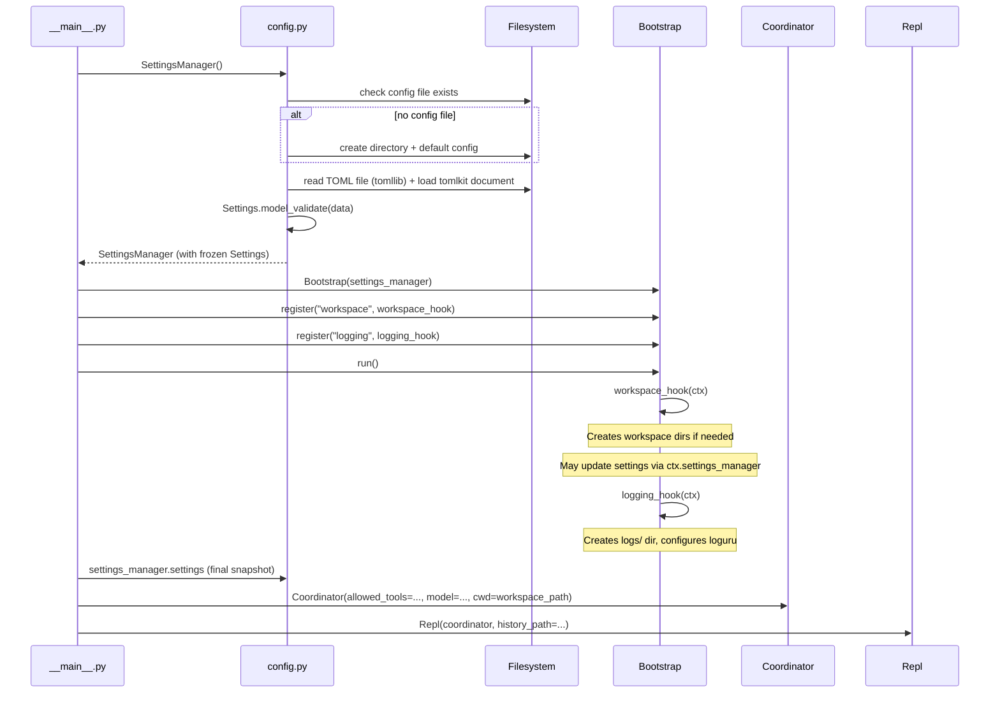
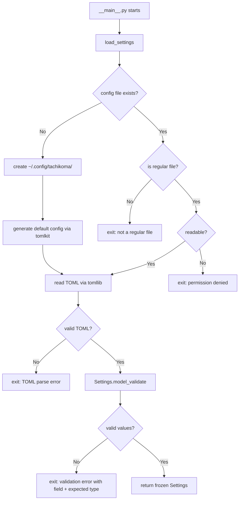

# Design: Configuration System

<!-- This design describes the current implementation approach. Updated through delta reconciliation. -->

**Feature Spec**: [../../feature-specs/configuration/config-system.md](../../feature-specs/configuration/config-system.md)
**Status**: Current

## Purpose

This document explains the design rationale for the configuration system: the modeling choices, loading flow, validation approach, and default generation mechanism.

## Problem Context

Tachikoma needs a way to manage operational parameters (workspace path, agent model, allowed tools, and future secrets like Telegram bot token) without hardcoding them across modules.

**Constraints:**
- Single-user, self-hosted deployment — enterprise-grade config management is unnecessary
- `ANTHROPIC_API_KEY` is handled natively by the Claude SDK — not managed by this system
- No environment variable overrides — a single TOML file is the sole source of truth
- Python 3.12+ required — `tomllib` is available in stdlib

## Design Overview

A single `config.py` module provides the entire configuration system: a typed Pydantic model hierarchy for validation, a loader function that reads TOML via stdlib `tomllib`, and a generator that produces a commented default config file using `tomlkit`. A `SettingsManager` class wraps the configuration system with read-write access for modules that need to update settings at runtime (e.g., bootstrap hooks persisting user-provided values).

Consumers (`__main__.py`, `Coordinator`, `Repl`) receive the frozen `Settings` instance and read values from it instead of using hardcoded defaults.

## Components

### Implementation Structure

| Layer/Component | Responsibility | Key Decisions |
|-----------------|----------------|---------------|
| `src/tachikoma/config.py` | Settings model, TOML loading, default generation, SettingsManager for read-write access | Plain Pydantic + tomllib for reading, tomlkit for writing defaults and write-back |

### Cross-Layer Contracts

At startup, `__main__.py` creates a `SettingsManager` which loads settings and supports write-back. After bootstrap completes, the final frozen `Settings` snapshot is read from the SettingsManager and passed to consumers via constructor injection. No global state.



## Modeling

The settings model is a nested hierarchy matching the TOML sections:

```
Settings (root, frozen)
├── workspace: WorkspaceSettings
│   ├── path: Path = ~/tachikoma
│   └── data_path: Path (computed property: self.path / ".tachikoma")
├── agent: AgentSettings
│   ├── model: str | None = None (SDK default)
│   ├── allowed_tools: list[str] = ["Read", "Glob", "Grep"]
│   ├── disallowed_tools: list[str] = ["AskUserQuestion"] (effective: ["AskUserQuestion", "Skill"] after system merge)
│   ├── cli_path: str | None = None (SDK bundled binary)
│   ├── session_resume_window: int = 86400 (seconds; lookup window for session resumption matching)
│   ├── session_idle_timeout: int = 900 (seconds of inactivity before auto-closing session; 0 = disabled)
│   └── env: dict[str, str] = {} (extra env vars for SDK sessions; validated: all values must be strings)
├── logging: LoggingSettings
│   ├── level: Literal["DEBUG", "INFO", "WARNING", "ERROR", "CRITICAL"] = "INFO"
│   └── console: bool = false
├── channel: Literal["repl", "telegram"] = "repl"
├── tasks: TaskSettings                        (always has default value, never None)
│   ├── idle_window: int = 300                 (seconds before session is considered idle)
│   ├── check_interval: int = 300              (session task check interval in seconds)
│   ├── max_iterations: int = 10               (max evaluator iterations for background tasks)
│   ├── max_concurrent_background: int = 3     (max parallel background tasks)
│   └── timezone: str | None = None            (IANA timezone, None = system timezone)
└── telegram: TelegramSettings | None = None
    ├── bot_token: str
    ├── authorized_chat_id: int
    └── push_notifications: bool = True   (enables post-response push via copy+delete)
```

A module-level `SYSTEM_DISALLOWED_TOOLS: frozenset[str]` constant defines tools that are always blocked regardless of user configuration. A `field_validator` on `AgentSettings.disallowed_tools` merges this set into the user value after type validation, deduplicating via `dict.fromkeys` to preserve insertion order (user entries first, then system entries). This merge is transparent to all downstream consumers — the field type remains `list[str]`.

All models use `ConfigDict(frozen=True, extra="ignore")`. Frozen prevents accidental mutation. Extra="ignore" provides forward compatibility — unknown TOML keys are silently ignored.

The `workspace.path` field stores a string in TOML but is validated into a `Path` by Pydantic. A `field_validator` calls `Path.expanduser()` to expand `~` to the home directory. The `data_path` computed property returns `self.path / ".tachikoma"` — available to any consumer of Settings, always current even after settings changes.

`SettingsManager` wraps the configuration system with read-write access:

```
SettingsManager
├── _config_path: Path (TOML file location)
├── _settings: Settings (frozen, reloaded after save)
├── _doc: tomlkit Document (in-memory TOML for write-back)
├── property settings → Settings (current frozen snapshot)
├── update(section, key, value) → modifies in-memory TOML doc (section-level)
├── update_root(key, value) → modifies in-memory TOML doc (root-level)
├── reload() → reloads frozen Settings from in-memory TOML (no file I/O)
└── save() → writes to file, reloads frozen Settings
```

New sections are added as needed (e.g., a future `secrets` section with `telegram_bot_token`).

## Data Flow

### Config loading (startup)



### Settings write-back flow

```
1. Module calls settings_manager.update(section, key, value)
2. SettingsManager validates section against Settings.model_fields
3. SettingsManager validates key against the section model's model_fields
4. Updates the in-memory tomlkit document
   - If the section table doesn't exist in the TOML document, creates it
5. Module calls settings_manager.save()
6. SettingsManager writes tomlkit document to config file (preserves comments)
7. SettingsManager reloads frozen Settings via load_settings()
8. Subsequent .settings access returns the updated snapshot
```

### CLI override flow (runtime-only)

```
1. CLI run subcommand parses flag (e.g., tachikoma run --channel telegram)
2. Module calls settings_manager.update_root("channel", "telegram")
3. SettingsManager validates key against Settings.model_fields (root level)
4. Updates the in-memory tomlkit document (root-level key)
5. Module calls settings_manager.reload()
6. SettingsManager reloads frozen Settings from in-memory TOML (no file I/O)
7. Subsequent .settings access returns the merged result (TOML + CLI override)
8. Config file is NOT modified — override is session-only
```

## Key Decisions

### Plain Pydantic BaseModel over pydantic-settings

**Choice**: Use `pydantic.BaseModel` + `tomllib` instead of `pydantic_settings.BaseSettings`
**Why**: The spec decided against environment variable overrides — a single TOML file is the sole source of truth. pydantic-settings' main value (env vars, dotenv, multiple sources) is unused. Plain Pydantic + stdlib `tomllib` achieves the same validation with fewer dependencies.
**Alternatives Considered**:
- pydantic-settings: Adds complexity for features we don't use
- dynaconf: Overkill for single-user deployment
- omegaconf: No TOML support

**Consequences**:
- Pro: Zero extra dependencies beyond pydantic (tomllib is stdlib)
- Pro: Simpler code — no source priority configuration
- Con: If env var overrides are needed later, must add pydantic-settings or handle manually

### tomlkit for default config generation

**Choice**: Use `tomlkit` to programmatically build the default config file with comments from model field metadata
**Why**: The spec requires a commented, annotated default config. `tomllib` (stdlib) is read-only. `tomli-w` can write TOML but doesn't support comments. `tomlkit` generates from model metadata — DRY and maintainable.

**Consequences**:
- Pro: Default file stays in sync with model as fields are added
- Pro: Comments derived from field descriptions — single source of truth
- Con: Adds `tomlkit` as a runtime dependency
- Note: The generator instantiates a default `AgentSettings()` instance and reads `getattr(agent_defaults, name)` instead of `field_info.default`, so the generated config reflects post-validator values (e.g., system-merged `disallowed_tools`)

### System-level tool blocking via field_validator

**Choice**: Use a `field_validator(mode='after')` on `disallowed_tools` to merge a module-level `frozenset` constant into the user-configured value
**Why**: The agent must never access certain Claude Code built-in tools (e.g., `Skill`) that shadow Tachikoma's own subsystems. A field-level validator keeps the merge logic contained within the config model — no changes needed to the Coordinator or SDK integration layer. The `frozenset` constant is extensible (future deltas can add more tools).
**Alternatives Considered**:
- Hardcode tools in the field default: Duplicates values; user overrides would remove system tools
- Merge at the Coordinator level: Scatters config logic; config consumers would see incomplete lists

**Consequences**:
- Pro: Transparent to all consumers — merged list flows through existing wiring
- Pro: Extensible — additional system-blocked tools can be added to the constant
- Con: System tools cannot be unblocked by user configuration (by design)

### SettingsManager for read-write config access

**Choice**: Add a `SettingsManager` class that wraps settings loading and provides `update()`/`save()` for write-back
**Why**: Bootstrap hooks may need to persist user-provided values. The SettingsManager uses tomlkit to read-modify-write the TOML file while preserving comments. The `.settings` property always returns a frozen `Settings` instance, preserving the immutability guarantee for consumers.
**Alternatives Considered**:
- Read-only settings + separate config writer: Splits concern but requires coordinating two objects for the same file
- Mutable Settings during bootstrap: Pydantic frozen models can't be unfrozen without hacks

**Consequences**:
- Pro: Hooks can prompt for values and persist them
- Pro: Frozen Settings guarantee preserved for all consumers
- Pro: tomlkit preserves comments in user-edited config files
- Con: Adds write responsibility to the config module

### Separate update() and save() methods

**Choice**: Separate `update()` (in-memory) and `save()` (write + reload) instead of auto-save
**Why**: Modules may batch multiple updates before writing, or update without saving if they determine the change isn't needed.

**Consequences**:
- Pro: Modules control when file I/O happens
- Pro: Multiple updates batched before a single write
- Con: Callers must remember to call save()

### Frozen settings instance

**Choice**: Use `ConfigDict(frozen=True)` on all settings models
**Why**: Configuration is loaded once at startup and consumed read-only. Freezing prevents accidental mutation and makes data flow clear.

**Consequences**:
- Pro: Prevents bugs from accidental settings mutation
- Con: For bootstrap-time changes, the SettingsManager handles reload-after-save internally while preserving the frozen guarantee for runtime consumers

### Hardcoded ~/.config over XDG_CONFIG_HOME

**Choice**: Use `~/.config/tachikoma/config.toml` directly instead of reading `XDG_CONFIG_HOME`
**Why**: For a single-user, self-hosted deployment, the added complexity of XDG support is unnecessary. The path is a module-level constant, easy to change later.

**Consequences**:
- Pro: Simpler — one known location
- Con: Users who set `XDG_CONFIG_HOME` won't have Tachikoma respect it

### extra="ignore" for forward compatibility

**Choice**: Use `ConfigDict(extra="ignore")` on all settings models
**Why**: Unknown keys are silently ignored for forward/backward compatibility. An older binary reading a newer config file (or vice versa) works without errors.

**Consequences**:
- Pro: Config files are forward and backward compatible
- Con: Typos in key names are silently ignored rather than flagged

### update_root() and reload() for CLI overrides

**Choice**: Add `update_root(key, value)` and `reload()` methods to SettingsManager for runtime-only CLI overrides
**Why**: CLI flags like `tachikoma run --channel telegram` need to override config values without modifying the TOML file. The `--channel` flag is scoped to the `run` subcommand; bare `tachikoma` invocation uses defaults. The existing `update()` only supports section-level keys. `update_root()` handles root-level fields (like `channel`), and `reload()` reapplies the frozen Settings from the in-memory TOML without file I/O.
**Alternatives Considered**:
- Mutate Settings directly: Pydantic frozen models can't be mutated
- Separate CLI config object: Duplicates logic, two sources of truth

**Consequences**:
- Pro: Single source of truth (SettingsManager) for all config values
- Pro: CLI overrides are session-only (no file persistence)
- Pro: Bootstrap and all consumers see merged result via `.settings`

### Optional TelegramSettings with required fields

**Choice**: Model `telegram` as `TelegramSettings | None = None`, where `TelegramSettings` fields are all required (no defaults)
**Why**: Telegram settings (bot token, chat ID) are secrets with no meaningful defaults. The section itself is optional (None = not configured), but when present, all fields must be provided. This prevents half-configured states.

**Consequences**:
- Pro: Clear distinction — None means "not configured", present means "fully configured"
- Pro: Pydantic validates all fields when the section exists
- Con: Bootstrap hook must prompt for missing values when channel is "telegram"

## System Behavior

### Scenario: First run — no config file

**Given**: No file at `~/.config/tachikoma/config.toml`
**When**: The application starts
**Then**: The config directory is created, a default config file with all parameters commented out and annotated is written, and the application loads with all defaults.

### Scenario: Valid config with partial settings

**Given**: A config file with only some sections populated
**When**: The application starts
**Then**: Specified values are used; missing sections use their defaults.

### Scenario: Invalid value type

**Given**: A config file with a wrong type (e.g. `workspace.path = 123`)
**When**: The application starts
**Then**: The application exits with a formatted message naming the field, expected type, and actual value.

### Scenario: Invalid TOML syntax

**Given**: A config file with malformed TOML
**When**: The application starts
**Then**: The application exits with the TOML parse error identifying the line and issue.

## Notes

- `pydantic` is a direct dependency (also transitively available via `claude-agent-sdk`)
- `tomlkit` is a runtime dependency for default config generation
- The config file location follows the XDG Base Directory Specification path (`~/.config/`) while the workspace directory defaults to `~/tachikoma`
