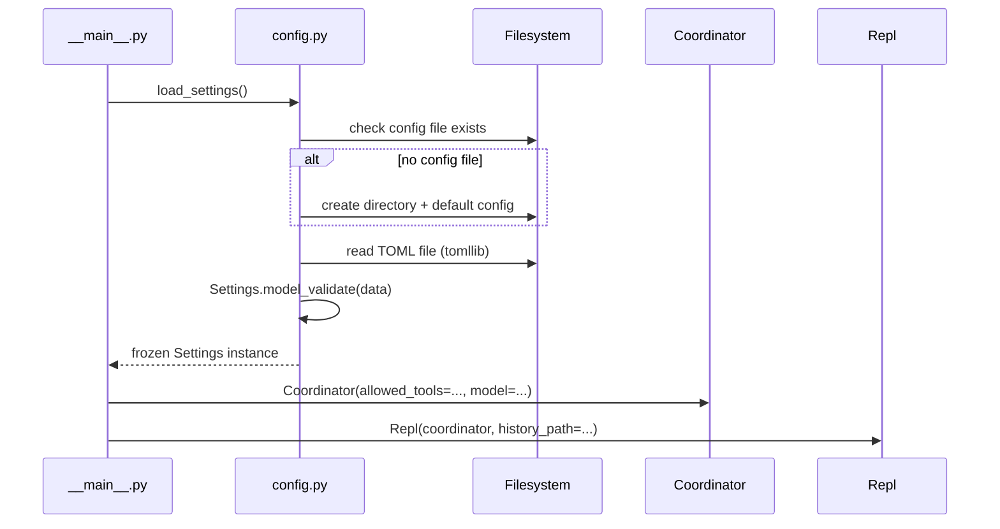
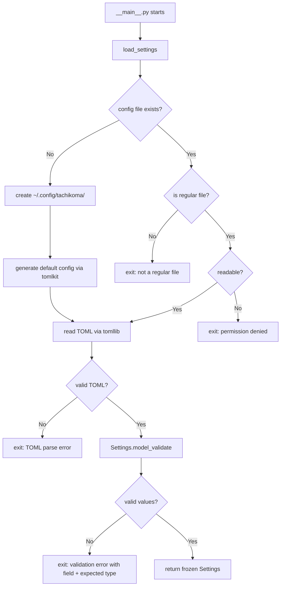

# Design: Configuration System

<!-- This design describes the current implementation approach. Updated through delta reconciliation. -->

**Feature Spec**: [../../feature-specs/configuration/config-system.md](../../feature-specs/configuration/config-system.md)
**Status**: Current

## Purpose

This document explains the design rationale for the configuration system: the modeling choices, loading flow, validation approach, and default generation mechanism.

## Problem Context

Tachikoma needs a way to manage operational parameters (workspace path, agent model, allowed tools, and future secrets like Telegram bot token) without hardcoding them across modules.

**Constraints:**
- Single-user, self-hosted deployment — enterprise-grade config management is unnecessary
- `ANTHROPIC_API_KEY` is handled natively by the Claude SDK — not managed by this system
- No environment variable overrides — a single TOML file is the sole source of truth
- Python 3.12+ required — `tomllib` is available in stdlib

## Design Overview

A single `config.py` module provides the entire configuration system: a typed Pydantic model hierarchy for validation, a loader function that reads TOML via stdlib `tomllib`, and a generator that produces a commented default config file using `tomlkit`.

Consumers (`__main__.py`, `Coordinator`, `Repl`) receive the `Settings` instance and read values from it instead of using hardcoded defaults.

## Components

### Implementation Structure

| Layer/Component | Responsibility | Key Decisions |
|-----------------|----------------|---------------|
| `src/tachikoma/config.py` | Settings model, TOML loading, default generation | Plain Pydantic + tomllib for reading, tomlkit for writing defaults |

### Cross-Layer Contracts

The `Settings` instance is created once at startup by `__main__.py` via `load_settings()` and passed to consumers via constructor injection. No global state.



## Modeling

The settings model is a nested hierarchy matching the TOML sections:

```
Settings (root, frozen)
├── workspace: WorkspaceSettings
│   └── path: Path = ~/tachikoma
└── agent: AgentSettings
    ├── model: str | None = None (SDK default)
    └── allowed_tools: list[str] = ["Read", "Glob", "Grep"]
```

All models use `ConfigDict(frozen=True, extra="ignore")`. Frozen prevents accidental mutation. Extra="ignore" provides forward compatibility — unknown TOML keys are silently ignored.

The `workspace.path` field stores a string in TOML but is validated into a `Path` by Pydantic. A `field_validator` calls `Path.expanduser()` to expand `~` to the home directory.

Future deltas add new sections as needed (e.g., a `secrets` section with `telegram_bot_token`).

## Data Flow

### Config loading (startup)



## Key Decisions

### Plain Pydantic BaseModel over pydantic-settings

**Choice**: Use `pydantic.BaseModel` + `tomllib` instead of `pydantic_settings.BaseSettings`
**Why**: The spec decided against environment variable overrides — a single TOML file is the sole source of truth. pydantic-settings' main value (env vars, dotenv, multiple sources) is unused. Plain Pydantic + stdlib `tomllib` achieves the same validation with fewer dependencies.
**Alternatives Considered**:
- pydantic-settings: Adds complexity for features we don't use
- dynaconf: Overkill for single-user deployment
- omegaconf: No TOML support

**Consequences**:
- Pro: Zero extra dependencies beyond pydantic (tomllib is stdlib)
- Pro: Simpler code — no source priority configuration
- Con: If env var overrides are needed later, must add pydantic-settings or handle manually

### tomlkit for default config generation

**Choice**: Use `tomlkit` to programmatically build the default config file with comments from model field metadata
**Why**: The spec requires a commented, annotated default config. `tomllib` (stdlib) is read-only. `tomli-w` can write TOML but doesn't support comments. `tomlkit` generates from model metadata — DRY and maintainable.

**Consequences**:
- Pro: Default file stays in sync with model as fields are added
- Pro: Comments derived from field descriptions — single source of truth
- Con: Adds `tomlkit` as a runtime dependency

### Frozen settings instance

**Choice**: Use `ConfigDict(frozen=True)` on all settings models
**Why**: Configuration is loaded once at startup and consumed read-only. Freezing prevents accidental mutation and makes data flow clear.

**Consequences**:
- Pro: Prevents bugs from accidental settings mutation
- Con: If runtime config changes are ever needed, must create a new Settings instance

### Hardcoded ~/.config over XDG_CONFIG_HOME

**Choice**: Use `~/.config/tachikoma/config.toml` directly instead of reading `XDG_CONFIG_HOME`
**Why**: For a single-user, self-hosted deployment, the added complexity of XDG support is unnecessary. The path is a module-level constant, easy to change later.

**Consequences**:
- Pro: Simpler — one known location
- Con: Users who set `XDG_CONFIG_HOME` won't have Tachikoma respect it

### extra="ignore" for forward compatibility

**Choice**: Use `ConfigDict(extra="ignore")` on all settings models
**Why**: Unknown keys are silently ignored for forward/backward compatibility. An older binary reading a newer config file (or vice versa) works without errors.

**Consequences**:
- Pro: Config files are forward and backward compatible
- Con: Typos in key names are silently ignored rather than flagged

## System Behavior

### Scenario: First run — no config file

**Given**: No file at `~/.config/tachikoma/config.toml`
**When**: The application starts
**Then**: The config directory is created, a default config file with all parameters commented out and annotated is written, and the application loads with all defaults.

### Scenario: Valid config with partial settings

**Given**: A config file with only some sections populated
**When**: The application starts
**Then**: Specified values are used; missing sections use their defaults.

### Scenario: Invalid value type

**Given**: A config file with a wrong type (e.g. `workspace.path = 123`)
**When**: The application starts
**Then**: The application exits with a formatted message naming the field, expected type, and actual value.

### Scenario: Invalid TOML syntax

**Given**: A config file with malformed TOML
**When**: The application starts
**Then**: The application exits with the TOML parse error identifying the line and issue.

## Notes

- `pydantic` is a direct dependency (also transitively available via `claude-agent-sdk`)
- `tomlkit` is a runtime dependency for default config generation
- The config file location follows the XDG Base Directory Specification path (`~/.config/`) while the workspace directory defaults to `~/tachikoma`
