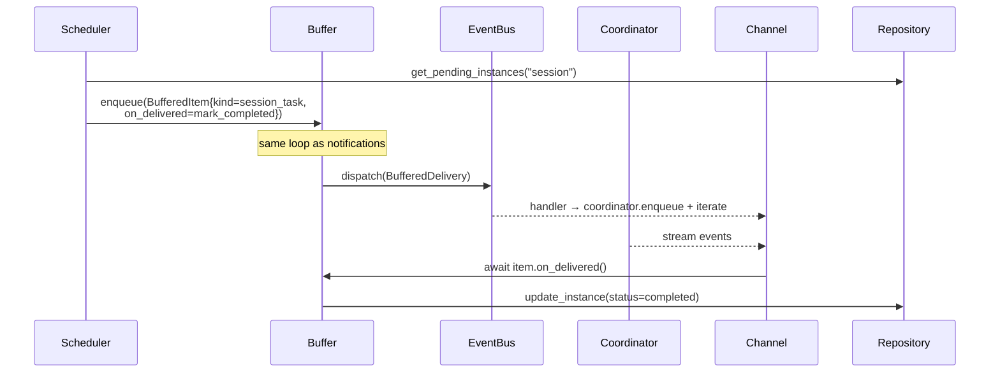
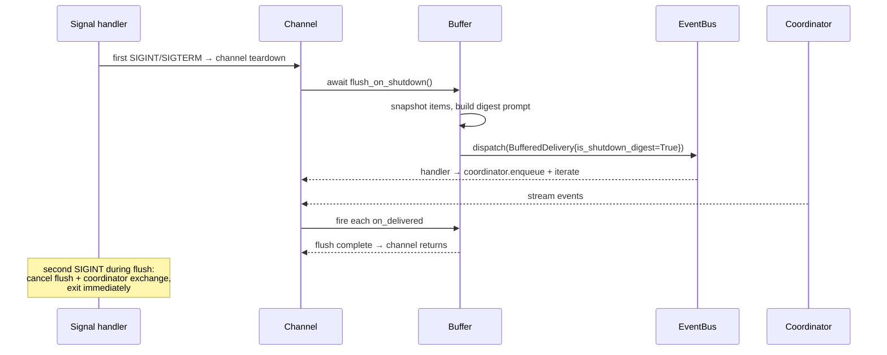

# Design: Priority Buffer

<!-- This design describes the current implementation approach. Updated through delta reconciliation. -->

**Feature Spec**: [../../feature-specs/delivery/priority-buffer.md](../../feature-specs/delivery/priority-buffer.md)
**Status**: Current

## Purpose

This document explains the design rationale for the priority buffer subsystem: the heap-backed priority queue, event-driven wake mechanism, preemption-aware front-time accounting, channel delivery contract, and shutdown-flush behavior.

## Problem Context

Background-originated items historically reached the user through two independent paths with inconsistent behavior: notifications were dispatched directly to channels (which could queue them between prompts or deliver them mid-stream), while session tasks were idle-gated by their own scheduler and silently skipped when the gate failed. The priority buffer unifies both paths so they share a single idle-gating and delivery mechanism.

**Constraints:**
- Buffered items do not persist across restarts. Session-task instances are already tracked in the database by the scheduler; notifications are ephemeral.
- Bus-based decoupling must be preserved (ADR-009) — the executor, `send_notification` MCP tool, and scheduler should not need to know about the buffer's internals.
- The coordinator's `last_message_time` and `is_busy` are the only idle signals, read from many places.
- Python/asyncio is single-threaded per event loop — exploit this for race-free transition detection without locks.

**Interactions:**
- Bus (ADR-009): subscribes to `Notification` and `CoordinatorIdle`; dispatches `BufferedDelivery`
- Scheduler (session-task-execution): calls `buffer.enqueue()` directly for session tasks
- Coordinator (core-architecture): reads `last_message_time` and `is_busy`; dispatches `CoordinatorIdle` on busy→idle transitions
- Channels (terminal-repl, telegram): subscribe to `BufferedDelivery` and route prompts through the coordinator; invoke `buffer.flush_on_shutdown()` in their `run()` teardown

## Design Overview

A **Buffer subsystem** (`src/tachikoma/buffer/`) owns a priority queue of pending deliveries and a single asynchronous loop that wakes only when something could change the outcome: a new item is enqueued, the coordinator transitions busy→idle, or a per-cycle timer fires for the next actionable moment.

The buffer is fed two ways:
- **Notifications**: the buffer subscribes to the existing `Notification` event on the bus. All producers (the background-task executor, the agent-driven `send_notification` MCP tool, and the detached-process exit watcher) dispatch to the bus without knowing about the buffer.
- **Session tasks**: the scheduler calls `buffer.enqueue(...)` directly. This lets the scheduler hand the `on_delivered` callback straight to the buffer item, and removes the scheduler's own idle gate.

Delivery goes through a new `BufferedDelivery` event. Channels subscribe once and handle both single-item and shutdown-digest deliveries through the same code path.

The coordinator gains a small responsibility: dispatch a `CoordinatorIdle` event exactly once on each busy→idle transition. This is the buffer's primary wake source.

On graceful shutdown, each channel calls `buffer.flush_on_shutdown()` in its `run()` teardown (before the channel's bus subscription is torn down). The buffer builds a single digest message from all pending items and routes it through the normal delivery path. A second SIGINT during flush cancels the flush and the in-flight coordinator exchange.

## Components

### Implementation Structure

| Layer/Component | Responsibility | Key Decisions |
|-----------------|----------------|---------------|
| `buffer.buffer.Buffer` | Owns priority queue, loop task, per-item front-time state, delivery dispatch | `heapq` for ordering; single loop task; event-driven wake via `asyncio.Event` + cancellable timer |
| `buffer.items.BufferedItem` | Dataclass model for queued items with `from_notification` and `from_session_instance` factories | Unified model with `kind` discriminator; optional `on_delivered` callback |
| `buffer.priority.Priority` | `IntEnum`: `URGENT=1`, `NORMAL=2`, `LOW=3` | Lives in its own module so `notifications.py` can import `Priority` without a circular dependency on the buffer package |
| `buffer.events.BufferedDelivery` | Event dispatched when an item (or shutdown digest) should reach the user | Unified event for single-item and shutdown-digest delivery, with `is_shutdown_digest` flag |
| `buffer.events.CoordinatorIdle` | Event dispatched by coordinator on busy→idle transition | Lives under `buffer.events` because it exists to serve the buffer |
| `buffer.digest.build_shutdown_digest` | Module-level function building the combined shutdown digest prompt with preamble + per-item sections | Easy to unit-test independently of the buffer |
| `buffer.factory.create_and_start_buffer` | Constructs the buffer, subscribes `Notification` and `CoordinatorIdle` handlers, starts the loop task | Called from `__main__.py` after the coordinator is created (not a DES-003 bootstrap hook because bus and coordinator are created post-bootstrap) |
| `config.BufferSettings` | Per-priority timing configuration | Pydantic model with spec-table defaults (Urgent 30/120, Normal 120/900, Low 300/None) |
| `coordinator.Coordinator` | Dispatches `CoordinatorIdle` on busy→idle transitions; exposes `is_busy` public property | `_was_busy` flag + `_maybe_emit_idle()` helper invoked at busy-changing sites |
| `notifications.Notification` | Existing event; gains `priority: Priority` field (default Normal) | Backward-compatible for existing callers; threaded through `dispatch_notification()` and `send_notification` MCP tool |
| `tasks.scheduler.session_task_scheduler` | Refactored to call `buffer.enqueue()` directly; idle-gate removed | Takes `buffer: Buffer` parameter instead of a bus reference |

### Cross-Layer Contracts

**Buffer public API:**

```
class Buffer:
    def __init__(self, bus: EventBus, coordinator: Coordinator, settings: BufferSettings): ...
    async def start(self) -> None          # spawn loop task
    async def stop(self) -> None           # cancel loop task; drain
    async def enqueue(self, item: BufferedItem) -> None   # used by scheduler; also used internally from Notification handler
    async def flush_on_shutdown(self) -> None             # snapshot + dispatch digest + await completion
```

Subscription wiring is done by `create_and_start_buffer()` (the factory), not by the Buffer class itself — keeps Buffer focused on queue/loop mechanics.

**Coordinator addition** — synchronous helper invoked at busy-changing sites to dispatch `CoordinatorIdle` exactly once per transition:

```python
def _maybe_emit_idle(self) -> None:
    is_busy_now = self.is_busy
    if self._was_busy and not is_busy_now:
        asyncio.create_task(self._bus.dispatch(CoordinatorIdle(timestamp=datetime.now(UTC))))
    self._was_busy = is_busy_now
```

Invocation sites:
1. End of `send_message()` — placed after `_pending_msg_task` is created (not in `finally`) to avoid a transient false-idle window between `_client = None` and task creation.
2. `_pending_msg_task.add_done_callback(lambda t: self._maybe_emit_idle())` — ensures the check runs when the background task completes even with no new `send_message()`.
3. After `enqueue()` — state capture only (resyncs `_was_busy=True`); never emits because the transition is idle→busy.
4. Coordinator `__aenter__` initializes `_was_busy=False` — startup is idle by convention.

**Channel handler contract:**

The handler spawns a detached `asyncio.Task` for the delivery work and returns immediately, freeing the EventBus to process other events. The task acquires the delivery lock, processes through the coordinator, fires callbacks, and resolves shutdown in a `finally` block.

```python
async def _handle_buffered_delivery(self, event: BufferedDelivery) -> None:
    # Spawns a detached task; returns immediately so the bus is freed
    task = asyncio.create_task(self._deliver(event))
    self._delivery_tasks.add(task)
    task.add_done_callback(self._delivery_tasks.discard)

async def _deliver(self, event: BufferedDelivery) -> None:
    try:
        async with self._delivery_lock:
            # 1. coordinator.enqueue(TextMessage(text=event.prompt, pinned_skills=event.pinned_skills()))
            # 2. async for ev in coordinator.send_message(): render(ev)
            # 3. For each item: if item.on_delivered: await item.on_delivered()
    except Exception:
        # 4. Log error; callbacks skipped on failure
    finally:
        if event.is_shutdown_digest:
            buffer.resolve_shutdown()  # ensures flush_on_shutdown completes
```

The envelope wrapping at step 1 follows the coordinator's typed-envelope contract ([DES-013](../../design/DES-013-typed-envelope-with-property-hooks.md)) — `BufferedDelivery` consumers (Telegram and REPL today) construct `TextMessage` envelopes at the coordinator boundary, threading the delivery's prompt and pinned skills through the envelope's hooks.

**Integration Points:**
- Buffer ↔ Bus: subscribes to `Notification` and `CoordinatorIdle`; dispatches `BufferedDelivery`
- Buffer ↔ Coordinator: reads `last_message_time` and `is_busy` for eligibility checks
- Buffer ↔ Scheduler: scheduler calls `buffer.enqueue()` directly (no bus round-trip for session tasks)
- Buffer ↔ Channels: `BufferedDelivery` subscription; channel calls `buffer.flush_on_shutdown()` in `run()` teardown

**Error contract:**
- Buffer loop errors: caught, logged via `_log.exception`, loop continues on next cycle
- Flush errors: caught by the channel's `run()` teardown, logged, channel returns normally so the bootstrap can still close the coordinator

## Modeling

```
Priority (IntEnum)
├── URGENT = 1    (front of queue; FIFO within tier)
├── NORMAL = 2    (middle; FIFO within tier)
└── LOW    = 3    (back; FIFO within tier)

BufferedItem
├── priority: Priority
├── prompt: str
├── kind: "notification" | "session_task"
├── source_id: str | None
├── metadata: dict                    # e.g. {"instance": TaskInstance} for session tasks
├── on_delivered: Callable[[], Awaitable[None]] | None
├── arrival_seq: int                  # monotonic within process lifetime
├── total_front_time: float           # accumulated across preemptions
└── current_front_since: datetime | None

Heap key: (priority.value, arrival_seq)
    → Urgent sorts before Normal; Normal before Low
    → Within a tier, earlier arrival_seq sorts first
```

**Why `heapq` over `asyncio.PriorityQueue`**: the buffer needs to peek at the front without popping (to decide whether the front is deliverable), which `PriorityQueue` does not expose. `heapq` with explicit list access handles this cleanly, and the loop is the only reader/writer (no concurrency concerns within a single event loop).

**Mutable item state and heap invariants**: `total_front_time` and `current_front_since` are mutated in place while the item sits in the heap. Safe because those fields are not part of the heap key — sort order depends only on `(priority.value, arrival_seq)`, both immutable.

**Item lifecycle:**

```
          enqueue
            │
            ▼
     ┌───────────┐           preempted
     │  queued   │◄───────────────────────┐
     └─────┬─────┘                        │
           │ becomes front                │
           ▼                              │
     ┌───────────┐   new higher-priority  │
     │  fronted  │───── item enqueued ────┘
     └─────┬─────┘
           │ eligible + coordinator idle
           ▼
     ┌───────────┐
     │ delivered │  → on_delivered callback (if set) → removed
     └───────────┘
```

## Data Flow

### Normal notification delivery

```mermaid
sequenceDiagram
    participant Exec as Executor / MCP tool
    participant Bus as EventBus
    participant Buf as Buffer
    participant Coord as Coordinator
    participant Ch as Channel

    Exec->>Bus: dispatch(Notification{prio=Normal})
    Bus-->>Buf: Notification handler
    Buf->>Buf: enqueue(BufferedItem); wake_event.set()
    Note over Buf: loop wakes, front=item,<br/>not idle enough → schedule timer<br/>(last_message_time + 2min)
    Note over Coord: user inactive for 2min
    Coord-->>Bus: CoordinatorIdle (from earlier busy→idle)
    Bus-->>Buf: CoordinatorIdle handler → wake_event.set()
    Buf->>Buf: loop wakes, eligible → dispatch BufferedDelivery
    Bus-->>Ch: BufferedDelivery handler
    Ch->>Coord: enqueue(prompt) + iterate send_message()
    Coord-->>Ch: stream events → render
    Coord->>Bus: CoordinatorIdle (next busy→idle transition)
```

### Session-task delivery



### Preemption (Normal fronted, Urgent arrives)

```mermaid
sequenceDiagram
    participant A as Normal item (A)
    participant Buf as Buffer
    participant B as Urgent item (B)

    Note over A,Buf: A is front; current_front_since = T0
    Note over Buf: timer scheduled for idle window
    B->>Buf: enqueue(Urgent)
    Buf->>A: leaves front:<br/>total_front_time += now - T0
    Buf->>B: becomes front: current_front_since = now
    Note over Buf: cancel old timer, schedule new one<br/>using B's idle window (30s)
    Note over Buf: later, B delivered and removed
    Buf->>A: returns to front:<br/>current_front_since = now (fresh idle window)<br/>total_front_time preserved (max-hold accumulates)
```

### Graceful shutdown flush



## Key Decisions

### Event-driven wake via `asyncio.wait(FIRST_COMPLETED)` + cancellable timer

**Choice**: A single `asyncio.Event` acts as the "wake flag" — set by the `Notification` handler, the `CoordinatorIdle` handler, and `enqueue()`. A second task wrapping `asyncio.sleep(delta)` serves as the max-hold / idle-window timer. The loop awaits `asyncio.wait({wake_event_task, timer_task}, return_when=FIRST_COMPLETED)`, cancels the loser, and awaits it to drain `CancelledError`.

**Why**: Avoids interval polling. Wakes exactly when something actionable changes. The clear-before-work idiom on `Event` prevents signal coalescing — `wait()` returns immediately if `set()` was called since the last `clear()`.

**Consequences**:
- Pro: No CPU used while waiting; immediate response to state changes.
- Pro: Deterministic single-loop model, easy to reason about and test.
- Con: Slightly more code than polling (two tasks to manage per cycle).
- Con: Timer cancellation requires care — must await the cancelled task to drain `CancelledError`.

### `CoordinatorIdle` event on the bus (not a coordinator callback)

**Choice**: Coordinator dispatches a typed `CoordinatorIdle` event via the existing `bubus.EventBus` on each busy→idle transition. The buffer subscribes.

**Why**: ADR-009 standardized the bus for inter-subsystem signalling. Using it here preserves decoupling — any future consumer (diagnostics, scheduler UI) can subscribe without coordinator code changes. Emission is exactly-once per transition via a `_was_busy` bool, safe under asyncio's single-threaded execution.

**Consequences**:
- Pro: Loosely coupled; additional consumers trivial.
- Con: Requires careful instrumentation of every busy-state-changing site — centralized via `_maybe_emit_idle()`.

### Buffer subscribes to `Notification`; scheduler calls buffer directly

**Choice**: Asymmetric integration. The buffer subscribes to the existing `Notification` event. The session-task scheduler is refactored to call `buffer.enqueue()` directly; `SessionTaskReady` is retired.

**Why**:
- Notifications come from many places (executor failure paths, MCP tool closures in each background-task process). Forcing each to depend on the buffer would thread the buffer reference through many call sites. Bus subscription preserves loose coupling.
- Session tasks have exactly one producer (the scheduler). Direct coupling is simpler than round-tripping through the bus, and the scheduler must pass an `on_delivered` callback that is more naturally embedded in the `BufferedItem` than carried through an event.
- `SessionTaskReady` has no consumer outside the channels once the buffer takes over; retiring it reduces dead surface area.

**Consequences**:
- Pro: Minimal changes to notification producers; cleaner scheduler.
- Con: Asymmetry between the two feeder paths — documented in code.

### Unified `BufferedItem` with `kind` discriminator (not a protocol)

**Choice**: Single concrete dataclass with a `kind` field and an optional `on_delivered` callback. Channels switch on `kind` for rendering chrome if they need to.

**Why**: The two current item types share 90% of fields and lifecycle — the only real difference is whether a completion callback runs. A protocol with two implementations would add ceremony without separation. The discriminator keeps extension straightforward (add a new literal value, new chrome in channels).

**Consequences**:
- Pro: Trivial to add new item kinds (webhook delivery, proactive prompts).
- Con: Channels need a match/if-elif on `kind`; acceptable for 2–4 kinds, would warrant revisiting at higher counts.

### Shutdown flush as a single `BufferedDelivery` with `is_shutdown_digest=True`

**Choice**: One combined `BufferedDelivery` event carrying all pending items and a preamble. Channel routes it through the coordinator as a normal delivery; callbacks fire on completion.

**Why**: Reuses the existing delivery path — no separate channel code for shutdown. The preamble gives the agent the context it needs to summarize the dump rather than act on each item individually. One combined turn avoids thrashing the coordinator with N exchanges during shutdown.

**Consequences**:
- Pro: Minimal code path reuse; one flag to check in the channel.
- Pro: Agent gets one context-rich prompt it can summarize.
- Con: No grace-window bound — shutdown can hang on a slow model response until a second SIGINT.

### Second-SIGINT force-exit scoped to the flush window

**Choice**: No global signal handler from `__main__.py`. Each channel's first-SIGINT handler continues to tear down input normally. When the channel's `run()` reaches its flush phase, it installs a one-shot signal handler via `loop.add_signal_handler` scoped to the flush window; on first SIGINT during flush it cancels the flush task plus the coordinator's active send via `coordinator.interrupt()`, then re-raises `KeyboardInterrupt`. Removed on flush completion.

**Why**: Avoids collision with Telegram's existing `loop.add_signal_handler` (last-writer-wins) during normal operation. Keeps signal ownership with the channel. The flush window is the only period needing second-SIGINT semantics, so the scope is minimal.

**Consequences**:
- Pro: Surgical change; channels retain signal ownership during their normal lifecycle.
- Pro: User retains a clean "abandon ship" escape during flush.
- Con: Second SIGINT during flush leaves session-task instances in `running` state — the task subsystem's crash-recovery hook heals these on next start.

### `heapq` list + monotonic `arrival_seq` for priority ordering

**Choice**: Plain `list[BufferedItem]` maintained as a heap via `heapq.heappush`/`heapq.heappop`, ordered by `(priority.value, arrival_seq)`.

**Why**: `heapq` gives O(log n) insert and O(1) front-peek. `arrival_seq` guarantees FIFO-within-tier deterministically. Standard library, no dependency.

**Consequences**:
- Pro: Zero deps; simple; easy to test.
- Con: Individual-item state (front-time) lives outside the heap order — fine because it only matters for the front item.

### Factory wiring instead of DES-003 bootstrap hook

**Choice**: The buffer is constructed and started by `create_and_start_buffer()` in `__main__.py`, not by a DES-003 bootstrap hook.

**Why**: The buffer depends on both the `EventBus` and the `Coordinator`, and both of those are created in `__main__.py` after bootstrap runs. A bootstrap hook would either need both references threaded through the bootstrap context (defeating the hook's encapsulation) or would need to run post-bootstrap (which is exactly what the factory does, without the hook ceremony).

**Consequences**:
- Pro: Keeps wiring in the place where the dependencies already exist.
- Con: One-off deviation from the DES-003 pattern; mitigated by being the same shape (small factory function, subscriptions + start).

## System Behavior

### Scenario: Normal notification during active conversation

**Given**: User just sent a message 10s ago; a background task dispatches `Notification(priority=Normal)`.
**When**: The notification handler runs.
**Then**: Item enqueued; buffer wakes; coordinator is busy (or will be). Buffer schedules a timer for `last_message_time + 2min`. On the next `CoordinatorIdle`, if the idle window is satisfied, the item is delivered; otherwise the timer reschedules.

### Scenario: Urgent notification preempts Normal

**Given**: Normal item A has been at the front for 45s of a 120s idle window.
**When**: Urgent item B is enqueued.
**Then**: A's `current_front_since` is accumulated into `total_front_time` (45s) and cleared. B becomes front with fresh `current_front_since`. The old timer is cancelled and rescheduled for B's 30s idle window. When B delivers and is removed, A returns to front; `current_front_since` resets but `total_front_time=45s` persists — max-hold countdown continues.

### Scenario: Low-priority item holds indefinitely

**Given**: Low item is front; no higher-priority item arrives; user is continuously active.
**When**: Time passes.
**Then**: Timer only watches idle-window completion (max_hold is `None` for Low). Item waits forever until idle-window satisfied.

### Scenario: Max-hold fires while coordinator is busy

**Given**: Normal item is front; `total_front_time` reached 900s; coordinator is mid-response to the user.
**When**: Max-hold timer fires.
**Then**: Loop wakes, evaluates eligibility. `is_busy` is True → not eligible. Do not reschedule. Wait for next `CoordinatorIdle`. When that fires, re-evaluate: `total_front_time` already past max-hold → dispatch delivery.

### Scenario: `last_message_time` is None at startup

**Given**: Process just started; no messages exchanged; item enqueued immediately.
**When**: Loop evaluates eligibility.
**Then**: Idle-window is satisfied (`last_message_time is None` treated as inherently idle). If the coordinator is not busy, the item is delivered immediately. If the coordinator is busy, delivery waits for the next busy→idle transition.

### Scenario: Shutdown flush with mid-response coordinator

**Given**: User triggered a long-running exchange; response is still streaming. SIGTERM arrives; channel's existing signal handler initiates teardown.
**When**: Channel calls `buffer.flush_on_shutdown()` in its teardown phase.
**Then**: Buffer dispatches `BufferedDelivery`. The channel's handler (still subscribed) picks it up. If the coordinator is still processing the user's exchange, the channel's normal concurrency guard queues the digest; the ongoing processing drains the digest after the user's exchange completes. Completion resolves the flush future; the channel returns from `run()`; bootstrap proceeds to coordinator close.

### Scenario: Second SIGINT during flush

**Given**: Flush is in progress (coordinator processing digest).
**When**: User Ctrl+C's again.
**Then**: Flush-scope signal handler fires: cancels the flush task and the coordinator's current exchange task, then re-raises `KeyboardInterrupt`. Running session-task instances remain in `running` state in DB for crash recovery.

### Scenario: Buffer loop encounters an unhandled exception

**Given**: Loop body raises (e.g., bus dispatch error).
**When**: Exception propagates inside the loop.
**Then**: Caught at the outer `try/except Exception`; logged via `_log.exception`; loop continues at the next iteration.

## Notes

- `Priority` lives in `buffer.priority` specifically so `notifications.py` can import it without a circular dependency on the rest of the buffer package.
- The pattern of "loop task + wake event + cancellable timer" is reusable; if a second subsystem needs the same shape, consider extracting a helper — not for this feature.
- Shutdown-flush lives inside `channel.run()` rather than in bootstrap teardown because the channel's `BufferedDelivery` subscription must still be active to drain the digest through the coordinator. `Coordinator.__aexit__` runs afterwards in the normal bootstrap exit path; no ordering change to `__aexit__` required.
