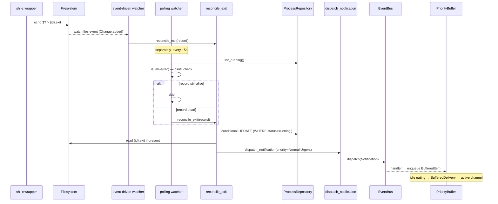
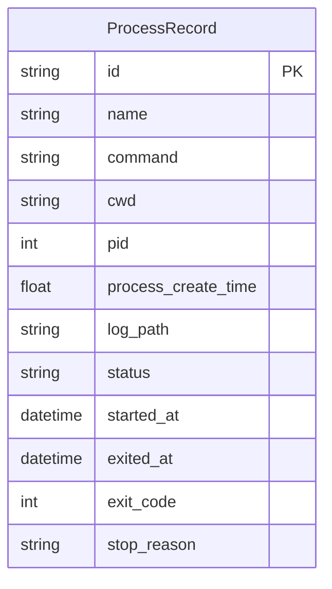
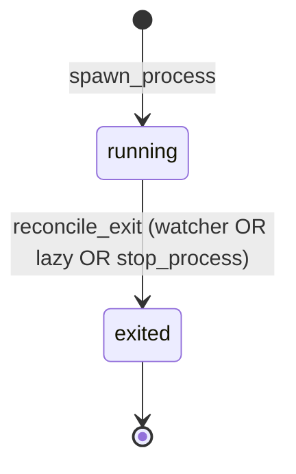

# Design: Process Supervision

<!-- This design describes the current implementation approach. Updated through delta reconciliation. -->

**Feature Spec**: [../../feature-specs/detached-processes/process-supervision.md](../../feature-specs/detached-processes/process-supervision.md)
**Status**: Current

## Purpose

This document explains the design rationale for supervising detached OS shell commands: the identity/liveness mechanism, exit-code capture, hybrid exit watcher, signalling strategy, and integration with the shared persistence and notification subsystems. Tachikoma here is a lightweight process supervisor — spawned processes have no Claude/SDK involvement.

## Problem Context

The agent needs to spawn OS-level shell commands that survive Tachikoma's own exit, restart, or crash, and later query their status, read their logs, or stop them without shelling in.

**Constraints:**
- Shared SQLite via the `Database` class (ADR-007) is the persistence layer — new tables share the same `Base(DeclarativeBase)` and `async_sessionmaker`
- Bootstrap hooks (DES-003) are the initialization mechanism
- MCP tools follow the SDK MCP Tool Server Factory pattern (DES-006)
- Notifications flow through `tachikoma.notifications.dispatch_notification` onto the event bus (ADR-009); the priority buffer idle-gates delivery
- Running processes must survive parent crash — no reliance on the parent being alive for process lifetime
- PID reuse is a real concern: a naive `os.kill(pid, 0)` check can hit a recycled PID
- POSIX-only (Linux + macOS) is acceptable; Windows is out of scope

**Interactions:**
- `ProcessRepository` ↔ `Database`: shares `Base` and the async session factory
- Bootstrap: `detached_processes_hook` runs after `database_hook`, creates the log directory, instantiates the repo, and reconciles crash-recovery records
- Coordinator: the detached-process MCP server is merged into `all_mcp_servers` alongside `task-tools` and `workflow-tools`
- Event bus (ADR-009): exit watcher calls `dispatch_notification`, producing `Notification` events
- Priority buffer: subscribes to `Notification`; this subsystem is just another producer, no bespoke delivery path

## Design Overview

A `tachikoma.detached_processes` subsystem owns a `ProcessRepository` (async SQLAlchemy, mirroring `TaskRepository`'s shape), spawn/terminate/liveness helpers, a six-tool MCP server (DES-006), and an exit watcher.

Detachment uses a single `asyncio.create_subprocess_exec("sh", "-c", wrapper, ..., start_new_session=True)` call. The wrapper wraps the user's command so it captures the exit code to a sidecar file:

    sh -c '<user command>; echo $? > {id}.exit'

Identity is a pair: the child's PID and its OS-reported creation time, read via `psutil.Process(pid).create_time()` at spawn. That pair protects against PID reuse — PID alone cannot identify the process we launched.

Exit detection is hybrid:
- **Primary — event-driven**: `watchfiles.awatch()` on the per-process log directory. When the wrapper writes `{id}.exit`, the event fires within milliseconds.
- **Fallback — periodic**: a ~5s loop lists `running` records and checks each via `psutil` liveness. Catches cases where the wrapper itself died without writing the sidecar (e.g. external SIGKILL of the wrapper).

Both paths share a single `reconcile_exit(record)` reconciler that reads the sidecar when present, updates the record (via a conditional `UPDATE ... WHERE status='running'` so concurrent reconcilers converge to a single winner), and dispatches a notification with Normal priority on exit code 0 or Urgent on non-zero / unknown.

All MCP tool paths that touch a record (`list_processes`, `get_process`, `read_process_output`, `stop_process`) run the same liveness check inline as lazy reconciliation — this keeps record state consistent even if both watcher paths missed the event.

## Components

### Implementation Structure

| Layer/Component | Responsibility | Key Decisions |
|-----------------|----------------|---------------|
| `src/tachikoma/detached_processes/__init__.py` | Public API re-exports | Clean package boundary |
| `src/tachikoma/detached_processes/model.py` | `ProcessRecord` frozen dataclass; `ProcessRecordRow` ORM model; `ProcessStatus` constant map | Domain types frozen; ORM internal; `process_create_time` (OS anchor) deliberately named differently from `started_at` (wall-clock persistence timestamp) |
| `src/tachikoma/detached_processes/repository.py` | `ProcessRepository` — async CRUD over `ProcessRecordRow`: `create`, `get`, `list_running`, `list_exited`, `update`, `delete`, `reconcile_to_exited` (conditional UPDATE), `mark_stop_initiated`, `clear_stop_reason` | Shared `async_sessionmaker` from `Database`; wraps exceptions in `ProcessRepositoryError`; `reconcile_to_exited` returns a boolean so racing reconcilers can detect their loss; `mark_stop_initiated`/`clear_stop_reason` manage the `stop_reason` field for agent-initiated stop tracking |
| `src/tachikoma/detached_processes/errors.py` | `ProcessRepositoryError` | Mirrors `TaskRepositoryError` shape |
| `src/tachikoma/detached_processes/spawn.py` | `spawn_process(...)` (wrapper build, subprocess, identity capture, persistence, DB-failure cleanup); `terminate(...)` (process-group signalling with escalation); `is_alive(record)` | Uses `psutil` for identity + liveness; `os.killpg` + `os.getpgid` for group signalling; kept outside the repository so tests can stub spawn behavior |
| `src/tachikoma/detached_processes/log_io.py` | `read_tail(path, n)` / `read_window(path, offset, count)` for serving logs | Reverse-seek chunked reader for tail (no full-file load); sequential line scan for paged reads |
| `src/tachikoma/detached_processes/reconcile.py` | `reconcile_exit(record, *, repository, bus, log_dir, dispatch_notification=True)` — shared reconciler | Conditional UPDATE for race resolution; `status=="running"` guard for idempotency; single 100ms retry on missing sidecar; suppresses notification when `stop_reason=="agent_stopped"` (agent-initiated stop); `bus: EventBus \| None` with precondition that `bus is not None or not dispatch_notification` so the bootstrap path can pass `None` |
| `src/tachikoma/detached_processes/watcher.py` | `event_driven_watcher(repository, bus, log_dir)` over `watchfiles.awatch`; `polling_watcher(repository, bus, log_dir, interval)` every `DETACHED_PROCESS_POLL_INTERVAL=5s` | Plain async functions started as `asyncio.Task`s in `scheduler_tasks`; mirror existing scheduler-task shape; per-record error isolation |
| `src/tachikoma/detached_processes/tools.py` | `create_detached_process_tools_server(repository, bus, log_dir, timezone)` factory — six `@tool`-decorated closures over extracted handlers | Pydantic arg model per tool; factory closures capture dependencies; every handler operating on a record runs `is_alive` + `reconcile_exit` before its main action (lazy reconciliation) |
| `src/tachikoma/detached_processes/hooks.py` | `detached_processes_hook(ctx)` — DES-003 bootstrap hook | Creates log dir; instantiates repo from `ctx.extras["database"]`; runs crash recovery via `list_running()` + `reconcile_exit(..., bus=None, dispatch_notification=False)` for dead records; stores repo and log_dir in `ctx.extras` |
| `src/tachikoma/__main__.py` | Register the hook; build the tool server; merge into `all_mcp_servers`; start both watcher tasks in `scheduler_tasks` | Identical pattern to how `task-tools` and task scheduler tasks are wired |
| `src/tachikoma/context/loading.py` (`SYSTEM_PREAMBLE_TEMPLATE`) | Add a "Detached Processes" section listing the six tools with one-line descriptions | Appended after the Tasks section, static content |
| `pyproject.toml` | Add `psutil>=6.0` to `[project].dependencies` | `watchfiles` already present |

### Cross-Layer Contracts

**Tool server contract (DES-006 shape):**

```
start_process(name, command, cwd?, env?) -> {id, pid, log_path}
list_processes(archived?) -> [{id, name, command, pid, cwd, started_at, status, ...}]
get_process(id) -> {...full record fields...}
read_process_output(id, offset?, count?) -> [log lines] | "no output yet"
stop_process(id, signal?, timeout?) -> status message
rename_process(id, name) -> status message
```

All tool errors return `{"is_error": True, "content": [{"type": "text", "text": <msg>}]}`. `ProcessRepositoryError` is caught specifically to surface root cause via `__cause__`; other errors use a generic fallback.

**Watcher ↔ reconciler ↔ notifications ↔ buffer:**



**Integration Points:**
- Repo ↔ Database: shared `async_sessionmaker`, shared `Base`
- Hook ↔ Repo: hook stores repo and log_dir in `ctx.extras` (`"process_repository"`, `"detached_process_log_dir"`)
- Tool server ↔ Bus: factory receives `bus`; tool closures never dispatch directly — only `reconcile_exit` dispatches (invoked from watchers and lazy reconciliation)
- Watchers ↔ reconciler: both watchers use the same `reconcile_exit`; the re-fetch + `status=="running"` guard ensures idempotency
- Tool handlers ↔ reconciler: every tool that operates on a record runs a liveness check and calls `reconcile_exit` for records that have died, keeping state consistent

**Error contract:**
- Tool errors: MCP-style `{"is_error": True, ...}`; `ProcessRepositoryError` surfaces its `__cause__`
- Watcher errors: caught per-record; logged via `_log.exception`; loops continue
- Spawn failures (child never ran): tool returns clear error; no record persisted
- Post-spawn DB failure: child process group sent `SIGKILL`; error surfaced to tool

## Modeling

### ProcessRecord

```
ProcessRecord (frozen dataclass)
├── id: str                         (UUID)
├── name: str                       (display label, non-unique)
├── command: str                    (original user command string)
├── cwd: str                        (absolute path)
├── pid: int                        (OS pid of the wrapper shell)
├── process_create_time: float      (psutil.Process.create_time(); identity anchor)
├── log_path: str                   (absolute path)
├── status: str                     ("running" or "exited")
├── started_at: datetime            (wall-clock UTC, set at spawn)
├── exited_at: datetime | None      (UTC; set on reconciliation)
├── exit_code: int | None           (None when wrapper died before sidecar)
└── stop_reason: str | None         ("agent_stopped" when stop_process initiated; None for natural exits)
```

### Entity



No foreign keys — detached processes are standalone records, independent of tasks and sessions.

### Status lifecycle



There is deliberately no intermediate `stopping` state — `stop_process` either reconciles immediately (already dead) or sends a signal + reconciles after polling.

## Data Flow

### Spawn flow

```
1. Agent calls start_process({name, command, cwd?, env?})
2. Handler validates: name/command non-empty; cwd exists when provided; log dir writable
3. Handler assigns id = uuid4()
4. exit_path = log_dir / f"{id}.exit"; log_path = log_dir / f"{id}.log"
5. wrapper = f"{command}; echo $? > {quoted exit_path}"
6. Open log_path in "ab"; pass the fd as stdout
7. asyncio.create_subprocess_exec("sh", "-c", wrapper,
       stdin=DEVNULL, stdout=fd, stderr=STDOUT,
       start_new_session=True,
       env={**os.environ, **(env or {})},
       cwd=cwd_or_tachikoma_cwd)
8. process_create_time = psutil.Process(proc.pid).create_time()   # synchronously after spawn
9. Persist ProcessRecord(status="running", ...)
    On DB failure: os.killpg(os.getpgid(proc.pid), SIGKILL); re-raise
10. Return {id, pid, log_path}
```

### Exit detection — event-driven path

```
1. wrapper finishes user cmd → shell writes echo $? > {id}.exit
2. watchfiles.awatch emits Change.added for {id}.exit
3. event_driven_watcher parses id from filename
4. repository.get(id) → record
5. reconcile_exit(record)
```

### Exit detection — fallback polling path

```
Every 5s:
  for record in repository.list_running():
      if not is_alive(record):
          await reconcile_exit(record)
```

### Lazy reconciliation (tool-call path)

Every tool that operates on an existing record:

```
for each record in scope:
    if record.status == "running" and not is_alive(record):
        await reconcile_exit(record)
    proceed with tool-specific logic using reconciled record
```

### Crash recovery (bootstrap)

```
detached_processes_hook:
  - mkdir -p {workspace}/.tachikoma/detached-processes/
  - repository = ProcessRepository(database.session_factory)
  - for record in await repository.list_running():
      if not is_alive(record):
          await reconcile_exit(record, bus=None, dispatch_notification=False)
  - ctx.extras["process_repository"] = repository
  - ctx.extras["detached_process_log_dir"] = log_dir
```

Notifications are suppressed during startup — a user rebooting Tachikoma shouldn't receive a barrage of Urgent notifications for workers that died days ago.

### Stop flow

```
1. Agent calls stop_process({id, signal?, timeout?})
2. Handler gets record; if not found → clear error
3. Lazy is_alive check; if already dead → reconcile_exit(record, dispatch_notification=False); return "already stopped"
4. repository.mark_stop_initiated(record.id) → sets stop_reason="agent_stopped"
5. os.killpg(os.getpgid(record.pid), signal_or_SIGTERM)
   - PermissionError → repository.clear_stop_reason(record.id); clear error without mutating status
6. If timeout == 0: return "signal sent"
7. Poll is_alive with small sleeps until alive==False or timeout exceeded
8. If still alive: os.killpg(..., SIGKILL); poll briefly to confirm
9. reconcile_exit(record, dispatch_notification=False)
```

The `stop_reason` flag is set before the signal (step 4) so that any watcher reconciliation that fires after the process dies sees the flag and suppresses the notification. This eliminates the previously-accepted edge case where the watcher racing ahead of `stop_process` would produce a spurious notification. The flag is cleared on PermissionError (step 5) so that a future natural exit is not incorrectly suppressed.

## Key Decisions

### psutil as the identity + liveness mechanism

**Choice**: Use `psutil.Process.create_time()` for the identity anchor and `Process.is_running()` for liveness, wrapping `psutil.NoSuchProcess` / `psutil.AccessDenied` to return `False`.
**Why**: psutil is the canonical cross-platform answer on Linux and macOS. `create_time()` is cached after first call (stable for equality comparison), and destructive methods like `send_signal()` internally run a PID+creation-time check. Implementing the same against `/proc/<pid>/stat` would be Linux-only and reinvent the wheel. `os.kill(pid, 0)` and `psutil.pid_exists` have no PID-reuse protection.

**Consequences**:
- Pro: Cross-platform with zero custom OS code
- Pro: Reuse protection for signalling methods
- Con: One new runtime dependency — psutil is widely-used and actively maintained

### Wrapper-based exit-code capture

**Choice**: Spawn the child as `sh -c '<cmd>; echo $? > {id}.exit'`. The sidecar file carries the exit code after the user command returns.
**Why**: R13 is nice-to-have, but R15 uses exit code 0 vs non-zero to choose Normal vs Urgent notification priority. Without a capture mechanism, every notification is Urgent, which defeats the priority distinction. The wrapper is the simplest mechanism that delivers the exit code without a long-running supervisor process and works across Tachikoma restarts (file on disk survives anything short of the disk itself).

**Consequences**:
- Pro: Exit codes captured across restarts (both crash recovery and the event watcher read the same sidecar)
- Pro: Enables meaningful Normal/Urgent notification priority
- Con: `ps` output shows the wrapper line, not the raw user command. Mitigated: MCP tools display the stored `command` field, not `ps`
- Con: SIGKILL of the wrapper itself leaves no sidecar. Mitigated: the fallback watcher detects this and reconciles with `exit_code=None` → Urgent (the correct signal for abnormal termination)

### Hybrid exit watcher — `watchfiles` event-driven + periodic fallback

**Choice**: Two parallel watcher tasks sharing a single `reconcile_exit` reconciler. The event-driven one uses `watchfiles.awatch()` (already a dependency) for sub-second detection; the fallback polls `is_alive()` every 5s for edge cases where the wrapper died without writing the sidecar.
**Why**: Pure polling is slow (a 30s+ poll interval can't meet R15's Urgent idle-window of 30s); pure event-driven misses SIGKILL-of-wrapper. The hybrid is both fast-common and robust. The shared reconciler's `status=="running"` guard makes duplicate wake-ups no-ops.

**Consequences**:
- Pro: Sub-second detection in the common case
- Pro: Robust against wrapper crashes and external SIGKILL
- Pro: Idle-cheap — when no records are `running`, both loops do near-nothing
- Con: Two tasks instead of one; mitigated by sharing the reconciler

### Notifications via the existing priority buffer

**Choice**: The exit watcher calls `dispatch_notification` (shared helper in `tachikoma.notifications`), producing a `Notification` event. The existing priority buffer handles idle-gated delivery. No bespoke channel integration.
**Why**: ADR-009 standardized inter-subsystem signalling on the bus; the priority buffer is the single producer-agnostic delivery path. Adding a direct-to-channel path for this subsystem would duplicate idle-gating logic and violate that architecture.

**Consequences**:
- Pro: Zero changes to buffer or channels
- Pro: Consistent idle-gating behavior across all notification producers
- Pro: Shutdown-flush behavior inherited for free

### Process-group signalling via `os.killpg`

**Choice**: `stop_process` and the DB-failure cleanup path signal the child process *group* via `os.killpg(os.getpgid(pid), sig)`, not the wrapper PID directly.
**Why**: The wrapper is `sh -c 'cmd; echo $? > file'`. The shell forks for `cmd` when there's a second statement, so signalling only the shell PID leaves the user's command running. `start_new_session=True` places the wrapper (and its descendants) into a dedicated process group, so group-signalling reaches the whole tree cleanly (with the predictable invariant `getpgid(pid) == pid`).

**Consequences**:
- Pro: Reliable termination of the real workload, not just the wrapper
- Con: None practical — this is the canonical POSIX pattern

### Lazy reconciliation on every tool call

**Choice**: Every tool that reads a record (`list_processes`, `get_process`, `read_process_output`, `stop_process`) runs the liveness check and reconciles if dead, before running the tool's main logic.
**Why**: R15 explicitly requires this as a fallback AC. Even with the event-driven watcher, there's a small detection window; lazy reconciliation ensures the agent always sees consistent state when touching a record. Implementation cost is one `psutil` call per record (microseconds).

**Consequences**:
- Pro: Consistent state regardless of watcher timing
- Pro: `stop_process` on an already-dead record yields the correct "already stopped" message, never accidentally signalling a reused PID

### Crash-recovery in the bootstrap hook, with notifications suppressed

**Choice**: The bootstrap hook runs `reconcile_exit(..., dispatch_notification=False, bus=None)` for dead `running` records at startup.
**Why**: Rebooting Tachikoma shouldn't produce a flood of Urgent notifications for processes that died hours or days ago. Reconciliation is still necessary so records reflect truth; suppressing the notifications is the user-friendly choice. The bus is not wired up yet at bootstrap time anyway, so a `bus=None` contract keeps the hook's call path clean.

**Consequences**:
- Pro: Clean startup; records accurate
- Pro: No surprise notification burst
- Con: The user loses "your worker died while offline" signals. Acceptable — `list_processes(archived=true)` surfaces those on demand

### Subsystem lives under `src/tachikoma/detached_processes/` mirroring `tasks/`

**Choice**: New package with dedicated modules for `model`, `repository`, `errors`, `spawn`, `log_io`, `reconcile`, `watcher`, `tools`, `hooks`.
**Why**: The `tasks/` subsystem is the closest analog (persistent records, MCP tools, scheduler tasks, crash recovery). Mirroring its layout keeps the codebase consistent.

**Consequences**:
- Pro: Zero structural surprise
- Pro: Each concern testable in isolation

## System Behavior

### Scenario: Clean exit (user command returns 0)

**Given**: A record is `running` with a wrapper that just finished its user command with exit code 0.
**When**: The shell writes `0` to `{id}.exit` and terminates.
**Then**: `watchfiles` fires. The event-driven watcher calls `reconcile_exit`. The record transitions to `exited` with `exit_code=0`. A `Notification` is dispatched with Normal priority; the priority buffer idle-gates it and the active channel delivers it at the next natural idle window.

### Scenario: Non-zero exit

**Given**: A record is `running`; the user command exits with code 1.
**When**: The wrapper writes `1` to the sidecar.
**Then**: Same reconciliation, but `exit_code=1` and priority is Urgent. The buffer delivers sooner (30s idle window for Urgent vs 120s for Normal).

### Scenario: External SIGKILL on wrapper

**Given**: A record is `running`; someone runs `kill -9 <pid>` against the wrapper.
**When**: The wrapper dies without writing `{id}.exit`.
**Then**: No `watchfiles` event. The fallback polling watcher's next tick (≤5s later) sees `is_alive(record) == False`, calls `reconcile_exit(record)`. The reconciler finds no sidecar, sets `exit_code=None`, and dispatches Urgent.

### Scenario: Tachikoma down while process exits

**Given**: A record is `running`; Tachikoma is killed; later the user command exits cleanly while Tachikoma is offline.
**When**: Tachikoma restarts.
**Then**: `detached_processes_hook` iterates `list_running`. `is_alive` returns False. The hook calls `reconcile_exit(record, dispatch_notification=False)`, reads the sidecar (written while offline), and updates the record. No notification fires. `list_processes(archived=true)` reveals the exit code on demand.

### Scenario: `list_processes` during a detection window

**Given**: A record is `running`; the user command just exited; the event-driven watcher hasn't fired yet.
**When**: The agent calls `list_processes`.
**Then**: The handler iterates running records, runs lazy `is_alive`; the just-exited one returns False; `reconcile_exit` runs inline; a notification dispatches. The response reflects reconciled state. When the watcher fires a beat later, its `reconcile_exit` re-fetches and finds `status != "running"` — no-op.

### Scenario: `stop_process` on an already-dead record

**Given**: A record whose process has died but hasn't been reconciled yet.
**When**: The agent calls `stop_process`.
**Then**: The handler calls `reconcile_exit(record, dispatch_notification=False)`; the record transitions silently; the handler returns "already stopped". No notification is produced by `stop_process` itself. If the watcher fired concurrently, the conditional UPDATE races cleanly — whichever writer wins, only one reconciliation takes effect.

### Scenario: PID reuse between records

**Given**: Record A's process exited long ago; its PID has been reused by an unrelated process.
**When**: Any code path runs `is_alive(record_A)`.
**Then**: `psutil.Process(pid).create_time()` returns the new process's creation time, which differs from A's stored `process_create_time`. `is_alive` returns False. A is reconciled to `exited`. The unrelated process is never signalled.

### Scenario: Spawn succeeds but DB write fails

**Given**: `asyncio.create_subprocess_exec` returns a live child; the subsequent `repository.create` raises.
**When**: The spawn helper's exception path runs.
**Then**: `os.killpg(os.getpgid(pid), SIGKILL)` cleans up the orphaned child; the error propagates to the tool handler as a clear error. No record exists; no orphan process.

### Scenario: Watcher error for one record

**Given**: The event-driven watcher receives an event for a record whose DB row has been deleted manually.
**When**: `repository.get(id)` returns None.
**Then**: The watcher logs a warning and continues processing subsequent events. Same isolation applies to per-record `reconcile_exit` errors.

## Notes

- One new runtime dependency: `psutil>=6.0`. `watchfiles` is already present
- Both watcher tasks match the existing scheduler-task shape so the `__main__.py` startup/shutdown logic remains uniform (shutdown cancellation is inherited)
- `reconcile_exit`'s `dispatch_notification=False` path is used by the bootstrap crash-recovery hook and by `stop_process`. All other call sites default to dispatching
- Agent-initiated stop tracking: `stop_process` sets `stop_reason="agent_stopped"` on the record before signalling; the reconciler suppresses notifications for records with this flag. The flag is cleared on PermissionError to avoid suppressing future natural exits. This replaces the previously-accepted edge case where watcher-initiated notifications for `stop_process` exits were tolerated
- Accepted edge-case tradeoff: the reconciler does a single 100ms retry when the sidecar is absent at read time (covers kernel-buffer lag). Persistent absence maps to `exit_code=None` → Urgent, the correct signal
