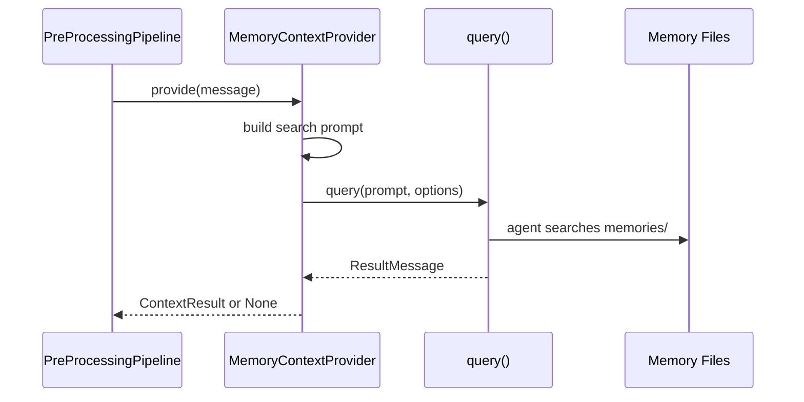

# Design: Memory Context Retrieval

<!-- This design describes the current implementation approach. Updated through delta reconciliation. -->

**Feature Spec**: [../../feature-specs/memory/memory-context-retrieval.md](../../feature-specs/memory/memory-context-retrieval.md)
**Status**: Current

## Purpose

This document explains the design rationale for the memory context provider: how it searches stored memories using an agent-based approach, and how it integrates with the pre-processing pipeline.

For the pre-processing pipeline infrastructure that the memory context provider plugs into, see the [pre-processing pipeline design](../agent/pre-processing-pipeline.md).

## Problem Context

Conversations are enriched when the agent knows about past interactions, user facts, and preferences. The memory context provider searches stored memories and returns relevant pointers so the main agent can reference them naturally. This is the retrieval counterpart to memory extraction — extraction stores memories after conversations, retrieval injects them before.

**Constraints:**
- Memory retrieval uses the existing file-based memory storage (episodic, facts, preferences)
- The provider must be domain-agnostic from the pipeline's perspective — it implements the `ContextProvider` ABC
- Provider failures must never block the conversation
- The workspace directory (`cwd`) is the root from which the agent navigates to discover the memory directory structure

**Interactions:**
- Pre-processing pipeline (`pre-processing-pipeline`): memory provider registers as a context provider
- Memory extraction (`memory-extraction`): provides the stored memories that this provider searches
- Coordinator (`core-architecture`): triggers the pipeline on first message of new session

## Design Overview

A `MemoryContextProvider` implements the `ContextProvider` ABC and uses a standalone `query()` call with an Opus agent to search stored memories.

```
┌──────────────────────────────────────────────────────────────────┐
│                    MemoryContextProvider                          │
│                    (src/tachikoma/memory/context_provider.py)     │
│                                                                  │
│  provide(message):                                               │
│    query(prompt, options=ClaudeAgentOptions(                     │
│      model="opus", effort="low",                                │
│      allowed_tools=["Read", "Glob", "Grep"],                    │
│      max_turns=8, cwd=workspace_path,                           │
│      permission_mode="bypassPermissions"                         │
│    ))                                                            │
│    → ContextResult(tag="memories", content=...)  or None         │
└──────────────────────────────────────────────────────────────────┘
```

The provider builds a search prompt embedding the user's message, runs the agent, and extracts the result from `ResultMessage`. If the agent finds relevant memories, it returns a `ContextResult`; if not (or on error), it returns `None`.

## Components

### Implementation Structure

| Layer/Component | Responsibility | Key Decisions |
|-----------------|----------------|---------------|
| `src/tachikoma/memory/context_provider.py` | `MemoryContextProvider(ContextProvider)` — uses standalone `query()` with Opus agent and search tools to find relevant memories. Accepts `cli_path` parameter. `MEMORY_SEARCH_PROMPT` constant co-located with provider. Extracts result from `ResultMessage`. Fully consumes the query() generator (DES-005). | Opus with `effort="low"` for better relevance assessment at controlled cost; `max_turns=8` as safety net; prompt uses Glob→Grep→Read narrowing strategy; `cwd` is workspace root so agent can navigate to discover memory structure |

### Cross-Layer Contracts



**Integration Points:**
- Provider ↔ Pipeline: registers via `pipeline.register(provider)`; `provide(message)` called in parallel during pipeline `run()`
- Provider ↔ SDK: standalone `query()` call (independent of coordinator's `ClaudeSDKClient`)
- Agent ↔ Workspace: agent searches `memories/episodic/`, `memories/facts/`, `memories/preferences/` via Read/Glob/Grep tools

**Error contract:**
- If agent query fails or raises an exception, provider catches it, logs per DES-002, and returns None
- If agent returns an error result (`ResultMessage.is_error`), provider logs warning and returns None
- If agent exhausts max_turns without producing a result, provider returns None

## Modeling

```
MemoryContextProvider(ContextProvider)
├── _cwd: Path           (workspace directory — agent navigates from here to discover memories/)
├── _cli_path: str | None  (optional Claude CLI binary path)
└── provide(message: str) → ContextResult | None

MEMORY_SEARCH_PROMPT: str  (module-level constant, embeds {message} placeholder)
```

For the `PreProcessingPipeline`, `ContextProvider` ABC, and `ContextResult` models, see the [pipeline design](../agent/pre-processing-pipeline.md).

## Data Flow

### Memory provider flow

```
1. provider.provide(message) is called
2. Builds search prompt by embedding user message into MEMORY_SEARCH_PROMPT
3. Creates ClaudeAgentOptions(model="opus", effort="low", max_turns=8,
   allowed_tools=["Read", "Glob", "Grep"],
   permission_mode="bypassPermissions", cwd=self._cwd, cli_path=self._cli_path)
4. Calls query(prompt=prompt, options=options)
5. Async iterates over the returned generator:
   - On ResultMessage:
     a. If is_error → log warning, return None
     b. If result contains "NO_RELEVANT_MEMORIES" sentinel → return None
     c. If result has content → return ContextResult(tag="memories", content=result)
6. If loop completes without a valid result → return None
7. If any exception → catch, log per DES-002, return None
```

## Key Decisions

### Opus with low effort for memory search

**Choice**: Use `model="opus"` with `effort="low"` for the memory search agent.
**Why**: Opus provides better reasoning for assessing memory relevance — distinguishing between superficially related and genuinely relevant memories requires judgment that benefits from a stronger model. The `effort="low"` setting keeps cost and latency reasonable.

**Consequences**:
- Pro: Better relevance assessment — fewer irrelevant memories injected, fewer relevant ones missed
- Pro: `effort="low"` controls cost and latency
- Con: Higher per-call cost than lighter models, even with low effort

### Read/Glob/Grep only (no Agent tool)

**Choice**: Give the memory search agent only `["Read", "Glob", "Grep"]` tools.
**Why**: The Agent tool would add a full additional agent invocation (~2× cost, significant latency) with no retrieval benefit. Read, Glob, and Grep are the actual search tools needed. Consistent with existing standalone agent pattern (git processor).

**Consequences**:
- Pro: Lower cost and latency
- Pro: Simpler execution — no recursive agent spawning
- Pro: Consistent with existing standalone agent pattern

### Free-form markdown output (not structured JSON)

**Choice**: Memory provider returns free-form markdown text, not structured JSON.
**Why**: The consumer is the main coordinator agent (an LLM), not parsing code. Consistent with existing `<soul>`, `<user>`, `<agents>` convention where context blocks contain markdown inside XML tags. Structured output adds retry overhead if the agent produces invalid JSON.

**Consequences**:
- Pro: Consistent with existing context block convention
- Pro: No parsing/validation overhead
- Con: Content is opaque to code — can't programmatically inspect which memories were retrieved

### NO_RELEVANT_MEMORIES sentinel

**Choice**: The agent prompt instructs returning exactly `NO_RELEVANT_MEMORIES` when no relevant memories are found.
**Why**: Allows the provider to distinguish "searched and found nothing" from "agent error" — the former returns None cleanly, the latter is caught as an exception.

**Consequences**:
- Pro: Clean distinction between "no results" and "error"
- Pro: Provider can log differently for each case

### Workspace root as cwd

**Choice**: `MemoryContextProvider.__init__` takes `cwd: Path` pointing to the workspace root, not the specific `memories/` subdirectory.
**Why**: The Opus agent navigates from the workspace root, which allows it to discover the memory directory structure via Glob. This is consistent with how other agents (memory extraction processors, git processor) receive the workspace path.

**Consequences**:
- Pro: Consistent with existing agent patterns
- Pro: Agent can discover directory structure naturally

### No per-provider timeout

**Choice**: Do not add `asyncio.wait_for()` timeouts around the provider.
**Why**: The `max_turns=8` limit on the Opus agent already bounds execution. Adding explicit timeouts introduces complexity without clear benefit when `max_turns` is set.

**Consequences**:
- Pro: Simpler implementation
- Pro: `max_turns` provides an equivalent bound

## System Behavior

### Scenario: Relevant memories exist

**Given**: Memories are stored in `memories/` directories
**When**: The user sends a message related to stored memories
**Then**: The memory provider searches memories, finds relevant files, returns a ranked list as `ContextResult(tag="memories", content=...)`. The pipeline assembles it into `<memories>...</memories>` XML.

### Scenario: No relevant memories

**Given**: Memories exist but none are relevant to the current message
**When**: The memory provider runs
**Then**: The agent searches but finds no relevant files. It responds with `NO_RELEVANT_MEMORIES`. The provider returns None.

### Scenario: Empty memories directory

**Given**: No memory files exist yet (new installation)
**When**: The memory provider runs
**Then**: The agent's Glob finds no files. It returns `NO_RELEVANT_MEMORIES`. The provider returns None, no error.

### Scenario: Memory provider fails

**Given**: The memory provider raises an exception (e.g., SDK connection error)
**When**: The pipeline runs the provider
**Then**: The exception is caught and logged. The message proceeds unmodified. Other providers (if any) complete normally.

### Scenario: Agent exhausts max_turns

**Given**: The memory search agent uses all 8 turns without producing a ResultMessage
**When**: The async iterator completes
**Then**: The provider returns None. The message proceeds unmodified.

## Notes

- The memory search agent's prompt strategy: Glob to discover → Grep to narrow → Read to verify → return ranked list.
- The `max_turns=8` limit is generous for a typical search flow (1 Glob + 1-2 Grep + 1-3 Read + 1 response = 4-7 turns).
- The provider fully consumes the `query()` generator (no early `return` or `break` inside `async for`). This follows DES-005 — preventing orphaned SDK resources from busy-looping the event loop.
- DLT-009 (embedding-based semantic search) could replace or augment the agent-based search in the future. The `ContextProvider` ABC means the memory provider can be swapped without touching the pipeline.
