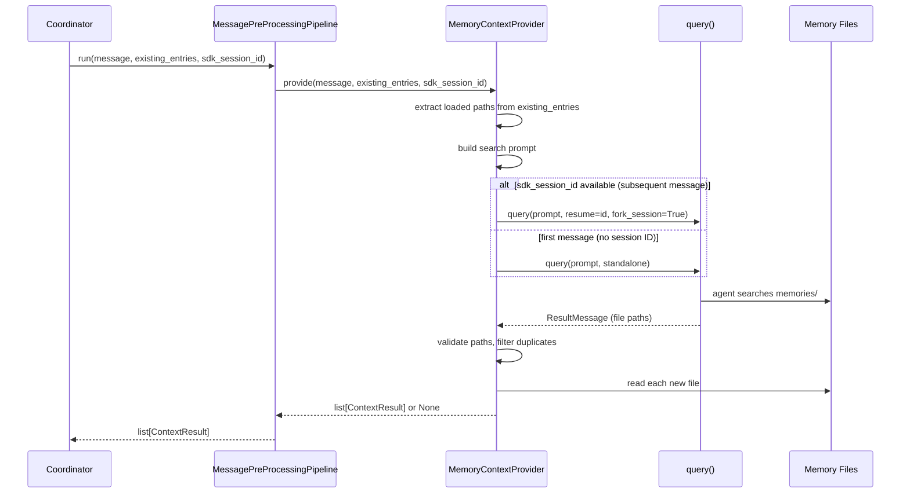

# Design: Memory Context Retrieval

<!-- This design describes the current implementation approach. Updated through delta reconciliation. -->

**Feature Spec**: [../../feature-specs/memory/memory-context-retrieval.md](../../feature-specs/memory/memory-context-retrieval.md)
**Status**: Current

## Purpose

This document explains the design rationale for the memory context provider: how it searches stored memories using an agent-based approach on every message, how it uses session forking for conversation context on subsequent messages, and how it integrates with the per-message pre-processing pipeline.

For the pre-processing pipeline infrastructure, see the [pre-processing pipeline design](../agent/pre-processing-pipeline.md).

## Problem Context

Conversations are enriched when the agent knows about past interactions, user facts, and preferences. The memory context provider searches stored memories and returns relevant content so the main agent can reference them naturally. This is the retrieval counterpart to memory extraction — extraction stores memories after conversations, retrieval injects them before.

**Constraints:**
- Memory retrieval uses the existing file-based memory storage (episodic, facts, preferences)
- The provider must be domain-agnostic from the pipeline's perspective — it implements the `MessageContextProvider` ABC
- Provider failures must never block the conversation
- The workspace directory (`cwd`) is the root from which the agent navigates to discover the memory directory structure
- The SDK session ID is only available after the first response completes — the first message always operates without conversation context

**Interactions:**
- Per-message pre-processing pipeline (`per-message-pre-processing`): memory provider registers as a `MessageContextProvider`
- Coordinator (`core-architecture`): triggers the per-message pipeline on every message, passes SDK session ID through
- Memory extraction (`memory-extraction`): provides the stored memories that this provider searches

## Design Overview

A `MemoryContextProvider` implements the `MessageContextProvider` ABC and uses a `query()` call with an Opus agent to search stored memories. On subsequent messages (when an SDK session ID is available), the provider forks the session to give the search agent full conversation context for informed relevance decisions — adapting DES-004's fork pattern for pre-processing. On the first message (no session ID yet), it falls back to a standalone query following DES-007.

The agent returns relevant memory file paths. The provider reads each file, filters out paths already present in `existing_entries` (via `memory_path` metadata), and returns one `ContextResult` per new memory file.

```
┌──────────────────────────────────────────────────────────────────┐
│                    MemoryContextProvider                          │
│                    (MessageContextProvider)                       │
│                                                                  │
│  provide(message, existing_entries, sdk_session_id):             │
│    1. Extract loaded memory paths from existing_entries metadata │
│    2. Build search prompt with user message                      │
│    3. If sdk_session_id → query(fork_session=True, resume=id)   │
│       Else → query(standalone, no fork)                         │
│    4. Parse file paths from agent response                       │
│    5. Validate paths are within memories/                        │
│    6. Filter out already-loaded paths                            │
│    7. Read each file, create ContextResult per file              │
│    → list[ContextResult]  or  None                              │
└──────────────────────────────────────────────────────────────────┘
```

## Components

### Implementation Structure

| Layer/Component | Responsibility | Key Decisions |
|-----------------|----------------|---------------|
| `src/tachikoma/memory/context_provider.py` | `MemoryContextProvider(MessageContextProvider)` — forks session when SDK session ID available, parses file paths from agent response, reads files, creates per-file `ContextResult` entries with metadata. Constants: `MEMORIES_OWNER`, `MEMORY_PATH_META_KEY`, `_NO_RELEVANT_MEMORIES`. Helper: `extract_memory_paths()`. `MEMORY_SEARCH_PROMPT` constant co-located with provider. | Agent returns paths (classification), provider reads files (assembly) — mirrors skills provider pattern; uses `memory_path` metadata key per ADR-011; single adaptive prompt handles both forked and standalone modes |

### Cross-Layer Contracts


```mermaid
sequenceDiagram
    participant Coordinator
    participant Pipeline as MessagePreProcessingPipeline
    participant Memory as MemoryContextProvider
    participant SDK as query()
    participant FS as Memory Files

    Coordinator->>Pipeline: run(message, existing_entries, sdk_session_id)
    Pipeline->>Memory: provide(message, existing_entries, sdk_session_id)
    Memory->>Memory: extract loaded paths from existing_entries
    Memory->>Memory: build search prompt
    alt sdk_session_id available (subsequent message)
        Memory->>SDK: query(prompt, resume=id, fork_session=True)
    else first message (no session ID)
        Memory->>SDK: query(prompt, standalone)
    end
    SDK->>FS: agent searches memories/
    SDK-->>Memory: ResultMessage (file paths)
    Memory->>Memory: validate paths, filter duplicates
    Memory->>FS: read each new file
    Memory-->>Pipeline: list[ContextResult] or None
    Pipeline-->>Coordinator: list[ContextResult]
```

**Integration Points:**
- Coordinator ↔ Pipeline: `msg_pre_pipeline.run(message, existing_entries=entries, sdk_session_id=self._sdk_session_id)`
- Pipeline ↔ Providers: `provide(message, existing_entries=entries, sdk_session_id=sdk_session_id)` — passed through to all providers
- Memory provider ↔ SDK: `query(prompt, resume=id, fork_session=True, ...)` for subsequent messages; standalone `query()` for first message
- Memory provider ↔ Filesystem: `Path.read_text()` to read memory files after agent identifies relevant paths

**Error contract:**
- If `query()` fails (SDK error, fork failure, expired session) → catch, log per DES-002, return None
- If agent returns error (`ResultMessage.is_error`) → log warning, return None
- If agent exhausts `max_turns` → return None
- If file read fails (FileNotFoundError) → skip that file, log warning, continue with remaining files

### Shared Logic

- **`MEMORY_PATH_META_KEY = "memory_path"`** — constant for metadata key, used for both writing metadata on new entries and reading metadata from existing entries (deduplication)
- **`MEMORIES_OWNER = "memories"`** — constant for the entry owner tag
- **`extract_memory_paths(entries)`** — helper function extracting loaded memory paths from `existing_entries` metadata. Filters by `entry.owner == MEMORIES_OWNER` and reads `metadata["memory_path"]`. Mirrors `extract_skill_names()` in the skills provider.

## Modeling

```
MemoryContextProvider(MessageContextProvider)
├── _agent_defaults: AgentDefaults     (cwd, cli_path, env, model)
└── provide(message, existing_entries, sdk_session_id) → list[ContextResult] | None

MEMORY_SEARCH_PROMPT: str              (module-level constant, embeds {message})
MEMORIES_OWNER: str = "memories"
MEMORY_PATH_META_KEY: str = "memory_path"

extract_memory_paths(entries: list[SessionContextEntry]) → set[str]
└── Filters by owner == MEMORIES_OWNER, reads metadata[MEMORY_PATH_META_KEY]
```

## Data Flow

### Memory provider flow (per message)

```
1. provider.provide(message, existing_entries, sdk_session_id) is called
2. Extract loaded memory paths: extract_memory_paths(existing_entries)
3. Build search prompt by embedding user message into MEMORY_SEARCH_PROMPT
4. Branch on sdk_session_id:
   a. If available → ClaudeAgentOptions(resume=sdk_session_id, fork_session=True,
      model=agent_defaults.model, effort="low", max_turns=8,
      allowed_tools=["Read", "Glob", "Grep"],
      permission_mode="bypassPermissions", cwd=agent_defaults.cwd)
   b. If None → ClaudeAgentOptions(model=agent_defaults.model, effort="low",
      max_turns=8, allowed_tools=["Read", "Glob", "Grep"],
      permission_mode="bypassPermissions", cwd=agent_defaults.cwd)
5. Call query(prompt=prompt, options=options)
6. Fully consume the query() generator per DES-007 (which requires DES-005):
   - On ResultMessage:
     a. If is_error → log warning
     b. If result == "NO_RELEVANT_MEMORIES" → no paths
     c. If result has content → parse file paths (one per line)
7. Validate paths: resolve each against workspace root, reject any outside memories/
8. Filter out paths already in loaded_paths set
9. For each new path:
   a. Read file content via Path.read_text()
   b. Create ContextResult(tag="memories", content=content,
      metadata={"memory_path": path})
10. Return list of ContextResults, or None if empty
11. If any exception → catch, log per DES-002, return None
```

## Key Decisions

### Session forking for conversation context

**Choice**: Fork the coordinator's SDK session (`fork_session=True` + `resume=sdk_session_id`) when available so the search agent has full conversation context. This is the first pre-processing provider to use the fork pattern previously established for post-processing (DES-004), adapting it for conversation-context-aware retrieval rather than file modification.
**Why**: Without conversation context, the search agent can only evaluate relevance based on the single message. With context, it can determine whether the latest message introduces new topics or continues existing ones, enabling the agent-driven search decision.

**Consequences**:
- Pro: Informed relevance assessment on follow-up messages
- Pro: Agent can decide "already covered" and skip unnecessary search
- Con: Fork overhead on each message (acceptable — fork is lightweight and `effort="low"`)

### Agent returns file paths, provider reads content

**Choice**: The memory search agent returns relevant file paths (one per line). The provider reads each file and assembles `ContextResult` entries.
**Why**: Separates relevance judgment (agent) from content assembly (provider code). Mirrors the skills provider pattern where the agent classifies names and the provider looks up content from the registry.

**Consequences**:
- Pro: Simple, parseable agent output
- Pro: Provider controls exact content format
- Pro: Consistent with skills provider pattern
- Con: Files are read twice (agent reads for relevance, provider reads for content) — negligible for small local files

### Single adaptive prompt

**Choice**: One prompt template handles both forked (with conversation context) and standalone (first message) modes.
**Why**: When forked, the agent sees the full conversation transcript. When standalone, there's no prior transcript. A single prompt with conditional guidance handles both cases.

**Consequences**:
- Pro: Single prompt to maintain
- Pro: Graceful degradation — same behavior whether context is present or not

### memory_path metadata key

**Choice**: Use `{"memory_path": "<relative-path>"}` as the metadata on each memory `ContextResult`, following ADR-011.
**Why**: Mirrors `{"skill_name": "name"}` from the skills provider. Enables deduplication by matching metadata in `existing_entries`.

**Consequences**:
- Pro: Consistent with ADR-011 and skills provider pattern
- Pro: Stable identifier for exact deduplication

### Path validation for agent-returned file paths

**Choice**: Resolve each returned path against the workspace root and reject any path not within `memories/`.
**Why**: The agent could return arbitrary paths. Without validation, the provider would read and inject arbitrary file content into the main agent's context.

**Consequences**:
- Pro: Prevents content injection from outside the memory directory
- Pro: Consistent with skills provider's validation pattern

### Preserved model and tool configuration

**Choice**: Keep `model=agent_defaults.model`, `effort="low"`, `max_turns=8`, `allowed_tools=["Read", "Glob", "Grep"]`, `permission_mode="bypassPermissions"` from the previous implementation.
**Why**: These settings are well-tuned for the memory search use case. The addition of `fork_session` doesn't change tool needs or reasoning requirements.

**Consequences**:
- Pro: No regression in search quality
- Pro: No additional cost beyond fork overhead

## System Behavior

### Scenario: First message of session (no SDK session ID)

**Given**: A new session with no SDK session ID yet
**When**: The memory provider runs on the first message
**Then**: Provider calls `query()` without fork/resume (standalone). Agent searches memories based on the message alone. Provider reads relevant files, creates per-file entries.

### Scenario: Follow-up message introduces new topic

**Given**: A session with an existing SDK session ID, memory entries already loaded for the initial topic
**When**: A subsequent message introduces a new topic
**Then**: Provider forks the session. Agent sees conversation context, searches memories, returns relevant file paths. Provider filters out already-loaded paths, reads new files, returns new entries.

### Scenario: Follow-up message continues same topic

**Given**: A session with conversation context, relevant memories already loaded
**When**: A follow-up message continues the same topic
**Then**: Provider forks the session. Agent sees context, determines no new memories needed, returns `NO_RELEVANT_MEMORIES`. Provider returns None.

### Scenario: Memory already loaded (deduplication)

**Given**: Memory file already in `existing_entries` (metadata `{"memory_path": "..."}`)
**When**: Agent returns that path as relevant
**Then**: Provider filters it out during deduplication.

### Scenario: Fork failure

**Given**: The SDK session has expired or become invalid
**When**: The provider attempts to fork
**Then**: `query()` raises an exception. Provider catches it, logs, returns None. Conversation proceeds unaffected.

### Scenario: Agent exhausts max_turns

**Given**: The memory search agent uses all 8 turns without producing a ResultMessage
**When**: The async iterator completes
**Then**: Provider returns None.

### Scenario: Memory file deleted between search and read

**Given**: Agent identifies a relevant file
**When**: Provider attempts to read it but it has been deleted
**Then**: Provider logs warning, skips that file, continues with remaining files.

## Notes

- The forked session's new ID is not stored — it's a throwaway branch for the search agent's context. The coordinator's main session is never modified by the fork.
- On first message, the provider behavior is functionally equivalent to the previous implementation but produces per-file entries instead of a single markdown block.
- The `extract_memory_paths()` helper mirrors `extract_skill_names()` in the skills provider — both read metadata from `existing_entries` for deduplication.
- DLT-009 (embedding-based semantic search) could replace or augment the agent-based search. The `MessageContextProvider` ABC means the memory provider can be swapped without touching the pipeline.
