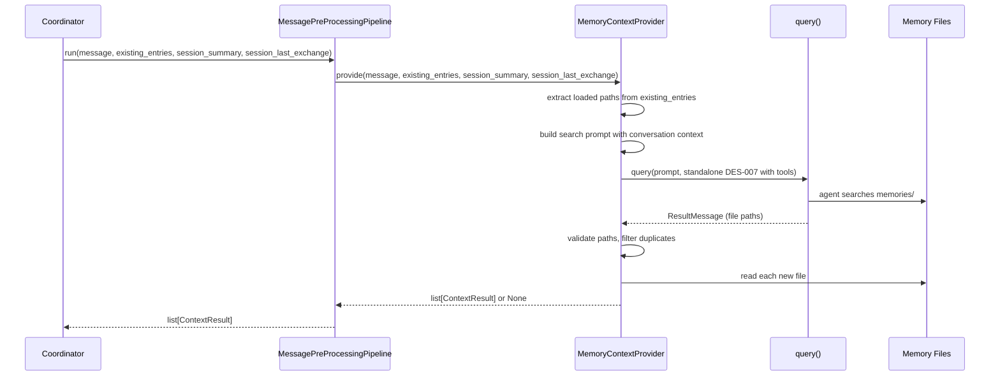

# Design: Memory Context Retrieval

<!-- This design describes the current implementation approach. Updated through delta reconciliation. -->

**Feature Spec**: [../../feature-specs/memory/memory-context-retrieval.md](../../feature-specs/memory/memory-context-retrieval.md)
**Status**: Current

## Purpose

This document explains the design rationale for the memory context provider: how it searches stored memories using an agent-based approach on every message, how it uses explicit conversation context (session summary + last exchange) for informed relevance decisions, and how it integrates with the per-message pre-processing pipeline.

For the pre-processing pipeline infrastructure, see the [pre-processing pipeline design](../agent/pre-processing-pipeline.md).

## Problem Context

Conversations are enriched when the agent knows about past interactions, user facts, and preferences. The memory context provider searches stored memories and returns relevant content so the main agent can reference them naturally. This is the retrieval counterpart to memory extraction — extraction stores memories after conversations, retrieval injects them before.

**Constraints:**
- Memory retrieval uses the existing file-based memory storage (episodic, facts, preferences)
- The provider must be domain-agnostic from the pipeline's perspective — it implements the `MessageContextProvider` ABC
- Provider failures must never block the conversation
- The workspace directory (`cwd`) is the root from which the agent navigates to discover the memory directory structure
- Conversation context (session summary + last exchange) is provided by the pipeline — the first message always operates without it

**Interactions:**
- Per-message pre-processing pipeline (`per-message-pre-processing`): memory provider registers as a `MessageContextProvider`
- Coordinator (`core-architecture`): triggers the per-message pipeline on every message, passes SDK session ID through
- Memory extraction (`memory-extraction`): provides the stored memories that this provider searches

## Design Overview

A `MemoryContextProvider` implements the `MessageContextProvider` ABC and uses a `query()` call with an Opus agent to search stored memories. The provider receives the session's summary and last exchange from the pipeline for conversation context, rendered via the shared `render_conversation_context()` helper. On the first message (no summary yet), it operates without conversation context. The provider runs as a standalone DES-007 agent with file search tools.

The agent returns relevant memory file paths in XML `<memory>` elements. For facts/preferences, it returns self-closing tags and the provider reads the full file. For episodic files (which can be very large), the agent extracts the relevant snippet inline and the provider uses it directly with a `[Source: path]` reference. The provider filters out paths already present in `existing_entries` (via `memory_path` metadata), and returns one `ContextResult` per new memory.

```
┌──────────────────────────────────────────────────────────────────┐
│                    MemoryContextProvider                          │
│                    (MessageContextProvider)                       │
│                                                                  │
│  provide(message, existing_entries, session_summary,            │
│           session_last_exchange):                                 │
│    1. Extract loaded memory paths from existing_entries metadata │
│    2. Build search prompt with user message + conversation ctx  │
│    3. query(standalone DES-007, with tools)                      │
│    4. Parse XML <memory> elements from agent response            │
│    5. Validate paths are within memories/                        │
│    6. Filter out already-loaded paths                            │
│    7. For snippets: use snippet + [Source: path] header          │
│       For self-closing: read full file from disk                 │
│    → list[ContextResult]  or  None                              │
└──────────────────────────────────────────────────────────────────┘
```

## Components

### Implementation Structure

| Layer/Component | Responsibility | Key Decisions |
|-----------------|----------------|---------------|
| `src/tachikoma/memory/context_provider.py` | `MemoryContextProvider(MessageContextProvider)` — receives conversation context (session summary + last exchange) from the pipeline, runs as a standalone DES-007 agent with file search tools, parses XML `<memory>` elements from agent response, handles snippets (episodic) vs full-file reads (facts/preferences), creates per-file `ContextResult` entries with metadata. `ParsedMemoryEntry` dataclass and `parse_memory_entries()` function for XML parsing. Constants: `MEMORIES_OWNER`, `MEMORY_PATH_META_KEY`, `_NO_RELEVANT_MEMORIES`. Helper: `extract_memory_paths()`. `MEMORY_SEARCH_PROMPT` constant co-located with provider — uses `$WORKSPACE` placeholders for directory paths, replaced with absolute workspace path at call time. | Agent returns XML elements with optional snippet content; self-closing = full file load, open/close = snippet extraction; uses `memory_path` metadata key per ADR-011; single adaptive prompt with `{conversation_context_section}` placeholder rendered via shared `render_conversation_context()` helper; `$WORKSPACE` replacement applied before `str.format()` |

### Cross-Layer Contracts


```mermaid
sequenceDiagram
    participant Coordinator
    participant Pipeline as MessagePreProcessingPipeline
    participant Memory as MemoryContextProvider
    participant SDK as query()
    participant FS as Memory Files

    Coordinator->>Pipeline: run(message, existing_entries, session_summary, session_last_exchange)
    Pipeline->>Memory: provide(message, existing_entries, session_summary, session_last_exchange)
    Memory->>Memory: extract loaded paths from existing_entries
    Memory->>Memory: build search prompt with conversation context
    Memory->>SDK: query(prompt, standalone DES-007 with tools)
    SDK->>FS: agent searches memories/
    SDK-->>Memory: ResultMessage (file paths)
    Memory->>Memory: validate paths, filter duplicates
    Memory->>FS: read each new file
    Memory-->>Pipeline: list[ContextResult] or None
    Pipeline-->>Coordinator: list[ContextResult]
```

**Integration Points:**
- Coordinator ↔ Pipeline: `msg_pre_pipeline.run(message, existing_entries=entries, session_summary=active.summary, session_last_exchange=active.last_exchange)`
- Pipeline ↔ Providers: `provide(message, existing_entries=entries, session_summary=summary, session_last_exchange=last_exchange)` — passed through to all providers
- Memory provider ↔ SDK: standalone `query()` with tools (DES-007), conversation context via `render_conversation_context()` in prompt
- Memory provider ↔ Filesystem: `Path.read_text()` to read memory files after agent identifies relevant paths

**Error contract:**
- If `query()` fails (SDK error, expired session) → catch, log per DES-002, return None
- If agent returns error (`ResultMessage.is_error`) → log warning, return None
- If file read fails (FileNotFoundError) → skip that file, log warning, continue with remaining files

### Shared Logic

- **`MEMORY_PATH_META_KEY = "memory_path"`** — constant for metadata key, used for both writing metadata on new entries and reading metadata from existing entries (deduplication)
- **`MEMORIES_OWNER = "memories"`** — constant for the entry owner tag
- **`extract_memory_paths(entries)`** — helper function extracting loaded memory paths from `existing_entries` metadata. Filters by `entry.owner == MEMORIES_OWNER` and reads `metadata["memory_path"]`. Mirrors `extract_skill_names()` in the skills provider.

## Modeling

```
MemoryContextProvider(MessageContextProvider)
├── _agent_defaults: AgentDefaults     (cwd, cli_path, env, model)
└── provide(message, existing_entries, session_summary, session_last_exchange) → list[ContextResult] | None

MEMORY_SEARCH_PROMPT: str              (module-level constant, embeds {message}; $WORKSPACE replaced at call time)
MEMORIES_OWNER: str = "memories"
MEMORY_PATH_META_KEY: str = "memory_path"

extract_memory_paths(entries: list[SessionContextEntry]) → set[str]
└── Filters by owner == MEMORIES_OWNER, reads metadata[MEMORY_PATH_META_KEY]
```

## Data Flow

### Memory provider flow (per message)

```
1. provider.provide(message, existing_entries, session_summary, session_last_exchange) is called
2. Extract loaded memory paths: extract_memory_paths(existing_entries)
3. Render conversation context: render_conversation_context(session_summary, session_last_exchange)
4. Build search prompt by embedding user message and conversation context into MEMORY_SEARCH_PROMPT
5. ClaudeAgentOptions(model=agent_defaults.searcher_model, effort="low",
   allowed_tools=["Read", "Glob", "Grep"],
   permission_mode="bypassPermissions", cwd=agent_defaults.cwd)
6. Call query(prompt=prompt, options=options)
7. Fully consume the query() generator per DES-007 (which requires DES-005):
   - On ResultMessage:
     a. If is_error → log warning
     b. If result == "NO_RELEVANT_MEMORIES" → no paths
     c. If result has content → parse XML <memory> elements via parse_memory_entries()
7. Validate paths: resolve each against workspace root, reject any outside memories/
8. Filter out paths already in loaded_paths set
9. For each new entry:
   a. If snippet provided → use snippet with [Source: path] header
   b. If self-closing (no snippet) → read full file via Path.read_text()
   c. Create ContextResult(tag="memories", content=content,
      metadata={"memory_path": path})
10. Return list of ContextResults, or None if empty
11. If any exception → catch, log per DES-002, return None
```

## Key Decisions

### Explicit conversation context via shared helper

**Choice**: The provider receives the session's summary and last exchange from the pipeline (threaded through from the coordinator) and renders them into the search prompt using the shared `render_conversation_context()` helper (defined in `per_message_pre_processing.py`). This is the same explicit context pattern used by the skills provider and boundary detector.
**Why**: Without conversation context, the search agent can only evaluate relevance based on the single message. With explicit context, it can determine whether the latest message introduces new topics or continues existing ones, enabling the agent-driven search decision. Explicit context is lightweight (bounded by summary length), avoids the overhead of creating throwaway session branches on every message, and provides uniform context across all per-message providers.

**Consequences**:
- Pro: Informed relevance assessment on follow-up messages
- Pro: Agent can decide "already covered" and skip unnecessary search
- Pro: Lighter-weight than forking (summary is 5-8 sentences vs full transcript)
- Pro: Uniform context pattern across all per-message providers (skills, memory, boundary detection)
- Con: Less detailed than full transcript (acceptable — summary captures the key points)

### XML output format with snippet extraction for episodic memories

**Choice**: The memory search agent returns XML `<memory>` elements. Self-closing tags (`<memory path="..." />`) signal full-file load (facts/preferences). Open/close tags with body content (`<memory path="...">snippet</memory>`) carry agent-extracted snippets (episodic). The provider uses `parse_memory_entries()` to parse both forms.
**Why**: Episodic memory files can grow very large (20-34KB each), and loading their full content into the system prompt CLI argument caused `[Errno 7] Argument list too long` (ARG_MAX overflow). The agent already reads files to assess relevance, so extracting the relevant snippet is natural. Facts and preferences files remain small and topically focused, so full-file loading is appropriate for them.

**Consequences**:
- Pro: Episodic memory contribution to system prompt reduced from ~92KB to ~5-15KB (6-18x reduction)
- Pro: Eliminates ARG_MAX overflow from memory context
- Pro: Agent provides only the relevant information, improving main agent context quality
- Pro: `[Source: path]` header allows the main agent to read more if the snippet is insufficient
- Con: Agent must produce well-formed XML (mitigated by graceful parsing with fallback)
- Con: Snippet quality depends on the agent's extraction judgment

### Single adaptive prompt with conditional context

**Choice**: One prompt template handles both with-context (summary available) and without-context (first message) modes via the `{conversation_context_section}` placeholder.
**Why**: When a summary exists, the agent sees conversation context. When no summary is available (first message), the placeholder renders as an empty string and the section is omitted entirely. A single prompt with conditional rendering handles both cases.

**Consequences**:
- Pro: Single prompt to maintain
- Pro: Graceful degradation — same behavior whether context is present or not

### memory_path metadata key

**Choice**: Use `{"memory_path": "<relative-path>"}` as the metadata on each memory `ContextResult`, following ADR-011.
**Why**: Mirrors `{"skill_name": "name"}` from the skills provider. Enables deduplication by matching metadata in `existing_entries`.

**Consequences**:
- Pro: Consistent with ADR-011 and skills provider pattern
- Pro: Stable identifier for exact deduplication

### Path validation for agent-returned file paths

**Choice**: Resolve each returned path against the workspace root and reject any path not within `memories/`.
**Why**: The agent could return arbitrary paths. Without validation, the provider would read and inject arbitrary file content into the main agent's context.

**Consequences**:
- Pro: Prevents content injection from outside the memory directory
- Pro: Consistent with skills provider's validation pattern

### Preserved model and tool configuration

**Choice**: Use `model=agent_defaults.searcher_model` (default `"opus"`, see DES-004), `effort="low"`, `allowed_tools=["Read", "Glob", "Grep"]`, `permission_mode="bypassPermissions"`. No explicit `max_turns` ceiling.
**Why**: An earlier `max_turns=12` cap was observed producing `error_max_turns` failures on non-Claude model backends (GLM-family models running via Anthropic-compatible proxies occasionally loop through tool calls without emitting a final answer). Removing the cap eliminates it as a failure variable while diagnosing upstream behavior; the SDK's internal safety bounds still protect against unbounded runaway. `effort="low"` keeps per-turn cost minimal.

**Consequences**:
- Pro: No spurious `error_max_turns` failures on non-Claude backends
- Pro: Existing error-isolation (`try/except` + `is_error` branch) still returns None cleanly on any SDK failure
- Con: Theoretically unbounded turns in pathological cases — mitigated by the SDK's own internal limits and by `effort="low"`

## System Behavior

### Scenario: First message of session (no conversation context)

**Given**: A new session with no summary yet
**When**: The memory provider runs on the first message
**Then**: Provider calls `query()` as a standalone agent. No conversation context section in the prompt. Agent searches memories based on the message alone. Provider reads relevant files, creates per-file entries.

### Scenario: Follow-up message introduces new topic

**Given**: A session with a summary and last exchange, memory entries already loaded for the initial topic
**When**: A subsequent message introduces a new topic
**Then**: Provider includes conversation context in the prompt. Agent sees the summary, searches memories, returns relevant file paths. Provider filters out already-loaded paths, reads new files, returns new entries.

### Scenario: Follow-up message continues same topic

**Given**: A session with conversation context, relevant memories already loaded
**When**: A follow-up message continues the same topic
**Then**: Provider includes conversation context in the prompt. Agent sees the summary, determines no new memories needed, returns `NO_RELEVANT_MEMORIES`. Provider returns None.

### Scenario: Memory already loaded (deduplication)

**Given**: Memory file already in `existing_entries` (metadata `{"memory_path": "..."}`)
**When**: Agent returns that path as relevant
**Then**: Provider filters it out during deduplication.

### Scenario: Query failure

**Given**: The SDK query fails for any reason
**When**: The provider calls `query()`
**Then**: `query()` raises an exception. Provider catches it, logs, returns None. Conversation proceeds unaffected.

### Scenario: Agent returns an error result

**Given**: The memory search agent returns `ResultMessage(is_error=True)` for any reason (upstream rate limit, SDK-internal safety cutoff, transient error)
**When**: The provider processes the ResultMessage
**Then**: Provider logs a warning and returns None without populating entries.

### Scenario: Memory file deleted between search and read

**Given**: Agent identifies a relevant file
**When**: Provider attempts to read it but it has been deleted
**Then**: Provider logs warning, skips that file, continues with remaining files.

## Notes

- The provider runs as a standalone DES-007 agent — no session forking. Conversation context is provided explicitly via the `render_conversation_context()` helper shared across all per-message providers (defined in `per_message_pre_processing.py`).
- On first message, the provider operates without conversation context — the summary is `None` and the conversation context section is omitted from the prompt.
- The `extract_memory_paths()` helper mirrors `extract_skill_names()` in the skills provider — both read metadata from `existing_entries` for deduplication.
- DLT-009 (embedding-based semantic search) could replace or augment the agent-based search. The `MessageContextProvider` ABC means the memory provider can be swapped without touching the pipeline.
- The coordinator uses `FilePromptTransport` (`src/tachikoma/sdk_transport.py`) — a `SubprocessCLITransport` subclass that writes the system prompt to a tempfile and passes `--append-system-prompt-file` instead of `--append-system-prompt`. This eliminates the ARG_MAX constraint entirely as a defensive measure complementing snippet extraction. The transport imports the SDK's internal `SubprocessCLITransport` (pinned to SDK v0.1.48); verify compatibility on SDK upgrades.
