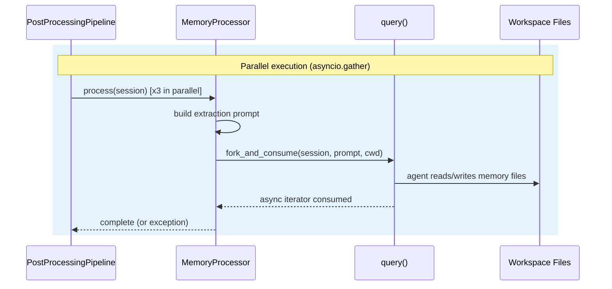
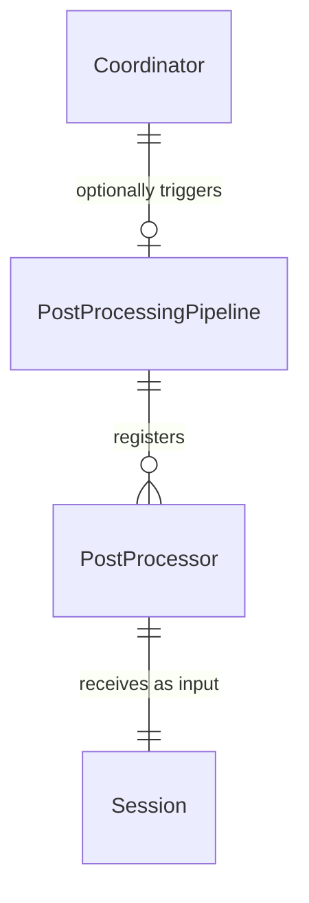

# Design: Memory Extraction

<!-- This design describes the current implementation approach. Updated through delta reconciliation. -->

**Feature Spec**: [../../feature-specs/memory/memory-extraction.md](../../feature-specs/memory/memory-extraction.md)
**Status**: Current

## Purpose

This document explains the design rationale for memory extraction: how the post-processing pipeline infrastructure works, how memory processors fork SDK sessions to extract memories, and how the bootstrap hook initializes the memory directory structure.

## Problem Context

Conversations are ephemeral — once a session ends, the context is lost. The assistant needs a way to automatically extract and persist learnings so that future sessions can reference past interactions, known user information, and expressed preferences.

**Constraints:**
- Memory extraction happens after a conversation ends — it must not block the user or the shutdown flow
- The SDK's standalone `query()` function is the mechanism for session forking — it operates independently of the coordinator's `ClaudeSDKClient`
- All file I/O is performed by the forked LLM agent, not by processor code — processors are thin orchestration wrappers
- Memories are plain markdown files in the workspace — no database, human-readable and directly editable

**Interactions:**
- Coordinator (core-architecture): triggers pipeline on session close in `__aexit__`
- Sessions: provides the `Session` dataclass with `sdk_session_id` for forking
- Workspace bootstrap: memory hook creates directory structure

## Design Overview

Two independent components work together: a reusable **post-processing pipeline** and a set of **memory processors** that plug into it.

```
┌───────────────────────────────────────────────────────────┐
│                       __main__.py                         │
│                                                           │
│  pipeline = PostProcessingPipeline()                      │
│  pipeline.register(EpisodicProcessor(cwd))                │
│  pipeline.register(FactsProcessor(cwd))                   │
│  pipeline.register(PreferencesProcessor(cwd))             │
│                                                           │
│  Coordinator(..., pipeline=pipeline)                      │
└───────────────────────────────────────────────────────────┘
                          │
                          ▼
┌───────────────────────────────────────────────────────────┐
│             PostProcessingPipeline                        │
│             (src/tachikoma/post_processing.py)            │
│                                                           │
│  run(session):                                            │
│    async with lock:    ◄── serializes concurrent runs     │
│      await gather(                                        │
│        processor1.process(session),                       │
│        processor2.process(session),                       │
│        processor3.process(session),                       │
│        return_exceptions=True                             │
│      )                                                    │
└───────────────────────────────────────────────────────────┘
                          │
             ┌────────────┼────────────┐
             ▼            ▼            ▼
        ┌─────────┐ ┌─────────┐ ┌─────────┐
        │Episodic │ │  Facts  │ │  Prefs  │
        │Processor│ │Processor│ │Processor│
        └────┬────┘ └────┬────┘ └────┬────┘
             │            │            │
             ▼            ▼            ▼
        query(prompt, resume=sdk_session_id, fork_session=True)
             │            │            │
             ▼            ▼            ▼
        memories/    memories/    memories/
        episodic/    facts/       preferences/
```

The **PostProcessingPipeline** is a generic mechanism — it knows nothing about memory. It accepts any `PostProcessor` subclass and runs them in parallel with error isolation. It lives in its own module (`post_processing.py`) so future features can register processors without touching memory code.

Each **memory processor** is a thin ABC subclass that builds an extraction prompt and calls the standalone `fork_and_consume()` helper. The forked agent has full workspace access and autonomously reads, creates, updates, or deletes memory files — the processor code performs no file I/O.

## Components

### Implementation Structure

| Layer/Component | Responsibility | Key Decisions |
|-----------------|----------------|---------------|
| `src/tachikoma/post_processing.py` | `PostProcessor` ABC (interface only), `PostProcessingPipeline` class, `fork_and_consume` standalone helper | Separate module from memory; reusable by future processors; ABC has no SDK coupling; fork helper uses standalone `query()` |
| `src/tachikoma/memory/__init__.py` | Re-exports: `EpisodicProcessor`, `FactsProcessor`, `PreferencesProcessor`, `memory_hook` | Clean public API for the memory package |
| `src/tachikoma/memory/hooks.py` | `memory_hook`: creates `memories/` directory structure | Subsystem-owned hook pattern; registered after context hook |
| `src/tachikoma/memory/episodic.py` | `EpisodicProcessor(PostProcessor)` + `EPISODIC_PROMPT` constant | Prompt co-located with processor logic |
| `src/tachikoma/memory/facts.py` | `FactsProcessor(PostProcessor)` + `FACTS_PROMPT` constant | Prompt co-located with processor logic |
| `src/tachikoma/memory/preferences.py` | `PreferencesProcessor(PostProcessor)` + `PREFERENCES_PROMPT` constant | Prompt co-located with processor logic |

### Cross-Layer Contracts



**Integration Points:**
- Pipeline ↔ Processors: `processor.process(session)` called in parallel via `asyncio.gather`
- Processors ↔ SDK: `fork_and_consume` calls `query(prompt, options=ClaudeAgentOptions(cwd=cwd, resume=session.sdk_session_id, fork_session=True, permission_mode="bypassPermissions"))` — standalone function, independent of `ClaudeSDKClient`
- Forked agents ↔ Workspace: agents read/write markdown files in `memories/` subdirectories
- Bootstrap ↔ Memory hook: `memory_hook` creates directory structure on startup

**Error contract:**
- Individual processor failures caught by `asyncio.gather(return_exceptions=True)` and logged per DES-002
- Pipeline failures in coordinator logged but never propagate — don't block shutdown
- Pipeline serializes concurrent invocations via `asyncio.Lock`

### Shared Logic

- **`PostProcessor` ABC** (`post_processing.py`): shared interface between all processors. Defines only the `process()` contract.
- **`fork_and_consume` function** (`post_processing.py`): standalone helper encapsulating SDK `query()` forking pattern. Available to future processors.
- **`Session` dataclass** (`sessions/model.py`): shared input to the pipeline — processors read `sdk_session_id`.

## Modeling

The domain model is minimal — no persistent entities or database tables. Memory files are unstructured markdown managed by forked LLM agents.

```
PostProcessingPipeline
├── _processors: list[PostProcessor]     (registered processors)
├── _lock: asyncio.Lock                  (serializes concurrent runs)
└── run(session: Session) → None         (parallel execution)

PostProcessor (ABC)
└── process(session: Session) → None     (abstract)

fork_and_consume(session, prompt, cwd) → None  (standalone helper)

EpisodicProcessor(PostProcessor)
├── _cwd: Path
└── EPISODIC_PROMPT: str

FactsProcessor(PostProcessor)
├── _cwd: Path
└── FACTS_PROMPT: str

PreferencesProcessor(PostProcessor)
├── _cwd: Path
└── PREFERENCES_PROMPT: str
```



## Data Flow

### Pipeline execution flow

```
1. pipeline.run(session) acquires asyncio.Lock
2. For each registered processor, creates a coroutine: processor.process(session)
3. Runs all coroutines via asyncio.gather(return_exceptions=True)
4. Iterates results:
   a. If result is an Exception → log error with processor name (DES-002)
   b. If result is None → processor succeeded
5. Releases lock
```

### Memory processor flow (per processor)

```
1. processor.process(session) is called
2. Processor references its extraction prompt (module-level constant)
3. Calls fork_and_consume(session, prompt, self._cwd):
   a. Creates ClaudeAgentOptions(cwd=self._cwd, resume=session.sdk_session_id, fork_session=True, permission_mode="bypassPermissions")
   b. Calls query(prompt=prompt, options=options)
   c. Async iterates over the returned generator to consume all messages
   d. The forked agent (LLM) autonomously:
      - Reads existing files in its memory subdirectory
      - Analyzes the conversation history (via the forked session)
      - Creates, updates, or deletes memory files as needed
4. Once the async iterator is exhausted, the forked session ends
```

## Key Decisions

### Pipeline separate from memory

**Choice**: `PostProcessingPipeline` and `PostProcessor` live in `src/tachikoma/post_processing.py`, separate from `memory/`.
**Why**: The pipeline is reusable — future features register processors without touching memory code. Separating mechanism from domain follows the same pattern as `bootstrap.py` (mechanism) vs subsystem hooks.
**Alternatives Considered**:
- Single `memory/` package: simpler but couples reusable pipeline to memory

**Consequences**:
- Pro: Clean separation — pipeline is domain-agnostic
- Pro: Future processors import from `post_processing.py`, not `memory/`
- Pro: Consistent with bootstrap mechanism-vs-hook pattern

### ABC with standalone fork helper

**Choice**: `PostProcessor` ABC with only `process()`. Shared forking logic in standalone `fork_and_consume()`.
**Why**: ABC defines interface contract. Fork helper is convenience for processors needing SDK session forking. Standalone avoids coupling ABC to SDK's `query()`.
**Alternatives Considered**:
- Plain callable: lacks structure
- ABC with fork as method: couples interface to SDK

**Consequences**:
- Pro: `PostProcessor` ABC is truly generic — no SDK coupling
- Pro: `fork_and_consume` available to any processor
- Pro: Future processors can implement `process()` without inheriting forking behavior

### Processor-per-file with co-located prompts

**Choice**: Each processor in its own file with extraction prompt as module-level constant.
**Why**: Co-locates related concerns. Each file is self-contained. When iterating on extraction quality, developers modify one file per memory type.
**Alternatives Considered**:
- External markdown files: adds runtime file I/O
- Dedicated `prompts.py` module: separates things that change together

**Consequences**:
- Pro: Self-contained files per processor
- Pro: Simple structure
- Con: Prompt changes require code changes (acceptable)

### Pipeline trigger timing — after session close, before SDK disconnect

**Choice**: Pipeline runs in `__aexit__` after `registry.close_session()` but before `client.disconnect()`.
**Why**: The pipeline uses standalone `query()` (not `ClaudeSDKClient`), so it doesn't depend on the client connection. Running before disconnect maintains clean ordering. The session must be closed first so the registry is in a consistent state.

**Consequences**:
- Pro: Clean ordering — session close → post-processing → SDK disconnect
- Pro: Pipeline independent of SDK client state
- Con: Adds latency to shutdown (acceptable — extraction runs in parallel)

## System Behavior

### Scenario: Normal shutdown with conversation history

**Given**: A conversation session with a valid `sdk_session_id`
**When**: The coordinator's `__aexit__` fires
**Then**: Session is closed. Pipeline runs all three processors in parallel. Each forks the session and the forked agent reads/writes memory files. After completion, SDK client disconnects.

### Scenario: One processor fails

**Given**: Three processors running in parallel
**When**: One processor's `query()` call fails
**Then**: `asyncio.gather(return_exceptions=True)` captures the exception. Other processors complete normally. Pipeline logs the failure.

### Scenario: Trivial conversation

**Given**: Session closes with minimal content
**When**: Pipeline runs all processors
**Then**: Each forked agent determines there's nothing meaningful. No files created. Valid outcome.

### Scenario: Multiple conversations on the same day

**Given**: Two conversations close on the same date
**When**: Episodic processor runs for the second
**Then**: Agent consolidates entries for the day rather than creating duplicates.

### Scenario: User manually edits a memory file

**Given**: User edits `memories/facts/work-info.md`
**When**: Next facts processor runs
**Then**: Forked agent reads the user-edited file and respects changes.

## Notes

- Forked sessions have no `max_turns` or `max_budget_usd` limits. Extraction prompts are focused, so sessions should be naturally short.
- Memory extraction quality is an LLM behavioral concern. Prompts are the primary quality lever.
- `fork_and_consume` fully consumes the async iterator, ensuring the forked session ends cleanly.
- The pipeline's `asyncio.Lock` serialization is forward-looking — currently at most one concurrent invocation per shutdown.
- Forked sessions require `permission_mode="bypassPermissions"` to allow the extraction agent to read and write memory files without permission prompts.
