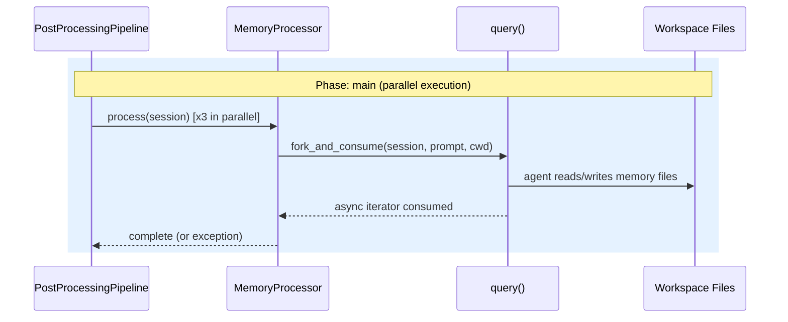

# Design: Memory Extraction

<!-- This design describes the current implementation approach. Updated through delta reconciliation. -->

**Feature Spec**: [../../feature-specs/memory/memory-extraction.md](../../feature-specs/memory/memory-extraction.md)
**Status**: Current

## Purpose

This document explains the design rationale for memory extraction: how memory processors fork SDK sessions to extract memories, and how the bootstrap hook initializes the memory directory structure.

For the post-processing pipeline infrastructure that memory processors plug into, see the [post-processing pipeline design](../agent/post-processing-pipeline.md).

## Problem Context

Conversations are ephemeral — once a session ends, the context is lost. The assistant needs a way to automatically extract and persist learnings so that future sessions can reference past interactions, known user information, and expressed preferences.

**Constraints:**
- Memory extraction happens after a conversation ends — it must not block the user or the shutdown flow
- The SDK's standalone `query()` function is the mechanism for session forking — it operates independently of the coordinator's `ClaudeSDKClient`
- All file I/O is performed by the forked LLM agent, not by processor code — processors are thin orchestration wrappers
- Memories are plain markdown files in the workspace — no database, human-readable and directly editable

**Interactions:**
- Coordinator (core-architecture): triggers pipeline on session close in `__aexit__`
- Post-processing pipeline: memory processors register in the default `main` phase (see [pipeline design](../agent/post-processing-pipeline.md))
- Sessions: provides the `Session` dataclass with `sdk_session_id` for forking
- Workspace bootstrap: memory hook creates directory structure

## Design Overview

Three **memory processors** extend `PromptDrivenProcessor` (DES-004) and plug into the [post-processing pipeline](../agent/post-processing-pipeline.md), registering in the default `main` phase and running in parallel.

```
┌───────────────────────────────────────────────────────────┐
│                       __main__.py                         │
│                                                           │
│  pipeline = PostProcessingPipeline()                      │
│  pipeline.register(EpisodicProcessor(cwd))                │
│  pipeline.register(FactsProcessor(cwd))                   │
│  pipeline.register(PreferencesProcessor(cwd))             │
│  pipeline.register(CoreContextProcessor(cwd))             │
│                                                           │
│  Coordinator(..., pipeline=pipeline)                      │
└───────────────────────────────────────────────────────────┘
                          │
           ┌──────────────┼──────────────┬──────────────┐
           ▼              ▼              ▼              ▼
      ┌─────────┐   ┌─────────┐   ┌─────────┐   ┌──────────┐
      │Episodic │   │  Facts  │   │  Prefs  │   │  Context │
      │Processor│   │Processor│   │Processor│   │ Processor│
      └────┬────┘   └────┬────┘   └────┬────┘   └────┬─────┘
           │              │              │              │
           ▼              ▼              ▼              ▼
      fork_and_consume(prompt, cwd)                fork_and_consume(
           │              │              │            prompt, cwd,
           ▼              ▼              ▼            mcp_servers=...)
      memories/      memories/      memories/           │
      episodic/      facts/         preferences/        ▼
                                                   context/ files
```

Each **memory processor** is a `PromptDrivenProcessor` subclass (DES-004) that provides an extraction prompt. The base class handles forking the SDK session via `fork_and_consume()`. The forked agent has full workspace access and autonomously reads, creates, updates, or deletes memory files — the processor code performs no file I/O.

For the context update processor that also runs in the main phase, see [core-context-updates design](../agent/core-context-updates.md).

## Components

### Implementation Structure

| Layer/Component | Responsibility | Key Decisions |
|-----------------|----------------|---------------|
| `src/tachikoma/memory/__init__.py` | Re-exports: `EpisodicProcessor`, `FactsProcessor`, `PreferencesProcessor`, `memory_hook` | Clean public API for the memory package |
| `src/tachikoma/memory/hooks.py` | `memory_hook`: creates `memories/` directory structure | Subsystem-owned hook pattern; registered after context hook |
| `src/tachikoma/memory/episodic.py` | `EpisodicProcessor(PromptDrivenProcessor)` + `EPISODIC_PROMPT` constant | Extends DES-004 base class; prompt co-located with processor |
| `src/tachikoma/memory/facts.py` | `FactsProcessor(PromptDrivenProcessor)` + `FACTS_PROMPT` constant | Extends DES-004 base class; prompt co-located with processor |
| `src/tachikoma/memory/preferences.py` | `PreferencesProcessor(PromptDrivenProcessor)` + `PREFERENCES_PROMPT` constant | Extends DES-004 base class; prompt co-located with processor |

### Cross-Layer Contracts



**Integration Points:**
- Processors ↔ Pipeline: memory processors register in the default `main` phase (see [pipeline design](../agent/post-processing-pipeline.md))
- Processors ↔ SDK: `fork_and_consume` calls `query(prompt, options=ClaudeAgentOptions(cwd=cwd, resume=session.sdk_session_id, fork_session=True, permission_mode="bypassPermissions"))` — standalone function, independent of `ClaudeSDKClient`
- Forked agents ↔ Workspace: agents read/write markdown files in `memories/` subdirectories
- Bootstrap ↔ Memory hook: `memory_hook` creates directory structure on startup

## Modeling

The domain model is minimal — no persistent entities or database tables. Memory files are unstructured markdown managed by forked LLM agents.

```
EpisodicProcessor(PromptDrivenProcessor)    [DES-004]
└── EPISODIC_PROMPT: str

FactsProcessor(PromptDrivenProcessor)       [DES-004]
└── FACTS_PROMPT: str

PreferencesProcessor(PromptDrivenProcessor) [DES-004]
└── PREFERENCES_PROMPT: str
```

Each processor inherits `_prompt`, `_cwd`, and the default `process()` implementation from `PromptDrivenProcessor`. For the base class, `PostProcessingPipeline`, `PostProcessor` ABC, and `fork_and_consume` models, see the [pipeline design](../agent/post-processing-pipeline.md).

## Data Flow

### Memory processor flow (per processor)

```
1. processor.process(session) is called
2. Base class references the extraction prompt (set in constructor via DES-004 pattern)
3. Base class calls fork_and_consume(session, self._prompt, self._cwd):
   a. Creates ClaudeAgentOptions(cwd=self._cwd, resume=session.sdk_session_id, fork_session=True, permission_mode="bypassPermissions")
   b. Calls query(prompt=prompt, options=options)
   c. Async iterates over the returned generator to consume all messages
   d. The forked agent (LLM) autonomously:
      - Reads existing files in its memory subdirectory
      - Analyzes the conversation history (via the forked session)
      - Creates, updates, or deletes memory files as needed
4. Once the async iterator is exhausted, the forked session ends
```

## Key Decisions

### Processor-per-file with co-located prompts

**Choice**: Each processor in its own file with extraction prompt as module-level constant. All three extend `PromptDrivenProcessor` (DES-004), inheriting the `process()` implementation.
**Why**: Co-locates related concerns. Each file is self-contained — just a prompt constant and a near-empty class. When iterating on extraction quality, developers modify one file per memory type.

**Consequences**:
- Pro: Self-contained files per processor
- Pro: Near-trivial subclasses thanks to DES-004 base class
- Con: Prompt changes require code changes (acceptable)

### Pipeline trigger timing — after session close, before SDK disconnect

**Choice**: Pipeline runs in `__aexit__` after `registry.close_session()` but before `client.disconnect()`.
**Why**: The pipeline uses standalone `query()` (not `ClaudeSDKClient`), so it doesn't depend on the client connection. Running before disconnect maintains clean ordering. The session must be closed first so the registry is in a consistent state.

**Consequences**:
- Pro: Clean ordering — session close → post-processing → SDK disconnect
- Pro: Pipeline independent of SDK client state
- Con: Adds latency to shutdown (acceptable — extraction runs in parallel)

## System Behavior

### Scenario: Normal shutdown with conversation history

**Given**: A conversation session with a valid `sdk_session_id`
**When**: The coordinator's `__aexit__` fires
**Then**: Session is closed. Pipeline runs all three memory processors in the main phase. Each forks the session and the forked agent reads/writes memory files. After completion, SDK client disconnects.

### Scenario: One processor fails

**Given**: Three processors running in parallel
**When**: One processor's `query()` call fails
**Then**: `asyncio.gather(return_exceptions=True)` captures the exception. Other processors complete normally. Pipeline logs the failure.

### Scenario: Trivial conversation

**Given**: Session closes with minimal content
**When**: Pipeline runs all processors
**Then**: Each forked agent determines there's nothing meaningful. No files created. Valid outcome.

### Scenario: Multiple conversations on the same day

**Given**: Two conversations close on the same date
**When**: Episodic processor runs for the second
**Then**: Agent consolidates entries for the day rather than creating duplicates.

### Scenario: User manually edits a memory file

**Given**: User edits `memories/facts/work-info.md`
**When**: Next facts processor runs
**Then**: Forked agent reads the user-edited file and respects changes.

## Notes

- Forked sessions have no `max_turns` or `max_budget_usd` limits. Extraction prompts are focused, so sessions should be naturally short.
- Memory extraction quality is an LLM behavioral concern. Prompts are the primary quality lever.
- Forked sessions require `permission_mode="bypassPermissions"` to allow the extraction agent to read and write memory files without permission prompts.
