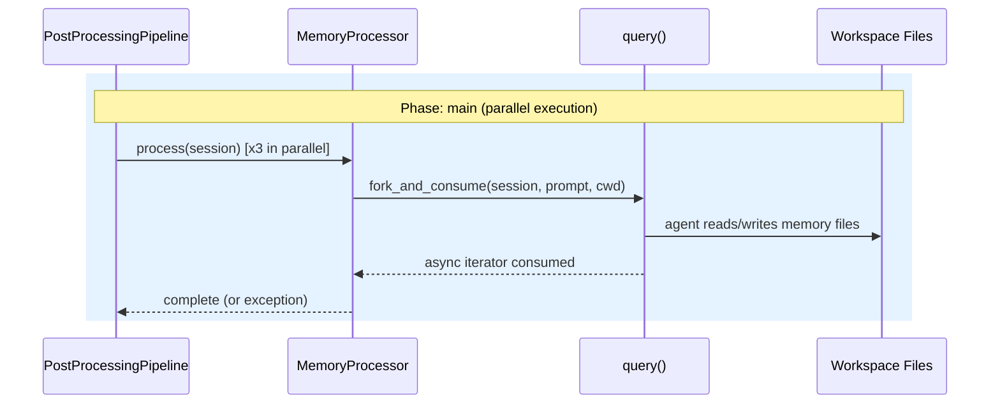
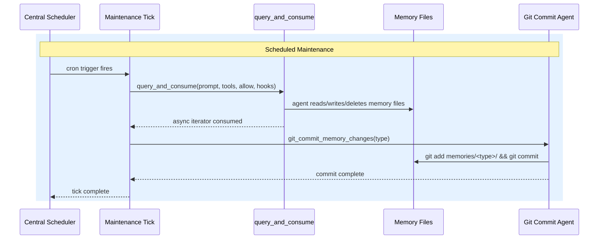

# Design: Memory Extraction

<!-- This design describes the current implementation approach. Updated through delta reconciliation. -->

**Feature Spec**: [../../feature-specs/memory/memory-extraction.md](../../feature-specs/memory/memory-extraction.md)
**Status**: Current

## Purpose

This document explains the design rationale for memory extraction: how memory processors fork SDK sessions to extract memories, how the bootstrap hook initializes the memory directory structure, and how scheduled maintenance keeps the memory store healthy over time.

For the post-processing pipeline infrastructure that memory processors plug into, see the [post-processing pipeline design](../agent/post-processing-pipeline.md).

## Problem Context

Conversations are ephemeral — once a session ends, the context is lost. The assistant needs a way to automatically extract and persist learnings so that future sessions can reference past interactions, known user information, and expressed preferences.

**Constraints:**
- Memory extraction happens after a conversation ends — it must not block the user or the shutdown flow
- The SDK's standalone `query()` function is the mechanism for session forking — it operates independently of the coordinator's `ClaudeSDKClient`
- All file I/O is performed by the forked LLM agent, not by processor code — processors are thin orchestration wrappers
- Memories are plain markdown files in the workspace — no database, human-readable and directly editable
- Maintenance runs on a schedule, not triggered by messages — must not interfere with user conversations

**Interactions:**
- Coordinator (core-architecture): triggers pipeline on session close in `__aexit__`
- Post-processing pipeline: memory processors register in the default `main` phase (see [pipeline design](../agent/post-processing-pipeline.md))
- Sessions: provides the `Session` dataclass with `sdk_session_id` for forking
- Workspace bootstrap: memory hook creates directory structure
- Central scheduler (DES-010): drives maintenance tick functions on cron schedule

## Design Overview

Three **memory processors** extend `PromptDrivenProcessor` (DES-004) and plug into the [post-processing pipeline](../agent/post-processing-pipeline.md), registering in the default `main` phase and running in parallel.

```
┌───────────────────────────────────────────────────────────┐
│                       __main__.py                         │
│                                                           │
│  pipeline = PostProcessingPipeline()                      │
│  pipeline.register(EpisodicProcessor(cwd))                │
│  pipeline.register(FactsProcessor(cwd))                   │
│  pipeline.register(PreferencesProcessor(cwd))             │
│  pipeline.register(CoreContextProcessor(cwd))             │
│                                                           │
│  Coordinator(..., pipeline=pipeline)                      │
└───────────────────────────────────────────────────────────┘
                          │
           ┌──────────────┼──────────────┬──────────────┐
           ▼              ▼              ▼              ▼
      ┌─────────┐   ┌─────────┐   ┌─────────┐   ┌──────────┐
      │Episodic │   │  Facts  │   │  Prefs  │   │  Context │
      │Processor│   │Processor│   │Processor│   │ Processor│
      └────┬────┘   └────┬────┘   └────┬────┘   └────┬─────┘
           │              │              │              │
           ▼              ▼              ▼              ▼
      fork_and_consume(prompt, cwd)                fork_and_consume(
           │              │              │            prompt, cwd,
           ▼              ▼              ▼            mcp_servers=...)
      memories/      memories/      memories/           │
      episodic/      facts/         preferences/        ▼
                                                   context/ files
```

Each **memory processor** is a `PromptDrivenProcessor` subclass (DES-004, scoped writer tier) that provides an extraction prompt. Prompts use `$WORKSPACE` placeholders for file paths (DES-008), which the base class replaces with the absolute workspace path at construction time — ensuring forked agents use absolute paths regardless of the CLI's session-restored working directory. The base class handles forking the SDK session via `fork_and_consume()`. Forked agents have `Read`, `Glob`, `Grep`, `Bash`, `Edit`, and `Write` tools (facts and preferences also have `Agent` for workspace claim validation). `Read` is unrestricted (needed for workspace claim validation on facts/preferences); `Edit` and `Write` are path-scoped to the agent's memory subdirectory. Bash is gated to utility-only commands via `UTILITY_BASH_HOOK` (DES-004). The forked agent autonomously reads, creates, updates, or deletes memory files — the processor code performs no file I/O.

Facts and preferences extraction prompts include a **Workspace Validation** section that instructs the agent to validate workspace-referencing claims (file paths, configuration values, implementation details) before writing. The agent uses the `Agent` tool to spawn lightweight read-only sub-agents (Explore type, haiku model) that verify claims against actual workspace files. Only validated claims are included in written memories; invalid claims are omitted. Episodic memories are conversation summaries that do not reference workspace state, so the episodic processor omits the validation section and does not include the `Agent` tool.

For the context update processor that also runs in the main phase, see [core-context-updates design](../agent/core-context-updates.md).

The memory package also owns `TranscriptArchiveProcessor` — a plain `PostProcessor` (not `PromptDrivenProcessor`) that copies the SDK-owned transcript into `memories/transcripts/<sdk-session-id>.jsonl` on session close. It is deterministic I/O with no LLM reasoning, registered in the `pre_finalize` phase so it runs after the extraction processors have read the SDK transcript and before the git commit processor stages the workspace. See the [post-processing pipeline design](../agent/post-processing-pipeline.md) for phase semantics.

Three **maintenance tick functions** run as scheduled jobs (DES-010), each using `query_and_consume` (shared infrastructure in `post_processing.py`) with scoped writer permissions (DES-004) and a maintenance-specific bash gate that extends utility commands with `rm` for file deletion. Each tick performs its maintenance pass and commits changes via a scoped git agent. A fourth **context maintenance tick** follows the same pattern but targets the `context/` directory instead of `memories/<type>/`, using a standalone implementation since the path structure differs from the shared `_run_maintenance_tick` helper.

```
┌──────────────────────────────────────────┐
│              Central Scheduler           │
│                (DES-010)                  │
│   priority="low" → shared semaphore      │
│   (max_concurrent_low=1 by default)      │
└──────────────┬───────────────────────────┘
               │  cron trigger (shared)
               │  ┌─── low-priority semaphore ───┐
        ┌──────┼──┼──────┬──────────┐            │
        ▼      ▼  ▼      ▼          ▼            │
   ┌────────┐┌──────┐┌──────────┐┌──────────┐   │
   │Epi Tick││Facts ││Prefs Tick││Ctx Tick  │   │
   │(+cfg)  ││Tick  ││          ││(context/)│   │
   │ [low]  ││[low] ││ [low]    ││ [low]    │   │
   └───┬────┘└──┬───┘└────┬─────┘└────┬─────┘   │
       │        │         │            │         │
       ▼        ▼         ▼            ▼         │
   _run_maintenance_tick()    context_maintenance_tick()
       │                            │
       ▼                            ▼
   query_and_consume(...)      query_and_consume(...)
       │                            │
       ▼                            ▼
   memories/<type>/            context/
       │                            │
       ▼                            ▼
   git_commit_memory_changes   git_commit_context_changes()
       │                            │
       ▼                            ▼
   git add memories/<type>/    git add context/ && commit
```

## Components

### Implementation Structure

| Layer/Component | Responsibility | Key Decisions |
|-----------------|----------------|---------------|
| `src/tachikoma/memory/__init__.py` | Re-exports: `EpisodicProcessor`, `FactsProcessor`, `PreferencesProcessor`, `TranscriptArchiveProcessor`, `memory_hook`, `episodic_maintenance_tick`, `facts_maintenance_tick`, `preferences_maintenance_tick` | Clean public API for the memory package |
| `src/tachikoma/memory/hooks.py` | `memory_hook`: creates `memories/` directory structure — `episodic/`, `facts/`, `preferences/`, and `transcripts/` subdirectories | Subsystem-owned hook pattern; registered after context hook; `transcripts/` lives alongside the extraction subdirectories because it is owned by the same package, even though it is populated by a deterministic processor |
| `src/tachikoma/memory/episodic.py` | `EpisodicProcessor(PromptDrivenProcessor)` + `EPISODIC_PROMPT` constant | Extends DES-004 base class; prompt co-located with processor |
| `src/tachikoma/memory/facts.py` | `FactsProcessor(PromptDrivenProcessor)` + `FACTS_PROMPT` constant | Extends DES-004 base class; prompt co-located with processor; prompt explicitly excludes one-time events (bug fixes, security incidents, deployments) with routing to episodic memory; includes concrete negative filename examples; adds pre-write durability check ("useful in a month?"); prompt uses shared `CONTEXT_DEDUP_SECTION` (context file + skill dedup) and `STORE_PURPOSE_SECTION` (authority hierarchy) |
| `src/tachikoma/memory/preferences.py` | `PreferencesProcessor(PromptDrivenProcessor)` + `PREFERENCES_PROMPT` constant | Extends DES-004 base class; prompt co-located with processor; prompt uses shared `CONTEXT_DEDUP_SECTION` (context file + skill dedup) and `STORE_PURPOSE_SECTION` (authority hierarchy) alongside inline AGENTS.md check |
| `src/tachikoma/memory/transcripts.py` | `TranscriptArchiveProcessor(PostProcessor)` — copies `session.transcript_path` to `memories/transcripts/<sdk-session-id>.jsonl` via `shutil.copy2` | Plain `PostProcessor` (no sub-agent — deterministic I/O); self-healing `mkdir(parents=True, exist_ok=True)` inside `process()`; all errors (`FileNotFoundError`, `OSError`) logged and swallowed so the pipeline never crashes on archival failure |
| `src/tachikoma/memory/maintenance.py` | Three memory tick functions (`episodic_maintenance_tick`, `facts_maintenance_tick`, `preferences_maintenance_tick`), shared `_run_maintenance_tick` helper, `git_commit_memory_changes` for post-agent commits, per-type maintenance prompts. Plus `context_maintenance_tick` (standalone, targets `context/`), `git_commit_context_changes`, `CONTEXT_MAINTENANCE_PROMPT`, `_build_cross_store_manifest` helper, `CONTRADICTION_DETECTION_SECTION` shared prompt constant | Uses `query_and_consume` (shared in `post_processing.py`) with DES-004 tool scoping; follows DES-010 tick function pattern; `MAINTENANCE_BASH_HOOK` composes `UTILITY_BASH_PREFIXES` + `rm` via `make_bash_gate_hook`; `git_commit_memory_changes` runs scoped git agent per tick via `has_uncommitted_changes` gate; context tick is standalone (not via shared helper) because the path structure (`context/` vs `memories/<type>/`) differs; ticks append `STORE_PURPOSE_SECTION`, cross-store manifest, and `CONTRADICTION_DETECTION_SECTION` to their prompts |

### Cross-Layer Contracts


```mermaid
sequenceDiagram
    participant Pipeline as PostProcessingPipeline
    participant Proc as MemoryProcessor
    participant SDK as query()
    participant FS as Workspace Files

    rect rgba(0, 128, 255, 0.1)
        Note over Pipeline,FS: Phase: main (parallel execution)
        Pipeline->>Proc: process(session) [x3 in parallel]
        Proc->>SDK: fork_and_consume(session, prompt, cwd)
        SDK->>FS: agent reads/writes memory files
        SDK-->>Proc: async iterator consumed
        Proc-->>Pipeline: complete (or exception)
    end
```

**Integration Points:**
- Processors ↔ Pipeline: memory processors register in the default `main` phase (see [pipeline design](../agent/post-processing-pipeline.md))
- Processors ↔ SDK: `fork_and_consume` calls `query(prompt, options=ClaudeAgentOptions(cwd=cwd, resume=session.sdk_session_id, fork_session=True, permission_mode="bypassPermissions"))` — standalone function, independent of `ClaudeSDKClient`
- Forked agents ↔ Workspace: agents read/write markdown files in `memories/` subdirectories
- Bootstrap ↔ Memory hook: `memory_hook` creates directory structure on startup

### Maintenance Cross-Layer Contract


```mermaid
sequenceDiagram
    participant Scheduler as Central Scheduler
    participant Tick as Maintenance Tick
    participant SDK as query_and_consume
    participant FS as Memory Files
    participant Git as Git Commit Agent

    rect rgba(0, 128, 255, 0.1)
        Note over Scheduler,Git: Scheduled Maintenance
        Scheduler->>Tick: cron trigger fires
        Tick->>SDK: query_and_consume(prompt, tools, allow, hooks)
        SDK->>FS: agent reads/writes/deletes memory files
        SDK-->>Tick: async iterator consumed
        Tick->>Git: git_commit_memory_changes(type)
        Git->>FS: git add memories/<type>/ && git commit
        Git-->>Tick: commit complete
        Tick-->>Scheduler: tick complete
    end
```

**Integration Points:**
- Ticks ↔ Scheduler: `CronTrigger` fires on shared cron schedule; conditional on `enabled` flag (DES-010)
- Ticks ↔ SDK: `query_and_consume` creates fresh sessions (no session forking — independent of conversations)
- Maintenance agents ↔ Workspace: agents read/write/delete files in `memories/<type>/` subdirectory
- Git commit ↔ Workspace: `has_uncommitted_changes` gates the commit; scoped `git add` stages only the affected subdirectory

## Modeling

The domain model is minimal — no persistent entities or database tables. Memory files are unstructured markdown managed by forked LLM agents.

```
EpisodicProcessor(PromptDrivenProcessor)    [DES-004]
└── EPISODIC_PROMPT: str

FactsProcessor(PromptDrivenProcessor)       [DES-004]
└── FACTS_PROMPT: str

PreferencesProcessor(PromptDrivenProcessor) [DES-004]
└── PREFERENCES_PROMPT: str
```

```
MemoryMaintenance                              [DES-010 + DES-004]
├── episodic_maintenance_tick(settings) → None   [tiered consolidation]
├── facts_maintenance_tick() → None              [staleness/redundancy/overlap]
├── preferences_maintenance_tick() → None        [redundancy/overlap]
├── context_maintenance_tick() → None            [staleness/redundancy/overlap/size limits]
├── _run_maintenance_tick(type, prompt) → None   [shared composition helper]
├── _build_cross_store_manifest(cwd, target) → str | None  [cross-store file manifest from filesystem]
├── CONTRADICTION_DETECTION_SECTION: str         [shared prompt for cross-store contradiction resolution]
├── git_commit_memory_changes(type) → None       [scoped git add/commit]
└── git_commit_context_changes() → None          [scoped git add context/]

MaintenanceSettings(BaseModel)                  [in config.py]
├── enabled: bool (default: true)
├── schedule: str (default: "0 3 * * *")
├── recent_days: int (default: 15)
├── weekly_threshold_months: int (default: 3)
└── monthly_threshold_months: int (default: 12)
```

Maintenance tick functions use `processor_model` (default haiku) for the same reason as extraction processors — mechanical work that doesn't benefit from higher-tier reasoning. Unlike extraction processors which extend `PromptDrivenProcessor` (pipeline-driven, session-forking), maintenance ticks are scheduler-driven and session-independent, so a shared helper function is the right abstraction.

Each processor inherits `_prompt`, `_cwd`, and the default `process()` implementation from `PromptDrivenProcessor`. All three pass `model=agent_defaults.processor_model` at construction so their forks run on the configured mechanical-work model tier (default `"haiku"`). Mechanical extraction doesn't benefit from higher-tier reasoning, and smaller requests are less likely to trip upstream rate limits when the pipeline fires multiple forks concurrently on session close. The `processor_model` setting is shared across all post-processors (see DES-004 for the role taxonomy). For the base class, `PostProcessingPipeline`, `PostProcessor` ABC, and `fork_and_consume` models, see the [pipeline design](../agent/post-processing-pipeline.md).

## Data Flow

### Memory processor flow (per processor)

```
1. processor.process(session) is called
2. Base class references the extraction prompt (set in constructor via DES-004 pattern)
3. Base class calls fork_and_consume(session, self._prompt, self._cwd):
   a. Creates ClaudeAgentOptions(cwd=self._cwd, resume=session.sdk_session_id, fork_session=True)
   b. Calls query(prompt=prompt, options=options)
   c. Async iterates over the returned generator to consume all messages
   d. The forked agent (LLM) autonomously:
      - Reads existing files in its memory subdirectory
      - Analyzes the conversation history (via the forked session)
      - For preferences: reads `$WORKSPACE/context/AGENTS.md` and skips
        creating files for preferences already captured there
      - For facts/preferences: uses STORE_PURPOSE_SECTION to understand
        the authority hierarchy for information routing
      - For facts/preferences: uses shared CONTEXT_DEDUP_SECTION to check
        context files and active skill files before creating memories
      - For facts/preferences: validates workspace-referencing claims by
        spawning read-only sub-agents (Agent tool, Explore type, haiku)
        to verify claims; omits claims that fail validation
      - Creates, updates, or deletes memory files
4. Once the async iterator is exhausted, the forked session ends
```

### Transcript archival flow

```
1. TranscriptArchiveProcessor.process(session) runs in the pre_finalize phase
2. If session.transcript_path is None or session.sdk_session_id is None → debug log, return
3. dest_dir = cwd / "memories" / "transcripts"
4. dest = dest_dir / f"{session.sdk_session_id}.jsonl"
5. dest_dir.mkdir(parents=True, exist_ok=True)   — self-healing if removed after bootstrap
6. shutil.copy2(Path(session.transcript_path), dest)
   - FileNotFoundError → warning log, return
   - OSError → error log with traceback, return
7. On success: info log with session id and destination path
8. The finalize phase's GitProcessor picks up the new/updated file via its normal "stage everything in workspace" behavior
```

### Maintenance tick flow (per memory type)

```
1. Scheduler fires cron trigger for maintenance job
2. Tick function builds scoped allow rules for memory subdirectory
3. Tick function builds prompt with configured thresholds (episodic)
   or fixed strategy (facts/preferences)
4. _run_maintenance_tick assembles the final prompt:
   a. Appends skill catalog section (if registry has skills)
   b. Appends STORE_PURPOSE_SECTION (authority hierarchy)
   c. Appends cross-store manifest from _build_cross_store_manifest (if other stores have files)
   d. Appends CONTRADICTION_DETECTION_SECTION
5. _run_maintenance_tick calls query_and_consume with:
   - MAINTENANCE_TOOLS (Read, Glob, Grep, Bash, Edit, Write)
   - Scoped allow rules (Edit/Write path-scoped, Read/Glob/Grep/Bash unrestricted)
   - MAINTENANCE_BASH_HOOK (utility commands + rm)
   - processor_model for cost efficiency
6. Agent reads directory, performs maintenance, exits
7. git_commit_memory_changes checks for uncommitted changes
   via has_uncommitted_changes():
   - If changes exist: runs scoped git agent to stage and commit
   - If no changes: skips (idempotent no-op)
```

### Context maintenance tick flow

```
1. Scheduler fires cron trigger for context maintenance job
2. context_maintenance_tick builds scoped allow rules for context/ directory
3. context_maintenance_tick assembles the final prompt:
   a. Appends skill catalog section (if registry has skills)
   b. Appends STORE_PURPOSE_SECTION (authority hierarchy)
   c. Appends cross-store manifest from _build_cross_store_manifest (if other stores have files)
   d. Appends CONTRADICTION_DETECTION_SECTION
4. context_maintenance_tick calls query_and_consume with:
   - MAINTENANCE_TOOLS (Read, Glob, Grep, Bash, Edit, Write)
   - Scoped allow rules (Edit/Write path-scoped to context/, Read unrestricted)
   - MAINTENANCE_BASH_HOOK (utility commands only — no rm needed)
   - processor_model for cost efficiency
5. Agent reads context files, evaluates staleness/redundancy/overlap,
   enforces size limits, exits
6. git_commit_context_changes checks for uncommitted changes
   via has_uncommitted_changes():
   - If changes exist: runs scoped git agent to stage context/ and commit
   - If no changes: skips (idempotent no-op)
```

## Key Decisions

### Processor-per-file with co-located prompts

**Choice**: Each processor in its own file with extraction prompt as module-level constant. All three extend `PromptDrivenProcessor` (DES-004), inheriting the `process()` implementation.
**Why**: Co-locates related concerns. Each file is self-contained — just a prompt constant and a near-empty class. When iterating on extraction quality, developers modify one file per memory type.

**Consequences**:
- Pro: Self-contained files per processor
- Pro: Near-trivial subclasses thanks to DES-004 base class
- Con: Prompt changes require code changes (acceptable)

### Pipeline trigger timing — after session close, before SDK disconnect

**Choice**: Pipeline runs in `__aexit__` after `registry.close_session()` but before `client.disconnect()`.
**Why**: The pipeline uses standalone `query()` (not `ClaudeSDKClient`), so it doesn't depend on the client connection. Running before disconnect maintains clean ordering. The session must be closed first so the registry is in a consistent state.

**Consequences**:
- Pro: Clean ordering — session close → post-processing → SDK disconnect
- Pro: Pipeline independent of SDK client state
- Con: Adds latency to shutdown (acceptable — extraction runs in parallel)

### Plain `PostProcessor` for transcript archival (no sub-agent)

**Choice**: `TranscriptArchiveProcessor` extends `PostProcessor` directly — no forked sub-agent, just `shutil.copy2` with `loguru` logging.
**Why**: Copying a file has no reasoning component. Forking a sub-agent (DES-004 `PromptDrivenProcessor`) would add LLM latency, cost, and failure modes for deterministic I/O. DES-004 is scoped to sub-agent spawning; plain `PostProcessor` remains the right choice when the task is purely mechanical.

**Consequences**:
- Pro: No prompt/tool/permission configuration — processor module is stdlib-only
- Pro: Tests run with pure filesystem assertions (no LLM mocks)
- Pro: Establishes precedent (alongside `StaleWorkflowCleanupProcessor`) that deterministic processors live in the same pipeline as sub-agent processors without ceremony

### `pre_finalize` phase for transcript archival

**Choice**: Register `TranscriptArchiveProcessor` on the `pre_finalize` phase.
**Why**: (a) The `main` phase's memory processors read the SDK transcript — they must complete before we copy it, otherwise we race their reads. (b) The `finalize` phase is `GitProcessor`'s — the archive must already be on disk when git stages. `pre_finalize` is the only phase that satisfies both constraints.

**Consequences**:
- Pro: Archive is guaranteed present for the git commit without coordinating with `finalize` processors
- Pro: Runs concurrently with other `pre_finalize` processors (`ProjectsProcessor`, `StaleWorkflowCleanupProcessor`) — disjoint filesystem scopes, no conflict

### Archived path derived from `sdk_session_id`

**Choice**: The archived path is always `memories/transcripts/<sdk-session-id>.jsonl` — computed from the session's existing `sdk_session_id` field. No `archived_transcript_path` column is added.
**Why**: The SDK session ID is already globally unique, already stored on `Session`, and already filesystem-safe. Adding a column would duplicate information the system can compute.

**Consequences**:
- Pro: Zero migration cost
- Pro: Consumers compute the path with a one-line helper or inline `f-string`
- Con: A future scheme change (different filename, different location) becomes a code change rather than a data migration — acceptable given the single source of archival logic

### Defensive `mkdir` inside `process()` (self-healing)

**Choice**: The processor calls `dest_dir.mkdir(parents=True, exist_ok=True)` on every run in addition to the bootstrap hook creating the directory at startup.
**Why**: Handles the edge case where `memories/transcripts/` is removed between bootstrap and session close (manual cleanup, fresh clone, etc.). Cost is negligible and the "log and continue" error policy absorbs any mkdir failure.

**Consequences**:
- Pro: Processor survives directory deletion mid-run
- Pro: No special-case error-handling branch required for the missing-directory AC

### Scheduler jobs instead of task definitions

**Choice**: Wire maintenance as scheduler jobs (like update checker, one-shot cleanup) rather than task definitions in the database.
**Why**: Mixing system-owned behavior into the user-facing task subsystem creates confusing patterns — users would see system tasks they didn't create, and the task tools would need special-casing for system ownership. The scheduler tick pattern (DES-010) already exists for system-level work.

**Consequences**:
- Pro: Clean separation — system work stays in the scheduler, user work stays in the task subsystem
- Con: No execution history in the database (only logs)

### Post-maintenance git commit

**Choice**: Each tick function runs a scoped git agent after the maintenance agent completes, gated by `has_uncommitted_changes`.
**Why**: Maintenance changes (consolidated summaries, removed files, merged entries) should be committed promptly so git history reflects what happened. Without this, changes sit uncommitted until the next session close's git processor picks them up.

**Consequences**:
- Pro: Git history is a clear audit trail of maintenance activity
- Con: Three extra agent calls per night (one per type), minimal cost since the commit agent is lightweight

### Bash gate with rm for file deletion

**Choice**: Extend `UTILITY_BASH_PREFIXES` with `rm` to create `MAINTENANCE_BASH_PREFIXES`, composed via `make_bash_gate_hook`.
**Why**: Maintenance agents need to delete files (removing obsolete facts, deleting old episodic entries after consolidation). The existing utility hook only allows read-only commands.

**Consequences**:
- Pro: Simple, leverages existing DES-004 infrastructure
- Con: `rm` is not path-scoped by the bash gate — mitigated by prompt restrictions (agent instructed to only delete in the target directory) and git rollback

### Configuration in [memory.maintenance]

**Choice**: New `[memory]` section in config.toml with a `[memory.maintenance]` subsection containing `enabled`, `schedule`, `recent_days`, `weekly_threshold_months`, and `monthly_threshold_months`.
**Why**: Follows the existing nested config pattern. A new top-level `memory` section leaves room for future memory configuration without crowding existing sections. Existing configs work seamlessly — `extra="ignore"` and default factories apply.

**Consequences**:
- Pro: Clean config organization; memory settings are self-contained and discoverable
- Con: One new Pydantic model and field on `Settings` (minor boilerplate)

### Shared maintenance tick helper

**Choice**: Extract `_run_maintenance_tick(type, prompt)` shared helper that handles the common pattern of building scoped rules, calling `query_and_consume`, and committing changes. Extraction processors don't use this helper — they extend `PromptDrivenProcessor` because they're pipeline-driven and need the session forking contract. Maintenance ticks are scheduler-driven and session-independent, so a shared function is the right abstraction.

**Why**: All three maintenance ticks follow the same structure — only the prompt differs.

**Consequences**:
- Pro: Eliminates duplication across three tick functions
- Pro: Single place to update if the maintenance execution pattern changes

### Standalone context maintenance tick (not via shared helper)

**Choice**: `context_maintenance_tick` is a standalone function rather than using `_run_maintenance_tick`. It has its own `git_commit_context_changes` helper instead of reusing `git_commit_memory_changes`.
**Why**: The shared helper hardcodes the scope as `cwd / "memories" / memory_type`. Context files live at `cwd / "context"` — a different path structure that doesn't fit the `memories/<type>/` pattern. Generalizing the shared helper would add complexity for minimal reuse (one additional call site). The standalone approach keeps the shared helper simple and avoids changing existing memory tick behavior.

**Consequences**:
- Pro: No risk of breaking existing maintenance ticks
- Pro: Context tick can evolve independently (e.g., different bash permissions, different commit strategy)
- Con: ~15 lines of similar code duplicated between `context_maintenance_tick` and `_run_maintenance_tick` (acceptable for a single additional call site)

### Cross-store visibility and contradiction detection in maintenance

**Choice**: Maintenance ticks (facts, preferences, context) append three shared sections to their prompts: `STORE_PURPOSE_SECTION` (defining each store's role and the authority hierarchy), a cross-store file manifest (built by `_build_cross_store_manifest` from filesystem listings), and `CONTRADICTION_DETECTION_SECTION` (instructions for resolving cross-store contradictions using the authority hierarchy). The manifest lists file names and paths only, not content — agents read the files themselves if needed.
**Why**: Without cross-store visibility, maintenance agents operated in isolation — a fact file and a context file could contain contradictory information indefinitely because each store's maintenance tick only saw its own files. The manifest gives agents awareness of what exists elsewhere, and the contradiction detection section provides structured instructions for resolving conflicts using the authority hierarchy (Skills > Memory facts > Context files). The `STORE_PURPOSE_SECTION` reinforces correct information routing during cleanup.

**Consequences**:
- Pro: Cross-store contradictions are detected and resolved during normal maintenance cycles
- Pro: Shared constants ensure consistent authority hierarchy and detection instructions across all ticks
- Pro: Manifest is built from filesystem listings (no database dependency)
- Pro: Omission-safe — when no other stores have files, the manifest section is silently omitted
- Con: Maintenance agents read additional files from other stores (small overhead; agents only read when they detect potential contradictions)
- Con: Contradiction resolution effectiveness depends on LLM interpretation

## System Behavior

### Scenario: Normal episodic maintenance run

**Given**: The episodic directory has daily files spanning 4 months, including some already-consolidated weekly summaries from a previous run
**When**: The episodic maintenance tick fires on its cron schedule
**Then**: The agent cleans verbosity from recent files (last 15 days), consolidates older files into weekly summaries (merging into existing ones where present), and commits changes. A second run produces no changes (idempotent).

### Scenario: Empty memory store

**Given**: The memory directory for a type exists but is empty (no files)
**When**: The maintenance tick fires
**Then**: The agent reads the directory, finds nothing to process, exits with no changes. No git commit is attempted.

### Scenario: Maintenance agent fails mid-run

**Given**: The maintenance agent encounters an error partway through processing
**When**: The error propagates out of `query_and_consume`
**Then**: The scheduler's error containment catches it, logs the error, and other maintenance jobs are unaffected. Partial changes from the failed agent remain on disk uncommitted — this is the safe state, with git rollback available.

### Scenario: Concurrent access during maintenance

**Given**: A user is actively chatting while maintenance runs
**When**: The maintenance agent reads and edits files that the post-processing pipeline might also be writing to
**Then**: The agent's view reflects whatever state it read. No locking is needed — the worst case is that a file is processed in its next-run state on the following night. Git provides rollback for any mistakes.

### Scenario: Configuration changes mid-stream

**Given**: The user changes `recent_days` from 15 to 30 in config.toml
**When**: The maintenance tick fires
**Then**: The tick function reads the current config value at call time (passed through from the settings object). The agent uses the new threshold (30 days) for its consolidation decisions.

### Scenario: Normal context maintenance run

**Given**: AGENTS.md has accumulated entries about resolved bugs and USER.md has stale project references, plus AGENTS.md exceeds 400 lines
**When**: The context maintenance tick fires on its cron schedule
**Then**: The agent reads all three context files, removes stale entries, consolidates duplicate sections, prunes AGENTS.md to under 400 lines, and commits changes scoped to `context/`. A second run produces no changes (idempotent).

### Scenario: Context files already clean

**Given**: All three context files are within size limits and contain no stale, redundant, or overlapping content
**When**: The context maintenance tick fires
**Then**: The agent reads the files, determines no changes are needed, exits with no changes. No git commit is attempted.

### Scenario: Normal shutdown with conversation history

**Given**: A conversation session with a valid `sdk_session_id`
**When**: The coordinator's `__aexit__` fires
**Then**: Session is closed. Pipeline runs all three memory processors in the main phase. Each forks the session and the forked agent reads/writes memory files. After completion, SDK client disconnects.

### Scenario: One processor fails

**Given**: Three processors running in parallel
**When**: One processor's `query()` call fails
**Then**: `asyncio.gather(return_exceptions=True)` captures the exception. Other processors complete normally. Pipeline logs the failure.

### Scenario: Trivial conversation

**Given**: Session closes with minimal content
**When**: Pipeline runs all processors
**Then**: Each forked agent determines there's nothing meaningful. No files created. Valid outcome.

### Scenario: Multiple conversations on the same day

**Given**: Two conversations close on the same date
**When**: Episodic processor runs for the second
**Then**: Agent consolidates entries for the day rather than creating duplicates.

### Scenario: User manually edits a memory file

**Given**: User edits `memories/facts/work-info.md`
**When**: Next facts processor runs
**Then**: Forked agent reads the user-edited file and respects changes.

### Scenario: Preference already captured in AGENTS.md

**Given**: A conversation where the user restates a preference already present in `context/AGENTS.md`
**When**: The preferences processor runs
**Then**: The forked agent reads AGENTS.md, detects the overlap, and skips creating a preference file — the information is already stored where it belongs.

### Scenario: AGENTS.md missing during preferences extraction

**Given**: A workspace without `context/AGENTS.md`
**When**: The preferences processor runs
**Then**: The forked agent proceeds normally — the dedup check is gracefully skipped and preferences are created or updated as usual.

### Scenario: Transcript archived on session close

**Given**: A closing session with populated `transcript_path` and `sdk_session_id`, and the SDK transcript file exists at that path
**When**: The post-processing pipeline advances through `pre_finalize`
**Then**: `TranscriptArchiveProcessor` copies the file to `memories/transcripts/<sdk-session-id>.jsonl`. The subsequent `finalize` phase's `GitProcessor` stages and commits the new file alongside the extracted memories.

### Scenario: SDK transcript already gone at archive time

**Given**: A closing session whose `transcript_path` points at a file removed before `pre_finalize` runs (e.g., `~/.claude` wiped between session end and post-processing)
**When**: `TranscriptArchiveProcessor.process(session)` runs
**Then**: `FileNotFoundError` is caught, a warning is logged with both source and destination paths, and the processor returns normally. Other `pre_finalize` processors and the `finalize` git commit are unaffected.

### Scenario: Filesystem error during archive

**Given**: The destination is read-only, disk is full, or any other `OSError` condition
**When**: `shutil.copy2` raises
**Then**: The error is logged with traceback, and the processor returns normally. The git commit still runs and commits whatever other workspace changes exist.

### Scenario: Archive directory missing at copy time

**Given**: `memories/transcripts/` was removed after bootstrap (manual cleanup, fresh clone)
**When**: The processor runs
**Then**: `mkdir(parents=True, exist_ok=True)` recreates it, then the copy proceeds. No error surfaces.

### Scenario: Idempotent re-archival

**Given**: A prior run already produced `memories/transcripts/<sid>.jsonl` (complete or partial)
**When**: The processor runs again for the same session
**Then**: `shutil.copy2` overwrites the destination. The final file matches the current source.

## Notes

- Forked sessions have no `max_turns` or `max_budget_usd` limits. Extraction prompts are focused, so sessions should be naturally short.
- Memory extraction quality is an LLM behavioral concern. Prompts are the primary quality lever.
- Forked sessions use `dontAsk` permission mode with explicit allow rules (DES-004). Read access is unrestricted; Edit/Write are path-scoped to the memory subdirectory.
- Maintenance agents run on the `processor_model` tier (default haiku) — like extraction agents, maintenance is mechanical work that doesn't benefit from higher-tier reasoning.

### Workspace claim validation via in-agent sub-agents (facts, preferences, and context)

**Choice**: Facts and preferences extraction prompts include a validation section instructing the agent to verify workspace-referencing claims using the `Agent` tool before writing. The agent spawns lightweight read-only sub-agents (Explore type, haiku model) that check claims against actual files. The episodic processor does not include this validation — episodic memories are conversation summaries that do not reference workspace state, so validation adds overhead without accuracy benefit. The validation prompt section (`WORKSPACE_VALIDATION_SECTION`) is defined in `post_processing.py` and shared with the core context update processor, which applies the same pattern to context file updates (SOUL.md, USER.md, AGENTS.md).
**Why**: Memories can contain stale or inaccurate claims about workspace state (file paths, configuration values, implementation details) that were accurate during conversation but became invalid by extraction time. Validating before writing prevents persisting bad data. Using in-agent sub-agents avoids creating new Python modules or pipeline phases — the prompt is the implementation. Episodic memories capture high-level narrative arcs, not workspace-specific claims, so validation is unnecessary for that processor.

**Consequences**:
- Pro: No new pipeline phase or preprocessor — purely prompt-driven
- Pro: Invalid claims are omitted, preventing stale memories from accumulating
- Pro: Read-only sub-agents cannot modify workspace state
- Pro: Episodic processor avoids unnecessary validation overhead
- Pro: Shared prompt section ensures consistent validation behavior across memory and context processors
- Con: Adds API cost (haiku sub-agents for validation) and extraction latency for facts/preferences
- Con: Unrestricted `Read` access expands facts/preferences agents' visibility beyond their memory directory (necessary for validation; write remains scoped)

### Prompt-driven pruning of stale entries

**Choice**: Extraction prompts include a pruning section instructing the agent to proactively identify and remove stale, outdated, or superseded entries when reading existing memory files. The agent compares conversation content against existing files and removes entries that are contradicted, superseded, or no longer relevant. Episodic memory is explicitly excluded — entries are never deleted for content reasons.
**Why**: Memory files accumulate stale content over time because processors only add or update entries. The existing prompts already grant delete permissions and mention "delete outdated files," but provide no criteria for when to prune. Adding explicit detection guidance (contradicted information, completed projects, reversed preferences) with conservative guardrails ("do NOT prune based on vague hints") makes the existing capability actionable without code changes.

**Consequences**:
- Pro: No code changes — purely prompt-driven, consistent with DES-004 pattern
- Pro: Files stay lean and current without scheduled maintenance
- Pro: Conservative guardrails prevent premature deletion of valid entries
- Con: Pruning effectiveness depends on LLM interpretation of staleness signals

### Context file deduplication via prompt instruction (facts and preferences)

**Choice**: Both facts and preferences extraction use a shared `CONTEXT_DEDUP_SECTION` prompt that combines context file checking (reads all three foundational context files: AGENTS.md, USER.md, SOUL.md) and skill dedup (reads active skill files listed in the context summary) into a single unified section. Preferences extraction also has an additional inline AGENTS.md check integrated directly into its extraction steps (step 1 reads AGENTS.md alongside existing preferences; step 3 searches AGENTS.md for overlap before creating files). Both processors include `STORE_PURPOSE_SECTION` defining the authority hierarchy (Skills > Memory facts > Context files). The episodic processor does not include dedup — episodic memories are conversation summaries that do not duplicate context file content.
**Why**: The prompts mentioned context files in their "DO NOT store" lists but this was passive guidance — agents never actively checked. This led to memory files that directly duplicated context file content (response gates, communication style, workflow details), creating confusion about which source was authoritative. Using a single shared section for both context file and skill dedup ensures consistent behavior across both processors. For preferences, the inline AGENTS.md check targets the most common source of duplication (operational and workflow preferences captured in AGENTS.md) with graceful fallback when the file is absent. The `STORE_PURPOSE_SECTION` gives agents explicit authority hierarchy guidance for routing decisions.

**Consequences**:
- Pro: No code changes beyond prompt text — consistent with DES-004 pattern
- Pro: Shared section keeps dedup consistent across both processors and easy to update
- Pro: Preferences inline check is more targeted and contextual (integrated into extraction steps)
- Pro: Context files remain authoritative; memory files supplement rather than duplicate
- Pro: Graceful fallback for preferences when AGENTS.md is absent
- Pro: Authority hierarchy is explicit rather than implicit
- Con: Agents read additional files per extraction (small overhead; files are small)
- Con: Dedup effectiveness depends on LLM interpretation of "already covered"

### File consolidation at write time and during maintenance (facts and preferences)

**Choice**: Facts and preferences extraction prompts include a "File Consolidation at Write Time" section that instructs the agent to list the target directory first, identify the broadest existing file that covers the topic, prefer updating it over creating a sibling, and — when creation is unavoidable — use a broad topic name (`<project>.md`, `<system>.md`, `<topic-area>-style.md`, etc.) so future related extracts merge in. The facts and preferences maintenance prompts include a matching "Cluster Consolidation" subsection that detects 3+ files sharing a prefix or core topic and merges them into a single broad-topic file using the same naming convention. Episodic maintenance is excluded because episodic names are date-based by design; context maintenance is excluded because it operates on a fixed three-file set, not a growing directory.

**Why**: Extraction was already told to "search for existing overlap" but in practice produced narrow incident- and date-named files (e.g., per-bug, per-patch, per-occasion). Creation accumulated far faster than nightly maintenance could consolidate (creation vs. maintenance commits ran roughly 97% / 3%), and existing maintenance only caught obvious pairwise duplicates, not large same-prefix clusters. Sharpening extraction with explicit positive/negative examples discourages narrow files at write time, and giving maintenance a cluster-detection rule with the same naming convention ensures the two stages converge on the same target shape instead of fighting each other. The 3-file threshold is the smallest count that meaningfully signals "topic fragmentation" rather than ordinary pairwise overlap (which the existing Overlap section already handles). Generic placeholder examples (`<project>.md`, `<topic-area>-style.md`) keep the guidance portable across users of the same code.

**Consequences**:
- Pro: No code changes beyond prompt text — consistent with DES-004 pattern
- Pro: Write-time and maintenance-time consolidation use the same naming convention, so the system converges instead of oscillating
- Pro: Generic placeholders make the prompts portable; no workspace-specific names baked in
- Pro: Episodic and context prompts are unchanged — the rule applies only where directory growth is unbounded
- Con: Compliance depends on LLM interpretation; some narrow files will still slip through and require maintenance to clean up
- Con: Aggressive cluster merging could occasionally combine genuinely distinct sub-topics under a single broad heading — mitigated by preserving substantive content during merge and by git rollback availability
