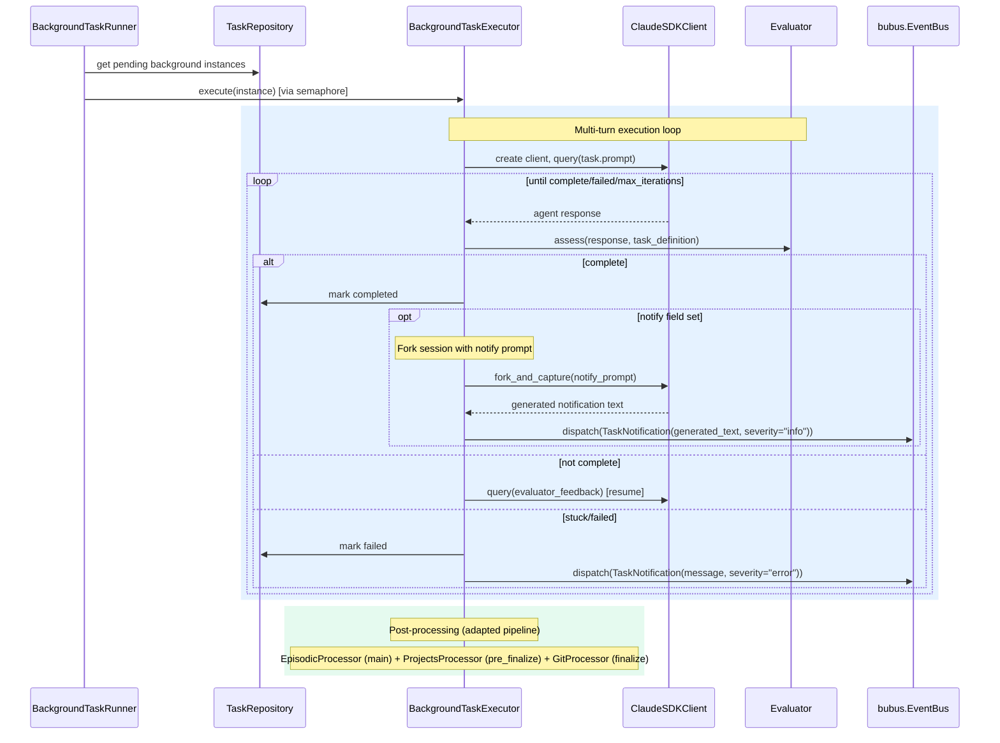

# Design: Background Task Execution

<!-- This design describes the current implementation approach. Updated through delta reconciliation. -->

**Feature Spec**: [../../feature-specs/tasks/background-task-execution.md](../../feature-specs/tasks/background-task-execution.md)
**Status**: Current

## Purpose

This document explains the design rationale for background task execution: the executor's SDK session management, evaluator loop, adapted pipeline, and notification delivery.

## Problem Context

Background tasks need to run in isolated sessions with multi-turn conversation support (the evaluator drives additional turns based on completion assessment). The executor reuses the coordinator's SDK session management pattern but with different concerns: an evaluator replaces the user, a restricted post-processing pipeline runs, and notifications are dispatched on completion or failure.

**Constraints:**
- Background tasks must not interfere with the main conversation session
- The evaluator needs multi-turn conversation continuity via `resume`
- Post-processing must be selective (episodic + project submodule commit + git only)
- Concurrency must be bounded to avoid resource exhaustion
- Uses the SDK's `query()` and `receive_response()` per DES-005

**Interactions:**
- Task repository (`task-management`): queries pending background instances, updates status
- Post-processing pipeline (`post-processing-pipeline`): separate pipeline instance with selective processors
- Event bus (ADR-009): dispatches `TaskNotification` events on completion/failure
- Channels (`telegram`, `terminal-repl`): subscribe to `TaskNotification` for delivery
- SDK (`core-architecture`): `ClaudeSDKClient` with `resume` for multi-turn execution

## Design Overview

Two components work together: the `BackgroundTaskRunner` (async loop picking up pending instances) and the `BackgroundTaskExecutor` (manages a single task's SDK session lifecycle with evaluator loop). The runner gates concurrency via `asyncio.Semaphore`.

```
┌────────────────────────────────────────────────────────────────┐
│                    BackgroundTaskRunner                          │
│  (async loop, picks up pending background instances)            │
│  ┌──────────────────────────────────────────────────────────┐  │
│  │  asyncio.Semaphore(max_concurrent)                       │  │
│  │  ┌──────────────────┐ ┌──────────────────┐              │  │
│  │  │ BackgroundTask   │ │ BackgroundTask   │ ...           │  │
│  │  │ Executor         │ │ Executor         │              │  │
│  │  │ (single task)    │ │ (single task)    │              │  │
│  │  └──────────────────┘ └──────────────────┘              │  │
│  └──────────────────────────────────────────────────────────┘  │
└────────────────────────────────────────────────────────────────┘
```

## Components

### Implementation Structure

| Layer/Component | Responsibility | Key Decisions |
|-----------------|----------------|---------------|
| `src/tachikoma/tasks/executor.py` | `background_task_runner()` — async loop picking up pending background instances; `BackgroundTaskExecutor` — manages single task's SDK session lifecycle with evaluator loop; injects current date/time in configured timezone into system prompt; dispatches `TaskNotification` events | Coordinator-like SDK client management; `asyncio.Semaphore` for concurrency; datetime injection via `get_timezone(settings)` + `datetime.now(tz)` prepended to `BACKGROUND_TASK_SYSTEM_PROMPT`; full `PreProcessingPipeline` (memory, projects, skills); separate `PostProcessingPipeline` with `EpisodicProcessor` (main phase) + `ProjectsProcessor` (pre_finalize phase) + `GitProcessor` (finalize phase) |
| `src/tachikoma/tasks/events.py` | `TaskNotification(BaseEvent)` — typed event carrying `prompt: str` (coordinator-routed notification prompt), `source_task_id: str | None`, and `severity: str` ("info" or "error"); channels subscribe and enqueue the prompt into the coordinator for pipeline-routed delivery | Pydantic `BaseEvent` subclass for typed dispatch |

### Cross-Layer Contracts

**Background task execution:**



**Integration Points:**
- Runner ↔ Repository: queries pending background instances, marks as running
- Executor ↔ SDK: per-task `ClaudeSDKClient` with `resume` for multi-turn
- Executor ↔ Evaluator: lightweight model assessment after each agent response
- Executor ↔ Event bus: dispatches `TaskNotification` on completion/failure
- Executor ↔ Pre-processing pipeline: full `PreProcessingPipeline` with memory, projects, skills providers; extracts MCP servers and agents into SDK options
- Executor ↔ Post-processing pipeline: separate `PostProcessingPipeline` instance with selective processors
- Executor ↔ `fork_and_capture` (`post_processing.py`): forks task session for notification generation

**Error contract:**
- Runner loop errors: logged, continues on next tick
- Executor errors: instance marked `failed`, `TaskNotification` dispatched
- Post-processing errors: logged, don't affect task completion status

## Data Flow

### Background task execution flow

```
1. Background task runner loop wakes up (~30s interval)
2. Query pending background task instances
3. For each instance (gated by asyncio.Semaphore, max_concurrent=3):
   a. Mark instance as running
   b. Create BackgroundTaskExecutor with:
      - Full pre-processing pipeline (memory, projects, skills context providers)
      - Adapted system prompt prepended with current date/time in configured timezone (task context + instructions)
      - Adapted post-processing pipeline (EpisodicProcessor in main phase + ProjectsProcessor in pre_finalize phase + GitProcessor in finalize phase)
      - Task instance prompt
   c. Executor creates ClaudeSDKClient, calls query(prompt)
   d. Evaluator loop (max_iterations):
      i.   Consume agent response via receive_response() (per DES-005)
      ii.  Evaluator prompt assesses: complete / continue / stuck
      iii. If continue: call client.query(feedback) using resume
      iv.  If complete: break loop
      v.   If stuck or max iterations: mark failed, break
   e. Run adapted post-processing pipeline on the executor's session
   f. If complete and notify is set: fork session with notify prompt via fork_and_capture,
      use generated text as notification message (fall back to evaluator feedback on failure),
      dispatch TaskNotification(generated_text, severity="info") on bus
   g. If failed: dispatch TaskNotification(raw_error_message, severity="error") on bus
4. Sleep until next tick
```

### Notification generation and delivery

For success notifications with `definition.notify` set, the executor forks the task's SDK session with the `notify` instruction as a prompt via `fork_and_capture`. The forked agent has full task conversation context and generates a user-facing notification message. The `notify` field is sent verbatim — the user controls the notification instruction when creating the task.

Fallback chain: if `sdk_session_id` is unavailable, the fork fails, or no text is produced, the evaluator's completion feedback is used as the notification message. Error notifications always use the raw error message directly (no fork).

Channels subscribe to `TaskNotification` events via `bus.on(TaskNotification, handler)`:

- **Telegram**: `_handle_notification` enqueues `event.prompt` into the coordinator via `coordinator.enqueue()`, then calls `_process_through_coordinator()` if not already processing (same pattern as `_handle_session_task`). When already processing, the prompt is buffered in the coordinator's message queue and picked up by the active processing loop.
- **REPL**: `_handle_notification` enqueues the event into `_task_queue` (same queue as session tasks, widened to `SessionTaskReady | TaskNotification`). The main REPL loop drains the queue via `_process_queued_tasks()`, which dispatches to `_execute_notification()` for notification events — enqueuing the prompt into the coordinator and rendering the agent response through the standard pipeline.

## Key Decisions

### Coordinator-like executor (not full coordinator reuse)

**Choice**: Extract the core SDK session management pattern into the background task executor rather than reusing the full coordinator.
**Why**: The coordinator has too many responsibilities (session registry, boundary detection, pre-processing) that don't apply to background tasks. The executor reuses the proven pattern (create `ClaudeSDKClient`, `query()`, `receive_response()`, `resume`) but with the evaluator replacing the user role.

**Consequences**:
- Pro: Multi-turn background tasks maintain conversation continuity via `resume`
- Pro: Reuses proven SDK lifecycle patterns
- Con: New component to maintain, though simpler than the full coordinator

### Adapted pipeline via separate instance

**Choice**: Background tasks run the full pre-processing pipeline (same context providers as the main conversation: memory, projects, skills) and create a separate `PostProcessingPipeline` instance with `EpisodicProcessor` (main phase), `ProjectsProcessor` (pre_finalize phase), and `GitProcessor` (finalize phase). Pre-processing results include MCP servers and agent definitions, which are passed to the SDK client options via a `_PreprocessingResult` dataclass.
**Why**: Background tasks need the same context awareness as the main conversation (project awareness, skill-based context, memory search) and should commit project submodule changes. They should not extract facts/preferences or update core context — those are user-conversation concerns.

**Consequences**:
- Pro: Background tasks have full project/skill awareness and can use project management tools
- Pro: Reuses existing pipeline infrastructure and processor implementations
- Con: Pipeline registration duplicated between `__main__.py` (full) and executor (adapted)
- Con: `SkillRegistry` must be threaded from bootstrap through `background_task_runner` to `BackgroundTaskExecutor`

### Lightweight evaluator model

**Choice**: Use `claude-3-5-haiku-20241022` for the evaluator assessment.
**Why**: The evaluator makes a simple structured assessment (complete/continue/stuck) that doesn't require a large model. Using a lightweight model reduces cost and latency for each evaluation turn.

**Consequences**:
- Pro: Low cost per evaluation
- Pro: Fast assessment turnaround
- Con: Less nuanced assessment than a larger model

### Fork-based notification generation with coordinator routing

**Choice**: Generate success notification text by forking the task's SDK session with `definition.notify` as a prompt (via `fork_and_capture`), then wrap the generated text in a coordinator-routed prompt template and dispatch a `TaskNotification` event carrying the prompt. Channels subscribe to the event and enqueue the prompt into the coordinator's standard message processing pipeline for delivery.
**Why**: The `notify` field is described as "an instruction for generating a notification message." Forking gives the notification agent full context about what the task accomplished, producing richer text than a static template. Routing through the coordinator pipeline provides message length handling, boundary detection, and consistent delivery — the same path used for session tasks. The coordinator's response renderer handles message splitting, preventing Telegram's 4096-char limit errors.

**Consequences**:
- Pro: Context-aware notifications that summarize actual task outcomes
- Pro: Users control notification quality via the prompt they write in `notify`
- Pro: Coordinator pipeline handles message splitting and rendering — no channel-specific length handling needed
- Pro: Consistent delivery pattern with session tasks (both route through coordinator)
- Con: Adds latency (one fork SDK invocation + one coordinator SDK invocation per notification)
- Con: Fallback needed when fork fails

### Semaphore-based concurrency gating

**Choice**: Use `asyncio.Semaphore(max_concurrent_background)` to limit concurrent background tasks.
**Why**: Each background task creates an SDK client (which spawns a CLI subprocess). Unbounded concurrency could exhaust system resources. The semaphore pattern is simple and effective for async concurrency control.

**Consequences**:
- Pro: Simple, built-in async primitive
- Pro: Configurable limit via task settings
- Con: Tasks at the limit must wait for a slot

## System Behavior

### Scenario: Background task completes with notification

**Given**: A pending background task with `notify` set
**When**: The executor runs and the evaluator marks it complete
**Then**: The instance is marked completed, post-processing runs (episodic + git), the task session is forked with the `notify` prompt to generate notification text, the generated text is wrapped in a coordinator-routed prompt template (`NOTIFICATION_PROMPT`), and a `TaskNotification` event with the prompt and severity "info" is dispatched. Channels receive the event, enqueue the prompt into the coordinator, and process it through the standard message pipeline.

### Scenario: Background task stuck

**Given**: A running background task producing repetitive responses
**When**: The evaluator detects stuck behavior
**Then**: The instance is marked failed and a `TaskNotification` event with severity "error" is dispatched.

### Scenario: Max iterations reached

**Given**: A running background task at the iteration limit
**When**: The max iteration count is reached
**Then**: The evaluator forces a final assessment. If not complete, the task is marked failed with a notification.

### Scenario: Concurrent tasks at limit

**Given**: Three background tasks running (default limit)
**When**: A fourth pending instance is found
**Then**: It remains pending until one of the running tasks completes and releases a semaphore slot.

## Notes

- The evaluator uses the SDK's standalone `query()` function (not `ClaudeSDKClient`) for the assessment — it's a single-turn evaluation with no conversation continuity needed
- The `on_complete` callback in `SessionTaskReady` is an async callable that marks the instance as completed in the repository — channels invoke it after successful delivery
- Background task notifications in Telegram are routed through the coordinator pipeline (same path as session tasks), using `coordinator.enqueue()` + `_process_through_coordinator()` — this handles message splitting and prevents Telegram's 4096-char limit errors
- The REPL channels handle notifications through the same `_task_queue` used for session tasks, with `isinstance` dispatch to `_execute_notification()` — notifications are buffered when the user is mid-conversation
