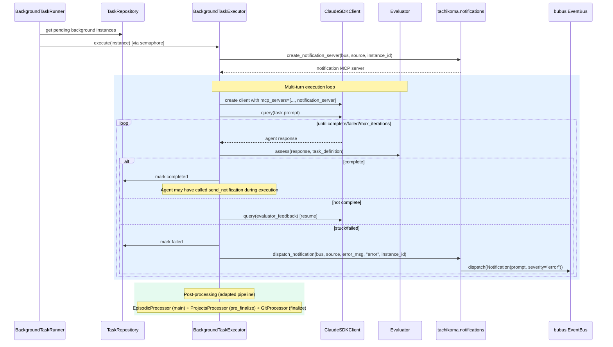
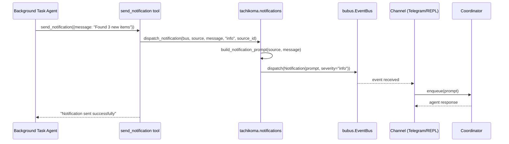

# Design: Background Task Execution

<!-- This design describes the current implementation approach. Updated through delta reconciliation. -->

**Feature Spec**: [../../feature-specs/tasks/background-task-execution.md](../../feature-specs/tasks/background-task-execution.md)
**Status**: Current

## Purpose

This document explains the design rationale for background task execution: the executor's SDK session management, evaluator loop, adapted pipeline, and notification delivery.

## Problem Context

Background tasks need to run in isolated sessions with multi-turn conversation support (the evaluator drives additional turns based on completion assessment). The executor reuses the coordinator's SDK session management pattern but with different concerns: an evaluator replaces the user, a restricted post-processing pipeline runs, and notifications are dispatched on completion or failure.

**Constraints:**
- Background tasks must not interfere with the main conversation session
- The evaluator needs multi-turn conversation continuity via `resume`
- Post-processing must be selective (episodic + project submodule commit + git only)
- Concurrency must be bounded to avoid resource exhaustion
- Uses the SDK's `query()` and `receive_response()` per DES-005

**Interactions:**
- Task repository (`task-management`): queries pending background instances, updates status
- Post-processing pipeline (`post-processing-pipeline`): separate pipeline instance with selective processors
- Notification module (`tachikoma.notifications`): generic `Notification` event, `dispatch_notification()` for failures, `create_notification_server()` MCP factory per-execution
- Event bus (ADR-009): dispatches `Notification` events on agent-driven notification or failure
- Channels (`telegram`, `terminal-repl`): subscribe to `Notification` for delivery
- SDK (`core-architecture`): `ClaudeSDKClient` with `resume` for multi-turn execution

## Design Overview

Two components work together: the `BackgroundTaskRunner` (async loop picking up pending instances) and the `BackgroundTaskExecutor` (manages a single task's SDK session lifecycle with evaluator loop). The runner gates concurrency via `asyncio.Semaphore`.

```
┌────────────────────────────────────────────────────────────────┐
│                    BackgroundTaskRunner                          │
│  (async loop, picks up pending background instances)            │
│  ┌──────────────────────────────────────────────────────────┐  │
│  │  asyncio.Semaphore(max_concurrent)                       │  │
│  │  ┌──────────────────┐ ┌──────────────────┐              │  │
│  │  │ BackgroundTask   │ │ BackgroundTask   │ ...           │  │
│  │  │ Executor         │ │ Executor         │              │  │
│  │  │ (single task)    │ │ (single task)    │              │  │
│  │  └──────────────────┘ └──────────────────┘              │  │
│  └──────────────────────────────────────────────────────────┘  │
└────────────────────────────────────────────────────────────────┘
```

## Components

### Implementation Structure

| Layer/Component | Responsibility | Key Decisions |
|-----------------|----------------|---------------|
| `src/tachikoma/tasks/executor.py` | `background_task_runner()` — async loop picking up pending background instances; `BackgroundTaskExecutor` — manages single task's SDK session lifecycle with evaluator loop; injects current date/time in configured timezone into system prompt; registers notification MCP server per-execution; calls `dispatch_notification()` for automatic failure notifications; creates `StderrAccumulator` per execution and passes to `ClaudeAgentOptions(stderr=...)` — on failure, the accumulated stderr is included in the error log entry | Coordinator-like SDK client management; `asyncio.Semaphore` for concurrency; datetime injection via `get_timezone(settings)` + `datetime.now(tz)` prepended to `BACKGROUND_TASK_SYSTEM_PROMPT`; full `PreProcessingPipeline` (memory, projects, skills); separate `PostProcessingPipeline` with `EpisodicProcessor` (main phase) + `ProjectsProcessor` (pre_finalize phase) + `GitProcessor` (finalize phase); notification MCP server via DES-006 factory |
| `src/tachikoma/notifications.py` | `Notification(BaseEvent[None])` — generic event type; `build_notification_prompt()` — template builder with source, timestamp, content; `dispatch_notification()` — shared dispatch for both agent-driven and failure notifications; `create_notification_server()` — MCP tool factory (DES-006) producing `send_notification` tool for agent-driven notifications | Standalone module outside tasks package for reusability; single dispatch path ensures consistent formatting; per-execution MCP server scopes tool to background sessions only |

### Cross-Layer Contracts

**Background task execution:**


```mermaid
sequenceDiagram
    participant Runner as BackgroundTaskRunner
    participant Repo as TaskRepository
    participant Exec as BackgroundTaskExecutor
    participant SDK as ClaudeSDKClient
    participant Eval as Evaluator
    participant Notif as tachikoma.notifications
    participant Bus as bubus.EventBus

    Runner->>Repo: get pending background instances
    Runner->>Exec: execute(instance) [via semaphore]
    Exec->>Notif: create_notification_server(bus, source, instance_id)
    Notif-->>Exec: notification MCP server

    rect rgba(0, 128, 255, 0.1)
        Note over Exec,Eval: Multi-turn execution loop
        Exec->>SDK: create client with mcp_servers=[..., notification_server]
        Exec->>SDK: query(task.prompt)
        loop until complete/failed/max_iterations
            SDK-->>Exec: agent response
            Exec->>Eval: assess(response, task_definition)
            alt complete
                Exec->>Repo: mark completed
                Note over Exec: Agent may have called send_notification during execution
            else not complete
                Exec->>SDK: query(evaluator_feedback) [resume]
            else stuck/failed
                Exec->>Repo: mark failed
                Exec->>Notif: dispatch_notification(bus, source, error_msg, "error", instance_id)
                Notif->>Bus: dispatch(Notification(prompt, severity="error"))
            end
        end
    end

    rect rgba(0, 200, 100, 0.1)
        Note over Exec: Post-processing (adapted pipeline)
        Note over Exec: EpisodicProcessor (main) + ProjectsProcessor (pre_finalize) + GitProcessor (finalize)
    end
```

**Agent-driven notification during execution:**


```mermaid
sequenceDiagram
    participant Agent as Background Task Agent
    participant MCP as send_notification tool
    participant Notif as tachikoma.notifications
    participant Bus as bubus.EventBus
    participant Channel as Channel (Telegram/REPL)
    participant Coord as Coordinator

    Agent->>MCP: send_notification({message: "Found 3 new items"})
    MCP->>Notif: dispatch_notification(bus, source, message, "info", source_id)
    Notif->>Notif: build_notification_prompt(source, message)
    Notif->>Bus: dispatch(Notification(prompt, severity="info"))
    Bus-->>Channel: event received
    Channel->>Coord: enqueue(prompt)
    Coord-->>Channel: agent response
    MCP-->>Agent: "Notification sent successfully"
```

**Integration Points:**
- Runner ↔ Repository: queries pending background instances, marks as running
- Executor ↔ SDK: per-task `ClaudeSDKClient` with `resume` for multi-turn
- Executor ↔ Evaluator: lightweight model assessment after each agent response
- Executor ↔ Notification module: registers notification MCP server per-execution, calls `dispatch_notification()` for failure notifications
- Executor ↔ Pre-processing pipeline: full `PreProcessingPipeline` with memory, projects, skills providers; extracts MCP servers and agents into SDK options
- Executor ↔ Post-processing pipeline: separate `PostProcessingPipeline` instance with selective processors
- Channels ↔ Event bus: subscribe to `Notification` events (from `tachikoma.notifications`) for delivery

**Error contract:**
- Runner loop errors: logged, continues on next tick
- Executor errors: instance marked `failed`, error logged with any captured stderr, `Notification` dispatched via `tachikoma.notifications`
- Post-processing errors: logged, don't affect task completion status

## Data Flow

### Background task execution flow

```
1. Background task runner loop wakes up (~30s interval)
2. Query pending background task instances
3. For each instance (gated by asyncio.Semaphore, max_concurrent=3):
   a. Mark instance as running
   b. Build notification source string from definition name (or instance prompt fallback)
   c. Create notification MCP server via create_notification_server(bus, source, instance_id)
   d. Create BackgroundTaskExecutor with:
      - Full pre-processing pipeline (memory, projects, skills context providers)
      - Notification MCP server registered in mcp_servers
      - Adapted system prompt prepended with current date/time in configured timezone (task context + instructions)
      - Adapted post-processing pipeline (EpisodicProcessor in main phase + ProjectsProcessor in pre_finalize phase + GitProcessor in finalize phase)
      - Task instance prompt
   e. Executor creates `StderrAccumulator`, passes to `ClaudeAgentOptions(stderr=...)`, creates ClaudeSDKClient, calls query(prompt)
   f. Evaluator loop (max_iterations):
      i.   Consume agent response via receive_response() (per DES-005)
      ii.  Evaluator prompt assesses: complete / continue / stuck
      iii. If continue: call client.query(feedback) using resume
      iv.  If complete: break loop
           (Agent may have called send_notification during execution for success notifications)
      v.   If stuck or max iterations: mark failed, break
   g. Run adapted post-processing pipeline on the executor's session
   h. If failed: call dispatch_notification(bus, source, error_msg, "error", instance_id)
4. Sleep until next tick
```

### Notification generation and delivery

The notification system uses a standalone `tachikoma.notifications` module (not inside the tasks package) with a single shared dispatch path for both agent-driven and automatic failure notifications.

**Agent-driven notifications**: The executor registers a notification MCP server per-execution via `create_notification_server(bus, source, source_id)`, following the DES-006 factory pattern. The resulting `send_notification` tool is available only within that background task agent's session. When the agent calls the tool with a message, the handler validates it is non-empty, calls `dispatch_notification()` which builds a prompt via `build_notification_prompt()` (source, timestamp, content) and dispatches a `Notification` event on the bus.

**Automatic failure notifications**: When the executor detects failure (stuck, error, max iterations), it calls `dispatch_notification()` directly with the error description and severity "error". This uses the same prompt template and dispatch path as agent-driven notifications, ensuring consistent formatting.

**Channel delivery**: Channels subscribe to `Notification` events via `bus.on(Notification, handler)`:

- **Telegram**: `_handle_notification` enqueues `event.prompt` into the coordinator via `coordinator.enqueue()`, then calls `_process_through_coordinator()` if not already processing (same pattern as `_handle_session_task`). When already processing, the prompt is buffered in the coordinator's message queue and picked up by the active processing loop.
- **REPL**: `_handle_notification` enqueues the event into `_task_queue` (same queue as session tasks, widened to `SessionTaskReady | Notification`). The main REPL loop drains the queue via `_process_queued_tasks()`, which dispatches to `_execute_notification()` for notification events — enqueuing the prompt into the coordinator and rendering the agent response through the standard pipeline.

## Key Decisions

### Coordinator-like executor (not full coordinator reuse)

**Choice**: Extract the core SDK session management pattern into the background task executor rather than reusing the full coordinator.
**Why**: The coordinator has too many responsibilities (session registry, boundary detection, pre-processing) that don't apply to background tasks. The executor reuses the proven pattern (create `ClaudeSDKClient`, `query()`, `receive_response()`, `resume`) but with the evaluator replacing the user role.

**Consequences**:
- Pro: Multi-turn background tasks maintain conversation continuity via `resume`
- Pro: Reuses proven SDK lifecycle patterns
- Con: New component to maintain, though simpler than the full coordinator

### Adapted pipeline via separate instance

**Choice**: Background tasks run the full pre-processing pipeline (same context providers as the main conversation: memory, projects, skills) and create a separate `PostProcessingPipeline` instance with `EpisodicProcessor` (main phase), `ProjectsProcessor` (pre_finalize phase), and `GitProcessor` (finalize phase). Pre-processing results include MCP servers and agent definitions, which are passed to the SDK client options via a `_PreprocessingResult` dataclass.
**Why**: Background tasks need the same context awareness as the main conversation (project awareness, skill-based context, memory search) and should commit project submodule changes. They should not extract facts/preferences or update core context — those are user-conversation concerns.

**Consequences**:
- Pro: Background tasks have full project/skill awareness and can use project management tools
- Pro: Reuses existing pipeline infrastructure and processor implementations
- Con: Pipeline registration duplicated between `__main__.py` (full) and executor (adapted)
- Con: `SkillRegistry` must be threaded from bootstrap through `background_task_runner` to `BackgroundTaskExecutor`

### Lightweight evaluator model

**Choice**: Use `haiku` for the evaluator assessment.
**Why**: The evaluator makes a simple structured assessment (complete/continue/stuck) that doesn't require a large model. Using a lightweight model reduces cost and latency for each evaluation turn.

**Consequences**:
- Pro: Low cost per evaluation
- Pro: Fast assessment turnaround
- Con: Less nuanced assessment than a larger model

### Agent-driven notification via MCP tool

**Choice**: Background task agents decide at runtime whether and what to notify the user about via a `send_notification` MCP tool, instead of a static `notify` field on task definitions. The executor registers a notification MCP server per-execution (DES-006 factory pattern), and failure notifications are dispatched automatically using the same shared `dispatch_notification()` function.
**Why**: A static `notify` field decided notification behavior at task creation time — the agent could not adapt at runtime. The MCP tool approach gives the agent full control: it can evaluate results, send progress updates, or complete silently. Failure notifications remain automatic because the agent can no longer act after failure. Using a single `dispatch_notification()` function for both paths ensures consistent prompt formatting.

**Consequences**:
- Pro: Agent decides at runtime whether results are worth notifying about
- Pro: Supports multiple notifications during execution (e.g., progress updates)
- Pro: No fork latency — notifications dispatch directly via event bus
- Pro: Consistent formatting between agent-driven and failure notifications
- Pro: Tool scoped to background execution only (per-execution MCP server registration)
- Con: Agent may forget to call `send_notification` on success, resulting in silent completion
- Con: No user-specified notification instruction (the `notify` field is removed)

### Semaphore-based concurrency gating

**Choice**: Use `asyncio.Semaphore(max_concurrent_background)` to limit concurrent background tasks.
**Why**: Each background task creates an SDK client (which spawns a CLI subprocess). Unbounded concurrency could exhaust system resources. The semaphore pattern is simple and effective for async concurrency control.

**Consequences**:
- Pro: Simple, built-in async primitive
- Pro: Configurable limit via task settings
- Con: Tasks at the limit must wait for a slot

## System Behavior

### Scenario: Agent sends notification during execution

**Given**: A background task is executing with `send_notification` available
**When**: The agent calls `send_notification` with a message
**Then**: A `Notification` event with the wrapped prompt (source, timestamp, content) and severity "info" is dispatched. Channels receive the event and route it through the coordinator for delivery. The tool returns success to the agent.

### Scenario: Agent sends multiple notifications

**Given**: A long-running background task is executing
**When**: The agent calls `send_notification` multiple times (e.g., progress updates)
**Then**: Each call independently dispatches a `Notification` event and is delivered independently. No state accumulates between calls.

### Scenario: Background task completes without notification

**Given**: A background task where the agent did not call `send_notification`
**When**: The evaluator marks it complete
**Then**: The instance is marked completed and post-processing runs. No notification is dispatched — the agent chose not to notify.

### Scenario: Background task stuck

**Given**: A running background task producing repetitive responses
**When**: The evaluator detects stuck behavior
**Then**: The instance is marked failed and `dispatch_notification()` is called with severity "error", dispatching a `Notification` event via `tachikoma.notifications`.

### Scenario: Max iterations reached

**Given**: A running background task at the iteration limit
**When**: The max iteration count is reached
**Then**: The evaluator forces a final assessment. If not complete, the task is marked failed and a `Notification` event with severity "error" is dispatched.

### Scenario: Concurrent tasks at limit

**Given**: Three background tasks running (default limit)
**When**: A fourth pending instance is found
**Then**: It remains pending until one of the running tasks completes and releases a semaphore slot.

## Notes

- The evaluator uses the SDK's standalone `query()` function (not `ClaudeSDKClient`) for the assessment — it's a single-turn evaluation with no conversation continuity needed
- The `on_complete` callback in `SessionTaskReady` is an async callable that marks the instance as completed in the repository — channels invoke it after successful delivery
- Background task notifications in Telegram are routed through the coordinator pipeline (same path as session tasks), using `coordinator.enqueue()` + `_process_through_coordinator()` — this handles message splitting and prevents Telegram's 4096-char limit errors
- The REPL channels handle notifications through the same `_task_queue` used for session tasks, with `isinstance` dispatch to `_execute_notification()` — notifications are buffered when the user is mid-conversation
