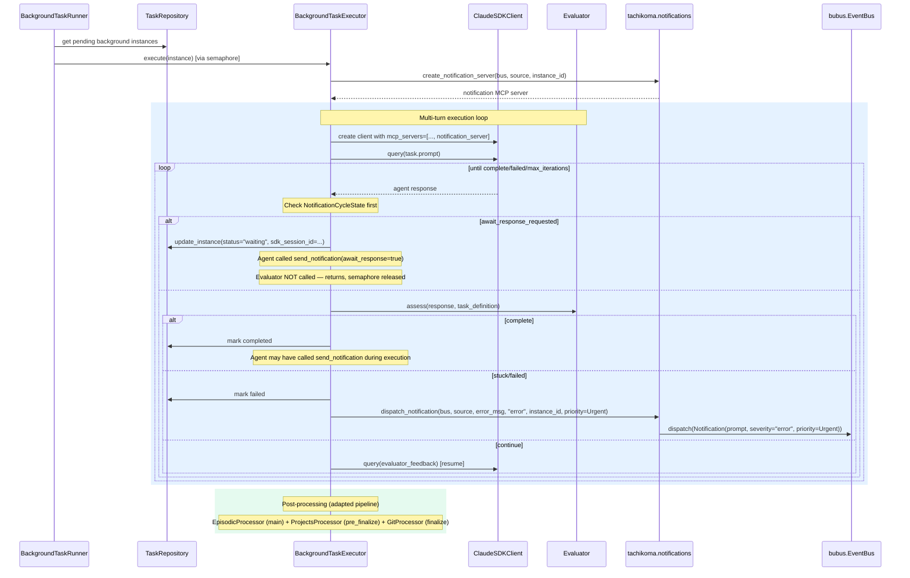
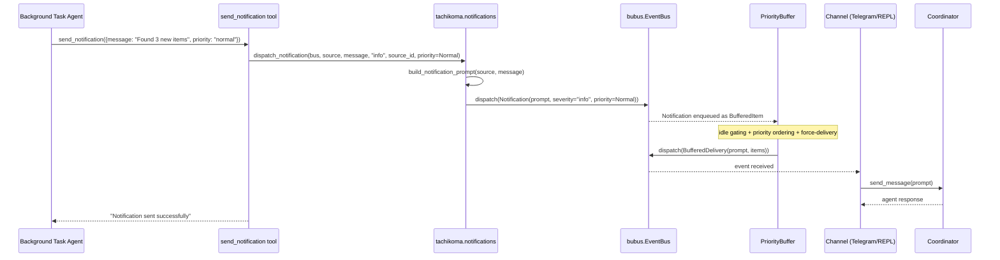

# Design: Background Task Execution

<!-- This design describes the current implementation approach. Updated through delta reconciliation. -->

**Feature Spec**: [../../feature-specs/tasks/background-task-execution.md](../../feature-specs/tasks/background-task-execution.md)
**Status**: Current

## Purpose

This document explains the design rationale for background task execution: the executor's SDK session management, evaluator loop, adapted pipeline, and notification delivery.

## Problem Context

Background tasks need to run in isolated sessions with multi-turn conversation support (the evaluator drives additional turns based on completion assessment). The executor reuses the coordinator's SDK session management pattern but with different concerns: an evaluator replaces the user, a restricted post-processing pipeline runs, and notifications are dispatched on completion or failure.

**Constraints:**
- Background tasks must not interfere with the main conversation session
- The evaluator needs multi-turn conversation continuity via `resume`
- Post-processing must be selective (episodic + project submodule commit + git only)
- Concurrency must be bounded to avoid resource exhaustion
- Uses the SDK's `query()` and `receive_response()` per DES-005

**Interactions:**
- Task repository (`task-management`): queries pending background instances, updates status
- Post-processing pipeline (`post-processing-pipeline`): separate pipeline instance with selective processors
- Notification module (`tachikoma.notifications`): generic `Notification` event with a priority field, `dispatch_notification()` for failures, `create_notification_server()` MCP factory per-execution
- Event bus (ADR-009): dispatches `Notification` events on agent-driven notification or failure
- Priority buffer (`delivery/priority-buffer`): subscribes to `Notification`, handles idle gating, priority ordering, and new-turn delivery — channels never receive `Notification` directly
- Channels (`telegram`, `terminal-repl`): subscribe to `BufferedDelivery` (not `Notification`) for delivery
- SDK (`core-architecture`): `ClaudeSDKClient` with `resume` for multi-turn execution

## Design Overview

Two components work together: the `BackgroundTaskRunner` (async loop picking up pending instances) and the `BackgroundTaskExecutor` (manages a single task's SDK session lifecycle with evaluator loop). The runner gates concurrency via `asyncio.Semaphore`.

```
┌────────────────────────────────────────────────────────────────┐
│                    BackgroundTaskRunner                          │
│  (async loop, picks up pending background instances)            │
│  ┌──────────────────────────────────────────────────────────┐  │
│  │  asyncio.Semaphore(max_concurrent)                       │  │
│  │  ┌──────────────────┐ ┌──────────────────┐              │  │
│  │  │ BackgroundTask   │ │ BackgroundTask   │ ...           │  │
│  │  │ Executor         │ │ Executor         │              │  │
│  │  │ (single task)    │ │ (single task)    │              │  │
│  │  └──────────────────┘ └──────────────────┘              │  │
│  └──────────────────────────────────────────────────────────┘  │
└────────────────────────────────────────────────────────────────┘
```

## Components

### Implementation Structure

| Layer/Component | Responsibility | Key Decisions |
|-----------------|----------------|---------------|
| `src/tachikoma/tasks/executor.py` | `background_task_runner()` — async loop picking up pending background instances; `BackgroundTaskExecutor` — manages single task's SDK session lifecycle with evaluator loop; injects current date/time in configured timezone into system prompt; registers notification MCP server per-execution (passing `NotificationCycleState`); checks `NotificationCycleState.await_response_requested` after each `receive_response()` to detect `await_response` without calling the evaluator; calls `dispatch_notification()` for automatic failure notifications; creates `StderrAccumulator` per execution and passes to `ClaudeAgentOptions(stderr=...)` — on failure, the accumulated stderr is included in the error log entry | Coordinator-like SDK client management; `asyncio.Semaphore` for concurrency; datetime injection via `get_timezone(settings)` + `datetime.now(tz)` prepended to `BACKGROUND_TASK_SYSTEM_PROMPT`; full `PreProcessingPipeline` (memory, projects, skills); separate `PostProcessingPipeline` with `EpisodicProcessor` (main phase) + `ProjectsProcessor` (pre_finalize phase) + `GitProcessor` (finalize phase); notification MCP server via DES-006 factory with `NotificationCycleState` for `await_response` detection; evaluator loop with three statuses only (`stuck`, `complete`, `continue`); shares the main agent's destructive-git deny hook, git-tools MCP server (see [workspace-version-tracking design](../../agent/workspace-version-tracking.md)), task-tools MCP server (same server the coordinator uses, injected via `extra_mcp_servers` so background agents can schedule follow-up work), and workflow-tools MCP server (see [workflow state machine spec](../../feature-specs/workflows/workflow-state-machine.md), injected via `extra_mcp_servers` so background agents can start, advance, and complete workflows during autonomous execution); pinned skills from the task definition are passed to the per-message pipeline via `IncomingMessage(text=prompt, pinned_skills=pinned_skills)` |
| `src/tachikoma/notifications.py` | `Notification(BaseEvent[None])` — generic event type carrying the wrapped prompt, severity, and a `priority: Priority` field; `NotificationCycleState` — mutable shared state object tracking whether `await_response` was requested during an evaluator loop iteration (created per-execution, reset per-iteration); `build_notification_prompt()` — template builder with source, timestamp, content; `dispatch_notification()` — shared dispatch (accepts `priority`, defaults to Normal for agent-driven, Urgent for failures); `create_notification_server()` — MCP tool factory (DES-006) producing `send_notification` tool with an optional `priority` argument (default Normal) and an `await_response` argument (default False) | Standalone module outside tasks package for reusability; single dispatch path ensures consistent formatting; per-execution MCP server scopes tool to background sessions only; `NotificationCycleState` is passed to `create_notification_server` and shared between the notification handler (sets flag) and the executor (reads flag); when `await_response=True`, the handler forces priority to Urgent, sets `response_instance_id`, and signals the executor via `cycle_state`; priority flows through the tool → `dispatch_notification()` → `Notification` event → priority buffer |

### Cross-Layer Contracts

**Background task execution:**


```mermaid
sequenceDiagram
    participant Runner as BackgroundTaskRunner
    participant Repo as TaskRepository
    participant Exec as BackgroundTaskExecutor
    participant SDK as ClaudeSDKClient
    participant Eval as Evaluator
    participant Notif as tachikoma.notifications
    participant Bus as bubus.EventBus

    Runner->>Repo: get pending background instances
    Runner->>Exec: execute(instance) [via semaphore]
    Exec->>Notif: create_notification_server(bus, source, instance_id)
    Notif-->>Exec: notification MCP server

    rect rgba(0, 128, 255, 0.1)
        Note over Exec,Eval: Multi-turn execution loop
        Exec->>SDK: create client with mcp_servers=[..., notification_server]
        Exec->>SDK: query(task.prompt)
        loop until complete/failed/max_iterations
            SDK-->>Exec: agent response
            Note over Exec: Check NotificationCycleState first
            alt await_response_requested
                Exec->>Repo: update_instance(status="waiting", sdk_session_id=...)
                Note over Exec: Agent called send_notification(await_response=true)
                Note over Exec: Evaluator NOT called — returns, semaphore released
            else
                Exec->>Eval: assess(response, task_definition)
                alt complete
                    Exec->>Repo: mark completed
                    Note over Exec: Agent may have called send_notification during execution
                else stuck/failed
                    Exec->>Repo: mark failed
                    Exec->>Notif: dispatch_notification(bus, source, error_msg, "error", instance_id, priority=Urgent)
                    Notif->>Bus: dispatch(Notification(prompt, severity="error", priority=Urgent))
                else continue
                    Exec->>SDK: query(evaluator_feedback) [resume]
                end
            end
        end
    end

    rect rgba(0, 200, 100, 0.1)
        Note over Exec: Post-processing (adapted pipeline)
        Note over Exec: EpisodicProcessor (main) + ProjectsProcessor (pre_finalize) + GitProcessor (finalize)
    end
```

**Agent-driven notification during execution:**


```mermaid
sequenceDiagram
    participant Agent as Background Task Agent
    participant MCP as send_notification tool
    participant Notif as tachikoma.notifications
    participant Bus as bubus.EventBus
    participant Buffer as PriorityBuffer
    participant Channel as Channel (Telegram/REPL)
    participant Coord as Coordinator

    Agent->>MCP: send_notification({message: "Found 3 new items", priority: "normal"})
    MCP->>Notif: dispatch_notification(bus, source, message, "info", source_id, priority=Normal)
    Notif->>Notif: build_notification_prompt(source, message)
    Notif->>Bus: dispatch(Notification(prompt, severity="info", priority=Normal))
    Bus-->>Buffer: Notification enqueued as BufferedItem
    Note over Buffer: idle gating + priority ordering + force-delivery
    Buffer->>Bus: dispatch(BufferedDelivery(prompt, items))
    Bus-->>Channel: event received
    Channel->>Coord: send_message(prompt)
    Coord-->>Channel: agent response
    MCP-->>Agent: "Notification sent successfully"
```

**Pause for user input and resume:**

```mermaid
sequenceDiagram
    participant Runner as BackgroundTaskRunner
    participant Repo as TaskRepository
    participant Exec as BackgroundTaskExecutor
    participant SDK as ClaudeSDKClient
    participant CycleState as NotificationCycleState
    participant Notif as tachikoma.notifications
    participant Bus as bubus.EventBus
    participant MainAgent as Main conversation agent
    participant RespondTool as respond_to_task (task-tools)

    rect rgba(255, 180, 50, 0.15)
        Note over Exec,CycleState: Pause (await_response path)
        Exec->>CycleState: reset() before receive_response()
        SDK-->>Exec: agent response (called send_notification with await_response=true)
        Note over CycleState: await_response_requested = true
        Exec->>Repo: update_instance(status="waiting", sdk_session_id=<latest>)
        Exec->>Notif: dispatch_notification(..., response_instance_id=instance.id, priority=Urgent)
        Notif->>Bus: dispatch(Notification(respondable, Urgent))
        Note over Exec: Evaluator NOT called — return, semaphore released
    end

    Note over MainAgent: User replies in main conversation
    MainAgent->>RespondTool: respond_to_task(task_instance_id, response)
    RespondTool->>Repo: update_instance(user_response=response)

    rect rgba(0, 180, 120, 0.15)
        Note over Runner,SDK: Resume on next runner tick
        Runner->>Repo: _sweep_expired_waiters() [no-op for fresh waiters]
        Runner->>Repo: get_ready_background_instances()
        Repo-->>Runner: includes waiting-with-response instance
        Runner->>Exec: execute(instance) [gated by semaphore]
        Exec->>Repo: update_instance(status="running", user_response=None) [atomic]
        Exec->>SDK: ClaudeSDKClient(resume=instance.sdk_session_id)
        Exec->>SDK: query(consumed user_response)
        Note over Exec,CycleState: Re-enters evaluator loop; may pause again via await_response
    end
```

**Integration Points:**
- Runner ↔ Repository: queries ready instances (pending + waiting-with-response), marks as running, sweeps expired waiters
- Executor ↔ SDK: per-task `ClaudeSDKClient` with `resume` for both in-tick multi-turn continuity and cross-tick pause/resume (same `sdk_session_id`)
- Executor ↔ Evaluator: lightweight model assessment after each agent response
- Executor ↔ Notification module: registers notification MCP server per-execution (agent can pass `priority`; default Normal), creates `NotificationCycleState` per-execution and passes it to the notification server; calls `dispatch_notification()` for failure notifications with Urgent priority; when `await_response=True`, the handler sets `cycle_state.await_response_requested = True` and dispatches a respondable urgent notification with `response_instance_id=instance.id` (priority forced to Urgent)
- Executor ↔ `respond_to_task` tool (task-management): the tool persists `user_response` on the instance; the runner picks up the next tick via the ready-instance union query — no direct coupling
- Executor ↔ Pre-processing pipeline: full `PreProcessingPipeline` with memory, projects, skills providers; extracts MCP servers and agents into SDK options; pinned skills from the task definition are passed to the per-message pipeline via the `IncomingMessage` envelope so the skills provider loads them unconditionally
- Executor ↔ Task tools: the task-tools MCP server is injected via `extra_mcp_servers` (wired in `__main__.py` alongside `git-tools` and `workflow-tools`) and merged into SDK options without shadowing per-invocation servers — enabling agents to call `create_task`, `list_tasks`, `get_task`, `update_task`, and `delete_task` during execution
- Executor ↔ Workflow tools: the workflow-tools MCP server is injected via `extra_mcp_servers` (wired in `__main__.py` alongside `git-tools` and `task-tools`) and merged into SDK options — enabling agents to call `start_workflow`, `update_workflow_state`, `get_workflow_state`, `end_workflow`, and `list_active_workflows` during execution
- Executor ↔ Post-processing pipeline: separate `PostProcessingPipeline` instance with selective processors
- Priority buffer ↔ Event bus: subscribes to `Notification` events and enqueues them as `BufferedItem`s; dispatches `BufferedDelivery` when delivery conditions are met (see [delivery/priority-buffer](../../feature-designs/delivery/priority-buffer.md))
- Channels ↔ Event bus: subscribe only to `BufferedDelivery` — `Notification` is consumed by the priority buffer, not channels

**Error contract:**
- Runner loop errors: logged, continues on next tick
- Executor errors: instance marked `failed`, error logged with any captured stderr, `Notification` dispatched via `tachikoma.notifications`
- Post-processing errors: logged, don't affect task completion status

## Data Flow

### Background task execution flow

```
1. Background task runner tick (~30s interval):
   a. _sweep_expired_waiters(): mark waiting instances whose updated_at is older than
      wait_timeout as failed, dispatch urgent non-respondable failure notification each
   b. get_ready_background_instances() → rows where
         status == "pending"
         OR (status == "waiting" AND user_response IS NOT NULL)
2. For each ready instance (gated by asyncio.Semaphore, max_concurrent=3):
   a. executor.execute(instance) — unified entry, branches on instance.status:
      - Fresh (status=="pending"):
        * update_instance(status="running", started_at=now)
        * preprocess → first query = preprocessing_result.prompt
        * resume = None
      - Resume (status=="waiting"):
        * Validate instance.sdk_session_id; if missing, fail with urgent notification
        * Atomic update_instance(status="running", user_response=None, started_at=now)
          — single UPDATE refreshes updated_at (DES-009) and consumes the response
        * preprocess (context providers re-run for fresh memory/project state)
        * first query = consumed user_response
        * resume = instance.sdk_session_id
   b. Build notification source from definition name (or instance prompt fallback)
   c. Register notifications MCP server via create_notification_server(bus, source, instance_id)
   d. Construct ClaudeAgentOptions(resume=..., stderr=StderrAccumulator, mcp_servers=...,
      system_prompt prefixed with current date/time in configured timezone)
   e. Enter ClaudeSDKClient context, call client.query(first_message)
   f. Evaluator loop (bounded by max_iterations):
      i.   Reset NotificationCycleState (clear previous iteration's flag)
      ii.  Consume agent response via receive_response() (DES-005), capturing the latest
           ResultMessage.sdk_session_id as sdk_session_id (seeded on resume with
           instance.sdk_session_id so await_response has a valid resume target even if
           the run errors before a ResultMessage arrives)
      iii. If notif_state.await_response_requested:
           - If sdk_session_id is None: fail (cannot pause without session), break
           - update_instance(status="waiting", sdk_session_id=<captured>) — updated_at
             auto-stamps, anchoring the wait_timeout sweep
           - The respondable urgent notification was already dispatched by the handler
             during receive_response() (with response_instance_id=instance.id)
           - return (semaphore slot released; task will resume when user_response is set)
           — evaluator is NOT called
      iv.  Evaluator assesses via ordered checklist: stuck / complete / continue
      v.   complete: break loop (agent may have called send_notification already)
      vi.  stuck / max iterations: mark failed, dispatch urgent failure notification, break
      vii. continue: client.query(evaluator_rationale) via the open session
   g. On completion: run adapted post-processing pipeline on the executor's session
   h. On failure: dispatch_notification(bus, source, error_msg, "error", instance_id,
      priority=Urgent) — non-respondable (response_instance_id omitted)
3. Sleep until next tick
```

### Notification generation and delivery

The notification system uses a standalone `tachikoma.notifications` module (not inside the tasks package) with a single shared dispatch path for both agent-driven and automatic failure notifications, and delivery is routed through the priority buffer (see [delivery/priority-buffer](../../feature-designs/delivery/priority-buffer.md)).

**Agent-driven notifications**: The executor registers a notification MCP server per-execution via `create_notification_server(bus, source, source_id, cycle_state=notif_state)`, following the DES-006 factory pattern. The resulting `send_notification` tool is available only within that background task agent's session. The tool accepts a `message`, an optional `priority` (Urgent/Normal/Low, default Normal), and an optional `await_response` (bool, default False). When `await_response=False` (default), the handler validates the message is non-empty, calls `dispatch_notification()` which builds a prompt via `build_notification_prompt()` (source, timestamp, content) and dispatches a `Notification` event carrying the priority field on the bus. When `await_response=True`, the handler sets `cycle_state.await_response_requested = True`, forces priority to Urgent, sets `response_instance_id=source_id`, and dispatches a respondable urgent notification — the executor will transition the task to `waiting` after the agent's response completes (without calling the evaluator). The background task system prompt documents the three priority levels (Urgent for time-sensitive results, Normal for standard completion, Low for informational updates) and explains that `await_response=true` is the only way to request user input.

**Automatic failure notifications**: When the executor detects failure (stuck, error, max iterations), it calls `dispatch_notification()` directly with the error description, severity "error", and priority Urgent. This uses the same prompt template and dispatch path as agent-driven notifications, ensuring consistent formatting.

**Delivery via priority buffer**: The priority buffer subscribes to `Notification` on the bus and enqueues each event as a `BufferedItem` keyed by the event's priority. The buffer holds items until the coordinator is idle (or the item's max-hold expires for Urgent/Normal), then dispatches a `BufferedDelivery` that the active channel routes through `coordinator.send_message()` as a new message turn. Channels no longer subscribe to `Notification` directly; both Telegram and the REPL observe only `BufferedDelivery`, making the delivery mechanism consistent across notifications and session tasks. The detached-process exit watcher (see [detached-processes/process-supervision](../detached-processes/process-supervision.md)) is another producer of `Notification` events and uses the same delivery path.

## Key Decisions

### Coordinator-like executor (not full coordinator reuse)

**Choice**: Extract the core SDK session management pattern into the background task executor rather than reusing the full coordinator.
**Why**: The coordinator has too many responsibilities (session registry, boundary detection, pre-processing) that don't apply to background tasks. The executor reuses the proven pattern (create `ClaudeSDKClient`, `query()`, `receive_response()`, `resume`) but with the evaluator replacing the user role.

**Consequences**:
- Pro: Multi-turn background tasks maintain conversation continuity via `resume`
- Pro: Reuses proven SDK lifecycle patterns
- Con: New component to maintain, though simpler than the full coordinator

### Adapted pipeline via separate instance

**Choice**: Background tasks run the full pre-processing pipeline (same context providers as the main conversation: memory, projects, skills) and create a separate `PostProcessingPipeline` instance with `EpisodicProcessor` (main phase), `ProjectsProcessor` (pre_finalize phase), and `GitProcessor` (finalize phase). Pre-processing results include MCP servers and agent definitions, which are passed to the SDK client options via a `_PreprocessingResult` dataclass.
**Why**: Background tasks need the same context awareness as the main conversation (project awareness, skill-based context, memory search) and should commit project submodule changes. They should not extract facts/preferences or update core context — those are user-conversation concerns.

**Consequences**:
- Pro: Background tasks have full project/skill awareness and can use project management tools
- Pro: Reuses existing pipeline infrastructure and processor implementations
- Con: Pipeline registration duplicated between `__main__.py` (full) and executor (adapted)
- Con: `SkillRegistry` must be threaded from bootstrap through `background_task_runner` to `BackgroundTaskExecutor`

### Classifier-tier evaluator model

**Choice**: Use `model=agent_defaults.classifier_model` (default `"haiku"`) for the evaluator assessment with a structured completion-signal checklist (not output quality judgment). The evaluator fits the "classifier" role in the DES-004 taxonomy — it applies a clear ordered checklist to map agent output to one of a small discrete set (`blocking_error | complete | continue`). The evaluator does NOT classify `needs_input` — that is handled exclusively by `send_notification` with `await_response=true`.
**Why**: The evaluator assesses workflow state via an ordered checklist, not output quality. A lightweight model is sufficient for this structured assessment and reduces cost/latency per evaluation turn. The checklist explicitly instructs the evaluator not to judge output correctness — only whether the agent finished its workflow steps. Removing `needs_input` from the evaluator eliminates fragile intent inference from free text and prevents duplicate notifications when the evaluator misclassifies.

**Consequences**:
- Pro: Low cost per evaluation (runs after every agent turn)
- Pro: Fast assessment turnaround
- Pro: Structured checklist reduces evaluator ambiguity, preventing false negatives that triggered re-execution and duplicate notifications
- Pro: Configurable via `classifier_model` setting without code change
- Con: Less nuanced assessment than a larger model (acceptable given checklist structure)

### Agent-driven notification via MCP tool

**Choice**: Background task agents decide at runtime whether and what to notify the user about via a `send_notification` MCP tool, instead of a static `notify` field on task definitions. The executor registers a notification MCP server per-execution (DES-006 factory pattern), and failure notifications are dispatched automatically using the same shared `dispatch_notification()` function.
**Why**: A static `notify` field decided notification behavior at task creation time — the agent could not adapt at runtime. The MCP tool approach gives the agent full control: it can evaluate results, send progress updates, or complete silently. Failure notifications remain automatic because the agent can no longer act after failure. Using a single `dispatch_notification()` function for both paths ensures consistent prompt formatting.

**Consequences**:
- Pro: Agent decides at runtime whether results are worth notifying about
- Pro: Supports multiple notifications during execution (e.g., progress updates)
- Pro: No fork latency — notifications dispatch directly via event bus
- Pro: Consistent formatting between agent-driven and failure notifications
- Pro: Tool scoped to background execution only (per-execution MCP server registration)
- Con: Agent may forget to call `send_notification` on success, resulting in silent completion
- Con: No user-specified notification instruction (the `notify` field is removed)

### Semaphore-based concurrency gating

**Choice**: Use `asyncio.Semaphore(max_concurrent_background)` to limit concurrent background tasks. Waiting tasks do NOT hold a semaphore slot — the executor returns (releasing the slot) after dispatching the pause notification.
**Why**: Each background task creates an SDK client (which spawns a CLI subprocess). Unbounded concurrency could exhaust system resources. The semaphore pattern is simple and effective for async concurrency control. Releasing on pause is important because waiting tasks may persist for hours (`wait_timeout=7200`), and holding a slot for that long would effectively reduce concurrent capacity to whatever's left over.

**Consequences**:
- Pro: Simple, built-in async primitive
- Pro: Configurable limit via task settings
- Pro: Waiting tasks don't starve fresh pending work
- Con: Tasks at the limit must wait for a slot

### Pause/resume via waiting state (not force-continue)

**Choice**: When the agent calls `send_notification` with `await_response=true`, the handler dispatches a respondable urgent notification and signals the executor via `NotificationCycleState.await_response_requested`. The executor transitions the task to `waiting` (storing the latest `sdk_session_id`) without calling the evaluator, and returns — releasing the semaphore slot. On the next runner tick, if `user_response` is present, resume the same SDK session by passing `resume=instance.sdk_session_id` to `ClaudeAgentOptions` and sending the consumed response as the next query. `await_response=true` is the **only** way to enter the `waiting` state — the evaluator does not produce a `needs_input` classification.
**Why**: Previously the evaluator inferred `needs_input` from free text, which was fragile and frequently misclassified, producing duplicate notifications. Making `await_response` an explicit flag on the tool eliminates intent inference entirely — the agent deliberately opts into waiting. Persisting the session id and the user's response on the row — rather than keeping an agent process alive — lets the pause survive process restarts and span arbitrary idle time without holding resources.
**Alternatives Considered**:
- Keep the agent process alive waiting: requires holding a semaphore slot and an open SDK client for hours; does not survive restarts; prevents the main conversation from deferring the response
- Inject "proceed without user" (previous behavior): forces wrong guesses for any question the agent can't answer from context

**Consequences**:
- Pro: Pause/resume survives restarts (waiting instances persist in DB; crash recovery leaves them alone)
- Pro: Multiple pause/resume cycles per task supported — each pause stores the latest `sdk_session_id`
- Pro: Waiting tasks free the semaphore slot for pending work
- Con: Two moving parts (wait_timeout sweep + ready-instance union) instead of one continuous loop
- Con: Short-lived SDK client per segment — pre-processing re-runs on each resume (acceptable; gives the resumed agent current memory/context)

### Unified execute() path keyed by status

**Choice**: `BackgroundTaskExecutor.execute(instance)` is a single entry point for both fresh and resumed tasks. It branches on `instance.status == "waiting"` to select between the fresh path (preprocess-first-query, `resume=None`) and the resume path (consume `user_response`, `resume=instance.sdk_session_id`). Both paths share the same preprocessing pipeline, system prompt, MCP server wiring, evaluator loop, and post-processing.
**Why**: An earlier iteration had two separate entry methods (`execute_fresh` and `execute_resume`) that duplicated the preprocessing and evaluator-loop setup. Keeping them in one method makes it obvious that fresh and resumed tasks converge on identical downstream behavior, and removes drift opportunities where a fix lands in one path but not the other.

**Consequences**:
- Pro: No drift between fresh and resume handling
- Pro: A new cross-cutting concern (e.g., additional context provider) has exactly one insertion point
- Con: The branch adds a small amount of reading overhead at the top of the function (acceptable for the clarity gain)

### Consume-on-pickup atomic UPDATE

**Choice**: The waiting→running transition is a single `update_instance(status="running", user_response=None, started_at=...)` call. The response is consumed (cleared) in the same UPDATE that marks the task running — before the SDK client is constructed.
**Why**: If status and `user_response` were cleared in separate writes — or if `user_response` were only cleared after the SDK session completed — a crash or exception between them could leave the instance with `status="running"` but still carrying a response. On the next tick the ready-instance query would skip it (it's `running`, not `waiting`), but if something later transitioned it back to `waiting`, the stale response would be silently replayed. Atomic clear-on-pickup plus the auto-stamped `updated_at` (DES-009) makes the semantics crisp: once a response is consumed, it is gone from the row.

**Consequences**:
- Pro: No stale-response replay window
- Pro: `updated_at` auto-stamps on the same UPDATE, resetting the wait_timeout anchor for any subsequent pause in the same task
- Con: If the resumed SDK session errors before producing useful work, the consumed response is not recoverable (acceptable — the agent's question can be re-asked)

### Inline timeout sweep at tick start

**Choice**: The runner tick begins with `_sweep_expired_waiters()` before acquiring ready instances. The sweep queries waiting instances whose `updated_at < now - wait_timeout`, marks each `failed`, and dispatches an urgent non-respondable failure notification. No separate scheduler process.
**Why**: Waiting tasks need bounded lifetime (a user may never reply). A dedicated timeout worker would be extra machinery for a once-per-tick operation that can trivially be done by the runner. Running it at the top of the tick — before querying ready instances — ensures an expired waiter is never accidentally picked up if a response arrived just after expiry; the sweep wins, keeping fail semantics consistent.

**Consequences**:
- Pro: Zero new coroutines or schedulers
- Pro: Deterministic ordering: expire-first, then dispatch
- Con: Timeout granularity is one tick (seconds), which is more than enough for a 2-hour default
- Con: If the process is down, timeouts don't fire until the runner resumes — the first tick after restart catches any that expired during downtime

### Respondability dual-gate via `response_instance_id` + status check

**Choice**: A notification is respondable when `Notification.response_instance_id` is set; the prompt body then includes explicit `respond_to_task(task_instance_id=..., response=...)` usage instructions. `response_instance_id` is set only when the agent calls `send_notification` with `await_response=true` — the handler forces priority to Urgent and sets `response_instance_id=instance.id`. The `respond_to_task` tool itself enforces a server-side check that the target instance is in `waiting` status with no pending `user_response` — only then does it persist the response.
**Why**: The prompt instructions guide the main agent toward the right action, but they are only a suggestion — the agent could still hallucinate a call, or be tricked into calling the tool by injected content. The tool-level status check is the authoritative gate: a call against a `running`, `completed`, `failed`, or already-responded instance returns an error without touching state. Both layers are necessary — the prompt makes the success path discoverable, the status check makes the failure paths safe. The `await_response` flag is the sole trigger for respondable notifications — the evaluator no longer infers input needs.

**Consequences**:
- Pro: Non-respondable notifications (success/failure) cannot be accidentally responded to — the tool rejects them
- Pro: Already-responded instances cannot be overwritten by a second respond_to_task call
- Pro: The prompt template is the only per-respondability branch — the event field is a simple `str | None` check

## System Behavior

### Scenario: Agent sends notification during execution

**Given**: A background task is executing with `send_notification` available
**When**: The agent calls `send_notification` with a message (and optionally a priority; default Normal)
**Then**: A `Notification` event with the wrapped prompt (source, timestamp, content), severity "info", and the chosen priority is dispatched. The priority buffer enqueues it and delivers via `BufferedDelivery` once idle-gated conditions are met; the active channel routes the prompt through the coordinator. The tool returns success to the agent.

### Scenario: Agent sends multiple notifications

**Given**: A long-running background task is executing
**When**: The agent calls `send_notification` multiple times (e.g., progress updates)
**Then**: Each call independently dispatches a `Notification` event and is delivered independently. No state accumulates between calls.

### Scenario: Background task completes without notification

**Given**: A background task where the agent did not call `send_notification`
**When**: The evaluator marks it complete
**Then**: The instance is marked completed and post-processing runs. No notification is dispatched — the agent chose not to notify.

### Scenario: Background task stuck

**Given**: A running background task producing repetitive responses
**When**: The evaluator detects stuck behavior
**Then**: The instance is marked failed and `dispatch_notification()` is called with severity "error" and priority Urgent, dispatching a `Notification` event via `tachikoma.notifications`. The priority buffer places it at the front of the queue (Urgent tier) for quick delivery.

### Scenario: Agent requests user input via await_response (pause)

**Given**: A background task agent encounters ambiguity and needs user input
**When**: The agent calls `send_notification(await_response=true, message="...")`
**Then**: The notification handler sets `cycle_state.await_response_requested = True`, dispatches a respondable urgent `Notification` (priority forced to Urgent, `response_instance_id=instance.id`) carrying the agent's question and `respond_to_task` usage hints. After the agent's response completes, the executor detects `await_response_requested`, marks the instance `waiting` with the latest `sdk_session_id` (the evaluator is NOT called), and returns — releasing the semaphore slot. The task's `updated_at` is auto-stamped (DES-009), anchoring the `wait_timeout` sweep.

### Scenario: User responds — task resumes

**Given**: A waiting task with `sdk_session_id` stored
**When**: The main agent calls `respond_to_task(task_instance_id, response)` and persists `user_response`
**Then**: On the next runner tick, `get_ready_background_instances()` returns the instance. The executor atomically transitions it to `running` (clearing `user_response` in the same UPDATE), constructs `ClaudeSDKClient(resume=sdk_session_id)`, and sends the consumed response as the next query. The evaluator loop re-enters; a second pause is supported if the agent calls `send_notification(await_response=true)` again.

### Scenario: Wait timeout expires

**Given**: A waiting task whose `updated_at` is older than `wait_timeout` (default 7200s)
**When**: The next runner tick's `_sweep_expired_waiters()` runs
**Then**: The instance is marked `failed` with a timeout reason and a non-respondable urgent failure `Notification` is dispatched. The ready-instance query in the same tick will not pick it up.

### Scenario: Process restarts while a task is waiting

**Given**: A `waiting` instance with a stored `sdk_session_id` when the process is shut down
**When**: The process restarts and the background task runner comes back up
**Then**: Crash recovery does not touch `waiting` rows — only `running` rows are marked failed. The waiting instance persists; the first tick's timeout sweep catches any that expired during downtime, and unresponded ones continue to wait for the user's reply.

### Scenario: Max iterations reached

**Given**: A running background task at the iteration limit
**When**: The max iteration count is reached
**Then**: The evaluator forces a final assessment. If not complete, the task is marked failed and a `Notification` event with severity "error" and priority Urgent is dispatched via `dispatch_notification()` for buffer-routed delivery.

### Scenario: Concurrent tasks at limit

**Given**: Three background tasks running (default limit)
**When**: A fourth pending instance is found
**Then**: It remains pending until one of the running tasks completes and releases a semaphore slot.

### Scenario: Running task transitions to waiting frees a slot

**Given**: Three running background tasks at the concurrency limit and a fourth pending instance
**When**: One of the running tasks pauses (agent calls `send_notification` with `await_response=true`)
**Then**: The executor returns and releases its semaphore slot on the way out. The next runner tick acquires the slot for the fourth pending instance while the waiting task stays out of the running pool.

## Notes

- The evaluator uses `stderr_aware_query()` (not `ClaudeSDKClient`) for the assessment — it's a single-turn evaluation with no conversation continuity needed. The evaluator prompt uses an ordered checklist that assesses workflow completion signals, not output quality. Three statuses: `stuck`, `complete`, `continue`. The evaluator does NOT classify `needs_input` — that is handled exclusively by `send_notification` with `await_response=true`
- Notifications (agent-driven and automatic failure) are delivered via the priority buffer — channels subscribe only to `BufferedDelivery` (see [delivery/priority-buffer](../../feature-designs/delivery/priority-buffer.md)). Message splitting and formatting still apply when the channel routes the buffered prompt through the coordinator
