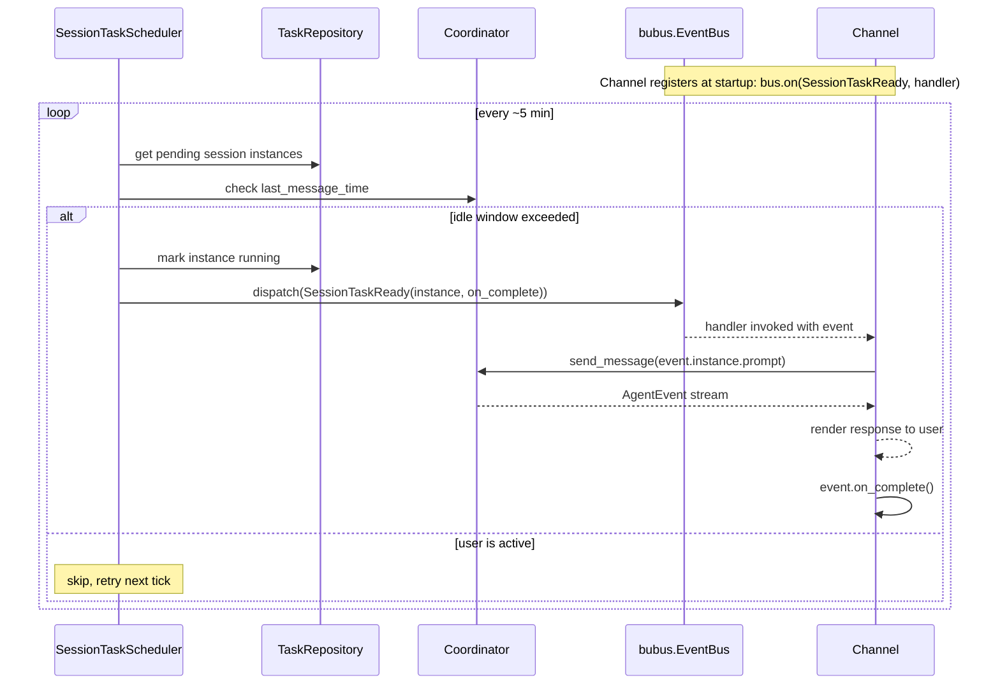

# Design: Session Task Execution

<!-- This design describes the current implementation approach. Updated through delta reconciliation. -->

**Feature Spec**: [../../feature-specs/tasks/session-task-execution.md](../../feature-specs/tasks/session-task-execution.md)
**Status**: Current

## Purpose

This document explains the design rationale for session task execution: the scheduling mechanism, idle gating, event bus delivery pattern, and channel integration.

## Problem Context

Session tasks are proactive messages the agent initiates during idle periods. The scheduler needs to check for pending instances, verify the session is idle, and deliver tasks through whatever channel is active — without the scheduler knowing about channels directly.

**Constraints:**
- Channels own the rendering loop — the scheduler cannot directly call coordinator methods
- The coordinator's `last_message_time` is the idle gating mechanism
- Multiple consumers (Telegram, REPL) need to receive events without point-to-point wiring
- Session task messages must flow through the full coordinator pipeline (pre-processing, boundary detection)

**Interactions:**
- Task repository (`task-management`): queries pending session instances, updates status
- Coordinator (`core-architecture`): `last_message_time` for idle gating, `send_message()` for delivery
- Event bus (ADR-009): `SessionTaskReady` dispatch and subscription
- Channels (`telegram`, `terminal-repl`): subscribe to events and deliver via coordinator

## Design Overview

The session task scheduler is a periodic async loop that queries pending session instances, checks idle state via the coordinator's `last_message_time`, and dispatches `SessionTaskReady` events on the `bubus.EventBus`. Channels subscribe to these events at startup and deliver task messages through the coordinator's standard `send_message()` path.

## Components

### Implementation Structure

| Layer/Component | Responsibility | Key Decisions |
|-----------------|----------------|---------------|
| `src/tachikoma/tasks/scheduler.py` | `session_task_scheduler()` — periodic async loop dispatching `SessionTaskReady` events | Plain async function started as `asyncio.Task`; idle gates via `coordinator.last_message_time` |
| `src/tachikoma/tasks/events.py` | `SessionTaskReady(BaseEvent)` — typed event carrying `instance: TaskInstance` and `on_complete: Callable` | Pydantic `BaseEvent` subclass for typed dispatch |

### Cross-Layer Contracts

**Session task injection via event bus:**



**Integration Points:**
- Scheduler ↔ Coordinator: reads `last_message_time` property for idle gating
- Scheduler ↔ Repository: queries pending session instances, marks as running
- Scheduler ↔ Event bus: dispatches `SessionTaskReady` events
- Channel ↔ Event bus: subscribes via `bus.on(SessionTaskReady, handler)`
- Channel ↔ Coordinator: calls `send_message()` with task prompt

**Error contract:**
- Scheduler errors: logged, loop continues on next tick
- Event bus handler errors: bubus logs handler exceptions; instance stays pending for retry on next tick

## Data Flow

### Session task delivery flow

```
1. Session task scheduler loop wakes up (~5 min interval)
2. Query pending session task instances (status="pending", task_type="session")
3. For each instance:
   a. Read coordinator.last_message_time
   b. If (now - last_message_time) < idle_window: skip, retry next tick
   c. If idle: mark instance running, dispatch SessionTaskReady(instance, on_complete) on bus
4. Channel's SessionTaskReady handler (registered via bus.on(SessionTaskReady, handler)):
   a. Receive SessionTaskReady event
   b. Call coordinator.send_message(event.instance.prompt)
   c. Consume and render AgentEvent stream
   d. Call event.on_complete() — marks instance completed in repository
5. Sleep until next tick
```

### Channel delivery patterns

**Telegram**: The `_handle_session_task` handler checks if a response is currently active. If idle, it calls the shared `_process_through_coordinator()` method with the task prompt and completion callback. If the user is mid-conversation, the task is steered via `coordinator.steer()`.

**REPL**: The handler enqueues `SessionTaskReady` events into an `asyncio.Queue`. The REPL's main loop drains the queue before each input prompt via `_process_queued_tasks()`, processing each task through the coordinator.

## Key Decisions

### Event bus for decoupled delivery

**Choice**: Use `bubus.EventBus` to dispatch `SessionTaskReady` events rather than direct channel calls.
**Why**: The scheduler doesn't know which channel is active. The event bus decouples the scheduler from channels — it dispatches typed events, and whichever channel is running subscribes and handles delivery.

**Consequences**:
- Pro: Scheduler has zero knowledge of channels
- Pro: Adding a new channel only requires subscribing to events
- Con: Indirection layer between scheduler and channel

### Completion callback on events

**Choice**: `SessionTaskReady` carries an `on_complete` callback that marks the instance as completed.
**Why**: The channel knows when delivery succeeds (after `send_message()` completes). The callback pattern lets the channel signal completion without importing the repository.

**Consequences**:
- Pro: Channel doesn't depend on task repository
- Pro: Status update happens at the right moment (after successful delivery)

## System Behavior

### Scenario: Idle session, pending task

**Given**: A pending session task and the user hasn't messaged in over 5 minutes
**When**: The scheduler's periodic check runs
**Then**: The instance is marked running, a `SessionTaskReady` event is dispatched, and the channel delivers the task through the coordinator.

### Scenario: Active session, pending task

**Given**: A pending session task but the user messaged less than 5 minutes ago
**When**: The scheduler's periodic check runs
**Then**: The instance is skipped and will be retried at the next tick.

### Scenario: Task delivered during Telegram conversation

**Given**: A session task is being processed via Telegram
**When**: The user sends a message simultaneously
**Then**: The user's message is steered into the current stream via `coordinator.steer()`.
