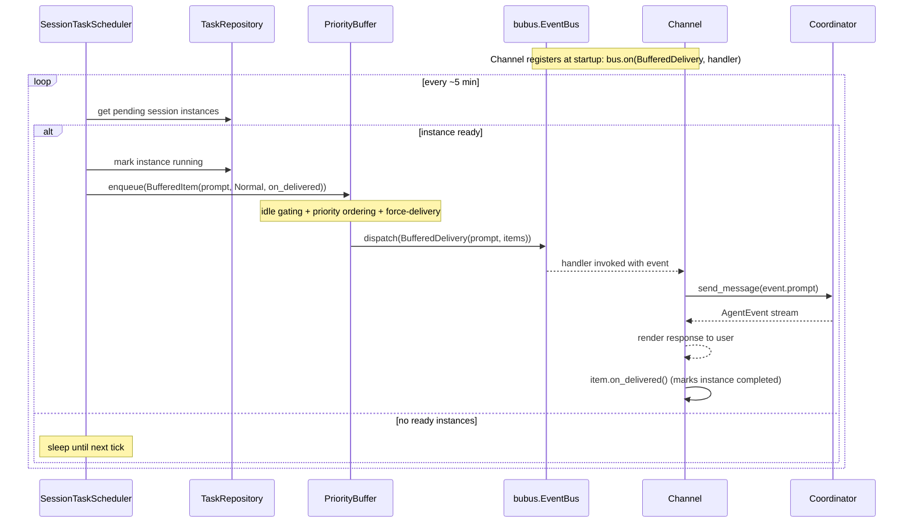

# Design: Session Task Execution

<!-- This design describes the current implementation approach. Updated through delta reconciliation. -->

**Feature Spec**: [../../feature-specs/tasks/session-task-execution.md](../../feature-specs/tasks/session-task-execution.md)
**Status**: Current

## Purpose

This document explains the design rationale for session task execution: the scheduling mechanism, its interaction with the priority buffer for idle-gated delivery, and channel integration.

## Problem Context

Session tasks are proactive messages the agent initiates during idle periods. The scheduler needs to detect ready instances and hand them to the priority buffer, which owns all delivery timing, ordering, and new-turn dispatch logic.

**Constraints:**
- Channels own the rendering loop — the scheduler cannot directly call coordinator methods
- Idle gating, priority ordering, force-delivery, and shutdown flush are concerns of the priority buffer (see [delivery/priority-buffer](../delivery/priority-buffer.md))
- Session task messages must flow through the full coordinator pipeline (pre-processing, boundary detection)
- The on-delivered callback must fire exactly once per instance after the channel successfully completes the exchange

**Interactions:**
- Task repository (`task-management`): queries pending session instances, updates status
- Priority buffer (`delivery/priority-buffer`): `buffer.enqueue()` accepts `BufferedItem` at Normal priority with an `on_delivered` callback
- Channels (`telegram`, `terminal-repl`): subscribe to `BufferedDelivery` and route prompts through the coordinator

## Design Overview

The session task scheduler is a periodic async loop that queries pending session instances and hands ready ones to the priority buffer via `buffer.enqueue()`. The buffer holds the item until the coordinator is idle (or max-hold expires), then dispatches a `BufferedDelivery` event that channels route through `coordinator.send_message()`. The scheduler is no longer aware of idle gating or channel events — it is a pure detector/enqueuer.

## Components

### Implementation Structure

| Layer/Component | Responsibility | Key Decisions |
|-----------------|----------------|---------------|
| `src/tachikoma/tasks/scheduler.py` | `session_task_scheduler()` — periodic async loop calling `buffer.enqueue()` for ready instances | Plain async function started as `asyncio.Task`; all delivery concerns (idle, priority, force) delegated to the buffer |

### Cross-Layer Contracts

**Session task enqueue via priority buffer:**


```mermaid
sequenceDiagram
    participant Sched as SessionTaskScheduler
    participant Repo as TaskRepository
    participant Buffer as PriorityBuffer
    participant Bus as bubus.EventBus
    participant Channel
    participant Coord as Coordinator

    Note over Channel,Bus: Channel registers at startup: bus.on(BufferedDelivery, handler)

    loop every ~5 min
        Sched->>Repo: get pending session instances
        alt instance ready
            Sched->>Repo: mark instance running
            Sched->>Buffer: enqueue(BufferedItem(prompt, Normal, on_delivered))
            Note over Buffer: idle gating + priority ordering + force-delivery
            Buffer->>Bus: dispatch(BufferedDelivery(prompt, items))
            Bus-->>Channel: handler invoked with event
            Channel->>Coord: send_message(event.prompt)
            Coord-->>Channel: AgentEvent stream
            Channel-->>Channel: render response to user
            Channel->>Channel: item.on_delivered() (marks instance completed)
        else no ready instances
            Note over Sched: sleep until next tick
        end
    end
```

**Integration Points:**
- Scheduler ↔ Repository: queries pending session instances, marks as running
- Scheduler ↔ Buffer: `buffer.enqueue(item)` at Normal priority with `on_delivered` callback
- Channel ↔ Event bus: subscribes via `bus.on(BufferedDelivery, handler)`
- Channel ↔ Coordinator: calls `send_message()` (or `enqueue()` during shutdown flush) with the buffer's prompt

**Error contract:**
- Scheduler errors: logged, loop continues on next tick
- Buffer loop errors: logged inside the buffer; instance stays in `running` state until delivery succeeds (or is resolved during crash recovery on next start)

## Data Flow

### Session task delivery flow

```
1. Session task scheduler loop wakes up (~5 min interval)
2. Query pending session task instances (status="pending", task_type="session")
3. For each ready instance:
   a. Mark instance running in repository
   b. Build BufferedItem(prompt, priority=Normal, on_delivered=mark_completed)
   c. Call buffer.enqueue(item)
4. Priority buffer (independent of scheduler):
   a. Places item in its priority queue ordered by (priority, arrival_seq)
   b. When the item is at the front and delivery conditions are met
      (coordinator idle + idle window satisfied, or max-hold expired),
      dispatches BufferedDelivery(prompt, items=[item]) on the bus
5. Channel's BufferedDelivery handler:
   a. Route event.prompt through coordinator.send_message() as a new turn
   b. Consume and render AgentEvent stream
   c. Fire item.on_delivered() — marks instance completed in repository
6. Sleep until next scheduler tick
```

### Channel delivery patterns

Channels subscribe only to `BufferedDelivery`. They no longer differentiate between session tasks and notifications — both flow through the same buffered-delivery path. On shutdown, the buffer emits a single digest `BufferedDelivery` whose items include any pending session tasks; the channel routes the combined prompt through the coordinator and each item's `on_delivered` callback fires after the exchange completes.

## Key Decisions

### Delegate idle gating and ordering to the priority buffer

**Choice**: The scheduler hands ready instances to the priority buffer via `buffer.enqueue()` and does not consult `coordinator.last_message_time` or dispatch delivery events itself.
**Why**: Idle gating was duplicated across subsystems (scheduler, notification handler). Centralizing it in the priority buffer gives a single consistent delivery mechanism for notifications and session tasks, with unified priority ordering, force-delivery, and shutdown flush behavior (see [delivery/priority-buffer](../delivery/priority-buffer.md)).

**Consequences**:
- Pro: One place that understands coordinator idleness and priority interactions
- Pro: Session tasks benefit automatically from shutdown flush and preemption semantics
- Pro: Scheduler becomes a pure detector — easy to reason about and test
- Con: Delivery timing is no longer visible from the scheduler alone (requires reading the buffer design)

### Completion callback on `BufferedItem`

**Choice**: `BufferedItem` carries an optional `on_delivered` callback that the channel fires after the coordinator exchange completes; for session tasks, this marks the instance as completed.
**Why**: The channel knows when delivery succeeds. A callback on the item lets the scheduler avoid subscribing to bus events just to observe completion, and the buffer remains item-type agnostic.

**Consequences**:
- Pro: Channel doesn't depend on task repository
- Pro: Status update happens at the right moment (after successful delivery)
- Pro: Notifications (no callback) and session tasks (with callback) share one buffered-delivery path

## System Behavior

### Scenario: Idle session, pending task

**Given**: A pending session task and the user hasn't messaged in over the Normal idle window (2 minutes)
**When**: The scheduler's periodic check runs and enqueues the item into the buffer
**Then**: The buffer, seeing the coordinator is idle and the idle window is satisfied, dispatches a `BufferedDelivery`; the channel delivers the task through the coordinator and fires `on_delivered`.

### Scenario: Active session, pending task

**Given**: A pending session task but the user messaged less than the idle window ago, or the coordinator is mid-response
**When**: The scheduler enqueues the item into the buffer
**Then**: The buffer holds the item; on the next coordinator busy→idle transition and satisfied idle window (or on Normal max-hold expiry), it dispatches `BufferedDelivery` and the task is delivered.

### Scenario: Task delivered during Telegram conversation

**Given**: A session task is being delivered via Telegram and the user sends a message
**When**: The user's message arrives
**Then**: The user's message is buffered via `coordinator.enqueue()` and processed within the same session or as a new session after completion — same concurrency behavior as user messages arriving during any other agent response.

### Scenario: Shutdown with pending session tasks

**Given**: One or more pending session tasks are in the buffer when graceful shutdown begins
**When**: The buffer's shutdown flush builds a digest `BufferedDelivery`
**Then**: The channel routes the combined prompt through the coordinator as a single final exchange; each session task's `on_delivered` fires when the exchange completes, marking instances completed.
