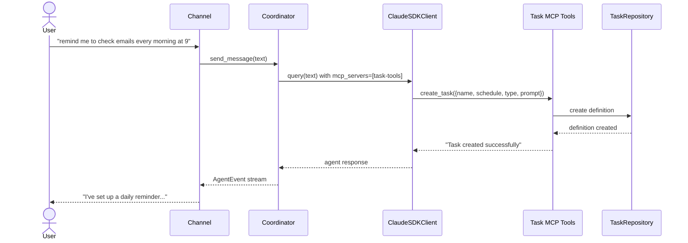
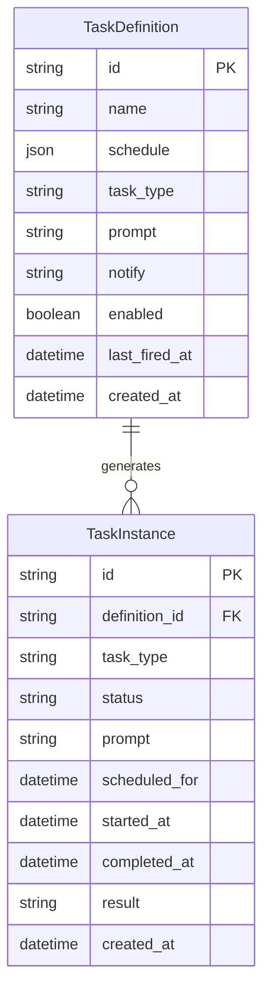
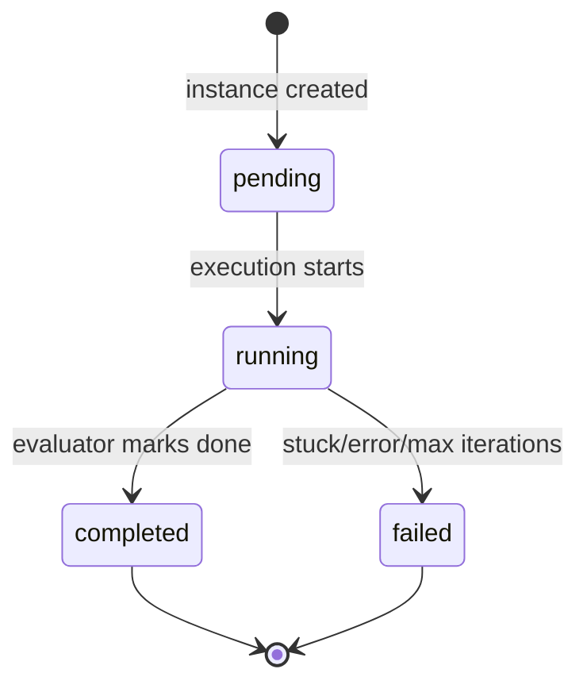

# Design: Task Management

<!-- This design describes the current implementation approach. Updated through delta reconciliation. -->

**Feature Spec**: [../../feature-specs/tasks/task-management.md](../../feature-specs/tasks/task-management.md)
**Status**: Current

## Purpose

This document explains the design rationale for task management: the data model, persistence layer, MCP tools for agent interaction, and the instance generation mechanism.

## Problem Context

Tachikoma needs persistent task definitions that the agent can create and manage during conversations, with automatic instance generation when schedules fire. The data model must support both cron-based recurring schedules and one-shot datetime schedules, with clear separation between definitions (what to do) and instances (individual executions).

**Constraints:**
- SQLAlchemy async + aiosqlite is the established persistence pattern (ADR-007)
- Bootstrap hooks (DES-003) are the initialization mechanism
- MCP tools follow the existing SDK MCP Tool Server Factory pattern (DES-006)
- Task data must be independent of the sessions subsystem

**Interactions:**
- Session task scheduler (`session-task-execution`): queries pending session instances
- Background task runner (`background-task-execution`): queries pending background instances, updates status
- Coordinator (`core-architecture`): receives task MCP tools via `mcp_servers` parameter
- Bootstrap (`__main__.py`): `tasks_hook` initializes the repository and runs crash recovery

## Design Overview

The task management subsystem lives in `src/tachikoma/tasks/` as a self-contained package. It follows the same persistence patterns as the sessions subsystem: frozen dataclasses for domain types, ORM models internal to the repository, and a repository class providing async CRUD operations. A separate SQLite database file (`tasks.db`) keeps task data independent from session data.

## Components

### Implementation Structure

| Layer/Component | Responsibility | Key Decisions |
|-----------------|----------------|---------------|
| `src/tachikoma/tasks/__init__.py` | Public API re-exports | Clean package interface |
| `src/tachikoma/tasks/model.py` | `TaskDefinition` and `TaskInstance` frozen dataclasses (domain types); `TaskDefinitionRecord` and `TaskInstanceRecord` ORM models; `TaskStatus` and `TaskType` constant maps; `ScheduleConfig` type | Domain types frozen; ORM models internal to persistence; schedule stored as JSON column |
| `src/tachikoma/tasks/repository.py` | `TaskRepository` — async SQLAlchemy CRUD for definitions and instances; separate DB file (`tasks.db`); crash recovery (mark running as failed) | Own DB file; follows ADR-007 pattern |
| `src/tachikoma/tasks/tools.py` | `create_task_tools_server()` — MCP server factory; `list_tasks`, `create_task`, `update_task`, `delete_task` with `cronsim` validation | Tools validate cron expressions at creation time; follows DES-006 (SDK MCP Tool Server Factory) |
| `src/tachikoma/tasks/hooks.py` | `tasks_hook` — bootstrap hook (DES-003): creates repository, initializes DB, runs crash recovery; stores `task_repository` in `bootstrap.extras` | Subsystem-owned hook; idempotent |
| `src/tachikoma/tasks/scheduler.py` | `instance_generator()` — async loop evaluating definitions via `cronsim` | Plain async function started as `asyncio.Task` |
| `src/tachikoma/tasks/migrations/` | Alembic migration environment and revision; separate from sessions; `TaskBase` metadata | Alembic scaffolded for future schema evolution; `create_all` used for initial creation |

### Cross-Layer Contracts

**Task creation during conversation:**



**Error contract:**
- MCP tool errors: return `{"is_error": true, "content": [...]}` — agent sees error message and can retry
- Instance generator errors: logged, loop continues on next tick
- Repository errors: wrapped in `TaskRepositoryError`, logged at call sites

## Modeling

### TaskDefinition

```
TaskDefinition (frozen dataclass)
├── id: str                          (UUID)
├── name: str                        (human-readable label)
├── schedule: ScheduleConfig         (cron expression or one-shot datetime)
├── task_type: str                   ("session" or "background")
├── prompt: str                      (instruction for the agent)
├── notify: str | None               (notification template, null = silent)
├── enabled: bool                    (default True)
├── last_fired_at: datetime | None   (last time an instance was generated)
└── created_at: datetime             (creation timestamp)
```

### TaskInstance

```
TaskInstance (frozen dataclass)
├── id: str                          (UUID)
├── definition_id: str | None        (FK → task_definitions.id, null for transient)
├── task_type: str                   ("session" or "background", copied from definition)
├── status: str                      ("pending", "running", "completed", "failed")
├── prompt: str                      (copied from definition at creation time)
├── scheduled_for: datetime          (when the instance should execute)
├── started_at: datetime | None      (when execution began)
├── completed_at: datetime | None    (when execution finished)
├── result: str | None               (completion/failure summary)
└── created_at: datetime             (creation timestamp)
```

### ScheduleConfig

```
ScheduleConfig (frozen dataclass)
├── type: str                        ("cron" or "once")
├── expression: str | None           (cron expression, only when type="cron")
└── at: datetime | None              (target datetime, only when type="once")
```

### Entity relationships



Note: `TaskInstance.definition_id` is nullable — transient instances (notifications from background task results) have no parent definition.

### Task status lifecycle



## Data Flow

### Instance generation flow

```
1. Instance generator loop wakes up (~60s interval)
2. Query all enabled definitions from repository
3. For each definition:
   a. Parse schedule: CronSim(expr, anchor_time, tz=configured_timezone)
   b. Check if next fire time ≤ now
   c. If yes, check no pending/running instance exists for this definition
   d. If clear, create TaskInstance(status="pending", task_type=definition.task_type, scheduled_for=fire_time)
   e. Update definition.last_fired_at = now
   f. If one-shot, set definition.enabled = false
4. Sleep until next tick
```

### Task MCP tool flow

```
1. Coordinator builds ClaudeAgentOptions with mcp_servers={"task-tools": server}
2. Agent receives user request like "remind me to check emails at 9am"
3. Agent calls create_task tool with name, schedule, type, prompt
4. Tool validates:
   a. Required fields present (name, schedule, type, prompt)
   b. Type is "session" or "background"
   c. Schedule is valid: CronSim(expr, now) doesn't raise CronSimError
      or one-shot datetime is in the future
5. Tool calls repository.create_definition()
6. Returns success/error message to agent
7. Agent confirms to user
```

## Key Decisions

### Separate database file for tasks

**Choice**: Store task definitions and instances in `tasks.db`, separate from `sessions.db`.
**Why**: The task subsystem is independent of the sessions subsystem — they share no tables or queries. Separate DB files enable independent lifecycle management and avoid lock contention.
**Alternatives Considered**:
- Shared DB with sessions: simpler but couples unrelated concerns

**Consequences**:
- Pro: Independent lifecycle — task DB can be reset/migrated independently
- Pro: No lock contention between session and task operations
- Con: Two DB files to manage and dispose on shutdown

### MCP tools on coordinator

**Choice**: Register the task tools MCP server on the coordinator's `ClaudeAgentOptions.mcp_servers`, making them available in every conversation turn.
**Why**: The agent needs to create/manage tasks during live conversations. The MCP tool pattern (DES-006) creates `McpSdkServerConfig` instances via factory functions — the same approach works for coordinator-level registration.

**Consequences**:
- Pro: Agent can manage tasks naturally during conversation
- Pro: Follows established MCP tool pattern
- Con: Tools are available in every turn (minor overhead)

### Alembic scaffolded for future evolution

**Choice**: Alembic migration infrastructure is present but the repository uses `TaskBase.metadata.create_all` for initial table creation.
**Why**: Starting fresh with no legacy data to migrate, `create_all` is the simplest path. Alembic is scaffolded for future schema changes that need proper migration support.

**Consequences**:
- Pro: Simplest initial setup
- Pro: Migration infrastructure ready for schema evolution
- Con: Must switch to `alembic upgrade head` if schema changes are needed later

## System Behavior

### Scenario: Agent creates a recurring task

**Given**: The agent is in a conversation
**When**: It calls `create_task` with a cron schedule
**Then**: The task definition is persisted and instances will be generated when the schedule fires.

### Scenario: Instance generation for a cron task

**Given**: An enabled cron-based task definition exists
**When**: The cron expression matches the current time
**Then**: A pending instance is created and `last_fired_at` is updated.

### Scenario: One-shot task auto-disables

**Given**: An enabled one-shot task definition
**When**: The scheduled datetime passes and an instance is generated
**Then**: The definition is set to `enabled=false`.

### Scenario: Crash recovery on startup

**Given**: The application crashed while tasks were running
**When**: The bootstrap hook runs
**Then**: All previously-running instances are marked as `failed`.

## Notes

- `cronsim` is used for cron expression evaluation (lightweight, timezone-aware)
- Task `type` is copied from definition to instance at creation time to enable direct queries without joins
- The `notify` field on `TaskDefinition` is a nullable instruction string — when set, the background task executor uses it to generate a notification message on completion
