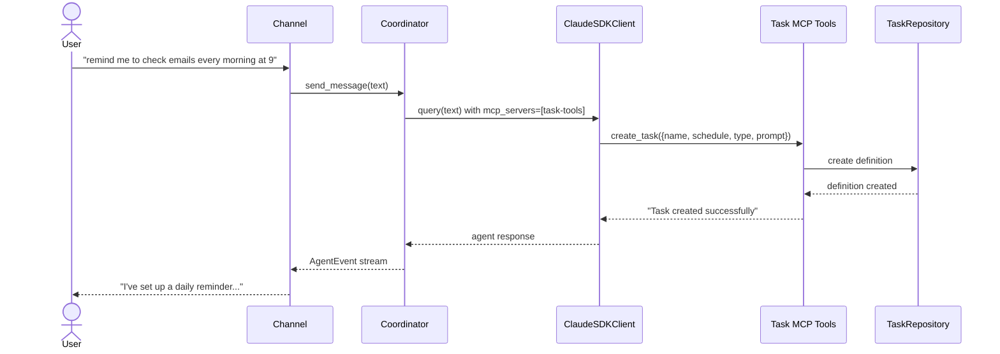
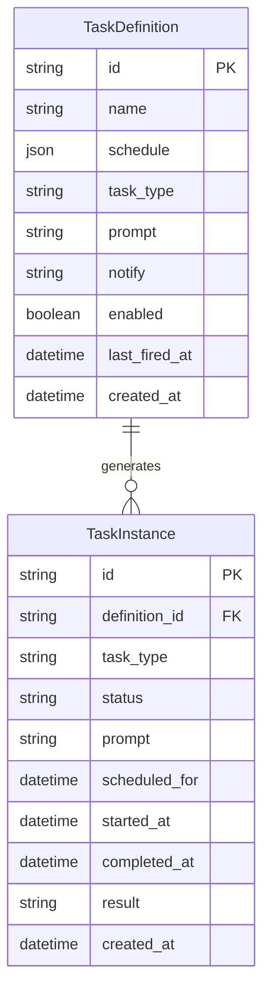
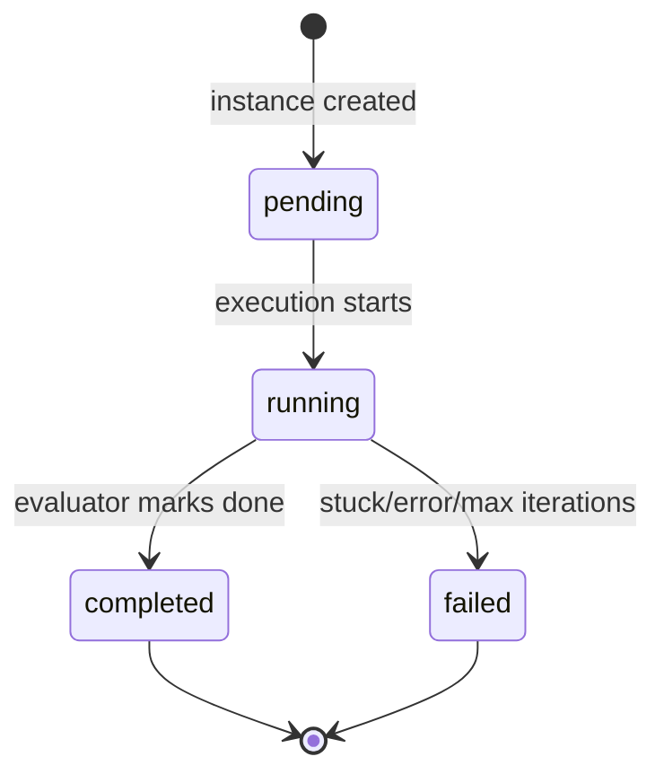

# Design: Task Management

<!-- This design describes the current implementation approach. Updated through delta reconciliation. -->

**Feature Spec**: [../../feature-specs/tasks/task-management.md](../../feature-specs/tasks/task-management.md)
**Status**: Current

## Purpose

This document explains the design rationale for task management: the data model, persistence layer, MCP tools for agent interaction, and the instance generation mechanism.

## Problem Context

Tachikoma needs persistent task definitions that the agent can create and manage during conversations, with automatic instance generation when schedules fire. The data model must support both cron-based recurring schedules and one-shot datetime schedules, with clear separation between definitions (what to do) and instances (individual executions).

**Constraints:**
- SQLAlchemy async + aiosqlite is the established persistence pattern (ADR-007)
- Bootstrap hooks (DES-003) are the initialization mechanism
- MCP tools follow the existing SDK MCP Tool Server Factory pattern (DES-006)
- Task data must be independent of the sessions subsystem

**Interactions:**
- Session task scheduler (`session-task-execution`): queries pending session instances
- Background task runner (`background-task-execution`): queries pending background instances, updates status
- Coordinator (`core-architecture`): receives task MCP tools via `mcp_servers` parameter
- Bootstrap (`__main__.py`): `tasks_hook` initializes the repository and runs crash recovery

## Design Overview

The task management subsystem lives in `src/tachikoma/tasks/` as a self-contained package. It follows the same persistence patterns as the sessions subsystem: frozen dataclasses for domain types, ORM models internal to the repository, and a repository class providing async CRUD operations. All tables live in the shared `tachikoma.db` database alongside session tables.

## Components

### Implementation Structure

| Layer/Component | Responsibility | Key Decisions |
|-----------------|----------------|---------------|
| `src/tachikoma/tasks/__init__.py` | Public API re-exports | Clean package interface |
| `src/tachikoma/tasks/model.py` | `TaskDefinition` and `TaskInstance` frozen dataclasses (domain types); `TaskDefinitionRecord` and `TaskInstanceRecord` ORM models; `TaskStatus` and `TaskType` constant maps; `ScheduleConfig` type | Domain types frozen; ORM models internal to persistence; schedule stored as JSON column |
| `src/tachikoma/tasks/repository.py` | `TaskRepository` — async SQLAlchemy CRUD for definitions and instances; `list_enabled_definitions()` and `list_disabled_definitions()` for filtered queries; crash recovery (mark running as failed) | Receives shared `async_sessionmaker` from `Database`; follows ADR-007 pattern |
| `src/tachikoma/tasks/tools.py` | `create_task_tools_server()` — MCP server factory; `list_tasks` (defaults to enabled-only, `archived` parameter for disabled; output includes task ID for referencing in other tools), `create_task`, `update_task` (supports `task_type` changes via `Literal` validation), `delete_task` with `cronsim` validation; Pydantic `BaseModel` classes (`ListTasksArgs`, `CreateTaskArgs`, `UpdateTaskArgs`, `DeleteTaskArgs`) for arg validation and type coercion; enriched `@tool()` descriptions with parameter documentation | Tools validate cron expressions at creation time; `list_tasks` uses `archived` parameter to toggle between enabled/disabled views; Pydantic models provide schema generation, bool coercion, and required-field validation; `UpdateTaskArgs.task_type` uses `Literal["session", "background"]` for automatic validation; `TaskRepositoryError`-specific error handling surfaces root causes via `__cause__`; follows DES-006 |
| `src/tachikoma/tasks/hooks.py` | `tasks_hook` — bootstrap hook (DES-003): retrieves shared `Database` from extras, creates repository, runs crash recovery; stores `task_repository` in `bootstrap.extras` | Subsystem-owned hook; runs after `database_hook` |
| `src/tachikoma/tasks/scheduler.py` | `instance_generator()` — async loop evaluating definitions via `cronsim` | Plain async function started as `asyncio.Task` |
| `src/tachikoma/database.py` | Shared `Database` class with `Base(DeclarativeBase)`, `AsyncEngine`, `async_sessionmaker`; `database_hook` bootstrap hook | All ORM models share one `Base`; single engine for all subsystems |
| `src/tachikoma/context/loading.py` (`SYSTEM_PREAMBLE`) | Static tasks documentation in the system prompt preamble: task types, scheduling formats, MCP tool descriptions with parameter documentation and cross-references, and corrected `notify` field behavior (success notification instruction; failures always notify) | Part of the `SYSTEM_PREAMBLE` constant; loaded once at startup; follows ADR-008 append pattern |

### Cross-Layer Contracts

**Task creation during conversation:**



**Error contract:**
- MCP tool errors: return `{"is_error": true, "content": [...]}` — agent sees error message and can retry; `TaskRepositoryError` is caught specifically to surface root cause via `__cause__`; unexpected errors use a generic fallback
- Instance generator errors: logged, loop continues on next tick
- Repository errors: wrapped in `TaskRepositoryError`, logged at call sites

## Modeling

### TaskDefinition

```
TaskDefinition (frozen dataclass)
├── id: str                          (UUID)
├── name: str                        (human-readable label)
├── schedule: ScheduleConfig         (cron expression or one-shot datetime)
├── task_type: str                   ("session" or "background")
├── prompt: str                      (instruction for the agent)
├── notify: str | None               (notification template, null = silent)
├── enabled: bool                    (default True)
├── last_fired_at: datetime | None   (last time an instance was generated)
└── created_at: datetime             (creation timestamp)
```

### TaskInstance

```
TaskInstance (frozen dataclass)
├── id: str                          (UUID)
├── definition_id: str | None        (FK → task_definitions.id, null for transient)
├── task_type: str                   ("session" or "background", copied from definition)
├── status: str                      ("pending", "running", "completed", "failed")
├── prompt: str                      (copied from definition at creation time)
├── scheduled_for: datetime          (when the instance should execute)
├── started_at: datetime | None      (when execution began)
├── completed_at: datetime | None    (when execution finished)
├── result: str | None               (completion/failure summary)
└── created_at: datetime             (creation timestamp)
```

### ScheduleConfig

```
ScheduleConfig (frozen dataclass)
├── type: str                        ("cron" or "once")
├── expression: str | None           (cron expression, only when type="cron")
└── at: datetime | None              (target datetime, only when type="once")
```

### Entity relationships



Note: `TaskInstance.definition_id` is nullable — transient instances (notifications from background task results) have no parent definition.

### Task status lifecycle



## Data Flow

### Instance generation flow

```
1. Instance generator loop wakes up (~60s interval)
2. Query all enabled definitions from repository
3. For each definition:
   a. Parse schedule: CronSim(expr, anchor_time, tz=configured_timezone)
   b. Check if next fire time ≤ now
   c. If yes, check no pending/running instance exists for this definition
   d. If clear, create TaskInstance(status="pending", task_type=definition.task_type, scheduled_for=fire_time)
   e. Update definition.last_fired_at = now
   f. If one-shot, set definition.enabled = false
4. Sleep until next tick
```

### Task creation flow

```
1. Coordinator builds ClaudeAgentOptions with mcp_servers={"task-tools": server}
2. Agent receives user request like "remind me to check emails at 9am"
3. Agent calls create_task tool with name, schedule, type, prompt
4. Tool validates:
   a. Required fields present (name, schedule, type, prompt)
   b. Type is "session" or "background"
   c. Schedule is valid: CronSim(expr, now) doesn't raise CronSimError
      or one-shot datetime is in the future
5. Tool calls repository.create_definition()
6. Returns success/error message to agent
7. Agent confirms to user
```

### Task listing flow

```
1. Agent calls list_tasks (optionally with archived=true)
2. Tool checks archived parameter (default: false)
3. If archived: calls repository.list_disabled_definitions()
   If not archived: calls repository.list_enabled_definitions()
4. Returns formatted list with task ID, name, type, schedule, and status per entry
   Or "No active/archived tasks found." if empty
```

## Key Decisions

### Shared database file

**Choice**: Store task definitions and instances in the shared `tachikoma.db` alongside session tables.
**Why**: All persistent subsystems share a single `Database` class with one `AsyncEngine` and `async_sessionmaker`. This simplifies engine lifecycle (one create, one dispose), reduces resource usage, and establishes a cleaner foundation as more persistent features are added.

**Consequences**:
- Pro: Single engine lifecycle — simpler shutdown, fewer resources
- Pro: All subsystems use the same `Base(DeclarativeBase)` and `session_factory`
- Pro: Future persistent features follow the same pattern naturally
- Con: Cannot reset task data independently of session data

### MCP tools on coordinator

**Choice**: Register the task tools MCP server on the coordinator's `ClaudeAgentOptions.mcp_servers`, making them available in every conversation turn.
**Why**: The agent needs to create/manage tasks during live conversations. The MCP tool pattern (DES-006) creates `McpSdkServerConfig` instances via factory functions — the same approach works for coordinator-level registration.

**Consequences**:
- Pro: Agent can manage tasks naturally during conversation
- Pro: Follows established MCP tool pattern
- Con: Tools are available in every turn (minor overhead)

### Task guidance in system preamble

**Choice**: Include task types, scheduling formats, tool descriptions, and the notify field in `SYSTEM_PREAMBLE` as a static Tasks section.
**Why**: The agent needs task domain knowledge to interpret user requests (e.g., choosing session vs background type) before invoking MCP tools. Tool schemas describe parameters but not when to use them.

**Consequences**:
- Pro: Agent has task context regardless of whether tasks exist
- Pro: Follows ADR-008 append pattern, consistent with Skills preamble section
- Con: Preamble content must be kept in sync with tool behavior

### Schema creation via create_all with pragma-based upgrades

**Choice**: The shared `Database.initialize()` uses `Base.metadata.create_all()` for table creation, with pragma-based column checks for upgrading existing databases.
**Why**: Starting fresh with `create_all` is the simplest path. Pragma-based checks handle incremental schema evolution (e.g., adding columns) without requiring a full migration framework.

**Consequences**:
- Pro: Simplest initial setup
- Pro: Handles both fresh and existing databases
- Con: Manual pragma checks for each new column addition

## System Behavior

### Scenario: Agent creates a recurring task

**Given**: The agent is in a conversation
**When**: It calls `create_task` with a cron schedule
**Then**: The task definition is persisted and instances will be generated when the schedule fires.

### Scenario: Instance generation for a cron task

**Given**: An enabled cron-based task definition exists
**When**: The cron expression matches the current time
**Then**: A pending instance is created and `last_fired_at` is updated.

### Scenario: One-shot task auto-disables

**Given**: An enabled one-shot task definition
**When**: The scheduled datetime passes and an instance is generated
**Then**: The definition is set to `enabled=false`.

### Scenario: Crash recovery on startup

**Given**: The application crashed while tasks were running
**When**: The bootstrap hook runs
**Then**: All previously-running instances are marked as `failed`.

## Notes

- `cronsim` is used for cron expression evaluation (lightweight, timezone-aware)
- Task `type` is copied from definition to instance at creation time to enable direct queries without joins
- The `notify` field on `TaskDefinition` is a nullable success notification instruction — when set, the background task executor uses it to generate a user-facing message on completion; when null, successful tasks complete silently; failures always generate notifications regardless of this field
