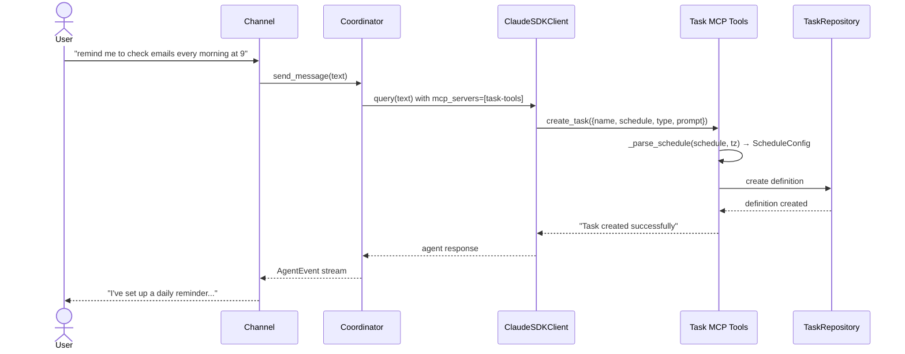
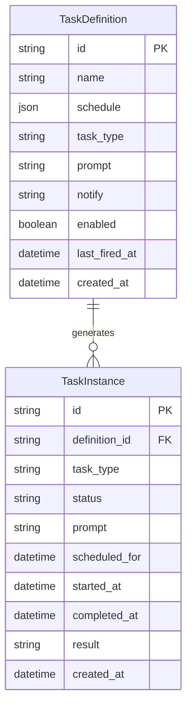
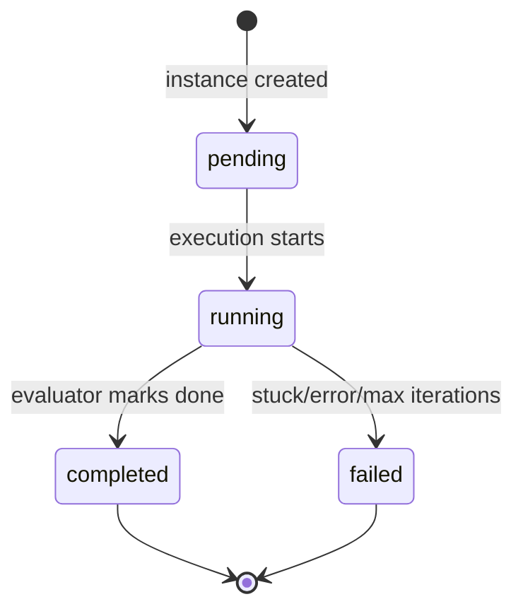

# Design: Task Management

<!-- This design describes the current implementation approach. Updated through delta reconciliation. -->

**Feature Spec**: [../../feature-specs/tasks/task-management.md](../../feature-specs/tasks/task-management.md)
**Status**: Current

## Purpose

This document explains the design rationale for task management: the data model, persistence layer, MCP tools for agent interaction, and the instance generation mechanism.

## Problem Context

Tachikoma needs persistent task definitions that the agent can create and manage during conversations, with automatic instance generation when schedules fire. The data model must support both cron-based recurring schedules and one-shot datetime schedules, with clear separation between definitions (what to do) and instances (individual executions).

**Constraints:**
- SQLAlchemy async + aiosqlite is the established persistence pattern (ADR-007)
- Bootstrap hooks (DES-003) are the initialization mechanism
- MCP tools follow the existing SDK MCP Tool Server Factory pattern (DES-006)
- Task data must be independent of the sessions subsystem

**Interactions:**
- Session task scheduler (`session-task-execution`): queries pending session instances
- Background task runner (`background-task-execution`): queries pending background instances, updates status
- Coordinator (`core-architecture`): receives task MCP tools via `mcp_servers` parameter
- Bootstrap (`__main__.py`): `tasks_hook` initializes the repository and runs crash recovery

## Design Overview

The task management subsystem lives in `src/tachikoma/tasks/` as a self-contained package. It follows the same persistence patterns as the sessions subsystem: frozen dataclasses for domain types, ORM models internal to the repository, and a repository class providing async CRUD operations. All tables live in the shared `tachikoma.db` database alongside session tables.

## Components

### Implementation Structure

| Layer/Component | Responsibility | Key Decisions |
|-----------------|----------------|---------------|
| `src/tachikoma/tasks/__init__.py` | Public API re-exports | Clean package interface |
| `src/tachikoma/tasks/model.py` | `TaskDefinition` and `TaskInstance` frozen dataclasses (domain types); `TaskDefinitionRecord` and `TaskInstanceRecord` ORM models; `TaskStatus` and `TaskType` constant maps; `ScheduleConfig` type | Domain types frozen; ORM models internal to persistence; schedule stored as JSON column; `from_json` recovers legacy bare ISO datetime strings as one-shot schedules; all parse failures raise `ValueError` (never bare `JSONDecodeError` or `KeyError`) |
| `src/tachikoma/tasks/repository.py` | `TaskRepository` — async SQLAlchemy CRUD for definitions and instances; `list_enabled_definitions()` and `list_disabled_definitions()` for filtered queries; `_to_domains_with_isolation()` for per-record error isolation with auto-disable; crash recovery (mark running as failed) | Receives shared `async_sessionmaker` from `Database`; follows ADR-007 pattern; list methods auto-disable corrupted definitions instead of failing the entire query |
| `src/tachikoma/tasks/tools.py` | `create_task_tools_server(repository, timezone)` — MCP server factory receiving `ZoneInfo` at construction; `_parse_schedule(schedule, tz)` stamps naive datetimes with configured timezone, preserves aware as-is; `_format_schedule(schedule, tz)` converts display to configured timezone; `list_tasks` (defaults to enabled-only, `archived` parameter for disabled; output includes task ID for referencing in other tools), `create_task`, `update_task` (supports `task_type` changes via `Literal` validation), `delete_task` with `cronsim` validation; Pydantic `BaseModel` classes (`ListTasksArgs`, `CreateTaskArgs`, `UpdateTaskArgs`, `DeleteTaskArgs`) for arg validation and type coercion; enriched `@tool()` descriptions with parameter documentation including timezone-aware schedule formats | Factory receives `ZoneInfo`, passes to `_parse_schedule` and `_format_schedule` via closures; uses `replace(tzinfo=tz)` for naive, `astimezone(tz)` for display; `UpdateTaskArgs.task_type` uses `Literal["session", "background"]` for automatic validation; `TaskRepositoryError`-specific error handling surfaces root causes via `__cause__`; follows DES-006 |
| `src/tachikoma/tasks/hooks.py` | `tasks_hook` — bootstrap hook (DES-003): retrieves shared `Database` from extras, creates repository, runs crash recovery; stores `task_repository` in `bootstrap.extras` | Subsystem-owned hook; runs after `database_hook` |
| `src/tachikoma/tasks/scheduler.py` | `instance_generator()` — async loop with strict cron firing and period-aware dedup; `_create_pending_instance()` helper for instance creation and logging; `get_timezone(settings)` — returns `ZoneInfo` from pre-validated settings string (shared utility used by scheduler, preamble rendering, and executor) | Plain async function started as `asyncio.Task`; `get_timezone` has no fallback logic — validation happens at config load |
| `src/tachikoma/database.py` | Shared `Database` class with `Base(DeclarativeBase)`, `AsyncEngine`, `async_sessionmaker`; `database_hook` bootstrap hook | All ORM models share one `Base`; single engine for all subsystems |
| `src/tachikoma/context/loading.py` (`SYSTEM_PREAMBLE_TEMPLATE`) | Timezone-aware tasks documentation in the system prompt preamble: task types, scheduling formats with timezone behavior, Date and Time section, MCP tool descriptions with parameter documentation, cross-references, and corrected `notify` field behavior | `SYSTEM_PREAMBLE_TEMPLATE` with `{timezone}` placeholder; `render_system_preamble(timezone)` resolves and formats; follows ADR-008 append pattern |

### Cross-Layer Contracts

**Task creation during conversation:**



**Error contract:**
- MCP tool errors: return `{"is_error": true, "content": [...]}` — agent sees error message and can retry; `TaskRepositoryError` is caught specifically to surface root cause via `__cause__`; unexpected errors use a generic fallback
- Instance generator errors: logged, loop continues on next tick
- Repository errors: wrapped in `TaskRepositoryError`, logged at call sites

## Modeling

### TaskDefinition

```
TaskDefinition (frozen dataclass)
├── id: str                          (UUID)
├── name: str                        (human-readable label)
├── schedule: ScheduleConfig         (cron expression or one-shot datetime)
├── task_type: str                   ("session" or "background")
├── prompt: str                      (instruction for the agent)
├── notify: str | None               (notification template, null = silent)
├── enabled: bool                    (default True)
├── last_fired_at: datetime | None   (last time an instance was generated)
└── created_at: datetime             (creation timestamp)
```

### TaskInstance

```
TaskInstance (frozen dataclass)
├── id: str                          (UUID)
├── definition_id: str | None        (FK → task_definitions.id, null for transient)
├── task_type: str                   ("session" or "background", copied from definition)
├── status: str                      ("pending", "running", "completed", "failed")
├── prompt: str                      (copied from definition at creation time)
├── scheduled_for: datetime          (cron match time for cron tasks; schedule.at for one-shot tasks)
├── started_at: datetime | None      (when execution began)
├── completed_at: datetime | None    (when execution finished)
├── result: str | None               (completion/failure summary)
└── created_at: datetime             (creation timestamp)
```

### ScheduleConfig

```
ScheduleConfig (frozen dataclass)
├── type: str                        ("cron" or "once")
├── expression: str | None           (cron expression, only when type="cron")
└── at: datetime | None              (target datetime, only when type="once")
```

### Entity relationships



Note: `TaskInstance.definition_id` is nullable — transient instances (notifications from background task results) have no parent definition.

### Task status lifecycle



## Data Flow

### Instance generation flow

```
1. Instance generator loop wakes up (~60s interval)
2. Query all enabled definitions from repository
3. For each definition:
   a. If cron schedule:
      - Compute anchor in evaluation timezone (convert last_fired_at from UTC to tz, or start-of-hour for first run)
      - Get next fire time from CronSim using anchor
      - If next fire time > now (hasn't passed), skip
      - Compute cron_match_utc from next fire time
      - Period-aware duplicate check: query for pending/running/completed instance with matching scheduled_for (failed excluded for retry)
      - If duplicate found, log suppression and skip
      - Create TaskInstance(status="pending", scheduled_for=cron_match_utc)
      - Update definition.last_fired_at = now (ensures CronSim anchors past missed periods on catch-up)
   b. If one-shot schedule (hasn't fired yet and time has passed):
      - Check no pending/running instance exists for this definition
      - Create TaskInstance(status="pending", scheduled_for=schedule.at)
      - Update definition.last_fired_at, set definition.enabled=false
4. Sleep until next tick
```

### Task creation flow

```
1. Coordinator builds ClaudeAgentOptions with mcp_servers={"task-tools": server}
2. Agent receives user request like "remind me to check emails at 9am"
3. Agent calls create_task tool with name, schedule, type, prompt
4. Tool validates:
   a. Required fields present (name, schedule, type, prompt)
   b. Type is "session" or "background"
   c. Schedule parsed via _parse_schedule(schedule, tz):
      - datetime.fromisoformat(schedule): if naive, stamp with configured tz; if aware, preserve
      - Falls back to CronSim for cron expressions
   d. One-shot datetime must be in the future (tz-aware comparison)
5. Tool calls repository.create_definition()
6. Returns success/error message to agent
7. Agent confirms to user
```

### Task listing flow

```
1. Agent calls list_tasks (optionally with archived=true)
2. Tool checks archived parameter (default: false)
3. If archived: calls repository.list_disabled_definitions()
   If not archived: calls repository.list_enabled_definitions()
4. Formats one-shot schedules via _format_schedule(schedule, tz): converts to configured timezone via astimezone(tz)
5. Returns formatted list with task ID, name, type, schedule, and status per entry
   Or "No active/archived tasks found." if empty
```

## Key Decisions

### Shared database file

**Choice**: Store task definitions and instances in the shared `tachikoma.db` alongside session tables.
**Why**: All persistent subsystems share a single `Database` class with one `AsyncEngine` and `async_sessionmaker`. This simplifies engine lifecycle (one create, one dispose), reduces resource usage, and establishes a cleaner foundation as more persistent features are added.

**Consequences**:
- Pro: Single engine lifecycle — simpler shutdown, fewer resources
- Pro: All subsystems use the same `Base(DeclarativeBase)` and `session_factory`
- Pro: Future persistent features follow the same pattern naturally
- Con: Cannot reset task data independently of session data

### MCP tools on coordinator

**Choice**: Register the task tools MCP server on the coordinator's `ClaudeAgentOptions.mcp_servers`, making them available in every conversation turn.
**Why**: The agent needs to create/manage tasks during live conversations. The MCP tool pattern (DES-006) creates `McpSdkServerConfig` instances via factory functions — the same approach works for coordinator-level registration.

**Consequences**:
- Pro: Agent can manage tasks naturally during conversation
- Pro: Follows established MCP tool pattern
- Con: Tools are available in every turn (minor overhead)

### Task guidance in system preamble

**Choice**: Include task types, scheduling formats, tool descriptions, and the notify field in `SYSTEM_PREAMBLE` as a static Tasks section.
**Why**: The agent needs task domain knowledge to interpret user requests (e.g., choosing session vs background type) before invoking MCP tools. Tool schemas describe parameters but not when to use them.

**Consequences**:
- Pro: Agent has task context regardless of whether tasks exist
- Pro: Follows ADR-008 append pattern, consistent with Skills preamble section
- Con: Preamble content must be kept in sync with tool behavior

### Schema creation via create_all with pragma-based upgrades

**Choice**: The shared `Database.initialize()` uses `Base.metadata.create_all()` for table creation, with pragma-based column checks for upgrading existing databases.
**Why**: Starting fresh with `create_all` is the simplest path. Pragma-based checks handle incremental schema evolution (e.g., adding columns) without requiring a full migration framework.

**Consequences**:
- Pro: Simplest initial setup
- Pro: Handles both fresh and existing databases
- Con: Manual pragma checks for each new column addition

### Timezone-aware schedule parsing

**Choice**: Stamp naive datetimes with the configured timezone via `replace(tzinfo=tz)` rather than `astimezone(tz)`.
**Why**: `replace` means "this datetime is expressed in timezone X" — preserves wall-clock values. `astimezone` means "convert this instant to timezone X" — would adjust clock values, which is wrong for user-intended wall-clock times.

**Consequences**:
- Pro: "3pm" means 3pm in the configured timezone
- Pro: Explicit tz offsets and `Z` suffix preserved as-is
- Pro: No dependency on system local time during parsing

### Timezone plumbing via factory closure

**Choice**: Resolve timezone once in `__main__.py` as `ZoneInfo(settings.tasks.timezone)` and inject via `create_task_tools_server(repository, timezone)`. Inner tool closures capture the timezone from the factory.
**Why**: Follows DES-006 factory pattern. Single resolution point; no repeated lookups.

**Consequences**:
- Pro: Clean single-resolution pattern
- Pro: Consistent with existing factory parameter passing

### Strict cron firing condition

**Choice**: Fire only when the cron match time has already passed (`next_fire <= now_tz`), with no tolerance window.
**Why**: A tolerance window caused early and repeated firing within the same cron period. Accepting up to 60s lateness (bounded by the generator interval) is preferable to duplicate instances.

### Period-aware duplicate check via `scheduled_for`

**Choice**: Store the cron match time in `scheduled_for` and check for existing instances matching that time and a non-failed status.
**Why**: Using the cron match time as a period identifier enables deduplication across instance status changes (e.g., a completed instance still blocks a duplicate). The previous approach only checked pending/running, allowing duplicates after completion within the same period.

### Corrupted definition auto-disable

**Choice**: When a repository list method encounters a record with an unparseable schedule, log a warning and disable the definition rather than failing the entire query.
**Why**: One corrupted definition blocked the entire instance generator loop (the list comprehension fails before per-definition error handling). Auto-disabling quarantines the bad record so it won't be re-encountered every tick, while allowing all valid definitions to continue scheduling. The user can see what happened via logs and re-create the task if needed. This is consistent with the one-shot auto-disable pattern already in the scheduler.

**Consequences**:
- Pro: One bad record cannot halt all task scheduling
- Pro: Corrupted definitions are quarantined rather than causing log spam
- Con: The definition is disabled (not deleted), so the user must manually clean up or re-create
- Con: If the disable write itself fails, it is logged and skipped (fail-open to preserve other definitions)

## System Behavior

### Scenario: Agent creates a recurring task

**Given**: The agent is in a conversation
**When**: It calls `create_task` with a cron schedule
**Then**: The task definition is persisted and instances will be generated when the schedule fires.

### Scenario: Instance generation for a cron task

**Given**: An enabled cron-based task definition exists
**When**: The cron match time has already passed
**Then**: A pending instance is created with `scheduled_for` set to the cron match time, and `last_fired_at` is updated.

### Scenario: One-shot task auto-disables

**Given**: An enabled one-shot task definition
**When**: The scheduled datetime passes and an instance is generated
**Then**: The definition is set to `enabled=false`.

### Scenario: Cron period-aware duplicate prevention

**Given**: A cron task where a pending, running, or completed instance already exists with `scheduled_for` matching the current cron match time
**When**: The instance generator evaluates the definition
**Then**: No new instance is created. Failed instances are excluded from this check to allow retry within the same period.

### Scenario: Catch-up after restart

**Given**: The system was down for multiple cron periods
**When**: The instance generator runs after restart
**Then**: At most one catch-up instance is created per definition. The generator evaluates each definition once per tick, and the `last_fired_at` update (set to wall-clock now) ensures subsequent ticks anchor CronSim past all missed periods.

### Scenario: Crash recovery on startup

**Given**: The application crashed while tasks were running
**When**: The bootstrap hook runs
**Then**: All previously-running instances are marked as `failed`.

### Scenario: Corrupted definition auto-disable

**Given**: An enabled task definition has a malformed schedule value in the database
**When**: The repository lists enabled definitions
**Then**: The corrupted definition is disabled (enabled=false), a warning is logged with the definition ID and error, and all other valid definitions are returned normally.

## Notes

- `cronsim` is used for cron expression evaluation (lightweight, timezone-aware)
- Task `type` is copied from definition to instance at creation time to enable direct queries without joins
- The `notify` field on `TaskDefinition` is a nullable success notification instruction — when set, the background task executor uses it to generate a user-facing message on completion; when null, successful tasks complete silently; failures always generate notifications regardless of this field
